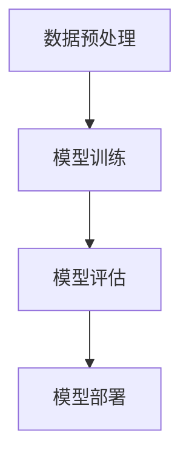

# 【大模型应用开发 动手做AI Agent】MetaGPT实战

## 1.背景介绍

在人工智能领域，特别是自然语言处理（NLP）方面，近年来大模型（如GPT-3、BERT等）取得了显著的进展。这些模型不仅在学术界引起了广泛关注，也在工业界得到了广泛应用。MetaGPT作为一种新兴的AI Agent开发框架，结合了大模型的强大能力和灵活的应用场景，成为了开发者们的热门选择。

MetaGPT不仅仅是一个大模型，它更是一个平台，提供了丰富的API和工具，帮助开发者快速构建和部署AI Agent。本篇文章将深入探讨MetaGPT的核心概念、算法原理、数学模型、项目实践、实际应用场景、工具和资源推荐，并展望其未来发展趋势与挑战。

## 2.核心概念与联系

### 2.1 大模型

大模型是指具有大量参数的深度学习模型，如GPT-3、BERT等。这些模型通过大规模数据训练，能够生成高质量的文本、进行复杂的语言理解和生成任务。

### 2.2 AI Agent

AI Agent是一种能够自主执行任务的智能体，通常具备感知、决策和执行能力。在NLP领域，AI Agent可以用于对话系统、文本生成、信息检索等任务。

### 2.3 MetaGPT

MetaGPT是一个基于大模型的AI Agent开发框架，提供了丰富的API和工具，帮助开发者快速构建和部署AI Agent。MetaGPT的核心在于其灵活性和扩展性，能够适应不同的应用场景。

### 2.4 核心联系

MetaGPT将大模型的强大能力与AI Agent的灵活性结合起来，通过提供易用的API和工具，使得开发者能够快速构建和部署高效的AI Agent。

## 3.核心算法原理具体操作步骤

### 3.1 数据预处理

数据预处理是构建AI Agent的第一步，主要包括数据清洗、数据标注和数据增强等步骤。数据预处理的质量直接影响模型的性能。

### 3.2 模型训练

模型训练是构建AI Agent的核心步骤，主要包括模型选择、超参数调优和训练过程监控等。MetaGPT提供了丰富的预训练模型，开发者可以根据具体任务选择合适的模型进行微调。

### 3.3 模型评估

模型评估是验证模型性能的重要步骤，主要包括评估指标选择、评估数据集准备和评估结果分析等。常用的评估指标包括准确率、召回率、F1值等。

### 3.4 模型部署

模型部署是将训练好的模型应用到实际场景中的步骤，主要包括部署环境选择、API设计和性能优化等。MetaGPT提供了丰富的部署工具，帮助开发者快速将模型部署到生产环境中。



## 4.数学模型和公式详细讲解举例说明

### 4.1 语言模型

语言模型是NLP中的核心模型，主要用于预测给定上下文中的下一个词。常用的语言模型包括n-gram模型、RNN、LSTM和Transformer等。

### 4.2 Transformer模型

Transformer模型是当前最先进的语言模型之一，其核心思想是自注意力机制。Transformer模型通过多头自注意力机制和前馈神经网络，实现了高效的并行计算和长距离依赖建模。

$$
\text{Attention}(Q, K, V) = \text{softmax}\left(\frac{QK^T}{\sqrt{d_k}}\right)V
$$

其中，$Q$、$K$和$V$分别表示查询、键和值矩阵，$d_k$表示键的维度。

### 4.3 GPT模型

GPT模型是基于Transformer的生成式预训练模型，其核心思想是通过大规模数据预训练语言模型，然后在下游任务中进行微调。

$$
P(w_t|w_{<t}) = \frac{\exp(e_{w_t}^T h_t)}{\sum_{w' \in V} \exp(e_{w'}^T h_t)}
$$

其中，$w_t$表示第$t$个词，$h_t$表示第$t$个位置的隐藏状态，$V$表示词汇表。

### 4.4 示例说明

假设我们要构建一个文本生成AI Agent，首先需要准备大规模的文本数据进行预训练，然后在具体任务上进行微调。通过上述公式，我们可以计算每个词的概率，并生成高质量的文本。

## 5.项目实践：代码实例和详细解释说明

### 5.1 环境配置

首先，我们需要配置开发环境，安装必要的依赖库。

```bash
pip install transformers
pip install torch
pip install datasets
```

### 5.2 数据准备

准备训练数据，通常可以使用公开的文本数据集，如WikiText、OpenWebText等。

```python
from datasets import load_dataset

dataset = load_dataset('wikitext', 'wikitext-2-raw-v1')
```

### 5.3 模型训练

使用MetaGPT提供的预训练模型进行微调。

```python
from transformers import GPT2LMHeadModel, GPT2Tokenizer, Trainer, TrainingArguments

model = GPT2LMHeadModel.from_pretrained('gpt2')
tokenizer = GPT2Tokenizer.from_pretrained('gpt2')

def tokenize_function(examples):
    return tokenizer(examples['text'], padding='max_length', truncation=True)

tokenized_datasets = dataset.map(tokenize_function, batched=True)

training_args = TrainingArguments(
    output_dir='./results',
    num_train_epochs=3,
    per_device_train_batch_size=4,
    per_device_eval_batch_size=4,
    warmup_steps=500,
    weight_decay=0.01,
    logging_dir='./logs',
)

trainer = Trainer(
    model=model,
    args=training_args,
    train_dataset=tokenized_datasets['train'],
    eval_dataset=tokenized_datasets['validation'],
)

trainer.train()
```

### 5.4 模型评估

使用验证集评估模型性能。

```python
results = trainer.evaluate()
print(results)
```

### 5.5 模型部署

将训练好的模型部署到生产环境中。

```python
model.save_pretrained('./model')
tokenizer.save_pretrained('./model')
```

## 6.实际应用场景

### 6.1 对话系统

MetaGPT可以用于构建高效的对话系统，提供自然流畅的对话体验。

### 6.2 文本生成

MetaGPT可以用于生成高质量的文本，如新闻报道、技术文档等。

### 6.3 信息检索

MetaGPT可以用于构建智能的信息检索系统，提供精准的搜索结果。

### 6.4 机器翻译

MetaGPT可以用于构建高效的机器翻译系统，实现多语言之间的自然翻译。

## 7.工具和资源推荐

### 7.1 开发工具

- **PyTorch**：深度学习框架，支持GPU加速。
- **Transformers**：Hugging Face提供的预训练模型库。
- **Datasets**：Hugging Face提供的数据集库。

### 7.2 学习资源

- **《深度学习》**：Ian Goodfellow等著，深度学习领域的经典教材。
- **Hugging Face官方文档**：提供了详细的API文档和使用示例。

### 7.3 社区资源

- **GitHub**：丰富的开源项目和代码示例。
- **Stack Overflow**：技术问答社区，解决开发中的问题。

## 8.总结：未来发展趋势与挑战

### 8.1 发展趋势

- **模型规模继续扩大**：随着计算资源的增加，模型规模将继续扩大，性能也将进一步提升。
- **多模态融合**：未来的AI Agent将不仅限于文本，还将融合图像、语音等多模态信息。
- **个性化定制**：AI Agent将更加注重个性化定制，提供更加精准的服务。

### 8.2 挑战

- **数据隐私**：大规模数据的使用带来了数据隐私的问题，需要制定相应的隐私保护措施。
- **模型解释性**：大模型的复杂性使得其解释性较差，需要研究更加透明的模型结构。
- **计算资源**：大模型的训练和部署需要大量的计算资源，需要优化计算效率。

## 9.附录：常见问题与解答

### 9.1 如何选择合适的预训练模型？

选择预训练模型时，需要考虑任务的具体需求和模型的性能。通常可以从Hugging Face的模型库中选择合适的模型进行微调。

### 9.2 如何处理数据不平衡问题？

数据不平衡问题可以通过数据增强、重采样等方法进行处理。可以使用SMOTE等算法进行数据增强，或者通过调整损失函数权重来平衡数据。

### 9.3 如何优化模型性能？

优化模型性能可以从以下几个方面入手：
- **超参数调优**：通过网格搜索、随机搜索等方法进行超参数调优。
- **模型结构优化**：尝试不同的模型结构，如增加层数、调整激活函数等。
- **数据增强**：通过数据增强技术增加训练数据的多样性，提高模型的泛化能力。

### 9.4 如何部署模型到生产环境？

部署模型到生产环境可以使用Docker等容器技术，确保环境的一致性。可以使用Flask等框架搭建API服务，将模型部署到云端。

---

作者：禅与计算机程序设计艺术 / Zen and the Art of Computer Programming