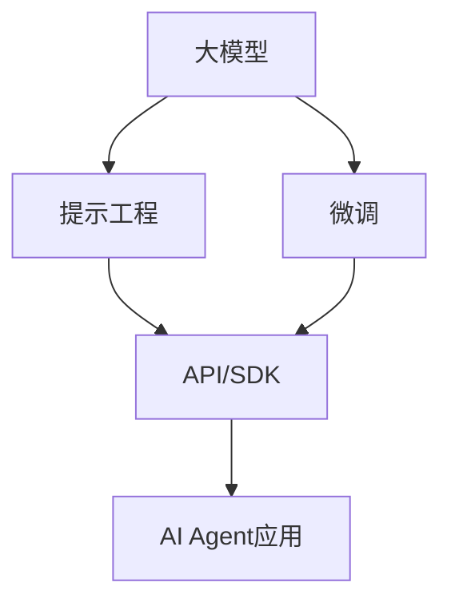

# 【大模型应用开发 动手做AI Agent】工具使用能力

## 1. 背景介绍
### 1.1 大模型应用开发的兴起
近年来,随着人工智能技术的快速发展,尤其是以ChatGPT为代表的大语言模型(Large Language Model, LLM)的出现,AI应用开发进入了一个新的阶段。LLM具有强大的自然语言理解和生成能力,可以应用于各种场景,如问答系统、对话助手、内容生成等。这为开发智能化的AI应用提供了新的可能性。

### 1.2 AI Agent的概念与价值
AI Agent是一种基于人工智能技术,能够自主执行任务、提供服务的智能体。它可以通过自然语言与用户交互,理解用户意图,并根据知识和算法完成相应的任务。AI Agent具有广阔的应用前景,可以应用于客服、教育、金融、医疗等多个领域,提高工作效率,改善用户体验。

### 1.3 大模型应用开发面临的挑战
虽然大模型为AI应用开发带来了新的机遇,但同时也存在一些挑战:
1. 大模型的训练和部署需要大量的计算资源和存储空间,对硬件和基础设施提出了更高的要求。 
2. 大模型生成的内容可能存在偏差、错误或不合适的情况,需要进行必要的过滤和校验。
3. 针对特定领域应用,需要对大模型进行微调和优化,提高模型在该领域的表现。
4. 开发者需要掌握大模型的使用方法和开发技能,学习成本较高。

因此,为了更好地利用大模型进行AI应用开发,需要相应的工具和平台来降低开发门槛,提高开发效率。这就需要开发者掌握一些关键的工具使用能力。

## 2. 核心概念与联系
### 2.1 大模型(Large Language Model)
大模型是指基于海量文本数据训练的大规模语言模型,通常包含数十亿到上万亿个参数。它能够从大量无标注数据中学习到丰富的语言知识和世界知识,具有强大的自然语言理解和生成能力。目前主流的大模型包括GPT系列、BERT系列、T5等。

### 2.2 提示工程(Prompt Engineering) 
提示工程是指如何设计和优化输入给大模型的提示(Prompt),以引导模型生成期望的输出。通过精心设计的提示,可以控制模型的行为,生成高质量、符合要求的内容。提示工程是应用大模型进行开发的关键技术之一。

### 2.3 微调(Fine-tuning)
微调是指在特定任务或领域数据上,对预训练的大模型进行进一步训练,使其更好地适应该任务或领域。微调可以提高模型在特定场景下的表现,生成更加准确、流畅、符合要求的内容。微调需要准备领域内的高质量数据集,并使用适当的训练策略。

### 2.4 API与SDK
API (Application Programming Interface) 是一组定义,允许开发者通过编程方式访问和使用某个服务或功能。大模型提供商通常会提供API,使开发者能够方便地接入和调用模型能力。

SDK (Software Development Kit) 是一套工具和库的集合,用于开发特定平台或语言的应用程序。大模型提供商也会推出配套的SDK,封装了API调用、数据处理等常用功能,方便开发者快速开发AI应用。

### 2.5 概念之间的关系
下图展示了以上核心概念之间的关系:



从图中可以看出,大模型是基础,通过提示工程和微调可以优化模型在特定任务上的表现。API和SDK是连接模型能力与应用开发的桥梁。掌握这些核心概念和技术,是开发高质量AI Agent应用的关键。

## 3. 核心算法原理与操作步骤
### 3.1 大模型的基本原理
大模型基于Transformer架构,使用自注意力机制和前馈神经网络,可以建模文本序列中的长距离依赖关系。模型通过无监督的方式在海量文本数据上进行预训练,学习语言的统计规律和世界知识。预训练的目标是根据上文预测下一个词,从而掌握语言的生成能力。

大模型的训练主要分为两个阶段:
1. 预训练阶段:在大规模通用语料上进行无监督训练,学习语言知识。常见的预训练任务有语言模型、掩码语言模型等。
2. 微调阶段:在下游任务的标注数据上进行有监督训练,使模型适应特定任务。常见的微调任务有分类、序列标注、问答等。

### 3.2 提示工程的操作步骤
提示工程的目标是设计出优质的提示,引导模型生成期望的输出。一般的操作步骤如下:
1. 明确任务目标:确定要完成的任务,如问答、写作、代码生成等。
2. 收集和分析数据:收集和分析与任务相关的数据,总结数据的特点和规律。
3. 设计提示模板:根据任务和数据的特点,设计提示的基本结构和格式。
4. 优化提示内容:在提示中加入必要的背景知识、指令、例子等,引导模型生成符合要求的内容。
5. 迭代优化:通过实验和反馈不断优化提示,提高模型输出的质量。

### 3.3 微调的操作步骤
微调的目标是在特定领域数据上调整模型参数,提高模型在该领域任务上的表现。一般的操作步骤如下:
1. 准备领域数据集:收集和标注特定领域的高质量数据集,用于微调。
2. 选择合适的预训练模型:根据任务和数据的特点,选择合适的预训练模型作为基础。
3. 设计微调的任务和损失函数:根据任务的类型,设计微调阶段的任务和损失函数,如分类、生成等。
4. 调整模型结构和超参数:根据任务的需要,调整模型的结构和超参数,如学习率、batch size等。
5. 训练和评估:在领域数据集上进行微调训练,并使用验证集评估模型性能,不断迭代优化。

### 3.4 API/SDK的使用步骤
使用大模型提供的API/SDK进行开发,一般包括以下步骤:
1. 注册和认证:在平台注册账号,获取API的访问密钥。
2. 安装和配置SDK:下载和安装与编程语言匹配的SDK,配置认证信息。
3. 调用API:使用SDK提供的接口,传入适当的参数,如提示、任务类型等,调用模型的API。
4. 解析和处理返回结果:获取API的返回结果,进行必要的解析和后处理,将结果应用到具体场景中。
5. 异常处理和日志记录:添加必要的异常处理逻辑和日志记录,以便排查和定位问题。

通过以上步骤,开发者可以利用大模型提供的API/SDK,快速搭建AI Agent应用的原型,验证想法和场景。

## 4. 数学模型和公式详解
大模型的核心是Transformer架构和自注意力机制。下面我们通过数学公式来详细说明其原理。

### 4.1 Transformer架构
Transformer的编码器和解码器都由多个相同的层堆叠而成,每一层包括两个子层:自注意力层和前馈神经网络层。

#### 4.1.1 自注意力层
自注意力层用于计算序列中每个位置与其他位置的相关性,捕捉长距离依赖关系。具体计算过程如下:

1. 将输入序列 $X\in \mathbb{R}^{n \times d}$ 通过三个线性变换得到查询矩阵 $Q$、键矩阵 $K$、值矩阵 $V$:

$$
\begin{aligned}
Q &= XW^Q \\
K &= XW^K \\
V &= XW^V
\end{aligned}
$$

其中 $W^Q, W^K, W^V \in \mathbb{R}^{d \times d_k}$ 是可学习的参数矩阵。

2. 计算查询矩阵和键矩阵的点积注意力分数,并进行缩放和softmax归一化:

$$
\text{Attention}(Q, K, V) = \text{softmax}(\frac{QK^T}{\sqrt{d_k}})V
$$

3. 将多头注意力的结果拼接并进行线性变换:

$$
\text{MultiHead}(X) = \text{Concat}(\text{head}_1, ..., \text{head}_h)W^O
$$

其中 $\text{head}_i = \text{Attention}(XW_i^Q, XW_i^K, XW_i^V)$, $W^O \in \mathbb{R}^{hd_k \times d}$ 是可学习的参数矩阵。

#### 4.1.2 前馈神经网络层
前馈神经网络层用于对自注意力层的输出进行非线性变换,增强模型的表达能力。具体计算如下:

$$
\text{FFN}(X) = \text{ReLU}(XW_1 + b_1)W_2 + b_2
$$

其中 $W_1 \in \mathbb{R}^{d \times d_{ff}}, b_1 \in \mathbb{R}^{d_{ff}}, W_2 \in \mathbb{R}^{d_{ff} \times d}, b_2 \in \mathbb{R}^d$ 是可学习的参数。

### 4.2 预训练和微调
#### 4.2.1 语言模型预训练
语言模型的目标是根据上文预测下一个词。给定文本序列 $x_1, ..., x_T$,语言模型的似然函数为:

$$
p(x_1, ..., x_T) = \prod_{t=1}^T p(x_t | x_{<t})
$$

模型通过最大化似然函数来学习语言的统计规律。

#### 4.2.2 掩码语言模型预训练
掩码语言模型的目标是根据上下文预测被掩码的词。随机掩码一定比例的词,然后最大化这些被掩码词的似然概率:

$$
\mathcal{L} = -\sum_{t=1}^T m_t \log p(x_t | x_{\backslash t})
$$

其中 $m_t$ 表示第 $t$ 个位置是否被掩码,$ x_{\backslash t}$ 表示去掉第 $t$ 个词的序列。

#### 4.2.3 微调
在下游任务的标注数据 $\mathcal{D} = \{(x^{(i)}, y^{(i)})\}_{i=1}^N$ 上,根据任务的类型设计损失函数 $\mathcal{L}$,然后最小化损失函数来微调模型参数 $\theta$:

$$
\theta^* = \arg\min_\theta \frac{1}{N} \sum_{i=1}^N \mathcal{L}(f_\theta(x^{(i)}), y^{(i)})
$$

其中 $f_\theta$ 表示模型的输出函数。

## 5. 项目实践:代码实例与详解
下面我们通过一个具体的项目实践,演示如何使用大模型API进行AI Agent的开发。本例中,我们使用OpenAI的GPT-3.5模型API,实现一个简单的问答助手。

### 5.1 环境准备
首先需要安装openai的Python SDK:

```bash
pip install openai
```

然后在OpenAI平台注册账号,获取API Key。

### 5.2 代码实现
```python
import openai

# 设置API Key
openai.api_key = "your_api_key"

# 设置模型和提示
model_engine = "text-davinci-003"
prompt = "User: 请问Python中如何对列表进行排序?\nAssistant: "

# 调用API生成回答
completion = openai.Completion.create(
    engine=model_engine,
    prompt=prompt,
    max_tokens=1024,
    n=1,
    stop=None,
    temperature=0.5,
)

# 解析API返回的结果
response = completion.choices[0].text
print(response)
```

代码解读:
1. 首先设置OpenAI的API Key,用于认证访问API。
2. 选择要使用的模型(如text-davinci-003)和提示信息。提示中包含一个问题"如何对Python列表排序"。
3. 调用openai.Completion.create()接口,传入模