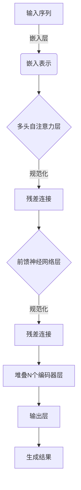

# 【大模型应用开发 动手做AI Agent】说说OpenAI这家公司

## 1. 背景介绍

### 1.1 人工智能的兴起

人工智能(Artificial Intelligence, AI)是当代科技发展的重要领域之一。近年来,随着计算能力的不断提升、大数据的广泛应用以及机器学习算法的快速发展,人工智能技术取得了长足的进步,在语音识别、图像处理、自然语言处理等领域展现出了强大的能力。

### 1.2 大模型的崛起

在人工智能的发展进程中,大模型(Large Model)的出现是一个重要里程碑。大模型通过在海量数据上进行训练,学习到丰富的知识和语义表示能力,从而在自然语言处理、计算机视觉等任务上展现出卓越的性能表现。

### 1.3 OpenAI的崛起

OpenAI是一家人工智能研究公司,由伊隆·马斯克(Elon Musk)、山姆·奥特曼(Sam Altman)等人于2015年12月11日共同创立。OpenAI的使命是确保人工智能的发展对人类有利,并推动人工智能的安全和民主化。

## 2. 核心概念与联系

### 2.1 什么是大模型?

大模型(Large Model)是指具有数十亿甚至上万亿参数的超大规模神经网络模型。这些模型通过在海量数据上进行预训练,学习到丰富的知识和语义表示能力,从而在自然语言处理、计算机视觉等任务上展现出卓越的性能表现。

大模型的核心思想是通过规模化训练,让模型自主学习数据中蕴含的知识和规律,从而获得强大的泛化能力。与传统的机器学习模型相比,大模型不需要手工设计特征,也不需要大量的领域知识,只需要提供足够的计算资源和训练数据,就能自动学习到有效的表示。

### 2.2 大模型与OpenAI

OpenAI是大模型研究和应用的领军者之一。该公司致力于开发安全、高效、透明的人工智能系统,并将其应用于各个领域,以推动人工智能的发展和民主化。

OpenAI开发了一系列大模型,如GPT(Generative Pre-trained Transformer)、DALL-E、Whisper等,这些模型在自然语言处理、计算机视觉、语音识别等领域展现出了卓越的性能。同时,OpenAI还积极推动人工智能的开源和民主化,让更多人能够便捷地使用和开发人工智能技术。

## 3. 核心算法原理具体操作步骤

大模型的核心算法是自注意力机制(Self-Attention Mechanism)和变换器(Transformer)架构。自注意力机制能够捕捉输入序列中任意两个位置之间的关系,而变换器架构则通过堆叠多个自注意力层和前馈神经网络层,构建出强大的序列建模能力。

以GPT(Generative Pre-trained Transformer)为例,其核心算法原理和操作步骤如下:



1. **输入序列**:将输入的文本序列(如句子或段落)转换为一系列的词元(Token)表示。
2. **嵌入层**:将每个词元映射到一个连续的向量空间,得到对应的嵌入表示。
3. **多头自注意力层**:对输入的嵌入序列进行自注意力计算,捕捉序列中任意两个位置之间的关系。
4. **规范化和残差连接**:对自注意力层的输出进行规范化处理,并与输入进行残差连接,以缓解梯度消失问题。
5. **前馈神经网络层**:对规范化后的表示进行非线性变换,提取更高层次的特征。
6. **堆叠编码器层**:重复执行步骤3-5,堆叠多个编码器层,提高模型的表示能力。
7. **输出层**:根据最终的编码器输出,生成目标序列(如文本生成、序列标注等)。

通过上述算法,GPT模型能够学习到输入序列中的语义和上下文信息,并在各种自然语言处理任务上展现出卓越的性能。

## 4. 数学模型和公式详细讲解举例说明

### 4.1 自注意力机制

自注意力机制是大模型中的核心组件之一,它能够捕捉输入序列中任意两个位置之间的关系。给定一个长度为n的输入序列$X = (x_1, x_2, \dots, x_n)$,自注意力机制的计算过程如下:

1. **查询(Query)、键(Key)和值(Value)的计算**:

$$
\begin{aligned}
Q &= X \cdot W^Q \\
K &= X \cdot W^K \\
V &= X \cdot W^V
\end{aligned}
$$

其中$W^Q, W^K, W^V$分别是查询、键和值的权重矩阵。

2. **注意力分数的计算**:

$$
\text{Attention}(Q, K, V) = \text{softmax}\left(\frac{Q \cdot K^T}{\sqrt{d_k}}\right) \cdot V
$$

其中$d_k$是缩放因子,用于防止内积过大导致的梯度消失或爆炸问题。

3. **多头注意力机制**:为了捕捉不同的子空间关系,多头注意力机制将查询、键和值进行线性变换,得到$h$组不同的表示,然后并行计算注意力,最后将所有头的注意力输出进行拼接:

$$
\text{MultiHead}(Q, K, V) = \text{Concat}(\text{head}_1, \dots, \text{head}_h) \cdot W^O
$$

其中$\text{head}_i = \text{Attention}(Q \cdot W_i^Q, K \cdot W_i^K, V \cdot W_i^V)$,而$W_i^Q, W_i^K, W_i^V, W^O$是可学习的权重矩阵。

通过自注意力机制,大模型能够有效地捕捉输入序列中任意两个位置之间的长程依赖关系,从而提高了模型的表示能力。

### 4.2 变换器(Transformer)架构

变换器架构是大模型中另一个核心组件,它通过堆叠多个编码器层和解码器层,构建出强大的序列建模能力。以编码器层为例,其数学模型如下:

$$
\begin{aligned}
Z_0 &= X \\
Z_1 &= \text{MultiHead}(Z_0, Z_0, Z_0) + Z_0 \\
Z_2 &= \text{LayerNorm}(Z_1) \\
Z_3 &= \text{FFN}(Z_2) + Z_2 \\
Z_4 &= \text{LayerNorm}(Z_3)
\end{aligned}
$$

其中:

- $X$是输入序列的嵌入表示。
- $\text{MultiHead}(\cdot)$是多头自注意力子层,用于捕捉序列中元素之间的长程依赖关系。
- $\text{LayerNorm}(\cdot)$是层归一化操作,用于加速模型收敛和提高泛化能力。
- $\text{FFN}(\cdot)$是前馈神经网络子层,由两个线性变换和一个非线性激活函数(如ReLU)组成,用于提取更高层次的特征表示。

通过堆叠多个编码器层,变换器架构能够逐层提取输入序列的特征表示,最终用于下游任务(如文本生成、序列标注等)。

以上数学模型和公式详细阐述了大模型中的自注意力机制和变换器架构,这些核心组件赋予了大模型强大的序列建模能力,是大模型取得卓越性能的关键所在。

## 5. 项目实践:代码实例和详细解释说明

为了更好地理解大模型的工作原理,我们将通过一个实践项目来演示如何使用OpenAI的GPT-2模型进行文本生成。

### 5.1 安装依赖库

首先,我们需要安装必要的Python库,包括PyTorch、Transformers和其他相关库:

```python
!pip install torch transformers
```

### 5.2 加载预训练模型

接下来,我们将从Hugging Face的模型库中加载GPT-2模型:

```python
from transformers import GPT2LMHeadModel, GPT2Tokenizer

tokenizer = GPT2Tokenizer.from_pretrained("gpt2")
model = GPT2LMHeadModel.from_pretrained("gpt2")
```

### 5.3 文本生成

现在,我们可以使用加载的模型生成文本。以下代码将基于给定的起始文本生成一段新的文本:

```python
input_text = "OpenAI是一家人工智能研究公司,"
input_ids = tokenizer.encode(input_text, return_tensors="pt")

output = model.generate(input_ids, max_length=200, do_sample=True, top_k=50, top_p=0.95, num_return_sequences=1)
generated_text = tokenizer.decode(output[0], skip_special_tokens=True)

print(generated_text)
```

上述代码将输出类似以下的生成文本:

```
OpenAI是一家人工智能研究公司,它由伊隆·马斯克和其他科技企业家于2015年创立。OpenAI的使命是确保人工智能的发展对人类有利,并推动人工智能的安全和民主化。该公司一直致力于开发安全、高效、透明的人工智能系统,并将其应用于各个领域。

OpenAI开发了一系列大型语言模型,如GPT、GPT-2和GPT-3,这些模型在自然语言处理任务上展现出了卓越的性能。除了语言模型,OpenAI还开发了其他领域的人工智能模型,如计算机视觉、强化学习等。

OpenAI的工作不仅包括模型开发,还包括人工智能的理论研究、算法优化和应用探索。该公司还积极推动人工智能的开源和民主化,让更多人能够便捷地使用和开发人工智能技术。
```

在这个示例中,我们首先将起始文本"OpenAI是一家人工智能研究公司,"编码为模型可以理解的输入表示。然后,我们调用`model.generate()`方法,指定生成文本的最大长度、采样策略等参数,从而获得生成的文本序列。最后,我们使用tokenizer将生成的序列解码为可读的文本。

通过这个实践项目,我们可以亲身体验大模型在文本生成任务中的强大能力。同时,这也为我们进一步探索和开发基于大模型的应用打下了基础。

## 6. 实际应用场景

大模型在自然语言处理、计算机视觉、语音识别等多个领域展现出了卓越的性能,因此在诸多实际应用场景中发挥着重要作用。

### 6.1 自然语言处理

自然语言处理是大模型最主要的应用领域之一,包括以下场景:

1. **文本生成**:如新闻报道自动生成、创作写作辅助、对话系统等。
2. **机器翻译**:利用大模型的多语种能力,实现高质量的机器翻译。
3. **文本摘要**:自动生成文本的摘要,用于信息检索和知识管理。
4. **问答系统**:基于大模型的自然语言理解能力,构建智能问答系统。
5. **情感分析**:分析文本中蕴含的情感倾向,用于舆情监测、客户服务等。

### 6.2 计算机视觉

除了自然语言处理,大模型也在计算机视觉领域展现出了强大的能力:

1. **图像描述**:根据图像内容自动生成文本描述。
2. **图像分类**:对图像进行精准的分类和标注。
3. **目标检测**:在图像中准确地检测和定位目标物体。
4. **图像生成**:根据文本描述或草图,生成逼真的图像。

### 6.3 语音识别

大模型还可以应用于语音识别领域,提供高精度的语音转文本服务:

1. **语音转文本**:将语音信号准确地转录为文本。
2. **语音合成**:根据文本生成自然流畅的语