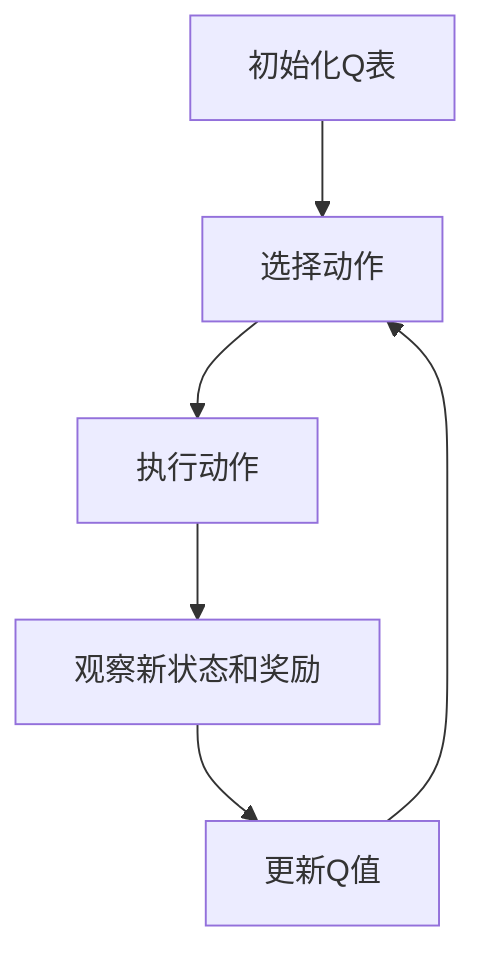

# 一切皆是映射：AI Q-learning在无人机路径规划的应用

## 1.背景介绍

在现代科技的推动下，无人机技术已经在多个领域得到了广泛应用，如物流配送、农业监测、灾害救援等。然而，无人机在复杂环境中的路径规划仍然是一个巨大的挑战。传统的路径规划算法，如A*、Dijkstra等，虽然在静态环境中表现良好，但在动态和不确定环境中往往力不从心。为了解决这一问题，人工智能中的强化学习（Reinforcement Learning, RL）方法，特别是Q-learning，提供了一种新的思路。

Q-learning是一种基于价值的强化学习算法，通过与环境的交互，逐步学习最优策略。本文将深入探讨Q-learning在无人机路径规划中的应用，展示其核心概念、算法原理、数学模型、项目实践以及实际应用场景。

## 2.核心概念与联系

### 2.1 强化学习

强化学习是一种机器学习方法，通过与环境的交互，学习如何采取行动以最大化累积奖励。其基本组成部分包括：

- **状态（State, S）**：环境的描述。
- **动作（Action, A）**：智能体在每个状态下可以采取的行为。
- **奖励（Reward, R）**：智能体在采取某个动作后获得的反馈。
- **策略（Policy, π）**：智能体在每个状态下选择动作的规则。

### 2.2 Q-learning

Q-learning是一种无模型的强化学习算法，通过学习状态-动作值函数（Q值）来估计每个状态-动作对的价值。其核心公式为：

$$
Q(s, a) \leftarrow Q(s, a) + \alpha [r + \gamma \max_{a'} Q(s', a') - Q(s, a)]
$$

其中，$\alpha$ 是学习率，$\gamma$ 是折扣因子，$r$ 是即时奖励，$s'$ 是执行动作$a$后到达的新状态。

### 2.3 无人机路径规划

无人机路径规划的目标是在给定的环境中，从起点到达终点，找到一条最优路径。该路径应尽量避开障碍物，最小化飞行时间或能量消耗。

## 3.核心算法原理具体操作步骤

### 3.1 环境建模

首先，需要对无人机的飞行环境进行建模。可以将环境离散化为一个网格，每个网格单元代表一个状态。无人机可以在网格中移动，每次移动一个单元。

### 3.2 状态和动作定义

- **状态（S）**：无人机在网格中的位置。
- **动作（A）**：无人机可以采取的移动方向，如上、下、左、右。

### 3.3 奖励函数设计

奖励函数的设计直接影响到Q-learning的效果。可以设置以下奖励规则：

- 到达终点：高奖励。
- 碰到障碍物：负奖励。
- 其他移动：小负奖励（鼓励尽快到达终点）。

### 3.4 Q-learning算法步骤

1. 初始化Q表，所有状态-动作对的Q值设为0。
2. 在每个状态下，选择一个动作（使用$\epsilon$-贪婪策略）。
3. 执行动作，观察新的状态和奖励。
4. 更新Q值：
   $$
   Q(s, a) \leftarrow Q(s, a) + \alpha [r + \gamma \max_{a'} Q(s', a') - Q(s, a)]
   $$
5. 重复步骤2-4，直到收敛。

### 3.5 算法流程图



## 4.数学模型和公式详细讲解举例说明

### 4.1 Q-learning更新公式

Q-learning的核心在于更新Q值，其公式为：

$$
Q(s, a) \leftarrow Q(s, a) + \alpha [r + \gamma \max_{a'} Q(s', a') - Q(s, a)]
$$

- $\alpha$：学习率，控制每次更新的步长。
- $\gamma$：折扣因子，衡量未来奖励的重要性。
- $r$：即时奖励。
- $s'$：执行动作$a$后到达的新状态。

### 4.2 示例说明

假设无人机当前在状态$s$，选择动作$a$后到达新状态$s'$，获得奖励$r$。当前Q值$Q(s, a) = 5$，学习率$\alpha = 0.1$，折扣因子$\gamma = 0.9$，新状态$s'$的最大Q值为$Q(s', a') = 8$。

则Q值更新为：

$$
Q(s, a) \leftarrow 5 + 0.1 [r + 0.9 \times 8 - 5]
$$

假设$r = 2$，则：

$$
Q(s, a) \leftarrow 5 + 0.1 [2 + 7.2 - 5] = 5 + 0.1 \times 4.2 = 5.42
$$

## 5.项目实践：代码实例和详细解释说明

### 5.1 环境设置

首先，定义无人机的飞行环境。假设一个10x10的网格，起点为(0,0)，终点为(9,9)，中间有若干障碍物。

```python
import numpy as np

# 定义环境
grid_size = 10
start = (0, 0)
end = (9, 9)
obstacles = [(1, 1), (2, 2), (3, 3), (4, 4)]

# 初始化Q表
Q = np.zeros((grid_size, grid_size, 4))  # 4个动作：上、下、左、右
```

### 5.2 奖励函数

定义奖励函数，设置到达终点的高奖励，碰到障碍物的负奖励，其他移动的小负奖励。

```python
def get_reward(state):
    if state == end:
        return 100
    elif state in obstacles:
        return -100
    else:
        return -1
```

### 5.3 Q-learning算法实现

实现Q-learning算法，更新Q值。

```python
import random

# 参数设置
alpha = 0.1
gamma = 0.9
epsilon = 0.1
num_episodes = 1000

# 动作定义
actions = [(0, 1), (0, -1), (1, 0), (-1, 0)]  # 上、下、左、右

for episode in range(num_episodes):
    state = start
    while state != end:
        if random.uniform(0, 1) < epsilon:
            action = random.choice(actions)
        else:
            action = actions[np.argmax(Q[state[0], state[1]])]
        
        new_state = (state[0] + action[0], state[1] + action[1])
        if new_state[0] < 0 or new_state[0] >= grid_size or new_state[1] < 0 or new_state[1] >= grid_size:
            new_state = state
        
        reward = get_reward(new_state)
        Q[state[0], state[1], actions.index(action)] += alpha * (reward + gamma * np.max(Q[new_state[0], new_state[1]]) - Q[state[0], state[1], actions.index(action)])
        
        state = new_state
```

### 5.4 结果分析

经过训练后，Q表中的值将趋于稳定。可以通过Q表来生成最优路径。

```python
def get_optimal_path():
    path = [start]
    state = start
    while state != end:
        action = actions[np.argmax(Q[state[0], state[1]])]
        state = (state[0] + action[0], state[1] + action[1])
        path.append(state)
    return path

optimal_path = get_optimal_path()
print("Optimal Path:", optimal_path)
```

## 6.实际应用场景

### 6.1 物流配送

在物流配送中，无人机需要在城市环境中避开建筑物和其他障碍物，找到最优路径将包裹送达目的地。Q-learning可以帮助无人机在动态环境中实时调整路径，提高配送效率。

### 6.2 农业监测

在农业监测中，无人机需要在农田上空飞行，采集作物生长数据。Q-learning可以帮助无人机规划最优飞行路径，覆盖整个农田，同时避开障碍物，如树木和电线杆。

### 6.3 灾害救援

在灾害救援中，无人机需要在复杂的灾区环境中搜索和救援受困人员。Q-learning可以帮助无人机在动态和不确定的环境中找到最优路径，提高救援效率。

## 7.工具和资源推荐

### 7.1 开发工具

- **Python**：广泛使用的编程语言，拥有丰富的机器学习库。
- **NumPy**：用于数值计算的Python库。
- **OpenAI Gym**：用于开发和比较强化学习算法的工具包。

### 7.2 学习资源

- **《强化学习：原理与实践》**：一本全面介绍强化学习的书籍。
- **Coursera上的强化学习课程**：由知名大学和机构提供的在线课程。
- **GitHub上的开源项目**：可以参考和学习其他开发者的代码。

## 8.总结：未来发展趋势与挑战

### 8.1 未来发展趋势

随着无人机技术和人工智能的不断发展，Q-learning在无人机路径规划中的应用前景广阔。未来，Q-learning可以与其他技术，如深度学习、计算机视觉等结合，进一步提高无人机的自主飞行能力。

### 8.2 挑战

尽管Q-learning在无人机路径规划中表现出色，但仍面临一些挑战：

- **计算资源**：Q-learning需要大量的计算资源，特别是在大规模环境中。
- **收敛速度**：Q-learning的收敛速度较慢，需要大量的训练时间。
- **环境复杂性**：在高度动态和不确定的环境中，Q-learning的表现可能不稳定。

## 9.附录：常见问题与解答

### 9.1 Q-learning与深度Q-learning有何区别？

Q-learning使用表格来存储Q值，适用于小规模状态空间。深度Q-learning（DQN）使用神经网络来近似Q值，适用于大规模和连续状态空间。

### 9.2 如何选择学习率和折扣因子？

学习率$\alpha$和折扣因子$\gamma$的选择需要根据具体问题进行调整。一般来说，$\alpha$应较小，以确保稳定收敛；$\gamma$应接近1，以重视未来奖励。

### 9.3 如何处理Q-learning中的探索与利用问题？

可以使用$\epsilon$-贪婪策略，在初期多进行探索（较大$\epsilon$），随着训练的进行逐步减少探索（较小$\epsilon$），以平衡探索与利用。

### 9.4 Q-learning在实际应用中有哪些限制？

Q-learning在大规模和高维状态空间中表现不佳，计算资源需求高，收敛速度慢。此外，在高度动态和不确定的环境中，Q-learning的表现可能不稳定。

---

作者：禅与计算机程序设计艺术 / Zen and the Art of Computer Programming