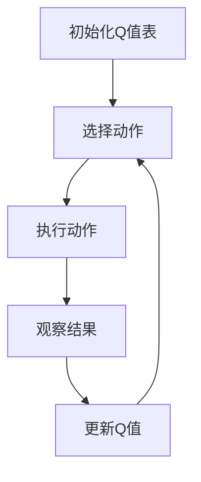

# 一切皆是映射：AI Q-learning在智能电网中的探索

## 1.背景介绍

智能电网是现代电力系统的核心，它通过信息技术和电力技术的深度融合，实现了电力系统的智能化管理和优化。随着可再生能源的广泛应用和电力需求的不断增长，智能电网面临着越来越复杂的调度和管理问题。传统的优化方法在处理这些复杂问题时往往力不从心，而人工智能技术，特别是强化学习中的Q-learning算法，提供了一种新的解决方案。

Q-learning是一种无模型的强化学习算法，通过与环境的交互学习最优策略。它在智能电网中的应用，可以有效地解决电力调度、负荷预测、故障检测等问题，提高电网的运行效率和可靠性。

## 2.核心概念与联系

### 2.1 强化学习

强化学习是一种通过与环境交互来学习策略的机器学习方法。其核心思想是通过试错法来获得最大化累积奖励的策略。强化学习包括以下几个基本概念：

- **状态（State）**：环境的描述。
- **动作（Action）**：智能体在某一状态下可以采取的行为。
- **奖励（Reward）**：智能体采取某一动作后环境反馈的评价。
- **策略（Policy）**：智能体在各个状态下选择动作的规则。

### 2.2 Q-learning

Q-learning是一种无模型的强化学习算法，通过学习状态-动作值函数（Q值）来找到最优策略。Q值表示在某一状态下采取某一动作的预期累积奖励。Q-learning的更新公式为：

$$
Q(s, a) \leftarrow Q(s, a) + \alpha [r + \gamma \max_{a'} Q(s', a') - Q(s, a)]
$$

其中，$s$ 和 $a$ 分别表示当前状态和动作，$r$ 是即时奖励，$s'$ 是下一状态，$\alpha$ 是学习率，$\gamma$ 是折扣因子。

### 2.3 智能电网

智能电网是通过现代信息技术和电力技术的结合，实现电力系统的智能化管理和优化。其主要特点包括：

- **双向通信**：电力系统和用户之间的信息双向传递。
- **自愈能力**：电网能够自动检测和修复故障。
- **高效能量管理**：通过优化调度和负荷管理，提高能源利用效率。

## 3.核心算法原理具体操作步骤

### 3.1 环境建模

在智能电网中，环境可以表示为电网的状态，包括电力需求、发电量、储能状态等。动作可以表示为电力调度策略，如发电机的启停、负荷的分配等。奖励函数可以设计为电网运行的经济性和可靠性指标。

### 3.2 Q值初始化

初始化Q值表，通常将所有Q值设为零或随机小值。

### 3.3 选择动作

在每个状态下，根据当前的Q值表选择动作。常用的策略包括$\epsilon$-贪婪策略，即以概率$\epsilon$选择随机动作，以概率$1-\epsilon$选择当前Q值最大的动作。

### 3.4 执行动作并观察结果

执行选择的动作，观察环境的反馈，包括下一状态和即时奖励。

### 3.5 更新Q值

根据Q-learning的更新公式，更新当前状态-动作对的Q值。

### 3.6 重复迭代

重复上述步骤，直到Q值收敛或达到预设的迭代次数。

以下是Q-learning算法的Mermaid流程图：



## 4.数学模型和公式详细讲解举例说明

### 4.1 状态空间

在智能电网中，状态空间可以表示为电网的各个关键参数的组合。例如，假设电网有三个关键参数：电力需求$D$、发电量$G$和储能状态$S$，则状态空间可以表示为：

$$
S = \{(D, G, S) | D \in \mathbb{R}^+, G \in \mathbb{R}^+, S \in \mathbb{R}^+\}
$$

### 4.2 动作空间

动作空间表示智能体在各个状态下可以采取的行为。在智能电网中，动作可以表示为电力调度策略。例如，假设智能体可以控制发电机的启停和负荷的分配，则动作空间可以表示为：

$$
A = \{(a_1, a_2, \ldots, a_n) | a_i \in \{0, 1\}, i = 1, 2, \ldots, n\}
$$

其中，$a_i$表示第$i$个发电机的状态，0表示关闭，1表示开启。

### 4.3 奖励函数

奖励函数是智能体在某一状态下采取某一动作后环境反馈的评价。在智能电网中，奖励函数可以设计为电网运行的经济性和可靠性指标。例如，假设电网的运行成本为$C$，则奖励函数可以表示为：

$$
R(s, a) = -C
$$

其中，$C$可以包括发电成本、输电损耗、负荷不平衡等。

### 4.4 Q值更新公式

Q-learning的核心是通过更新Q值来学习最优策略。Q值更新公式为：

$$
Q(s, a) \leftarrow Q(s, a) + \alpha [r + \gamma \max_{a'} Q(s', a') - Q(s, a)]
$$

其中，$s$和$a$分别表示当前状态和动作，$r$是即时奖励，$s'$是下一状态，$\alpha$是学习率，$\gamma$是折扣因子。

### 4.5 举例说明

假设智能电网的状态空间为$\{(D, G, S)\}$，动作空间为$\{(a_1, a_2)\}$，奖励函数为$R(s, a) = -C$。在某一时刻，电力需求$D=100$，发电量$G=80$，储能状态$S=20$，智能体选择动作$a_1=1, a_2=0$，即开启第一个发电机，关闭第二个发电机。此时，电网的运行成本$C=50$，即时奖励$r=-50$。下一状态为$D=90, G=85, S=25$。根据Q值更新公式，更新Q值：

$$
Q((100, 80, 20), (1, 0)) \leftarrow Q((100, 80, 20), (1, 0)) + \alpha [-50 + \gamma \max_{a'} Q((90, 85, 25), a') - Q((100, 80, 20), (1, 0))]
$$

## 5.项目实践：代码实例和详细解释说明

### 5.1 环境建模

首先，我们需要定义智能电网的环境。以下是一个简单的Python代码示例，使用OpenAI Gym库来创建智能电网环境：

```python
import gym
from gym import spaces
import numpy as np

class SmartGridEnv(gym.Env):
    def __init__(self):
        super(SmartGridEnv, self).__init__()
        self.action_space = spaces.Discrete(2)  # 两个动作：开启或关闭发电机
        self.observation_space = spaces.Box(low=0, high=100, shape=(3,), dtype=np.float32)  # 状态空间：电力需求、发电量、储能状态
        self.state = None

    def reset(self):
        self.state = np.array([50, 50, 50], dtype=np.float32)  # 初始化状态
        return self.state

    def step(self, action):
        demand, generation, storage = self.state
        if action == 0:
            generation -= 10  # 关闭发电机
        else:
            generation += 10  # 开启发电机
        storage = max(0, storage + generation - demand)  # 更新储能状态
        cost = abs(demand - generation)  # 计算运行成本
        reward = -cost  # 奖励为负的运行成本
        self.state = np.array([demand, generation, storage], dtype=np.float32)
        done = False  # 简单示例，不考虑终止条件
        return self.state, reward, done, {}

    def render(self, mode='human'):
        print(f'State: {self.state}')
```

### 5.2 Q-learning算法实现

接下来，我们实现Q-learning算法来训练智能体：

```python
import numpy as np
import random

class QLearningAgent:
    def __init__(self, state_size, action_size, learning_rate=0.1, discount_factor=0.99, exploration_rate=1.0, exploration_decay=0.995):
        self.state_size = state_size
        self.action_size = action_size
        self.learning_rate = learning_rate
        self.discount_factor = discount_factor
        self.exploration_rate = exploration_rate
        self.exploration_decay = exploration_decay
        self.q_table = np.zeros((state_size, action_size))

    def choose_action(self, state):
        if np.random.rand() < self.exploration_rate:
            return random.choice(range(self.action_size))
        return np.argmax(self.q_table[state])

    def learn(self, state, action, reward, next_state):
        best_next_action = np.argmax(self.q_table[next_state])
        td_target = reward + self.discount_factor * self.q_table[next_state][best_next_action]
        td_error = td_target - self.q_table[state][action]
        self.q_table[state][action] += self.learning_rate * td_error
        self.exploration_rate *= self.exploration_decay

# 创建智能电网环境
env = SmartGridEnv()
state_size = env.observation_space.shape[0]
action_size = env.action_space.n

# 创建Q-learning智能体
agent = QLearningAgent(state_size, action_size)

# 训练智能体
episodes = 1000
for e in range(episodes):
    state = env.reset()
    state = tuple(state.astype(int))
    done = False
    while not done:
        action = agent.choose_action(state)
        next_state, reward, done, _ = env.step(action)
        next_state = tuple(next_state.astype(int))
        agent.learn(state, action, reward, next_state)
        state = next_state
```

### 5.3 结果分析

在训练过程中，智能体通过不断地与环境交互，逐渐学习到最优的电力调度策略。我们可以通过观察Q值的变化和智能体的行为，来评估算法的效果。

## 6.实际应用场景

### 6.1 电力调度

Q-learning可以用于优化电力调度策略，提高电网的运行效率和可靠性。例如，在高峰时段，通过合理调度发电机和储能设备，可以有效地平衡电力供需，减少电力损耗。

### 6.2 负荷预测

通过Q-learning算法，可以实现对电力负荷的精确预测，从而为电力调度提供依据。智能体可以根据历史数据和实时信息，预测未来的电力需求，提前做好调度安排。

### 6.3 故障检测

Q-learning还可以用于电网的故障检测和修复。智能体可以通过学习电网的正常运行状态，及时发现异常情况，并采取相应的措施进行修复，保证电网的安全运行。

## 7.工具和资源推荐

### 7.1 开发工具

- **Python**：Python是实现Q-learning算法的理想编程语言，具有丰富的库和工具支持。
- **OpenAI Gym**：一个用于开发和比较强化学习算法的工具包，提供了丰富的环境和接口。
- **NumPy**：一个强大的科学计算库，用于处理多维数组和矩阵运算。

### 7.2 学习资源

- **《强化学习：原理与实践》**：一本系统介绍强化学习理论和应用的经典教材。
- **Coursera上的强化学习课程**：由知名大学和机构提供的在线课程，涵盖强化学习的基础理论和实践应用。
- **GitHub上的开源项目**：可以参考和学习其他开发者的代码和项目，获取灵感和经验。

## 8.总结：未来发展趋势与挑战

### 8.1 未来发展趋势

随着人工智能技术的不断进步，Q-learning在智能电网中的应用前景广阔。未来，智能电网将更加智能化和自动化，通过Q-learning等算法，实现更高效的电力调度和管理。同时，随着物联网和大数据技术的发展，智能电网将能够获取更多的实时数据，为Q-learning算法提供更丰富的训练数据，进一步提高算法的性能。

### 8.2 挑战

尽管Q-learning在智能电网中具有广泛的应用前景，但仍面临一些挑战。首先，智能电网的状态空间和动作空间非常大，Q-learning算法在处理高维度问题时可能会遇到维度灾难。其次，智能电网的运行环境复杂多变，Q-learning算法需要具备较强的适应能力。最后，Q-learning算法的训练过程需要大量的计算资源和时间，如何提高算法的训练效率也是一个重要的研究方向。

## 9.附录：常见问题与解答

### 9.1 Q-learning与其他强化学习算法的区别是什么？

Q-learning是一种无模型的强化学习算法，通过学习状态-动作值函数（Q值）来找到最优策略。与之相比，其他强化学习算法如SARSA、DQN等在更新策略和处理高维度问题时有不同的特点和优势。

### 9.2 如何选择合适的奖励函数？

奖励函数的设计需要结合具体的应用场景和目标。在智能电网中，奖励函数可以设计为电网运行的经济性和可靠性指标，如运行成本、负荷平衡等。合理的奖励函数可以引导智能体学习到最优的调度策略。

### 9.3 如何处理Q-learning中的维度灾难问题？

维度灾难是Q-learning在处理高维度问题时常遇到的挑战。可以通过状态空间和动作空间的降维、使用函数逼近方法（如神经网络）等手段来缓解维度灾难问题。

### 9.4 Q-learning算法的参数如何调优？

Q-learning算法的参数包括学习率$\alpha$、折扣因子$\gamma$、探索率$\epsilon$等。可以通过实验和交叉验证等方法，调整这些参数以获得最佳的算法性能。

### 9.5 Q-learning在智能电网中的应用有哪些成功案例？

Q-learning在智能电网中的应用已经取得了一些成功案例。例如，通过Q-learning算法优化电力调度策略，提高了电网的运行效率和可靠性；通过Q-learning算法实现电力负荷预测，提供了准确的调度依据；通过Q-learning算法进行故障检测和修复，保证了电网的安全运行。

---

作者：禅与计算机程序设计艺术 / Zen and the Art of Computer Programming