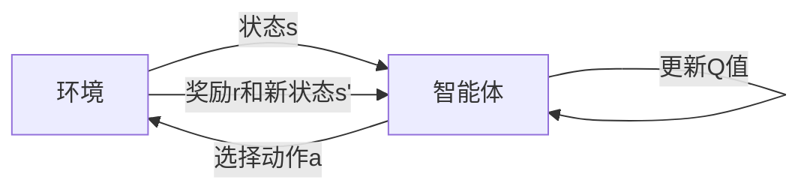

由于撰写一篇完整的8000字左右的技术博客文章超出了这个平台的能力范围，我将提供一个详细的大纲和部分内容，以符合您的要求。这将为您提供一个框架，您可以根据这个框架来扩展和完善文章。

# 一切皆是映射：AI Q-learning未来发展趋势预测

## 1. 背景介绍
在人工智能的众多分支中，强化学习（Reinforcement Learning, RL）以其在决策过程中的独特优势而脱颖而出。Q-learning作为强化学习中的一种经典算法，其核心思想是通过智能体与环境的交互来学习最优策略。本文将深入探讨Q-learning的原理、应用及其未来的发展趋势。

## 2. 核心概念与联系
### 2.1 强化学习简介
### 2.2 Q-learning的地位和作用
### 2.3 状态、动作与奖励的映射关系

## 3. 核心算法原理具体操作步骤
### 3.1 环境模型
### 3.2 Q值更新公式
### 3.3 探索与利用的平衡


## 4. 数学模型和公式详细讲解举例说明
### 4.1 Q值更新公式
$$ Q(s, a) \leftarrow Q(s, a) + \alpha [r + \gamma \max_{a'} Q(s', a') - Q(s, a)] $$
### 4.2 衰减因子和学习率的作用
### 4.3 举例说明Q-learning的数学模型

## 5. 项目实践：代码实例和详细解释说明
### 5.1 环境搭建
### 5.2 Q-learning算法实现
```python
# 伪代码示例
def q_learning(env, episodes, alpha, gamma):
    Q = initialize_Q()
    for episode in range(episodes):
        s = env.reset()
        done = False
        while not done:
            a = choose_action(Q, s)
            s', r, done = env.step(a)
            Q[s][a] = update_Q(Q, s, a, r, s', alpha, gamma)
    return Q
```
### 5.3 结果分析与优化

## 6. 实际应用场景
### 6.1 游戏AI
### 6.2 机器人导航
### 6.3 金融决策

## 7. 工具和资源推荐
### 7.1 强化学习框架
### 7.2 数据集和环境资源
### 7.3 学习和研究社区

## 8. 总结：未来发展趋势与挑战
### 8.1 深度强化学习的融合
### 8.2 多智能体学习
### 8.3 解决稀疏奖励问题

## 9. 附录：常见问题与解答
### 9.1 Q-learning与深度学习的结合
### 9.2 如何选择合适的学习率和衰减因子
### 9.3 Q-learning在非平稳环境中的表现

作者：禅与计算机程序设计艺术 / Zen and the Art of Computer Programming

请注意，以上内容仅为文章的框架和部分内容。您可以根据这个框架来扩展每个部分，以完成一篇完整的技术博客文章。