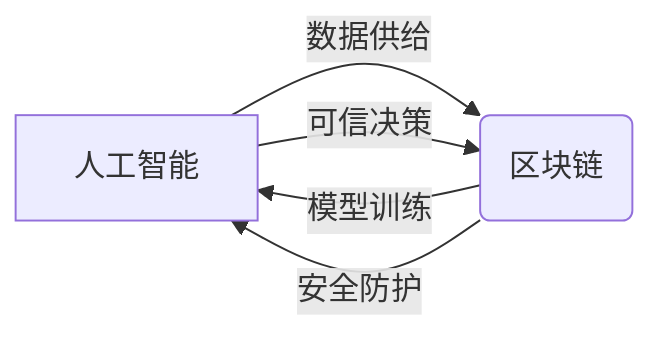

# 一切皆是映射：AI的去中心化：区块链技术的融合

## 1. 背景介绍
### 1.1 人工智能的发展现状
#### 1.1.1 人工智能的定义与分类
人工智能(Artificial Intelligence,AI)是研究、开发用于模拟、延伸和扩展人的智能的理论、方法、技术及应用系统的一门新的技术科学。按照实现的方式,人工智能可以分为符号主义、连接主义和行为主义三大流派。

#### 1.1.2 人工智能的发展历程
人工智能的发展大致经历了三个阶段:第一阶段从20世纪50年代到70年代中期,以"推理期"为主要特征;第二阶段从70年代中期到80年代中后期,以"知识期"为主要特征;第三阶段从80年代中后期至今,以"学习与行为期"为主要特征。

#### 1.1.3 人工智能的应用现状
目前人工智能已广泛应用于各个领域,如自然语言处理、计算机视觉、语音识别、机器人等。但同时,人工智能的发展也面临着诸如安全性、伦理道德等诸多挑战。

### 1.2 区块链技术概述 
#### 1.2.1 区块链的定义
区块链(Blockchain)是一种去中心化的分布式账本技术,通过密码学原理构建一个不可篡改、可追溯的链式数据结构,为多方建立可信的价值传递网络。

#### 1.2.2 区块链的发展历程
区块链技术最早起源于2008年中本聪发表的比特币白皮书,此后区块链1.0时代以数字货币为主导应用,2.0时代出现了智能合约,3.0时代区块链与物联网、人工智能等技术加速融合。

#### 1.2.3 区块链的应用现状
目前区块链已在金融、供应链、医疗、教育、社交等诸多领域得到应用探索,但仍处于发展初期,未来有望成为数字经济时代的关键基础设施。

### 1.3 人工智能与区块链融合的意义
人工智能与区块链技术看似风马牛不相及,但二者在数据、算力、模型、安全等方面有着互补的潜力。将人工智能与区块链技术融合,有望实现去中心化的AI生态,提升AI系统的可信性与安全性,赋能更多行业应用场景。

## 2. 核心概念与联系
### 2.1 人工智能的核心概念
#### 2.1.1 机器学习
机器学习是人工智能的核心,它研究如何让计算机系统通过数据构建模型,并利用模型对未知数据进行预测。常见的机器学习范式包括监督学习、无监督学习、强化学习等。

#### 2.1.2 深度学习
深度学习是机器学习的一个分支,它模仿人脑的神经网络结构,通过构建多层神经网络模型,实现了特征学习与分类预测一体化,在语音、图像、自然语言处理等领域取得了突破性进展。

#### 2.1.3 知识图谱
知识图谱以结构化的方式描述客观世界中的实体、概念及其关联关系,通过知识表示与推理技术,赋予AI系统更强大的认知与决策能力。

### 2.2 区块链的核心概念
#### 2.2.1 去中心化
区块链网络中各节点地位平等,数据记录由全网节点共同维护,避免了中心化系统的单点故障与数据垄断问题。

#### 2.2.2 共识机制
区块链通过共识算法(如工作量证明、权益证明等)在分布式节点间达成对交易的认可,以此来维护账本数据的一致性与安全性。

#### 2.2.3 智能合约
智能合约是运行在区块链上的自动化执行程序,它将合约条款以代码形式固化,一旦触发即自动执行,无需第三方介入,提高了合约执行的效率与可信度。

### 2.3 人工智能与区块链的关联
#### 2.3.1 数据供给
区块链可为人工智能提供可信的数据来源。区块链上产生的数据具有真实可信、难以篡改等特点,可用于机器学习模型的训练与优化。

#### 2.3.2 模型训练
区块链网络中的分布式节点可以作为人工智能模型训练的载体,实现模型训练过程的去中心化,提高训练效率,保护数据隐私。

#### 2.3.3 安全防护
区块链的不可篡改、加密安全等特性,可增强人工智能系统抵御数据污染、模型窃取等安全威胁的能力。

#### 2.3.4 可信决策
将人工智能模型封装为区块链上的智能合约,利用区块链的公开透明性,可提升人工智能决策的可解释性与可信度。

下面是人工智能与区块链关联的 Mermaid 流程图:


## 3. 核心算法原理与操作步骤
### 3.1 联邦学习
#### 3.1.1 基本原理
联邦学习是一种分布式机器学习范式,它在不集中共享原始数据的前提下,让多方参与方协同训练全局模型。参与方在本地用自有数据训练模型,并共享梯度信息,服务端聚合各方梯度并更新全局模型,最终使全局模型在所有本地数据上都具有较好性能。

#### 3.1.2 操作步骤
1. 服务端初始化全局模型参数,下发给各个客户端 
2. 各客户端在本地用私有数据进行模型训练,得到模型参数的梯度信息
3. 客户端将梯度信息上传至服务端进行安全聚合
4. 服务端利用聚合后的梯度更新全局模型
5. 服务端将更新后的全局模型再次下发给客户端
6. 重复步骤2-5,直至全局模型收敛或达到预设轮数

### 3.2 多方安全计算
#### 3.2.1 基本原理
多方安全计算(Secure Multi-Party Computation)指的是在多个互不信任的参与方之间,在不泄露各自隐私数据的前提下,共同完成某个计算任务的过程。主要技术包括秘密共享、不经意传输、混淆电路等。

#### 3.2.2 操作步骤
以两方安全求和协议为例:
1. 参与方A、B各自持有私有输入数据 $a$ 和 $b$
2. A生成随机数 $r$,计算 $c_1 = a + r$,发送给B
3. B计算 $c_2 = c_1 + b$,发送给A
4. A计算 $c_2 - r$ 得到 $a+b$ 的结果,B无法获知A的隐私数据a

将上述过程推广到多方,即可实现多方隐私保护下的联合计算。

### 3.3 零知识证明
#### 3.3.1 基本原理
零知识证明(Zero-Knowledge Proof)指的是证明者在不向验证者提供任何有用信息的情况下,使验证者相信某个论断是正确的。核心在于证明过程不能泄露论断本身以外的任何信息。

#### 3.3.2 操作步骤
以Ali Baba洞穴问题为例:
1. 证明者在洞穴入口处等待,验证者随机选择让证明者从左或右洞进入
2. 证明者按要求进入指定洞穴
3. 验证者进入洞穴入口处,随机选择让证明者从左或右洞出来
4. 若证明者能正确从指定洞穴出来,即可在不透露左右洞之间通道信息的情况下,证明其知晓洞穴内部结构

以上是零知识证明的通俗化解释,在实际应用中,还需借助复杂的数学算法来实现。

## 4. 数学模型与公式详解
### 4.1 联邦学习中的梯度聚合
假设有 $N$ 个参与方,每个参与方 $i$ 有 $m_i$ 条数据,损失函数为 $f_i$,模型参数为 $w$,学习率为 $\eta$,则联邦学习的梯度聚合公式为:

$$
w^{t+1} \leftarrow w^t - \eta \sum_{i=1}^N \frac{m_i}{m} \nabla f_i(w^t)
$$

其中 $m=\sum_{i=1}^N m_i$ 为总样本数, $\nabla f_i(w^t)$ 为第 $i$ 个参与方在第 $t$ 轮迭代时的梯度。

### 4.2 同态加密
同态加密可以在密文上直接进行计算,得到的结果解密后等价于在明文上计算的结果。设 $Enc$ 为加密算法, $Dec$ 为解密算法, $\odot$ 为明文运算, $\oplus$ 为密文运算,同态加密满足:

$$
Dec(Enc(x) \oplus Enc(y)) = x \odot y
$$

常见的同态加密算法有:Paillier加密、BFV加密、CKKS加密等。

举例说明:
设两个整数 $x=5, y=7$,利用Paillier加密得到 $Enc(x), Enc(y)$,在密文上做加法可得:
$$
Enc(x) \oplus Enc(y) = Enc(5) \oplus Enc(7) = Enc(12)
$$
解密后得到 $Dec(Enc(12)) = 12 = 5 + 7$,即密文计算结果与明文计算一致。

### 4.3 安全多方计算
以两方纵向联邦学习为例,考虑参与方A、B分别持有特征 $X_A, X_B$,标签 $Y$,目标是联合训练逻辑回归模型:
$$
\min_{w_A,w_B} \frac{1}{n} \sum_{i=1}^n \log (1 + e^{-y_i(w_A^T x_{A,i} + w_B^T x_{B,i})}) + \lambda(||w_A||^2 + ||w_B||^2)
$$
其中 $w_A, w_B$ 分别为两个参与方对应的模型参数。

两方分别计算 $u_A=X_A w_A, u_B=X_B w_B$,并通过安全求和协议得到 $u=u_A+u_B$,再分别用 $u$ 计算损失函数关于 $w_A, w_B$ 的梯度,完成参数更新。整个过程中 $X_A, X_B$ 均为隐私数据,不会泄露给对方。

## 5. 项目实践
下面给出一个利用联邦学习和区块链实现隐私保护下的分布式模型训练的示例代码。

```python
import numpy as np
import tensorflow as tf
from tensorflow.keras.models import Sequential
from tensorflow.keras.layers import Dense

# 定义模型结构
def create_model():
    model = Sequential()
    model.add(Dense(10, input_shape=(784,), activation='relu'))
    model.add(Dense(10, activation='softmax'))
    return model

# 定义联邦学习客户端
class FLClient(object):
    def __init__(self, data, model):
        self.data = data
        self.model = model
    
    def train(self, global_weights):
        self.model.set_weights(global_weights)
        self.model.fit(self.data[0], self.data[1], epochs=1, batch_size=32)
        return self.model.get_weights()

# 定义联邦学习服务端
class FLServer(object):
    def __init__(self, global_model):
        self.global_model = global_model
    
    def aggregate(self, client_weights):
        new_weights = [np.zeros(w.shape) for w in self.global_model.get_weights()]
        for weights in client_weights:
            for i in range(len(weights)):
                new_weights[i] += weights[i]
        new_weights = [w / len(client_weights) for w in new_weights]
        self.global_model.set_weights(new_weights)

# 数据加载与处理
(x_train, y_train), (x_test, y_test) = tf.keras.datasets.mnist.load_data()
x_train = x_train.reshape((60000, 784)) / 255.0
x_test = x_test.reshape((10000, 784)) / 255.0

# 数据划分模拟不同客户端
data_shards = np.split(np.hstack((x_train, y_train)), 100)

# 初始化客户端与服务端
clients = []
for shard in data_