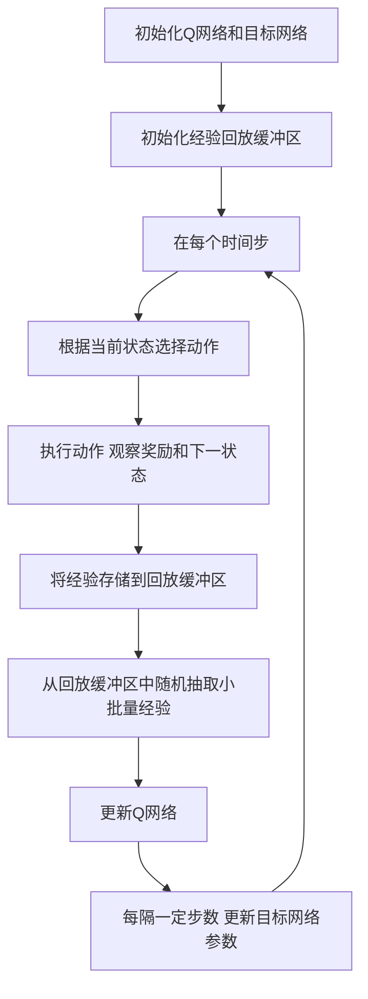

# 一切皆是映射：DQN在安全防御中的应用：智能检测与响应

## 1.背景介绍

在当今数字化时代，网络安全已经成为各行各业的重中之重。随着网络攻击手段的不断升级，传统的安全防御机制显得越来越力不从心。深度强化学习（Deep Reinforcement Learning, DRL）作为人工智能领域的前沿技术，展示了其在复杂决策问题中的强大能力。特别是深度Q网络（Deep Q-Network, DQN），在游戏、机器人控制等领域取得了显著成果。本文将探讨DQN在网络安全防御中的应用，特别是其在智能检测与响应中的潜力。

## 2.核心概念与联系

### 2.1 深度强化学习

深度强化学习结合了深度学习和强化学习的优势，通过深度神经网络来近似值函数，从而在高维状态空间中进行有效的决策。其核心思想是通过与环境的交互，不断调整策略以最大化累积奖励。

### 2.2 Q学习与DQN

Q学习是一种无模型的强化学习算法，通过学习状态-动作值函数（Q函数）来指导代理的行为。DQN则是Q学习的扩展，利用深度神经网络来近似Q函数，从而在复杂环境中进行有效的决策。

### 2.3 网络安全防御

网络安全防御包括检测和响应两个主要部分。检测是指识别潜在的威胁和攻击，而响应则是采取适当的措施来阻止或减轻攻击的影响。传统的防御机制主要依赖于规则和签名，难以应对新型和未知的攻击。

### 2.4 DQN与网络安全的联系

DQN在网络安全中的应用主要体现在其智能检测与响应能力上。通过不断学习和调整策略，DQN可以在复杂的网络环境中识别潜在威胁，并采取适当的响应措施，从而提高整体防御能力。

## 3.核心算法原理具体操作步骤

### 3.1 环境建模

在应用DQN进行网络安全防御时，首先需要对网络环境进行建模。环境包括状态、动作和奖励三个主要部分。

- **状态**：网络的当前状态，可以包括流量特征、系统日志、用户行为等。
- **动作**：代理可以采取的防御措施，如阻止IP、隔离主机、调整防火墙规则等。
- **奖励**：根据防御措施的效果给予奖励或惩罚，如成功阻止攻击给予正奖励，误报或漏报给予负奖励。

### 3.2 Q函数近似

DQN通过深度神经网络来近似Q函数。具体来说，输入当前状态，输出每个可能动作的Q值。网络的训练目标是最小化以下损失函数：

$$
L(\theta) = \mathbb{E}[(r + \gamma \max_{a'} Q(s', a'; \theta^-) - Q(s, a; \theta))^2]
$$

其中，$r$ 是奖励，$\gamma$ 是折扣因子，$s'$ 是下一状态，$\theta$ 和 $\theta^-$ 分别是当前网络和目标网络的参数。

### 3.3 经验回放

为了提高训练的稳定性，DQN引入了经验回放机制。代理在与环境交互过程中，将每次的经验（状态、动作、奖励、下一状态）存储在回放缓冲区中。训练时，从缓冲区中随机抽取小批量经验进行更新。

### 3.4 目标网络

DQN还引入了目标网络来进一步稳定训练。目标网络的参数每隔一定步数才会更新为当前网络的参数，从而减少Q值的波动。

### 3.5 训练过程

1. 初始化Q网络和目标网络的参数。
2. 初始化经验回放缓冲区。
3. 在每个时间步：
   - 根据当前状态选择动作（使用 $\epsilon$-贪心策略）。
   - 执行动作，观察奖励和下一状态。
   - 将经验存储到回放缓冲区。
   - 从回放缓冲区中随机抽取小批量经验，更新Q网络。
   - 每隔一定步数，更新目标网络的参数。

以下是DQN训练过程的Mermaid流程图：



## 4.数学模型和公式详细讲解举例说明

### 4.1 Q学习的数学模型

Q学习的核心是状态-动作值函数 $Q(s, a)$，表示在状态 $s$ 下采取动作 $a$ 所能获得的期望累积奖励。更新公式为：

$$
Q(s, a) \leftarrow Q(s, a) + \alpha [r + \gamma \max_{a'} Q(s', a') - Q(s, a)]
$$

其中，$\alpha$ 是学习率，$\gamma$ 是折扣因子，$r$ 是即时奖励，$s'$ 是下一状态，$a'$ 是下一动作。

### 4.2 DQN的改进

DQN通过深度神经网络来近似Q函数，输入当前状态 $s$，输出每个可能动作的Q值。损失函数为：

$$
L(\theta) = \mathbb{E}[(r + \gamma \max_{a'} Q(s', a'; \theta^-) - Q(s, a; \theta))^2]
$$

其中，$\theta$ 和 $\theta^-$ 分别是当前网络和目标网络的参数。

### 4.3 经验回放

经验回放缓冲区存储代理与环境交互的经验 $(s, a, r, s')$。训练时，从缓冲区中随机抽取小批量经验进行更新，减少样本间的相关性，提高训练稳定性。

### 4.4 目标网络

目标网络的参数 $\theta^-$ 每隔一定步数才会更新为当前网络的参数 $\theta$，从而减少Q值的波动，稳定训练过程。

### 4.5 举例说明

假设我们在一个简单的网络环境中应用DQN进行防御。状态包括当前网络流量特征，动作包括阻止IP和调整防火墙规则。奖励根据防御效果给予正负值。

1. 初始状态 $s_0$：网络流量正常。
2. 代理选择动作 $a_0$：阻止可疑IP。
3. 观察到奖励 $r_0$：成功阻止攻击，奖励为正。
4. 进入下一状态 $s_1$：网络流量恢复正常。
5. 更新Q值：$Q(s_0, a_0) \leftarrow Q(s_0, a_0) + \alpha [r_0 + \gamma \max_{a'} Q(s_1, a') - Q(s_0, a_0)]$。

通过不断与环境交互，代理逐渐学会在不同状态下采取最优的防御措施。

## 5.项目实践：代码实例和详细解释说明

### 5.1 环境搭建

首先，我们需要搭建一个模拟的网络环境。可以使用Python的Gym库来创建自定义环境。

```python
import gym
from gym import spaces
import numpy as np

class NetworkEnv(gym.Env):
    def __init__(self):
        super(NetworkEnv, self).__init__()
        self.action_space = spaces.Discrete(2)  # 两个动作：阻止IP和调整防火墙规则
        self.observation_space = spaces.Box(low=0, high=1, shape=(4,), dtype=np.float32)  # 网络流量特征
        self.state = None

    def reset(self):
        self.state = np.random.rand(4)
        return self.state

    def step(self, action):
        reward = 0
        if action == 0:  # 阻止IP
            reward = 1 if np.random.rand() > 0.5 else -1
        elif action == 1:  # 调整防火墙规则
            reward = 1 if np.random.rand() > 0.7 else -1
        self.state = np.random.rand(4)
        done = False
        return self.state, reward, done, {}

    def render(self, mode='human'):
        pass
```

### 5.2 DQN实现

接下来，我们实现DQN算法。可以使用PyTorch来构建深度神经网络。

```python
import torch
import torch.nn as nn
import torch.optim as optim
import random
from collections import deque

class DQN(nn.Module):
    def __init__(self, state_size, action_size):
        super(DQN, self).__init__()
        self.fc1 = nn.Linear(state_size, 24)
        self.fc2 = nn.Linear(24, 24)
        self.fc3 = nn.Linear(24, action_size)

    def forward(self, x):
        x = torch.relu(self.fc1(x))
        x = torch.relu(self.fc2(x))
        return self.fc3(x)

class Agent:
    def __init__(self, state_size, action_size):
        self.state_size = state_size
        self.action_size = action_size
        self.memory = deque(maxlen=2000)
        self.gamma = 0.95
        self.epsilon = 1.0
        self.epsilon_min = 0.01
        self.epsilon_decay = 0.995
        self.learning_rate = 0.001
        self.model = DQN(state_size, action_size)
        self.target_model = DQN(state_size, action_size)
        self.optimizer = optim.Adam(self.model.parameters(), lr=self.learning_rate)
        self.update_target_model()

    def update_target_model(self):
        self.target_model.load_state_dict(self.model.state_dict())

    def remember(self, state, action, reward, next_state, done):
        self.memory.append((state, action, reward, next_state, done))

    def act(self, state):
        if np.random.rand() <= self.epsilon:
            return random.randrange(self.action_size)
        state = torch.FloatTensor(state).unsqueeze(0)
        act_values = self.model(state)
        return torch.argmax(act_values[0]).item()

    def replay(self, batch_size):
        minibatch = random.sample(self.memory, batch_size)
        for state, action, reward, next_state, done in minibatch:
            target = reward
            if not done:
                next_state = torch.FloatTensor(next_state).unsqueeze(0)
                target = reward + self.gamma * torch.max(self.target_model(next_state)[0]).item()
            state = torch.FloatTensor(state).unsqueeze(0)
            target_f = self.model(state)
            target_f[0][action] = target
            self.optimizer.zero_grad()
            loss = nn.MSELoss()(target_f, self.model(state))
            loss.backward()
            self.optimizer.step()
        if self.epsilon > self.epsilon_min:
            self.epsilon *= self.epsilon_decay

    def load(self, name):
        self.model.load_state_dict(torch.load(name))

    def save(self, name):
        torch.save(self.model.state_dict(), name)

env = NetworkEnv()
state_size = env.observation_space.shape[0]
action_size = env.action_space.n
agent = Agent(state_size, action_size)
done = False
batch_size = 32

for e in range(1000):
    state = env.reset()
    for time in range(500):
        action = agent.act(state)
        next_state, reward, done, _ = env.step(action)
        agent.remember(state, action, reward, next_state, done)
        state = next_state
        if done:
            agent.update_target_model()
            break
        if len(agent.memory) > batch_size:
            agent.replay(batch_size)
    if e % 10 == 0:
        agent.save(f"dqn_{e}.h5")
```

### 5.3 代码解释

1. **环境搭建**：我们创建了一个自定义的网络环境，包含两个动作和四个状态特征。
2. **DQN实现**：我们使用PyTorch构建了一个简单的三层全连接神经网络来近似Q函数。
3. **代理类**：包含记忆回放、动作选择、经验存储和模型训练等功能。
4. **训练过程**：在每个回合中，代理与环境交互，存储经验，并定期更新目标网络。

## 6.实际应用场景

### 6.1 入侵检测系统

DQN可以用于构建智能入侵检测系统（IDS）。通过不断学习网络流量特征和攻击模式，DQN能够识别潜在的威胁，并采取适当的响应措施，如阻止IP、调整防火墙规则等。

### 6.2 恶意软件检测

在恶意软件检测中，DQN可以通过分析文件特征和行为模式，识别潜在的恶意软件，并采取相应的防御措施，如隔离文件、阻止执行等。

### 6.3 网络流量管理

DQN还可以用于网络流量管理，通过分析网络流量特征，动态调整网络配置，以优化网络性能和安全性。

### 6.4 用户行为分析

通过分析用户行为特征，DQN可以识别异常行为，并采取相应的防御措施，如限制访问、强制重新认证等。

## 7.工具和资源推荐

### 7.1 开发工具

- **Python**：主要编程语言，广泛用于机器学习和深度学习。
- **PyTorch**：深度学习框架，支持动态计算图，易于调试和扩展。
- **Gym**：强化学习环境库，支持自定义环境创建。

### 7.2 数据集

- **KDD Cup 99**：经典的入侵检测数据集，包含多种网络攻击类型。
- **CICIDS 2017**：现代入侵检测数据集，包含多种最新的攻击类型和正常流量。

### 7.3 学习资源

- **《深度强化学习》**：介绍深度强化学习的基本概念和算法。
- **《Python深度学习》**：介绍如何使用Python和深度学习框架进行开发。
- **Coursera**：提供多种机器学习和深度学习课程。

## 8.总结：未来发展趋势与挑战

### 8.1 未来发展趋势

随着网络攻击手段的不断升级，传统的安全防御机制难以应对新型和未知的攻击。深度强化学习，特别是DQN，展示了其在智能检测与响应中的巨大潜力。未来，随着算法的不断改进和计算资源的增加，DQN在网络安全中的应用将更加广泛和深入。

### 8.2 挑战

尽管DQN在网络安全中展示了巨大的潜力，但仍面临一些挑战：

- **数据稀缺**：高质量的训练数据集较为稀缺，难以覆盖所有可能的攻击类型。
- **计算资源**：训练深度神经网络需要大量的计算资源，特别是在大规模网络环境中。
- **实时性**：在实际应用中，防御措施需要实时响应，DQN的计算开销可能成为瓶颈。
- **鲁棒性**：DQN在面对未知攻击时的鲁棒性仍需进一步验证和提高。

## 9.附录：常见问题与解答

### 9.1 DQN与传统防御机制的区别是什么？

DQN通过不断学习和调整策略，能够在复杂的网络环境中识别潜在威胁，并采取适当的响应措施。相比之下，传统防御机制主要依赖于规则和签名，难以应对新型和未知的攻击。

### 9.2 如何选择合适的奖励函数？

奖励函数的设计需要结合具体的应用场景。一般来说，成功阻止攻击或识别威胁应给予正奖励，而误报或漏报应给予负奖励。奖励函数的设计直接影响到代理的学习效果。

### 9.3 如何提高DQN的训练效率？

可以通过以下几种方法提高DQN的训练效率：
- 使用经验回放缓冲区，减少样本间的相关性。
- 引入目标网络，稳定训练过程。
- 调整超参数，如学习率、折扣因子等。
- 使用更复杂的神经网络结构，提高模型的表达能力。

### 9.4 DQN在实际应用中有哪些限制？

DQN在实际应用中主要面临以下限制：
- 数据稀缺：高质量的训练数据集较为稀缺，难以覆盖所有可能的攻击类型。
- 计算资源：训练深度神经网络需要大量的计算资源，特别是在大规模网络环境中。
- 实时性：在实际应用中，防御措施需要实时响应，DQN的计算开销可能成为瓶颈。

### 9.5 如何评估DQN的防御效果？

可以通过以下几种方法评估DQN的防御效果：
- 准确率：识别威胁的准确率。
- 召回率：识别威胁的召回率。
- F1分数：准确率和召回率的综合指标。
- 平均奖励：在训练过程中，代理获得的平均奖励。

作者：禅与计算机程序设计艺术 / Zen and the Art of Computer Programming