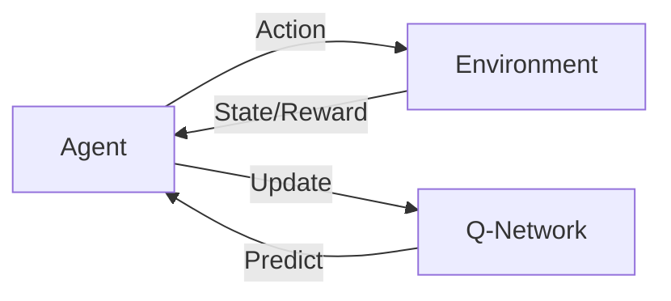

# 一切皆是映射：DQN在自然语言处理任务中的应用探讨

## 1. 背景介绍
### 1.1 自然语言处理的发展历程
#### 1.1.1 早期的规则与统计方法
#### 1.1.2 深度学习的兴起
#### 1.1.3 强化学习的引入
### 1.2 DQN的起源与发展
#### 1.2.1 Q-Learning的基本原理 
#### 1.2.2 DQN的提出与改进
#### 1.2.3 DQN在游戏领域的成功应用
### 1.3 DQN在NLP中的应用前景
#### 1.3.1 传统NLP方法的局限性
#### 1.3.2 DQN的优势与潜力
#### 1.3.3 已有的探索与尝试

## 2. 核心概念与联系
### 2.1 强化学习的基本框架
#### 2.1.1 Agent、Environment、State、Action、Reward
#### 2.1.2 探索与利用的权衡
#### 2.1.3 值函数与策略函数
### 2.2 Q-Learning与DQN
#### 2.2.1 Q-Learning的Bellman方程与更新规则
#### 2.2.2 Q-Table的维度灾难与函数近似
#### 2.2.3 DQN的神经网络结构与损失函数
### 2.3 NLP任务的MDP建模
#### 2.3.1 状态空间与动作空间的设计
#### 2.3.2 奖励函数的定义与优化
#### 2.3.3 环境模型的构建与交互



## 3. 核心算法原理具体操作步骤
### 3.1 DQN的训练流程
#### 3.1.1 经验回放的数据结构与采样策略
#### 3.1.2 目标网络的参数更新机制
#### 3.1.3 ε-greedy的探索策略
### 3.2 DQN在NLP任务中的适配
#### 3.2.1 状态表示的特征工程
#### 3.2.2 动作空间的离散化处理
#### 3.2.3 奖励函数的归一化与平滑
### 3.3 算法的伪代码与实现要点  
#### 3.3.1 DQN的PyTorch实现模板
#### 3.3.2 经验回放的高效存储与采样
#### 3.3.3 梯度裁剪与优化器选择

## 4. 数学模型和公式详细讲解举例说明
### 4.1 MDP的数学定义与性质
#### 4.1.1 状态转移概率与奖励函数
#### 4.1.2 策略、值函数与贝尔曼方程
#### 4.1.3 最优策略与最优值函数的存在性与唯一性
### 4.2 Q-Learning的收敛性证明
#### 4.2.1 Q-Learning的异步动态规划解释
#### 4.2.2 探索策略对收敛性的影响
#### 4.2.3 Q-Learning收敛于最优Q值的充分必要条件
### 4.3 DQN的损失函数推导
#### 4.3.1 TD误差与均方损失的关系
#### 4.3.2 目标Q值的计算与Bootstrap
#### 4.3.3 基于梯度下降的参数更新公式

$$ L(\theta) = \mathbb{E}_{(s,a,r,s')\sim D} \left[ \left( r + \gamma \max_{a'}Q(s',a';\theta^-) - Q(s,a;\theta) \right)^2 \right] $$

$$ \theta \leftarrow \theta - \alpha \nabla_\theta L(\theta) $$

## 5. 项目实践：代码实例和详细解释说明
### 5.1 DQN在问答系统中的应用
#### 5.1.1 将问答任务建模为MDP
#### 5.1.2 状态表示：问题与对话历史的Embedding
#### 5.1.3 动作空间：候选答案的排序与选择
#### 5.1.4 奖励函数：基于ROUGE、BLEU等指标的设计
#### 5.1.5 DQN模型的训练与测试
### 5.2 DQN在文本摘要中的应用
#### 5.2.1 将摘要任务建模为序列决策过程
#### 5.2.2 状态表示：文章与摘要的Embedding
#### 5.2.3 动作空间：词语的选择与停止
#### 5.2.4 奖励函数：基于覆盖度、相关性等指标的设计
#### 5.2.5 DQN模型的训练与测试
### 5.3 DQN在对话生成中的应用
#### 5.3.1 将对话生成任务建模为MDP
#### 5.3.2 状态表示：对话历史与话题的Embedding
#### 5.3.3 动作空间：回复内容的生成
#### 5.3.4 奖励函数：基于相关性、流畅性、丰富性等指标的设计 
#### 5.3.5 DQN模型的训练与人机交互测试

```python
class DQN(nn.Module):
    def __init__(self, state_dim, action_dim, hidden_dim):
        super(DQN, self).__init__()
        self.layers = nn.Sequential(
            nn.Linear(state_dim, hidden_dim),
            nn.ReLU(),
            nn.Linear(hidden_dim, hidden_dim),
            nn.ReLU(),
            nn.Linear(hidden_dim, action_dim)
        )
        
    def forward(self, x):
        return self.layers(x)
    
def train(model, target_model, memory, optimizer):
    states, actions, rewards, next_states, dones = memory.sample(BATCH_SIZE)
    
    q_values      = model(states).gather(1, actions)
    next_q_values = target_model(next_states).max(1)[0].detach()
    expected_q_values = rewards + (GAMMA * next_q_values * (1 - dones))
    
    loss = F.mse_loss(q_values, expected_q_values.unsqueeze(1))
    
    optimizer.zero_grad()
    loss.backward()
    optimizer.step()
```

## 6. 实际应用场景
### 6.1 智能客服系统
#### 6.1.1 用户意图识别与问题分类
#### 6.1.2 问题解答与多轮对话管理
#### 6.1.3 个性化推荐与服务评价
### 6.2 智能写作助手
#### 6.2.1 写作素材与知识的自动推荐
#### 6.2.2 文章结构与逻辑的优化建议
#### 6.2.3 语法错误与不恰当表述的检查
### 6.3 智能教育系统
#### 6.3.1 学生能力与知识掌握情况的追踪
#### 6.3.2 个性化学习路径与资源推荐
#### 6.3.3 智能作业批改与反馈

## 7. 工具和资源推荐
### 7.1 DQN相关的开源库
#### 7.1.1 OpenAI Baselines
#### 7.1.2 Stable Baselines
#### 7.1.3 Dopamine
### 7.2 NLP任务相关的数据集
#### 7.2.1 SQuAD：大规模阅读理解数据集
#### 7.2.2 CNN/Daily Mail：新闻文章摘要数据集
#### 7.2.3 PersonaChat：基于角色的对话数据集
### 7.3 论文与教程资源
#### 7.3.1 Playing Atari with Deep Reinforcement Learning
#### 7.3.2 Deep Reinforcement Learning for Dialogue Generation
#### 7.3.3 OpenAI Spinning Up

## 8. 总结：未来发展趋势与挑战
### 8.1 DQN的改进方向
#### 8.1.1 更高效的探索策略
#### 8.1.2 层次化的决策框架
#### 8.1.3 基于模型的规划能力
### 8.2 NLP任务的特殊挑战
#### 8.2.1 语言的离散性与稀疏性
#### 8.2.2 语义的复杂性与歧义性
#### 8.2.3 语用与常识知识的引入
### 8.3 多模态与跨领域的融合
#### 8.3.1 视觉-语言的联合理解与生成
#### 8.3.2 语音-文本的端到端建模
#### 8.3.3 知识图谱与推理能力的结合

## 9. 附录：常见问题与解答
### 9.1 DQN容易训练不稳定的原因？
### 9.2 如何选择NLP任务的奖励函数设计？
### 9.3 是否需要对状态空间和动作空间进行预训练？
### 9.4 如何平衡探索与利用以提高训练效率？
### 9.5 目标网络更新频率对性能的影响？

DQN作为强化学习的代表方法之一，其核心思想是通过函数拟合的方式来近似值函数，从而解决状态空间过大时Q表难以存储的问题。将DQN应用于自然语言处理任务，可以很好地建模语言理解与生成过程中的序列决策问题。通过巧妙地设计状态表示、动作空间和奖励函数，DQN能够在问答、摘要、对话等任务上取得不错的效果。未来进一步探索DQN与其他深度学习、迁移学习方法的结合，有望在更大规模、更复杂的场景中发挥重要作用。同时，我们也要看到将强化学习应用于NLP所面临的特殊挑战，需要在算法和建模两个层面上进行针对性的改进和创新。总之，DQN为NLP任务带来了全新的思路和范式，值得学术界和业界持续关注与投入。

作者：禅与计算机程序设计艺术 / Zen and the Art of Computer Programming