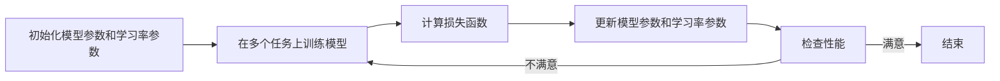

## 1. 背景介绍

在人工智能领域，快速适应新任务和环境是一个长期追求的目标。元学习，或称为“学会学习”，是实现这一目标的关键技术之一。传统的机器学习方法需要大量数据和时间来训练模型，而元学习旨在通过少量样本快速适应新任务。Meta-SGD是元学习领域的一个重要突破，它提出了一种新的优化器调整方法，能够显著提高学习速度和效率。

## 2. 核心概念与联系

元学习的核心在于学习一个能够迅速适应新任务的模型。Meta-SGD扩展了这一概念，不仅学习模型的初始参数，还学习梯度更新的步长，即学习率。这种方法可以看作是对传统梯度下降法的一种映射，其中每个参数的更新不再是固定的，而是由模型自身决定。

## 3. 核心算法原理具体操作步骤

Meta-SGD算法的操作步骤如下：

1. 初始化模型参数和学习率参数。
2. 在多个任务上训练模型，每个任务包含少量样本。
3. 对每个任务，计算损失函数并更新模型参数和学习率参数。
4. 重复步骤2和3，直到模型在新任务上的性能达到满意的水平。



## 4. 数学模型和公式详细讲解举例说明

Meta-SGD的数学模型可以表示为：

$$
\theta_{i+1} = \theta_i - \alpha_i \cdot \nabla_{\theta}L_{\tau}(\theta_i)
$$

其中，$\theta$ 是模型参数，$\alpha$ 是学习率参数，$L_{\tau}$ 是在任务$\tau$上的损失函数，$\nabla_{\theta}$ 表示对$\theta$的梯度。

通过这个模型，Meta-SGD不仅更新$\theta$，还同时更新$\alpha$，使得模型能够自适应地调整学习率。

## 5. 项目实践：代码实例和详细解释说明

在实际项目中，Meta-SGD可以用以下伪代码表示：

```python
for epoch in range(num_epochs):
    for task in tasks:
        theta, alpha = initialize_parameters()
        for step in range(num_steps):
            loss = compute_loss(task, theta)
            theta_grad = compute_gradients(loss, theta)
            theta = theta - alpha * theta_grad
            alpha = update_learning_rate(alpha, theta_grad)
```

这段代码展示了在多个任务上迭代更新模型参数和学习率参数的过程。

## 6. 实际应用场景

Meta-SGD可以应用于多种场景，包括但不限于：

- 小样本学习
- 强化学习中的快速策略适应
- 个性化推荐系统

## 7. 工具和资源推荐

对于想要实践Meta-SGD的研究者和开发者，以下是一些有用的工具和资源：

- TensorFlow或PyTorch：两个流行的深度学习框架，都有支持Meta-SGD的库。
- MAML：Meta-SGD的前身，一个流行的元学习算法，有助于理解Meta-SGD的基础。

## 8. 总结：未来发展趋势与挑战

Meta-SGD作为元学习领域的一种先进技术，展示了优化器自适应调整的巨大潜力。未来的发展趋势可能会集中在进一步提高算法的泛化能力和减少计算资源的消耗。同时，如何设计更有效的学习率更新策略也是一个挑战。

## 9. 附录：常见问题与解答

Q1: Meta-SGD与传统SGD有何不同？
A1: Meta-SGD不仅更新模型参数，还更新每个参数的学习率，使得模型能够更快地适应新任务。

Q2: Meta-SGD适用于哪些类型的任务？
A2: Meta-SGD适用于需要快速适应新任务的场景，特别是在数据量有限的情况下。

作者：禅与计算机程序设计艺术 / Zen and the Art of Computer Programming