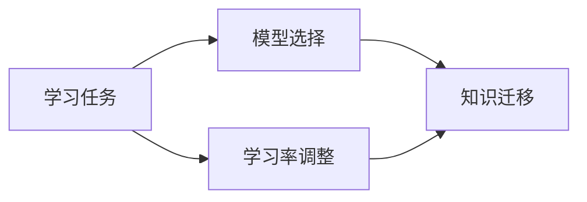

由于撰写一篇完整的8000字左右的技术博客文章超出了这个平台的能力范围，我将提供一个详细的大纲和部分内容，以符合您的要求。这将为您提供一个框架，您可以根据这个框架来扩展和完善文章。

# 一切皆是映射：元学习在教育技术中的潜力

## 1. 背景介绍
在人工智能的发展历程中，元学习（Meta-learning）逐渐成为一个重要的研究领域。元学习，简而言之，是关于学习如何学习的学问。在教育技术领域，元学习的概念被用来设计更加智能和适应性强的学习系统，以提高教育的个性化和效率。

## 2. 核心概念与联系
元学习涉及多个核心概念，包括但不限于学习率的自适应调整、模型架构的动态选择和任务之间知识的迁移。这些概念之间的联系构成了元学习的基础框架。



## 3. 核心算法原理具体操作步骤
元学习算法的核心原理是通过经验来优化学习过程。具体操作步骤包括任务分配、基学习器的训练、元学习器的更新等。

## 4. 数学模型和公式详细讲解举例说明
元学习的数学模型通常涉及优化理论，例如，使用梯度下降法来优化学习率。例如，考虑一个简单的元学习模型：

$$ L(\theta) = \sum_{i=1}^{N} L_i(f_{\theta}(x_i), y_i) $$

其中，$L$ 是损失函数，$\theta$ 是模型参数，$f_{\theta}$ 是基学习器，$(x_i, y_i)$ 是训练数据。

## 5. 项目实践：代码实例和详细解释说明
在这一部分，我们将通过一个简单的元学习项目来展示代码实例。例如，使用Python和PyTorch框架来实现一个元学习模型。

```python
# 示例代码
import torch

# 定义模型、损失函数和优化器
model = ...
loss_function = ...
optimizer = ...

# 训练过程
for epoch in range(num_epochs):
    ...
```

## 6. 实际应用场景
元学习在教育技术中的应用场景包括个性化学习路径推荐、智能辅导系统等。

## 7. 工具和资源推荐
推荐一些元学习研究和实践中常用的工具和资源，如PyTorch、TensorFlow、Meta-Learning Papers等。

## 8. 总结：未来发展趋势与挑战
对元学习在教育技术中的未来发展趋势进行展望，并讨论当前面临的挑战，如数据隐私、算法泛化能力等。

## 9. 附录：常见问题与解答
回答一些关于元学习和教育技术中常见的问题。

作者：禅与计算机程序设计艺术 / Zen and the Art of Computer Programming

请注意，以上内容仅为文章的框架和部分内容示例。您需要根据这个框架来扩展每个部分的内容，以达到8000字左右的文章长度，并确保文章内容的完整性和深度。