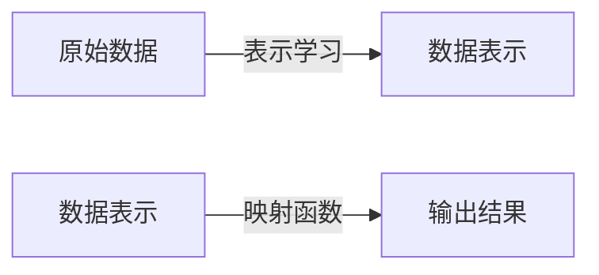

# 一切皆是映射：利用深度学习提升个性化营销策略

## 1. 背景介绍

### 1.1 个性化营销的重要性

在当今竞争激烈的商业环境中，个性化营销已经成为企业吸引并留住客户的关键策略。传统的大众营销方式已经无法满足消费者日益个性化和多样化的需求。相比之下，个性化营销通过深入了解每个客户的偏好、行为和需求,为他们提供量身定制的产品、服务和体验,从而提高客户满意度、忠诚度和转化率。

### 1.2 大数据和人工智能的助力

随着大数据和人工智能技术的快速发展,个性化营销获得了前所未有的推动力。企业可以收集和分析海量的客户数据,包括人口统计信息、浏览记录、购买历史等,从中发现隐藏的模式和洞察。同时,深度学习等先进的机器学习算法能够从这些复杂的数据中提取有价值的信息,为个性化营销决策提供强有力的支持。

### 1.3 深度学习在个性化营销中的应用

深度学习作为人工智能的一个重要分支,已经在个性化营销领域取得了广泛的应用。通过构建复杂的神经网络模型,深度学习可以自动从原始数据中学习特征表示,并对用户行为进行精准预测和个性化推荐。这种端到端的学习方式,不仅提高了模型的准确性,而且降低了人工特征工程的工作量。

## 2. 核心概念与联系

### 2.1 映射函数

在个性化营销的背景下,映射函数是一种将输入数据(如用户信息、行为数据等)映射到输出结果(如个性化推荐、转化概率等)的函数。深度学习模型就是一种复杂的、多层次的映射函数,它通过训练不断优化参数,以最小化预测误差。


### 2.2 表示学习

表示学习是深度学习的核心概念之一。传统的机器学习算法需要人工设计特征,而深度学习则能够自动从原始数据中学习数据的内在表示,这种表示往往比人工设计的特征更加丰富和抽象。在个性化营销中,表示学习可以自动捕捉用户行为和偏好的深层次模式,为个性化决策提供有力支持。



### 2.3 端到端学习

端到端学习是深度学习的另一个关键概念。传统的机器学习流程包括多个独立的模块,如特征工程、模型训练等,每个模块都需要人工设计和调优。而端到端学习则将整个流程集成到一个统一的深度神经网络中,通过反向传播算法自动优化所有参数,从而简化了模型开发过程,提高了模型的性能和泛化能力。


## 3. 核心算法原理具体操作步骤

### 3.1 深度学习模型架构

在个性化营销中,常用的深度学习模型架构包括:

1. **多层感知机(MLP)**: 由多个全连接层组成的前馈神经网络,适用于结构化数据的处理。

2. **卷积神经网络(CNN)**: 通过卷积和池化操作提取局部特征,擅长处理图像、文本等数据。

3. **循环神经网络(RNN)**: 能够处理序列数据,如用户浏览轨迹、购买历史等。

4. **注意力机制(Attention)**: 通过自适应地分配不同特征的权重,提高模型对重要特征的关注度。

5. **自编码器(AutoEncoder)**: 无监督学习模型,用于学习数据的紧凑表示,可用于数据压缩、去噪等任务。

6. **生成对抗网络(GAN)**: 通过生成器和判别器的对抗训练,可以生成逼真的数据样本,用于数据增强、个性化内容生成等。

这些模型可以单独使用,也可以组合成复杂的混合架构,以适应不同的数据类型和任务需求。

### 3.2 模型训练流程

深度学习模型的训练流程通常包括以下步骤:

1. **数据预处理**: 对原始数据进行清洗、标准化等预处理,以提高数据质量。

2. **构建模型**: 根据任务需求和数据特征,选择合适的模型架构。

3. **设置超参数**: 确定模型的各种超参数,如学习率、正则化系数等。

4. **数据分割**: 将数据划分为训练集、验证集和测试集。

5. **模型训练**: 使用训练数据对模型进行训练,通过优化目标函数(如交叉熵损失)来学习模型参数。

6. **模型评估**: 在验证集上评估模型性能,根据评估指标(如准确率、AUC等)进行模型选择和调优。

7. **模型微调**: 根据评估结果,对模型架构、超参数等进行微调,以提高模型性能。

8. **模型部署**: 将训练好的模型部署到生产环境中,用于实际的个性化营销决策。

此外,还需要注意防止过拟合、处理数据不平衡等常见问题,以确保模型的泛化能力。

## 4. 数学模型和公式详细讲解举例说明

### 4.1 损失函数

损失函数是深度学习模型训练的关键,它衡量了模型预测与真实标签之间的差异。常用的损失函数包括:

1. **均方误差(MSE)**: $$ \text{MSE}(y, \hat{y}) = \frac{1}{n} \sum_{i=1}^{n} (y_i - \hat{y}_i)^2 $$
   适用于回归任务,衡量预测值与真实值之间的平方差。

2. **交叉熵损失(Cross-Entropy)**: $$ \text{CE}(y, \hat{y}) = -\sum_{i=1}^{n} y_i \log(\hat{y}_i) $$
   适用于分类任务,衡量预测概率分布与真实分布之间的差异。

3. **focal loss**: $$ \text{FL}(y, \hat{y}) = -(1-\hat{y}_i)^\gamma y_i \log(\hat{y}_i) $$
   是交叉熵损失的变体,通过调节难易样本的权重,提高模型对难分样本的关注度。

4. **triplet loss**: $$ \text{TL}(a, p, n) = \max(d(a, p) - d(a, n) + \alpha, 0) $$
   常用于度量学习和相似性建模,通过最小化锚点样本与正样本的距离,最大化锚点样本与负样本的距离来学习embedding。

根据具体任务的特点,选择合适的损失函数对模型性能至关重要。

### 4.2 优化算法

优化算法用于更新模型参数,使损失函数最小化。常用的优化算法包括:

1. **随机梯度下降(SGD)**: $$ \theta_{t+1} = \theta_t - \eta \nabla_\theta J(\theta_t) $$
   通过计算损失函数关于参数的梯度,并沿着梯度的反方向更新参数。

2. **动量优化(Momentum)**: $$ v_{t+1} = \gamma v_t + \eta \nabla_\theta J(\theta_t) \\
   \theta_{t+1} = \theta_t - v_{t+1} $$
   在SGD的基础上,引入动量项来加速收敛并跳出局部最优。

3. **AdaGrad**: $$ g_{t+1} = g_t + \nabla_\theta J(\theta_t)^2 \\
   \theta_{t+1} = \theta_t - \frac{\eta}{\sqrt{g_{t+1} + \epsilon}} \odot \nabla_\theta J(\theta_t) $$
   通过对参数的历史梯度进行缩放,自适应地调整每个参数的学习率。

4. **Adam**: $$ m_{t+1} = \beta_1 m_t + (1 - \beta_1) \nabla_\theta J(\theta_t) \\
   v_{t+1} = \beta_2 v_t + (1 - \beta_2) (\nabla_\theta J(\theta_t))^2 \\
   \theta_{t+1} = \theta_t - \frac{\eta}{\sqrt{v_{t+1}} + \epsilon} m_{t+1} $$
   结合了动量优化和自适应学习率调整的优点,是目前最常用的优化算法之一。

选择合适的优化算法,并调整相应的超参数(如学习率、动量系数等),对模型的收敛速度和性能有重要影响。

### 4.3 正则化技术

为了防止过拟合,提高模型的泛化能力,通常需要采用正则化技术。常用的正则化方法包括:

1. **L1/L2正则化**: 在损失函数中加入模型参数的L1或L2范数项,以约束参数的大小。

2. **Dropout**: 在训练过程中随机丢弃一部分神经元,防止神经网络过度依赖某些特征。

3. **批量归一化(BatchNorm)**: 对每一层的输入进行归一化处理,加速收敛并提高泛化能力。

4. **早停(Early Stopping)**: 在验证集上的性能开始下降时,提前终止训练过程。

5. **数据增强**: 通过对原始数据进行变换(如旋转、缩放等)生成新的训练样本,增加数据的多样性。

6. **集成学习**: 将多个基学习器(如随机森林、Boosting等)的预测结果进行集成,提高模型的鲁棒性。

合理地应用正则化技术,可以有效缓解过拟合问题,提高模型在未见数据上的泛化能力。

## 5. 项目实践: 代码实例和详细解释说明

为了更好地理解深度学习在个性化营销中的应用,我们以一个基于用户行为数据进行个性化推荐的项目为例,介绍相关的代码实现和详细说明。

### 5.1 数据预处理

```python
import pandas as pd

# 加载用户行为数据
user_log = pd.read_csv('user_log.csv')

# 对类别特征进行编码
user_log['gender'] = user_log['gender'].map({'male': 0, 'female': 1})
user_log['city'] = user_log['city'].factorize()[0]

# 划分训练集和测试集
from sklearn.model_selection import train_test_split
train_data, test_data = train_test_split(user_log, test_size=0.2, random_state=42)
```

在这个示例中,我们首先加载了用户行为数据,然后对类别特征进行了编码处理。接着,我们使用`train_test_split`函数将数据划分为训练集和测试集,以便后续的模型训练和评估。

### 5.2 构建深度学习模型

```python
import torch
import torch.nn as nn

# 定义模型架构
class RecommenderNet(nn.Module):
    def __init__(self, num_users, num_items, embedding_dim):
        super(RecommenderNet, self).__init__()
        self.user_embedding = nn.Embedding(num_users, embedding_dim)
        self.item_embedding = nn.Embedding(num_items, embedding_dim)
        self.fc1 = nn.Linear(2 * embedding_dim, 128)
        self.fc2 = nn.Linear(128, 64)
        self.fc3 = nn.Linear(64, 1)
        self.relu = nn.ReLU()
        self.sigmoid = nn.Sigmoid()

    def forward(self, user, item):
        user_embed = self.user_embedding(user)
        item_embed = self.item_embedding(item)
        concat = torch.cat((user_embed, item_embed), dim=1)
        x = self.relu(self.fc1(concat))
        x = self.relu(self.fc2(x))
        x = self.sigmoid(self.fc3(x))
        return x

# 实例化模型
num_users = len(user_log['user_id'].unique())
num_items = len(user_log['item_id'].unique())
model = RecommenderNet(num_users, num_items, embedding_dim=64)
```

在这个例子中,我们定义了一个基于神经协同过滤的推荐系统模型`RecommenderNet`。该模型包含用户embedding和物品embedding层,以及几个全连接层。通过将用户和物品的embedding进行拼接,然后经过全连接层的非线性变换,模型可以预测用户对某个物品的喜好程度。

我们