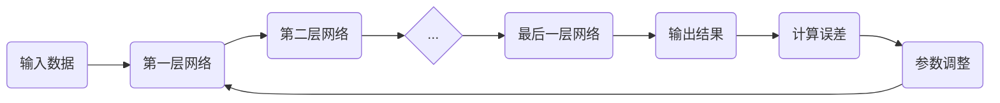

# 一切皆是映射：深度学习与人类语言理解

## 1. 背景介绍
在人工智能的发展历程中，深度学习技术的兴起无疑是一个里程碑。它使得机器能够通过模仿人脑的工作方式来处理和分析大量数据，尤其是在人类语言理解方面取得了突破性的进展。深度学习中的多层神经网络能够捕捉语言的复杂特征，从而实现对自然语言的高效处理。

## 2. 核心概念与联系
深度学习的核心在于通过多层次的非线性变换来实现从输入到输出的映射，这一过程可以被看作是从数据中学习到的一种高维空间的映射。在语言理解领域，这种映射关系尤为重要，因为它能够帮助模型理解单词、短语、句子甚至整篇文章的语义。

## 3. 核心算法原理具体操作步骤
深度学习模型的训练通常包括前向传播和反向传播两个主要步骤。前向传播是指输入数据通过神经网络的每一层进行处理，最终得到输出。反向传播则是根据输出结果与真实值之间的差异，通过梯度下降算法调整网络参数，以减少预测误差。



## 4. 数学模型和公式详细讲解举例说明
深度学习中的一个关键数学模型是神经网络。以最常见的前馈神经网络为例，每个神经元的输出可以表示为：

$$
y = f(\sum_{i=1}^{n} w_i x_i + b)
$$

其中，$x_i$ 是输入，$w_i$ 是权重，$b$ 是偏置，$f$ 是激活函数，$y$ 是输出。激活函数通常选用非线性函数，如ReLU或Sigmoid，以增加模型的表达能力。

## 5. 项目实践：代码实例和详细解释说明
以TensorFlow为例，构建一个简单的神经网络来处理文本分类任务的代码如下：

```python
import tensorflow as tf

# 构建模型
model = tf.keras.Sequential([
    tf.keras.layers.Embedding(input_dim=vocab_size, output_dim=embedding_dim),
    tf.keras.layers.GlobalAveragePooling1D(),
    tf.keras.layers.Dense(16, activation='relu'),
    tf.keras.layers.Dense(1, activation='sigmoid')
])

# 编译模型
model.compile(optimizer='adam',
              loss='binary_crossentropy',
              metrics=['accuracy'])

# 训练模型
history = model.fit(train_data, train_labels, epochs=10, validation_data=(test_data, test_labels))
```

在这段代码中，我们首先使用`Embedding`层将单词映射到高维空间，然后通过`GlobalAveragePooling1D`层对句子进行编码，最后通过两个全连接层进行分类。

## 6. 实际应用场景
深度学习在语言理解方面的应用非常广泛，包括但不限于机器翻译、情感分析、问答系统、语音识别等。这些应用都极大地依赖于深度学习模型对语言的理解能力。

## 7. 工具和资源推荐
对于深度学习和自然语言处理的研究者和开发者来说，以下是一些有用的工具和资源：
- TensorFlow和PyTorch：两个流行的深度学习框架。
- Hugging Face的Transformers：提供了大量预训练模型和工具，方便进行自然语言处理任务。
- NLTK和spaCy：两个强大的自然语言处理库。

## 8. 总结：未来发展趋势与挑战
深度学习在人类语言理解方面虽然取得了显著成就，但仍面临着诸多挑战，如模型的可解释性、对抗性攻击的防御、以及如何处理低资源语言等。未来的发展趋势可能会集中在提高模型的泛化能力和效率，以及探索更加复杂的语言现象。

## 9. 附录：常见问题与解答
Q1: 深度学习模型如何理解语言？
A1: 模型通过学习大量文本数据中的统计规律，捕捉词汇、句法和语义等多个层面的特征，从而实现对语言的理解。

Q2: 如何提高深度学习模型的性能？
A2: 可以通过增加数据量、调整模型结构、使用预训练模型等方法来提高性能。

Q3: 深度学习模型的训练需要多长时间？
A3: 这取决于模型的复杂度、数据量大小以及计算资源。一些大型模型可能需要几天甚至几周的时间来训练。

作者：禅与计算机程序设计艺术 / Zen and the Art of Computer Programming