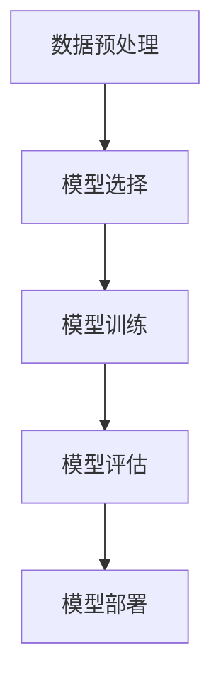

# 一切皆是映射：深度学习在农业科技中的实践

## 1.背景介绍

### 1.1 农业科技的现状与挑战

农业作为人类生存的基础产业，面临着诸多挑战，如气候变化、病虫害、土壤退化等。传统的农业方法已经难以应对这些问题，迫切需要新的技术手段来提高生产效率和可持续性。

### 1.2 深度学习的崛起

深度学习作为人工智能的一个重要分支，近年来在图像识别、自然语言处理等领域取得了显著的成果。其强大的数据处理和模式识别能力，使其在农业科技中展现出巨大的潜力。

### 1.3 农业与深度学习的结合

将深度学习应用于农业科技，可以实现精准农业、智能灌溉、病虫害预测等多种功能，从而提高农业生产效率，减少资源浪费，促进可持续发展。

## 2.核心概念与联系

### 2.1 映射的概念

在数学中，映射是指将一个集合中的元素关联到另一个集合中的元素。深度学习中的神经网络本质上就是一种复杂的映射关系，通过大量的训练数据来学习输入与输出之间的映射。

### 2.2 深度学习中的映射

深度学习中的映射关系可以通过多层神经网络来实现，每一层神经网络都可以看作是一个映射函数。通过层层映射，最终实现从输入到输出的复杂映射关系。

### 2.3 农业数据与映射

农业数据包括气象数据、土壤数据、作物生长数据等，这些数据之间存在复杂的映射关系。通过深度学习，可以挖掘出这些数据之间的潜在关系，从而实现精准农业。

## 3.核心算法原理具体操作步骤

### 3.1 数据预处理

数据预处理是深度学习的第一步，包括数据清洗、数据归一化、数据增强等步骤。对于农业数据，常见的预处理方法包括缺失值填补、异常值处理、数据标准化等。

### 3.2 模型选择

根据具体的农业应用场景，选择合适的深度学习模型。常见的模型包括卷积神经网络（CNN）、循环神经网络（RNN）、生成对抗网络（GAN）等。

### 3.3 模型训练

模型训练是深度学习的核心步骤，通过大量的训练数据来调整模型参数，使模型能够准确地映射输入与输出之间的关系。训练过程中需要注意防止过拟合和欠拟合。

### 3.4 模型评估

模型评估是验证模型性能的重要步骤，通过测试数据来评估模型的准确性、精度、召回率等指标。常用的评估方法包括交叉验证、混淆矩阵等。

### 3.5 模型部署

模型部署是将训练好的模型应用到实际农业场景中的步骤。可以通过云计算平台、边缘计算设备等方式来部署模型，实现实时数据处理和预测。



## 4.数学模型和公式详细讲解举例说明

### 4.1 神经网络的基本结构

神经网络由输入层、隐藏层和输出层组成。每一层由若干个神经元组成，神经元之间通过权重连接。神经网络的目标是通过调整权重，使得输入与输出之间的映射关系尽可能准确。

### 4.2 前向传播

前向传播是指从输入层到输出层的计算过程。假设输入层有 $x_1, x_2, \ldots, x_n$ 个输入，隐藏层有 $h_1, h_2, \ldots, h_m$ 个神经元，输出层有 $y_1, y_2, \ldots, y_k$ 个输出。前向传播的计算公式如下：

$$
h_j = f\left(\sum_{i=1}^{n} w_{ij} x_i + b_j\right)
$$

$$
y_k = g\left(\sum_{j=1}^{m} w_{jk} h_j + b_k\right)
$$

其中，$w_{ij}$ 和 $w_{jk}$ 分别是输入层到隐藏层、隐藏层到输出层的权重，$b_j$ 和 $b_k$ 是偏置，$f$ 和 $g$ 是激活函数。

### 4.3 反向传播

反向传播是通过计算损失函数的梯度来调整权重的过程。假设损失函数为 $L$，反向传播的计算公式如下：

$$
\frac{\partial L}{\partial w_{ij}} = \frac{\partial L}{\partial h_j} \cdot \frac{\partial h_j}{\partial w_{ij}}
$$

$$
\frac{\partial L}{\partial w_{jk}} = \frac{\partial L}{\partial y_k} \cdot \frac{\partial y_k}{\partial w_{jk}}
$$

通过梯度下降算法，不断调整权重，使得损失函数 $L$ 最小化。

### 4.4 举例说明

假设我们要预测某种作物的产量，输入数据包括气温、降水量、土壤湿度等。通过前向传播计算出预测的产量，与实际产量之间的差异作为损失函数，通过反向传播调整权重，最终实现准确的产量预测。

## 5.项目实践：代码实例和详细解释说明

### 5.1 数据集准备

首先，我们需要准备一个农业数据集，包括气象数据、土壤数据、作物生长数据等。可以使用公开的数据集，也可以通过传感器采集数据。

### 5.2 数据预处理

```python
import pandas as pd
from sklearn.preprocessing import StandardScaler

# 读取数据集
data = pd.read_csv('agriculture_data.csv')

# 数据清洗
data = data.dropna()

# 数据标准化
scaler = StandardScaler()
data_scaled = scaler.fit_transform(data)
```

### 5.3 模型选择与构建

```python
import tensorflow as tf
from tensorflow.keras.models import Sequential
from tensorflow.keras.layers import Dense

# 构建神经网络模型
model = Sequential()
model.add(Dense(64, input_dim=data_scaled.shape[1], activation='relu'))
model.add(Dense(32, activation='relu'))
model.add(Dense(1, activation='linear'))

# 编译模型
model.compile(optimizer='adam', loss='mean_squared_error')
```

### 5.4 模型训练

```python
# 训练模型
model.fit(data_scaled, target, epochs=100, batch_size=32, validation_split=0.2)
```

### 5.5 模型评估

```python
# 评估模型
loss = model.evaluate(test_data, test_target)
print(f'Model Loss: {loss}')
```

### 5.6 模型部署

```python
# 保存模型
model.save('agriculture_model.h5')

# 加载模型
loaded_model = tf.keras.models.load_model('agriculture_model.h5')

# 预测
predictions = loaded_model.predict(new_data)
```

## 6.实际应用场景

### 6.1 精准农业

通过深度学习，可以实现精准农业，如智能灌溉、施肥、病虫害预测等。通过传感器采集数据，实时监控作物生长情况，优化农业生产过程。

### 6.2 作物产量预测

通过深度学习模型，可以预测作物的产量，帮助农民合理安排种植计划，提高农业生产效率。

### 6.3 土壤健康监测

通过深度学习，可以分析土壤数据，监测土壤健康状况，提供科学的土壤改良建议，促进可持续农业发展。

### 6.4 农业机器人

深度学习可以应用于农业机器人，如自动化播种、收割、除草等，提高农业生产的自动化水平，减少人力成本。

## 7.工具和资源推荐

### 7.1 深度学习框架

- TensorFlow：谷歌开发的开源深度学习框架，支持多种平台和设备。
- PyTorch：Facebook开发的开源深度学习框架，具有灵活的动态计算图。

### 7.2 数据集

- Kaggle：提供多种农业相关的数据集，如作物产量预测、病虫害检测等。
- UCI Machine Learning Repository：提供多种农业相关的数据集，如土壤数据、气象数据等。

### 7.3 云计算平台

- AWS：提供多种云计算服务，如EC2、S3、SageMaker等，支持深度学习模型的训练和部署。
- Google Cloud：提供多种云计算服务，如Compute Engine、Cloud Storage、AI Platform等，支持深度学习模型的训练和部署。

## 8.总结：未来发展趋势与挑战

### 8.1 未来发展趋势

深度学习在农业科技中的应用前景广阔，未来将会有更多的创新应用，如智能农场、无人机监测、农业大数据分析等。随着技术的不断进步，深度学习将会在农业科技中发挥越来越重要的作用。

### 8.2 挑战与解决方案

尽管深度学习在农业科技中展现出巨大的潜力，但也面临着一些挑战，如数据获取困难、模型泛化能力不足、计算资源需求高等。解决这些挑战需要多方面的努力，如加强数据采集和共享、优化模型结构、提高计算效率等。

## 9.附录：常见问题与解答

### 9.1 深度学习在农业中的应用有哪些？

深度学习在农业中的应用包括精准农业、作物产量预测、土壤健康监测、农业机器人等。

### 9.2 如何选择合适的深度学习模型？

选择合适的深度学习模型需要根据具体的应用场景和数据特点，常见的模型包括卷积神经网络（CNN）、循环神经网络（RNN）、生成对抗网络（GAN）等。

### 9.3 如何解决深度学习模型的过拟合问题？

解决过拟合问题的方法包括增加训练数据、使用正则化技术、采用交叉验证等。

### 9.4 深度学习在农业中的未来发展趋势是什么？

深度学习在农业中的未来发展趋势包括智能农场、无人机监测、农业大数据分析等，随着技术的不断进步，深度学习将会在农业科技中发挥越来越重要的作用。

---

作者：禅与计算机程序设计艺术 / Zen and the Art of Computer Programming