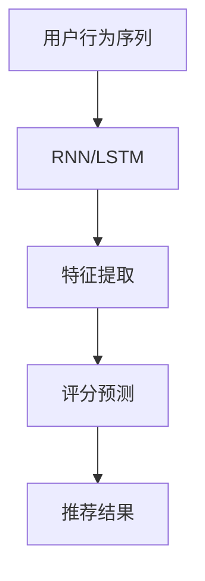

# 一切皆是映射：神经网络在推荐系统中的应用

## 1.背景介绍

推荐系统已经成为现代互联网应用的核心组成部分，从电商平台的商品推荐到社交媒体的内容推荐，推荐系统无处不在。传统的推荐系统主要依赖于协同过滤和基于内容的推荐方法。然而，随着数据量的爆炸性增长和用户需求的多样化，传统方法逐渐显现出其局限性。神经网络，尤其是深度学习技术，因其强大的特征提取和表示能力，逐渐成为推荐系统领域的研究热点。

## 2.核心概念与联系

### 2.1 神经网络基础

神经网络是一种模拟人脑神经元结构的计算模型，主要由输入层、隐藏层和输出层组成。每一层由若干个神经元构成，神经元之间通过权重连接。神经网络通过调整这些权重来学习数据中的模式。

### 2.2 推荐系统基础

推荐系统的目标是根据用户的历史行为和偏好，预测用户可能感兴趣的物品。常见的推荐系统方法包括协同过滤、基于内容的推荐和混合推荐。

### 2.3 神经网络与推荐系统的结合

神经网络在推荐系统中的应用主要体现在以下几个方面：

- 特征提取：通过深度学习模型提取用户和物品的高维特征表示。
- 预测模型：利用神经网络模型进行评分预测和排序。
- 序列建模：使用循环神经网络（RNN）处理用户的序列行为数据。

## 3.核心算法原理具体操作步骤

### 3.1 特征提取

特征提取是推荐系统的关键步骤。通过神经网络，可以从用户和物品的原始数据中提取出高维特征表示。常用的方法包括：

- 嵌入层：将离散的用户和物品ID映射到连续的向量空间。
- 卷积神经网络（CNN）：处理图像和文本数据，提取局部特征。
- 循环神经网络（RNN）：处理序列数据，捕捉时间依赖性。

### 3.2 评分预测

评分预测是推荐系统的核心任务。通过神经网络模型，可以对用户和物品的特征进行非线性组合，预测用户对物品的评分。常用的方法包括：

- 多层感知机（MLP）：通过多层全连接网络进行评分预测。
- 自编码器：通过编码和解码过程进行评分预测。
- 注意力机制：通过加权组合特征进行评分预测。

### 3.3 序列建模

序列建模是处理用户行为序列的关键技术。通过循环神经网络（RNN）和长短期记忆网络（LSTM），可以捕捉用户行为的时间依赖性，进行序列推荐。



## 4.数学模型和公式详细讲解举例说明

### 4.1 嵌入层

嵌入层将离散的用户和物品ID映射到连续的向量空间。假设用户ID为 $u_i$，物品ID为 $v_j$，嵌入矩阵分别为 $E_u$ 和 $E_v$，则用户和物品的嵌入向量表示为：

$$
\mathbf{e}_u = E_u[u_i]
$$

$$
\mathbf{e}_v = E_v[v_j]
$$

### 4.2 多层感知机

多层感知机通过多层全连接网络进行评分预测。假设用户和物品的嵌入向量为 $\mathbf{e}_u$ 和 $\mathbf{e}_v$，则评分预测过程为：

$$
\mathbf{h}_1 = \sigma(W_1[\mathbf{e}_u; \mathbf{e}_v] + b_1)
$$

$$
\mathbf{h}_2 = \sigma(W_2\mathbf{h}_1 + b_2)
$$

$$
\hat{r}_{ui} = W_3\mathbf{h}_2 + b_3
$$

其中，$W_1, W_2, W_3$ 为权重矩阵，$b_1, b_2, b_3$ 为偏置向量，$\sigma$ 为激活函数。

### 4.3 自编码器

自编码器通过编码和解码过程进行评分预测。假设用户和物品的嵌入向量为 $\mathbf{e}_u$ 和 $\mathbf{e}_v$，则编码和解码过程为：

$$
\mathbf{z} = \sigma(W_e[\mathbf{e}_u; \mathbf{e}_v] + b_e)
$$

$$
\hat{r}_{ui} = \sigma(W_d\mathbf{z} + b_d)
$$

其中，$W_e, W_d$ 为编码和解码的权重矩阵，$b_e, b_d$ 为偏置向量，$\sigma$ 为激活函数。

## 5.项目实践：代码实例和详细解释说明

### 5.1 数据准备

首先，我们需要准备用户和物品的交互数据。假设我们有一个用户-物品评分矩阵：

```python
import numpy as np

# 用户-物品评分矩阵
ratings = np.array([
    [5, 3, 0, 1],
    [4, 0, 0, 1],
    [1, 1, 0, 5],
    [1, 0, 0, 4],
    [0, 1, 5, 4],
])
```

### 5.2 嵌入层实现

接下来，我们使用嵌入层将用户和物品ID映射到连续的向量空间：

```python
import torch
import torch.nn as nn

class EmbeddingLayer(nn.Module):
    def __init__(self, num_users, num_items, embedding_dim):
        super(EmbeddingLayer, self).__init__()
        self.user_embedding = nn.Embedding(num_users, embedding_dim)
        self.item_embedding = nn.Embedding(num_items, embedding_dim)

    def forward(self, user_ids, item_ids):
        user_embeds = self.user_embedding(user_ids)
        item_embeds = self.item_embedding(item_ids)
        return user_embeds, item_embeds

# 假设有5个用户和4个物品，嵌入维度为3
embedding_layer = EmbeddingLayer(num_users=5, num_items=4, embedding_dim=3)
user_ids = torch.tensor([0, 1, 2, 3, 4])
item_ids = torch.tensor([0, 1, 2, 3])
user_embeds, item_embeds = embedding_layer(user_ids, item_ids)
print(user_embeds)
print(item_embeds)
```

### 5.3 多层感知机实现

然后，我们使用多层感知机进行评分预测：

```python
class MLP(nn.Module):
    def __init__(self, input_dim, hidden_dim):
        super(MLP, self).__init__()
        self.fc1 = nn.Linear(input_dim, hidden_dim)
        self.fc2 = nn.Linear(hidden_dim, hidden_dim)
        self.fc3 = nn.Linear(hidden_dim, 1)
        self.relu = nn.ReLU()

    def forward(self, user_embeds, item_embeds):
        x = torch.cat([user_embeds, item_embeds], dim=-1)
        x = self.relu(self.fc1(x))
        x = self.relu(self.fc2(x))
        x = self.fc3(x)
        return x

# 假设嵌入维度为3，隐藏层维度为5
mlp = MLP(input_dim=6, hidden_dim=5)
predictions = mlp(user_embeds, item_embeds)
print(predictions)
```

### 5.4 训练模型

最后，我们定义损失函数和优化器，进行模型训练：

```python
import torch.optim as optim

# 定义损失函数和优化器
criterion = nn.MSELoss()
optimizer = optim.Adam(mlp.parameters(), lr=0.001)

# 训练模型
num_epochs = 100
for epoch in range(num_epochs):
    optimizer.zero_grad()
    predictions = mlp(user_embeds, item_embeds)
    loss = criterion(predictions, ratings.float())
    loss.backward()
    optimizer.step()
    if (epoch + 1) % 10 == 0:
        print(f'Epoch [{epoch + 1}/{num_epochs}], Loss: {loss.item():.4f}')
```

## 6.实际应用场景

### 6.1 电商平台

在电商平台中，推荐系统可以根据用户的浏览和购买历史，推荐相关的商品，提高用户的购买率和满意度。

### 6.2 社交媒体

在社交媒体中，推荐系统可以根据用户的兴趣和行为，推荐相关的内容和好友，增加用户的活跃度和粘性。

### 6.3 在线教育

在在线教育平台中，推荐系统可以根据用户的学习历史和兴趣，推荐相关的课程和学习资料，提高用户的学习效果和满意度。

## 7.工具和资源推荐

### 7.1 工具

- TensorFlow：一个开源的深度学习框架，支持多种神经网络模型的构建和训练。
- PyTorch：一个开源的深度学习框架，具有灵活的动态计算图和强大的社区支持。
- Scikit-learn：一个开源的机器学习库，提供了多种机器学习算法和工具。

### 7.2 资源

- 《深度学习》：一本经典的深度学习教材，详细介绍了深度学习的基本概念和算法。
- 《推荐系统实践》：一本推荐系统领域的经典书籍，详细介绍了推荐系统的基本原理和实践方法。
- Coursera和Udacity上的深度学习和推荐系统课程：提供了丰富的在线学习资源和实践项目。

## 8.总结：未来发展趋势与挑战

神经网络在推荐系统中的应用已经取得了显著的成果，但仍然面临许多挑战和机遇。未来的发展趋势包括：

- 更加个性化的推荐：通过更精细的用户画像和行为分析，实现更加个性化的推荐。
- 实时推荐：通过实时数据处理和在线学习，实现实时的推荐更新。
- 多模态推荐：通过融合多种数据源（如图像、文本、音频等），实现更加全面的推荐。

同时，推荐系统也面临一些挑战，如数据隐私和安全问题、算法的公平性和透明性等。解决这些问题需要学术界和工业界的共同努力。

## 9.附录：常见问题与解答

### 9.1 神经网络在推荐系统中的优势是什么？

神经网络具有强大的特征提取和表示能力，能够从复杂的用户和物品数据中提取出高维特征表示，提高推荐系统的准确性和鲁棒性。

### 9.2 如何选择合适的神经网络模型？

选择合适的神经网络模型需要根据具体的应用场景和数据特点进行综合考虑。常见的模型包括多层感知机、自编码器、卷积神经网络和循环神经网络等。

### 9.3 如何处理推荐系统中的冷启动问题？

冷启动问题是指新用户或新物品缺乏历史数据，导致推荐效果不佳。解决冷启动问题的方法包括基于内容的推荐、利用外部数据源和混合推荐等。

### 9.4 如何评估推荐系统的效果？

评估推荐系统的效果可以使用多种指标，如准确率、召回率、F1值、AUC等。同时，还可以通过用户实验和在线A/B测试进行评估。

### 9.5 如何提高推荐系统的实时性？

提高推荐系统的实时性可以通过实时数据处理和在线学习技术实现，如流处理框架（如Apache Kafka、Apache Flink）和在线学习算法（如FTRL、SGD）等。

---

作者：禅与计算机程序设计艺术 / Zen and the Art of Computer Programming