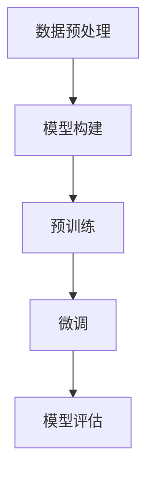

# 从零开始大模型开发与微调：人工智能的历史与未来

## 1.背景介绍

### 1.1 人工智能的起源与发展

人工智能（AI）作为计算机科学的一个分支，起源于20世纪50年代。最早的AI研究主要集中在符号逻辑和规则系统上。1956年，达特茅斯会议被认为是AI研究的正式起点。此后，AI经历了几次高潮和低谷，从早期的专家系统到后来的机器学习，再到如今的深度学习和大模型。

### 1.2 大模型的崛起

大模型（Large Models）是指具有大量参数和复杂结构的深度学习模型，如GPT-3、BERT等。这些模型通过大规模数据训练，能够在自然语言处理、图像识别等多个领域表现出色。大模型的崛起得益于计算能力的提升和数据资源的丰富。

### 1.3 微调的重要性

微调（Fine-tuning）是指在预训练模型的基础上，通过少量数据进行进一步训练，以适应特定任务。微调不仅能够提高模型的性能，还能减少训练时间和资源消耗。

## 2.核心概念与联系

### 2.1 预训练与微调

预训练（Pre-training）是指在大规模数据集上训练模型，使其学习通用特征。微调则是在预训练模型的基础上，通过特定任务的数据进行进一步训练。预训练和微调的结合使得大模型能够在多个任务上表现出色。

### 2.2 参数与超参数

参数（Parameters）是模型在训练过程中学习到的权重和偏置。超参数（Hyperparameters）则是训练过程中需要手动设置的参数，如学习率、批量大小等。参数和超参数的优化是模型性能提升的关键。

### 2.3 损失函数与优化算法

损失函数（Loss Function）用于衡量模型预测与真实值之间的差距。优化算法（Optimization Algorithm）则是用于最小化损失函数的算法，如梯度下降（Gradient Descent）。损失函数和优化算法的选择直接影响模型的训练效果。

## 3.核心算法原理具体操作步骤

### 3.1 数据预处理

数据预处理是模型训练的第一步，包括数据清洗、归一化、分词等操作。数据质量直接影响模型的性能。

### 3.2 模型构建

模型构建是指选择合适的模型架构，如卷积神经网络（CNN）、循环神经网络（RNN）等。模型架构的选择需要根据具体任务和数据特点进行。

### 3.3 预训练

预训练是指在大规模数据集上训练模型，使其学习通用特征。预训练通常需要大量计算资源和时间。

### 3.4 微调

微调是指在预训练模型的基础上，通过特定任务的数据进行进一步训练。微调能够提高模型在特定任务上的性能。

### 3.5 模型评估

模型评估是指通过指标如准确率、精确率、召回率等评估模型的性能。评估结果用于指导模型的优化和改进。



## 4.数学模型和公式详细讲解举例说明

### 4.1 线性回归

线性回归是最简单的机器学习模型之一，其目标是找到一个线性函数，使得预测值与真实值之间的误差最小。线性回归的数学模型如下：

$$
y = \beta_0 + \beta_1 x + \epsilon
$$

其中，$y$ 是预测值，$x$ 是输入特征，$\beta_0$ 和 $\beta_1$ 是模型参数，$\epsilon$ 是误差项。

### 4.2 梯度下降

梯度下降是一种优化算法，用于最小化损失函数。其基本思想是通过计算损失函数的梯度，沿梯度的反方向更新模型参数。梯度下降的更新公式如下：

$$
\theta = \theta - \alpha \nabla J(\theta)
$$

其中，$\theta$ 是模型参数，$\alpha$ 是学习率，$J(\theta)$ 是损失函数。

### 4.3 交叉熵损失

交叉熵损失（Cross-Entropy Loss）常用于分类任务，其公式如下：

$$
L = -\sum_{i=1}^{N} y_i \log(\hat{y}_i)
$$

其中，$N$ 是样本数量，$y_i$ 是真实标签，$\hat{y}_i$ 是预测概率。

## 5.项目实践：代码实例和详细解释说明

### 5.1 数据预处理

```python
import pandas as pd
from sklearn.model_selection import train_test_split
from sklearn.preprocessing import StandardScaler

# 读取数据
data = pd.read_csv('data.csv')

# 数据清洗
data = data.dropna()

# 特征和标签分离
X = data.drop('label', axis=1)
y = data['label']

# 数据归一化
scaler = StandardScaler()
X = scaler.fit_transform(X)

# 数据集划分
X_train, X_test, y_train, y_test = train_test_split(X, y, test_size=0.2, random_state=42)
```

### 5.2 模型构建与预训练

```python
import tensorflow as tf
from tensorflow.keras.models import Sequential
from tensorflow.keras.layers import Dense

# 构建模型
model = Sequential([
    Dense(64, activation='relu', input_shape=(X_train.shape[1],)),
    Dense(64, activation='relu'),
    Dense(1, activation='sigmoid')
])

# 编译模型
model.compile(optimizer='adam', loss='binary_crossentropy', metrics=['accuracy'])

# 预训练
model.fit(X_train, y_train, epochs=10, batch_size=32, validation_split=0.2)
```

### 5.3 微调

```python
# 微调
model.fit(X_train, y_train, epochs=5, batch_size=32, validation_split=0.2)
```

### 5.4 模型评估

```python
# 模型评估
loss, accuracy = model.evaluate(X_test, y_test)
print(f'Loss: {loss}, Accuracy: {accuracy}')
```

## 6.实际应用场景

### 6.1 自然语言处理

大模型在自然语言处理（NLP）领域表现出色，如文本生成、机器翻译、情感分析等。GPT-3等模型能够生成高质量的文本，BERT等模型则在文本分类、问答系统等任务中表现优异。

### 6.2 计算机视觉

在计算机视觉（CV）领域，大模型同样表现出色，如图像分类、目标检测、图像生成等。ResNet、EfficientNet等模型在图像分类任务中取得了显著的成果，YOLO、Faster R-CNN等模型在目标检测任务中表现优异。

### 6.3 医疗健康

大模型在医疗健康领域的应用也越来越广泛，如疾病预测、医学影像分析、药物发现等。通过大规模数据训练的模型能够辅助医生进行诊断，提高医疗效率和准确性。

## 7.工具和资源推荐

### 7.1 开源框架

- TensorFlow：谷歌开发的开源深度学习框架，支持多种平台和设备。
- PyTorch：Facebook开发的开源深度学习框架，具有灵活性和易用性。
- Hugging Face Transformers：提供预训练模型和微调工具，支持多种NLP任务。

### 7.2 数据集

- ImageNet：大规模图像数据集，常用于图像分类和目标检测任务。
- COCO：大规模图像数据集，常用于目标检测、分割和关键点检测任务。
- GLUE：通用语言理解评估基准，常用于评估NLP模型的性能。

### 7.3 在线资源

- arXiv：提供最新的AI研究论文，涵盖多个领域和方向。
- GitHub：开源代码库，提供大量AI项目和工具。
- Coursera、edX：提供AI相关的在线课程和学习资源。

## 8.总结：未来发展趋势与挑战

### 8.1 未来发展趋势

- 更大规模的模型：随着计算能力的提升和数据资源的丰富，未来的大模型将更加庞大和复杂。
- 多模态学习：未来的AI模型将能够处理多种模态的数据，如文本、图像、音频等，实现更全面的理解和生成。
- 自监督学习：自监督学习将成为未来AI研究的热点，通过无标签数据进行训练，提高模型的泛化能力。

### 8.2 挑战

- 计算资源：大模型的训练需要大量计算资源，如何高效利用计算资源是一个重要挑战。
- 数据隐私：大规模数据的使用涉及数据隐私和安全问题，如何保护用户隐私是一个重要课题。
- 模型解释性：大模型的复杂性使得其内部机制难以解释，如何提高模型的可解释性是一个重要研究方向。

## 9.附录：常见问题与解答

### 9.1 什么是大模型？

大模型是指具有大量参数和复杂结构的深度学习模型，如GPT-3、BERT等。大模型通过大规模数据训练，能够在多个任务上表现出色。

### 9.2 什么是微调？

微调是指在预训练模型的基础上，通过少量数据进行进一步训练，以适应特定任务。微调能够提高模型的性能，减少训练时间和资源消耗。

### 9.3 如何选择合适的模型架构？

模型架构的选择需要根据具体任务和数据特点进行。常见的模型架构包括卷积神经网络（CNN）、循环神经网络（RNN）等。

### 9.4 如何评估模型的性能？

模型的性能可以通过指标如准确率、精确率、召回率等进行评估。评估结果用于指导模型的优化和改进。

### 9.5 大模型的未来发展趋势是什么？

未来的大模型将更加庞大和复杂，能够处理多种模态的数据，实现更全面的理解和生成。自监督学习将成为未来AI研究的热点。

---

作者：禅与计算机程序设计艺术 / Zen and the Art of Computer Programming