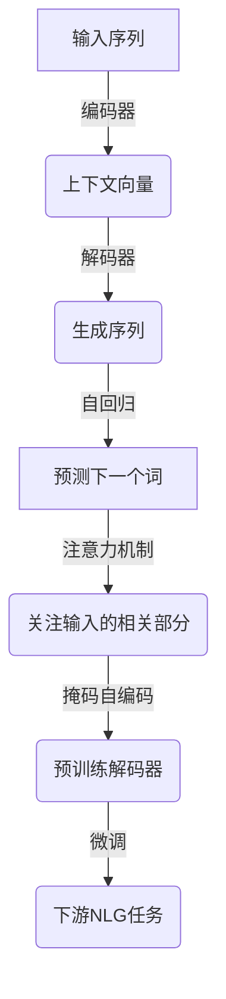

# 从零开始大模型开发与微调：从1开始自然语言处理的解码器

## 1.背景介绍

### 1.1 自然语言处理的重要性

在当今的数字时代，自然语言处理(NLP)已成为一项关键技术,广泛应用于各个领域。作为人工智能的一个重要分支,NLP旨在使计算机能够理解、解释和生成人类语言。它为人机交互提供了基础,并推动了智能系统的发展。

### 1.2 大模型的兴起

近年来,benefiting from海量数据、强大的计算能力和深度学习算法的进步,大型神经网络模型(大模型)在NLP任务中取得了卓越的成绩。这些模型能够捕捉复杂的语言模式,并在各种下游任务中表现出色,如机器翻译、问答系统、文本摘要等。

### 1.3 解码器在NLP中的作用

解码器是自然语言生成(NLG)模型的核心组件,负责根据输入生成相应的文本输出。在序列到序列(Seq2Seq)模型中,解码器接收编码器的上下文向量,并逐步生成目标序列。解码器的性能直接影响着生成文本的质量和效率。

## 2.核心概念与联系

### 2.1 自回归语言模型

自回归语言模型是NLG任务的基础,它通过最大化给定上文的下一个词的条件概率来学习语言的联合概率分布。形式化地,对于一个长度为T的序列$\boldsymbol{x} = (x_1, x_2, \ldots, x_T)$,自回归语言模型的目标是最大化如下概率:

$$P(\boldsymbol{x}) = \prod_{t=1}^{T} P(x_t | x_1, \ldots, x_{t-1})$$

自回归语言模型的核心思想是利用历史上下文来预测下一个词,这种思路也被应用于解码器的设计中。

### 2.2 注意力机制

注意力机制是序列到序列模型中的一个关键创新,它允许模型在生成每个目标词时,动态地关注输入序列的不同部分。注意力机制通过计算查询向量(来自解码器)和键值对(来自编码器)之间的相关性分数,从而获取对应的注意力权重。这种机制赋予了模型"选择性关注"的能力,有助于捕捉长距离依赖关系。

在解码器中,注意力机制被广泛应用,以提高生成质量和效率。它不仅有助于模型关注与当前生成词相关的输入部分,还可以缓解长序列的梯度消失问题。

### 2.3 掩码自编码语言模型

掩码自编码语言模型(Masked Autoencoding Language Model, MALM)是一种有监督的预训练方法,通过掩码部分输入词,并预测被掩码的词来学习上下文表示。MALM模型在预训练阶段学习到的语义和语法知识,可以为下游任务(如机器翻译)提供有价值的初始化参数。

BERT等大型预训练语言模型就采用了MALM的方法,取得了卓越的性能。在解码器中,MALM也可以用于预训练,以获得更好的初始化参数,从而提高生成质量。



## 3.核心算法原理具体操作步骤

### 3.1 Transformer解码器

Transformer是一种流行的序列到序列模型架构,其解码器部分由多个相同的解码器层组成。每个解码器层包含三个主要子层:

1. **多头自注意力子层**:计算当前位置词与前文的注意力权重,捕捉序列内部的依赖关系。
2. **多头交叉注意力子层**:计算当前位置词与编码器输出的注意力权重,融合编码器的上下文信息。
3. **前馈神经网络子层**:对注意力输出进行进一步的非线性变换,提取高阶特征。

这三个子层通过残差连接和层归一化组合在一起,形成了Transformer解码器层的基本结构。在生成过程中,解码器逐步预测下一个词,并利用自注意力和交叉注意力机制来捕捉上下文信息。

### 3.2 生成算法

Transformer解码器采用了自回归生成算法,具体步骤如下:

1. 初始化解码器的起始状态,通常使用特殊的起始符号`<bos>`。
2. 在每个时间步:
   a. 计算当前时间步的自注意力和交叉注意力。
   b. 通过前馈神经网络获取当前时间步的输出向量。
   c. 将输出向量传递到一个线性层和softmax层,获取词汇表上的概率分布。
   d. 从概率分布中采样一个词作为当前时间步的输出。
   e. 将采样的词作为下一个时间步的输入。
3. 重复步骤2,直到生成特殊的结束符号`<eos>`或达到最大长度。

在生成过程中,解码器通过自注意力机制捕捉已生成序列的依赖关系,并通过交叉注意力机制关注与当前生成词相关的编码器输出。这种注意力机制赋予了解码器"选择性关注"的能力,有助于生成更加连贯和相关的文本。

### 3.3 Beam Search解码

为了提高生成质量,通常采用Beam Search解码算法,而不是贪婪搜索。Beam Search在每个时间步保留概率最高的k个候选序列(束宽为k),并在下一个时间步基于这k个候选序列进行扩展,从而获得更优的生成结果。

Beam Search算法的具体步骤如下:

1. 初始化一个大小为k的候选序列集合,每个候选序列仅包含起始符号`<bos>`。
2. 在每个时间步:
   a. 对于每个候选序列,计算所有可能的下一个词的概率分布。
   b. 为每个候选序列保留概率最高的k个扩展序列。
   c. 将这些扩展序列组成新的候选序列集合。
3. 重复步骤2,直到所有候选序列都生成了结束符号`<eos>`或达到最大长度。
4. 从最终的候选序列集合中选择概率最高的序列作为输出。

Beam Search算法通过保留多个候选序列,增加了探索更优解的机会。但是,它也引入了一些近似,可能无法找到全局最优解。此外,束宽k的选择也需要权衡计算效率和生成质量。

## 4.数学模型和公式详细讲解举例说明

### 4.1 Transformer解码器层

Transformer解码器层的核心是多头自注意力机制和多头交叉注意力机制。我们先来看自注意力机制的数学表示。

对于一个长度为$T_q$的查询序列$\boldsymbol{Q} = (q_1, q_2, \ldots, q_{T_q})$,我们计算其与长度为$T_k$的键序列$\boldsymbol{K} = (k_1, k_2, \ldots, k_{T_k})$之间的注意力权重:

$$\text{Attention}(\boldsymbol{Q}, \boldsymbol{K}, \boldsymbol{V}) = \text{softmax}\left(\frac{\boldsymbol{Q}\boldsymbol{K}^\top}{\sqrt{d_k}}\right)\boldsymbol{V}$$

其中,$\boldsymbol{V} = (v_1, v_2, \ldots, v_{T_v})$是长度为$T_v$的值序列,$d_k$是键的维度,用于缩放点积的结果。

多头注意力机制将注意力计算过程分成多个并行的"头",每个头对查询、键和值序列进行不同的线性变换,然后将所有头的结果拼接起来:

$$\begin{aligned}
\text{MultiHead}(\boldsymbol{Q}, \boldsymbol{K}, \boldsymbol{V}) &= \text{Concat}(\text{head}_1, \ldots, \text{head}_h)\boldsymbol{W}^O\\
\text{where}\,\text{head}_i &= \text{Attention}(\boldsymbol{Q}\boldsymbol{W}_i^Q, \boldsymbol{K}\boldsymbol{W}_i^K, \boldsymbol{V}\boldsymbol{W}_i^V)
\end{aligned}$$

其中,$\boldsymbol{W}_i^Q \in \mathbb{R}^{d_\text{model} \times d_q}$,$\boldsymbol{W}_i^K \in \mathbb{R}^{d_\text{model} \times d_k}$,$\boldsymbol{W}_i^V \in \mathbb{R}^{d_\text{model} \times d_v}$和$\boldsymbol{W}^O \in \mathbb{R}^{hd_v \times d_\text{model}}$是可学习的线性变换矩阵,用于投影查询、键、值和多头注意力输出。

在解码器中,自注意力机制用于捕捉输出序列内部的依赖关系,而交叉注意力机制则用于融合编码器的上下文信息。交叉注意力的计算方式与自注意力类似,只是查询向量来自解码器,而键和值向量来自编码器的输出。

### 4.2 掩码自编码语言模型

掩码自编码语言模型(MALM)的目标是根据上下文预测被掩码的词。具体来说,对于一个长度为T的序列$\boldsymbol{x} = (x_1, x_2, \ldots, x_T)$,我们随机掩码一部分词$\boldsymbol{x}_\text{mask}$,并使用一个编码器模型(如BERT)计算掩码位置的上下文向量$\boldsymbol{h}_\text{mask}$。然后,我们使用一个解码器模型预测被掩码的词$\hat{\boldsymbol{x}}_\text{mask}$,目标是最大化以下条件概率:

$$\mathcal{L}_\text{MALM} = -\mathbb{E}_{\boldsymbol{x}}\left[\sum_{x_i \in \boldsymbol{x}_\text{mask}} \log P(x_i | \boldsymbol{x}_\text{unmasked}, \boldsymbol{h}_\text{mask})\right]$$

其中,$\boldsymbol{x}_\text{unmasked}$表示未被掩码的词。

在预训练阶段,MALM模型通过最小化上述损失函数来学习语言的上下文表示。预训练后的模型参数可以用作下游任务(如机器翻译)的初始化参数,从而提高模型的性能。

## 5.项目实践：代码实例和详细解释说明

在这一部分,我们将使用PyTorch实现一个简单的Transformer解码器,并演示如何使用它进行文本生成。

### 5.1 导入所需的库

```python
import torch
import torch.nn as nn
import math
```

### 5.2 定义多头注意力机制

```python
class MultiHeadAttention(nn.Module):
    def __init__(self, d_model, num_heads):
        super(MultiHeadAttention, self).__init__()
        self.d_model = d_model
        self.num_heads = num_heads
        self.head_dim = d_model // num_heads

        self.q_proj = nn.Linear(d_model, d_model)
        self.k_proj = nn.Linear(d_model, d_model)
        self.v_proj = nn.Linear(d_model, d_model)
        self.out_proj = nn.Linear(d_model, d_model)

    def forward(self, q, k, v, mask=None):
        batch_size = q.size(0)

        q = self.q_proj(q).view(batch_size, -1, self.num_heads, self.head_dim).transpose(1, 2)
        k = self.k_proj(k).view(batch_size, -1, self.num_heads, self.head_dim).transpose(1, 2)
        v = self.v_proj(v).view(batch_size, -1, self.num_heads, self.head_dim).transpose(1, 2)

        attn_scores = torch.matmul(q, k.transpose(-2, -1)) / math.sqrt(self.head_dim)
        if mask is not None:
            attn_scores = attn_scores.masked_fill(mask == 0, -1e9)

        attn_probs = nn.Softmax(dim=-1)(attn_scores)
        attn_output = torch.matmul(attn_probs, v).transpose(1, 2).contiguous().view(batch_size, -1, self.d_