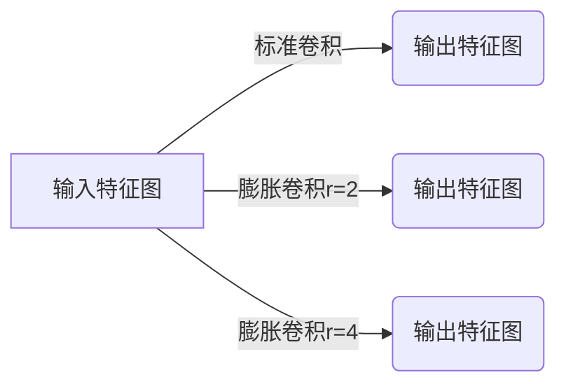

# 从零开始大模型开发与微调：膨胀卷积详解

## 1.背景介绍

### 1.1 大模型的兴起与重要性

近年来,大型神经网络模型在自然语言处理、计算机视觉等领域取得了令人瞩目的成就。随着算力和数据的不断增长,训练大规模模型成为可能,这些模型能够捕获复杂的模式和语义关系,显著提高了人工智能系统的性能。

大模型的概念源于对模型规模和能力的追求。通过增加模型参数数量和训练数据规模,可以提高模型的表征能力和泛化性能。著名的大模型包括GPT(Generative Pre-trained Transformer)、BERT(Bidirectional Encoder Representations from Transformers)等,它们在多项基准测试中取得了最佳成绩。

### 1.2 膨胀卷积在大模型中的作用

在大模型的发展过程中,卷积神经网络(CNN)扮演着重要角色。CNN擅长捕捉局部模式和空间关系,在计算机视觉任务中表现出色。然而,标准卷积存在感受野(receptive field)受限的问题,难以有效捕获全局信息。

为解决这一问题,膨胀卷积(Dilated Convolution)应运而生。它通过在卷积核中引入空洞(dilation rate),使卷积核覆盖更大的感受野,从而捕获全局上下文信息。膨胀卷积在语义分割、目标检测等任务中发挥着关键作用,成为大模型架构的重要组成部分。

## 2.核心概念与联系

### 2.1 卷积神经网络回顾

卷积神经网络是一种前馈神经网络,由卷积层、池化层和全连接层组成。卷积层通过滑动卷积核在输入特征图上进行卷积运算,提取局部特征。池化层则用于降低特征图的分辨率,减少计算量和过拟合风险。全连接层将特征图展平,对特征进行高级组合和分类。

标准卷积的计算公式为:

$$
y_{i,j} = \sum_{m}\sum_{n}x_{m,n}w_{i-m,j-n} + b
$$

其中,$x$为输入特征图,$w$为卷积核权重,$b$为偏置项。卷积核在输入特征图上滑动,生成输出特征图$y$。

### 2.2 膨胀卷积的核心思想

膨胀卷积的关键在于引入了膨胀率(dilation rate)的概念。膨胀率控制卷积核中元素之间的间隔,使卷积核覆盖更大的感受野,而不增加参数数量。

膨胀卷积的计算公式为:

$$
y_{i,j} = \sum_{m}\sum_{n}x_{m,n}w_{i-r\cdot m,j-r\cdot n} + b
$$

其中,$r$为膨胀率。当$r=1$时,即为标准卷积。随着$r$的增大,卷积核的感受野exponentially扩大。



上图展示了不同膨胀率下卷积核的感受野变化。膨胀卷积能够有效捕获全局上下文信息,同时保持参数高效。

### 2.3 膨胀卷积与其他技术的联系

膨胀卷积与其他一些技术存在密切联系:

1. **空洞卷积(Atrous Convolution)**:空洞卷积实际上是膨胀卷积的另一种表述方式,两者等价。

2. **金字塔池化(Pyramid Pooling)**:金字塔池化通过不同尺度的池化层捕获不同尺度的上下文信息,与膨胀卷积的目标类似。

3. **注意力机制(Attention Mechanism)**:注意力机制能够自适应地捕获全局依赖关系,与膨胀卷积在目标上存在一定相似性。

4. **图卷积网络(Graph Convolutional Networks)**:图卷积网络通过在图结构上进行卷积操作,捕获节点之间的关系,与膨胀卷积在处理结构化数据方面具有一定相似性。

## 3.核心算法原理具体操作步骤 

### 3.1 膨胀卷积的前向计算过程

膨胀卷积的前向计算过程可以分为以下几个步骤:

1. **初始化卷积核权重和偏置**:根据输入通道数和输出通道数初始化卷积核权重$W$和偏置$b$。

2. **计算膨胀卷积**:对于每个输出特征图位置$(i,j)$,计算膨胀卷积:

   $$
   y_{i,j} = \sum_{m}\sum_{n}x_{m,n}w_{i-r\cdot m,j-r\cdot n} + b
   $$

   其中,$r$为膨胀率,控制卷积核元素之间的间隔。

3. **边界处理**:由于膨胀卷积会导致输出特征图尺寸减小,需要对边界进行适当的填充(padding)处理,以保持输出特征图尺寸不变。

4. **非线性激活**:通常在膨胀卷积后会应用非线性激活函数(如ReLU)以增加模型的表达能力。

5. **批归一化(optional)**:可选地对输出特征图进行批归一化(Batch Normalization),以加速训练收敛并提高泛化能力。

```mermaid
graph TD
    A[输入特征图] --> B[初始化卷积核权重和偏置]
    B --> C[计算膨胀卷积]
    C --> D[边界处理]
    D --> E[非线性激活]
    E --> F[批归一化(可选)]
    F --> G[输出特征图]
```

上图展示了膨胀卷积的前向计算流程。通过合理设置膨胀率,可以在保持参数高效的同时捕获更大的感受野,提高模型的表现力。

### 3.2 膨胀卷积的反向传播

与标准卷积类似,膨胀卷积也可以通过反向传播算法进行参数更新。具体步骤如下:

1. **计算输出误差**:根据损失函数,计算输出特征图相对于真实标签的误差。

2. **反向传播误差**:将输出误差通过激活函数、膨胀卷积层反向传播,计算输入特征图相对于误差的梯度。

3. **更新权重和偏置**:根据输入特征图和误差梯度,使用优化算法(如SGD、Adam等)更新卷积核权重$W$和偏置$b$。

膨胀卷积的反向传播过程与标准卷积非常相似,只需要在卷积计算时考虑膨胀率即可。通过反向传播,模型可以不断调整参数,最小化损失函数,提高模型性能。

## 4.数学模型和公式详细讲解举例说明

### 4.1 膨胀卷积的数学表示

膨胀卷积的数学表示如下:

$$
y_{i,j} = \sum_{m}\sum_{n}x_{m,n}w_{i-r\cdot m,j-r\cdot n} + b
$$

其中:

- $x$为输入特征图
- $y$为输出特征图
- $w$为卷积核权重
- $b$为偏置项
- $r$为膨胀率(dilation rate),控制卷积核元素之间的间隔

当$r=1$时,即为标准卷积。随着$r$的增大,卷积核的感受野exponentially扩大,能够捕获更大范围的上下文信息。

### 4.2 膨胀卷积的感受野计算

膨胀卷积的感受野(receptive field)是指卷积核能够覆盖的输入区域大小。对于一个$k\times k$的卷积核,膨胀率为$r$,则其感受野大小为:

$$
(k-1)\cdot r + 1
$$

例如,对于一个$3\times 3$的卷积核,当$r=1$时,感受野大小为$3$;当$r=2$时,感受野大小为$5$;当$r=4$时,感受野大小为$9$。

通过堆叠多层膨胀卷积,可以进一步扩大感受野。假设有$L$层膨胀卷积,每层使用相同的膨胀率$r$和卷积核大小$k$,则最终的感受野大小为:

$$
((k-1)\cdot r + 1)^L - 1
$$

这意味着,通过增加层数和膨胀率,可以显著扩大模型的感受野,捕获更广泛的上下文信息。

### 4.3 膨胀卷积的优缺点分析

**优点**:

1. **扩大感受野**:膨胀卷积能够在保持参数高效的同时,显著扩大卷积核的感受野,捕获更广泛的上下文信息。
2. **保持分辨率**:与池化层不同,膨胀卷积可以保持输出特征图的分辨率,避免丢失细节信息。
3. **计算高效**:相比于使用更大的卷积核,膨胀卷积具有更高的计算效率,能够在保持感受野的同时减少参数数量。

**缺点**:

1. **网格效应**:膨胀卷积可能会导致网格效应(gridding artifacts),即输出特征图中出现规则性的网格状纹理,影响模型性能。
2. **内存消耗**:对于大尺寸的输入和高膨胀率,膨胀卷积可能会导致较高的内存消耗。
3. **优化困难**:由于膨胀卷积引入了稀疏连接,可能会导致优化过程变得更加困难。

总的来说,膨胀卷积在扩大感受野和保持计算高效方面具有显著优势,但也需要注意其潜在的缺陷,并采取适当的策略加以缓解。

## 5.项目实践:代码实例和详细解释说明

在本节中,我们将通过一个实际的代码示例,演示如何在PyTorch中实现膨胀卷积。

### 5.1 导入必要的库

```python
import torch
import torch.nn as nn
```

### 5.2 定义膨胀卷积层

```python
class DilatedConv2d(nn.Module):
    def __init__(self, in_channels, out_channels, kernel_size, stride=1, padding=0, dilation=1):
        super(DilatedConv2d, self).__init__()
        self.conv = nn.Conv2d(in_channels, out_channels, kernel_size, stride, padding, dilation=dilation)

    def forward(self, x):
        return self.conv(x)
```

在上面的代码中,我们定义了一个`DilatedConv2d`类,继承自`nn.Module`。该类封装了PyTorch的`nn.Conv2d`模块,允许我们指定膨胀率(`dilation`)参数。

### 5.3 构建膨胀卷积网络

```python
class DilatedConvNet(nn.Module):
    def __init__(self):
        super(DilatedConvNet, self).__init__()
        self.conv1 = DilatedConv2d(1, 32, kernel_size=3, padding=1)
        self.conv2 = DilatedConv2d(32, 64, kernel_size=3, padding=2, dilation=2)
        self.conv3 = DilatedConv2d(64, 128, kernel_size=3, padding=4, dilation=4)
        self.fc = nn.Linear(128 * 7 * 7, 10)

    def forward(self, x):
        x = nn.functional.relu(self.conv1(x))
        x = nn.functional.relu(self.conv2(x))
        x = nn.functional.relu(self.conv3(x))
        x = x.view(-1, 128 * 7 * 7)
        x = self.fc(x)
        return x
```

在上面的代码中,我们定义了一个简单的膨胀卷积网络`DilatedConvNet`。该网络包含三个膨胀卷积层,分别使用膨胀率为1、2和4。最后,我们使用一个全连接层进行分类。

### 5.4 训练和评估模型

```python
# 准备数据
train_loader = ...
test_loader = ...

# 实例化模型
model = DilatedConvNet()

# 定义损失函数和优化器
criterion = nn.CrossEntropyLoss()
optimizer = torch.optim.Adam(model.parameters(), lr=0.001)

# 训练循环
for epoch in range(num_epochs):
    train_loss = 0.0
    for data, target in train_loader:
        optimizer.zero_gra