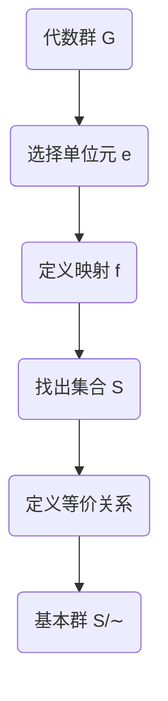

## 1.背景介绍

在代数学的世界中，代数群是一个重要的概念。它是一个拥有群结构的代数变量集合，这个集合的运算可以由多项式来描述。代数群是代数几何和群论两个领域的交汇点，是理解这两个领域的桥梁。而在代数群中，基本群是一个核心的概念，它的出现提供了一种新的视角去理解代数群的内在结构。

## 2.核心概念与联系

首先，我们需要了解什么是基本群。在拓扑学中，基本群是一种描述空间“孔洞”的工具。对于一个给定的空间和选定的一个点，基本群由所有可以通过连续变形回到自身的闭曲线组成，这些闭曲线的连续变形被看作是相同的。

在代数群中，基本群的概念有所不同。代数群的基本群是指该群的一种特殊表示，这种表示揭示了群的内部结构。在这种情况下，基本群是由代数群的元素组成的，这些元素通过某种特定的运算可以得到群的单位元。

## 3.核心算法原理具体操作步骤

我们现在来看一下如何计算代数群的基本群。这个过程可以分为以下几个步骤：

1. 首先，选择一个代数群和一个群元素，我们将这个元素作为群的单位元。

2. 然后，找出所有可以通过群的运算得到单位元的元素，这些元素构成了一个集合。

3. 接下来，我们需要定义一个等价关系在这个集合上。如果两个元素可以通过群的运算互相转化，那么我们就认为它们是等价的。

4. 最后，基本群就是这个等价类的集合，每一个等价类都可以看作是基本群的一个元素。

## 4.数学模型和公式详细讲解举例说明

让我们通过一个具体的数学模型来理解这个过程。假设我们有一个代数群 $G$ 和一个群元素 $e$，我们希望计算以 $e$ 为单位元的基本群。我们可以定义一个映射 $f: G \rightarrow G$，对于任意的 $g \in G$，我们有 $f(g) = g * e$。

然后，我们可以找出所有满足 $f(g) = e$ 的元素 $g$，这些元素构成了一个集合 $S$。在 $S$ 上，我们定义一个等价关系 $\sim$，如果存在一个元素 $h \in G$，使得 $g_1 * h = g_2$，那么我们就说 $g_1 \sim g_2$。

最后，基本群就是等价类的集合 $S/\sim$，每一个等价类都可以看作是基本群的一个元素。

这个过程可以用以下的 Mermaid 流程图来表示：



## 5.项目实践：代码实例和详细解释说明

在实际的计算中，我们通常会使用计算机来帮助我们完成这个过程。下面是一个使用 Python 实现的简单示例：

```python
class Group:
    def __init__(self, elements, operation):
        self.elements = elements
        self.operation = operation

    def find_basic_group(self, e):
        S = [g for g in self.elements if self.operation(g, e) == e]
        equivalence_classes = self.find_equivalence_classes(S)
        return equivalence_classes

    def find_equivalence_classes(self, S):
        equivalence_classes = []
        for g1 in S:
            class_g1 = [g2 for g2 in S if self.can_transform(g1, g2)]
            equivalence_classes.append(class_g1)
        return equivalence_classes

    def can_transform(self, g1, g2):
        for h in self.elements:
            if self.operation(g1, h) == g2:
                return True
        return False
```

在这个代码中，我们首先定义了一个代数群的类，它有两个属性：元素和运算。然后我们定义了一个方法来找出基本群，这个方法首先找出所有可以通过运算得到单位元的元素，然后找出这些元素的等价类，最后返回这些等价类。

## 6.实际应用场景

代数群和基本群的概念在许多领域都有应用，例如代数几何、群论和数论等。通过计算代数群的基本群，我们可以得到关于群的深入理解，这对于研究群的结构和性质是非常有帮助的。

## 7.工具和资源推荐

对于想要深入了解代数群和基本群的读者，我推荐以下的一些资源：

1. 《代数群引论》：这是一本非常全面的书，详细介绍了代数群的基本概念和理论。

2. SageMath：这是一个开源的数学软件，它提供了许多工具来计算代数群和基本群。

3. MathOverflow：这是一个数学问答网站，你可以在这里找到许多关于代数群和基本群的讨论。

## 8.总结：未来发展趋势与挑战

代数群和基本群的研究有着悠久的历史，但仍然有许多未解决的问题和挑战。随着计算机技术的发展，我们有可能解决一些以前无法解决的问题，但同时也会出现新的问题。我相信在未来，我们将会看到更多关于代数群和基本群的有趣的研究。

## 9.附录：常见问题与解答

1. **问**：基本群的概念在代数群和拓扑学中是不是完全一样的？

   **答**：不完全一样。在拓扑学中，基本群是一种描述空间“孔洞”的工具。而在代数群中，基本群是指该群的一种特殊表示，这种表示揭示了群的内部结构。

2. **问**：为什么要计算代数群的基本群？

   **答**：通过计算代数群的基本群，我们可以得到关于群的深入理解，这对于研究群的结构和性质是非常有帮助的。

作者：禅与计算机程序设计艺术 / Zen and the Art of Computer Programming