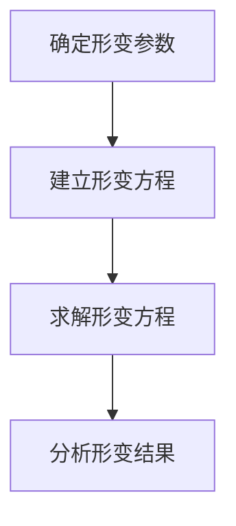

# 代数群引论：3.3 形变

## 1.背景介绍

代数群是数学中一个重要的研究领域，广泛应用于数论、代数几何和表示论等多个分支。形变理论是代数群研究中的一个关键概念，它涉及到代数群的结构在不同参数下的变化。形变理论不仅在纯数学中有重要地位，还在物理学、计算机科学等领域有广泛应用。

形变理论的核心在于理解代数群在不同参数下的行为变化，这对于解决许多实际问题具有重要意义。例如，在密码学中，代数群的形变可以用于构造安全的加密算法；在机器学习中，形变理论可以帮助我们理解模型参数的变化对模型性能的影响。

## 2.核心概念与联系

### 2.1 代数群

代数群是一个既是代数多样体又是群的数学结构。它们在代数几何和表示论中扮演着重要角色。代数群的基本性质包括闭包性、结合性、单位元和逆元的存在性。

### 2.2 形变

形变（Deformation）是指在某些参数变化下，代数群的结构发生变化的过程。形变理论研究的是这些变化的性质和规律。形变可以是连续的，也可以是离散的，具体取决于参数的性质。

### 2.3 形变与代数群的联系

形变理论在代数群中的应用主要体现在以下几个方面：

- **结构变化**：研究代数群在不同参数下的结构变化。
- **表示论**：分析代数群表示在形变过程中的变化。
- **几何性质**：探讨代数群形变对其几何性质的影响。

## 3.核心算法原理具体操作步骤

### 3.1 形变参数化

形变的第一步是确定形变参数。形变参数可以是一个或多个变量，这些变量控制代数群的结构变化。

### 3.2 形变方程

形变方程描述了代数群在形变参数下的变化规律。形变方程通常是一个或多个代数方程，具体形式取决于代数群的性质。

### 3.3 形变求解

求解形变方程是形变理论的核心步骤。求解过程通常涉及代数几何和数值计算等多种方法。

### 3.4 形变分析

形变求解后，需要对形变结果进行分析。这包括验证形变方程的解是否满足代数群的基本性质，以及分析形变对代数群结构和性质的影响。

以下是形变过程的Mermaid流程图：



## 4.数学模型和公式详细讲解举例说明

### 4.1 形变参数化

设 $G$ 是一个代数群，$t$ 是形变参数。我们用 $G_t$ 表示在参数 $t$ 下的代数群。

### 4.2 形变方程

形变方程可以表示为：

$$
F(G_t, t) = 0
$$

其中，$F$ 是一个代数方程，描述了 $G_t$ 在参数 $t$ 下的变化。

### 4.3 形变求解

求解形变方程 $F(G_t, t) = 0$，得到 $G_t$ 的具体形式。求解过程可能涉及数值计算和代数几何方法。

### 4.4 形变分析

分析形变结果，验证 $G_t$ 是否满足代数群的基本性质，如闭包性、结合性、单位元和逆元的存在性。

### 举例说明

假设我们研究一个简单的代数群 $G$，其形变方程为：

$$
G_t = \{(x, y) \in \mathbb{R}^2 \mid x^2 + y^2 = t\}
$$

当 $t$ 变化时，$G_t$ 的结构也随之变化。例如，当 $t = 1$ 时，$G_t$ 是一个单位圆；当 $t = 4$ 时，$G_t$ 是一个半径为2的圆。

## 5.项目实践：代码实例和详细解释说明

### 5.1 形变方程的Python实现

以下是一个简单的Python代码示例，用于求解形变方程并绘制代数群的形变图。

```python
import numpy as np
import matplotlib.pyplot as plt

def plot_deformation(t_values):
    theta = np.linspace(0, 2 * np.pi, 100)
    for t in t_values:
        x = np.sqrt(t) * np.cos(theta)
        y = np.sqrt(t) * np.sin(theta)
        plt.plot(x, y, label=f't={t}')
    plt.xlabel('x')
    plt.ylabel('y')
    plt.title('Deformation of Algebraic Group')
    plt.legend()
    plt.grid(True)
    plt.show()

# 形变参数 t 的取值
t_values = [1, 2, 3, 4]
plot_deformation(t_values)
```

### 5.2 代码解释

- `theta = np.linspace(0, 2 * np.pi, 100)`：生成从0到 $2\pi$ 的100个等间隔点。
- `x = np.sqrt(t) * np.cos(theta)` 和 `y = np.sqrt(t) * np.sin(theta)`：计算在参数 $t$ 下的代数群 $G_t$ 的点。
- `plt.plot(x, y, label=f't={t}')`：绘制代数群 $G_t$ 的形变图。

## 6.实际应用场景

### 6.1 密码学

在密码学中，代数群的形变可以用于构造安全的加密算法。例如，椭圆曲线密码学（ECC）利用椭圆曲线的形变来增强加密算法的安全性。

### 6.2 机器学习

在机器学习中，形变理论可以帮助我们理解模型参数的变化对模型性能的影响。例如，神经网络的权重形变可以用于优化模型的训练过程。

### 6.3 物理学

在物理学中，形变理论用于研究物理系统在不同参数下的行为变化。例如，量子场论中的形变理论用于研究粒子在不同能量状态下的行为。

## 7.工具和资源推荐

### 7.1 数学软件

- **Mathematica**：强大的数学计算软件，适用于求解复杂的形变方程。
- **MATLAB**：广泛应用于科学计算和工程领域，适用于形变分析和数值计算。

### 7.2 编程语言

- **Python**：具有丰富的科学计算库，如NumPy、SciPy和Matplotlib，适用于形变方程的求解和可视化。
- **R**：适用于统计分析和数据可视化，适用于形变数据的分析。

### 7.3 在线资源

- **arXiv**：提供大量关于代数群和形变理论的研究论文。
- **MathOverflow**：数学研究者的问答社区，可以在这里找到关于形变理论的讨论和解答。

## 8.总结：未来发展趋势与挑战

### 8.1 未来发展趋势

- **跨学科应用**：形变理论在多个学科中的应用将进一步深化，如生物信息学、金融工程等。
- **算法优化**：形变方程的求解算法将不断优化，提高计算效率和精度。
- **大数据分析**：形变理论在大数据分析中的应用将成为一个重要研究方向，帮助我们理解数据的结构和变化规律。

### 8.2 挑战

- **复杂性**：形变方程的复杂性可能导致求解过程非常困难，需要发展新的数学工具和算法。
- **计算资源**：形变分析通常需要大量的计算资源，如何高效利用计算资源是一个重要挑战。
- **应用推广**：将形变理论应用于实际问题需要跨学科的合作和深入研究。

## 9.附录：常见问题与解答

### 9.1 什么是代数群的形变？

代数群的形变是指在某些参数变化下，代数群的结构发生变化的过程。形变理论研究的是这些变化的性质和规律。

### 9.2 形变理论有哪些实际应用？

形变理论在密码学、机器学习、物理学等多个领域有广泛应用。例如，椭圆曲线密码学利用形变增强加密算法的安全性，机器学习中形变理论用于优化模型训练过程。

### 9.3 如何求解形变方程？

求解形变方程通常涉及代数几何和数值计算等多种方法。可以使用数学软件（如Mathematica、MATLAB）或编程语言（如Python、R）进行求解。

### 9.4 形变理论的未来发展趋势是什么？

形变理论的未来发展趋势包括跨学科应用、算法优化和大数据分析等。形变理论在多个学科中的应用将进一步深化，形变方程的求解算法将不断优化，形变理论在大数据分析中的应用将成为一个重要研究方向。

---

作者：禅与计算机程序设计艺术 / Zen and the Art of Computer Programming