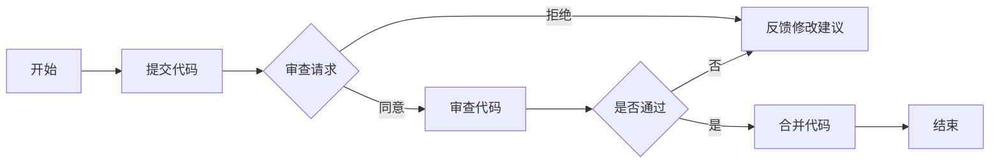
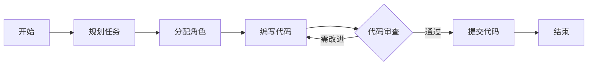

# 代码审查与结对编程原理与代码实战案例讲解

## 1. 背景介绍
在软件开发的世界里，代码质量是确保产品稳定性、性能和安全性的关键。代码审查和结对编程是两种广泛采用的实践，它们旨在提高代码质量和团队协作效率。代码审查是指在代码合并到共享代码库之前，由一个或多个开发者检查代码的过程。结对编程则是两名程序员共同在一台计算机上工作，共享设计思路和代码实现的过程。

## 2. 核心概念与联系
### 2.1 代码审查的目的与原则
代码审查的目的在于通过同行评审来发现和修正错误，分享知识和经验，以及保持代码风格的一致性。其核心原则包括透明性、尊重、及时反馈和持续改进。

### 2.2 结对编程的理念与实践
结对编程基于这样的理念：两个头脑比一个更好。它鼓励实时的交流和协作，以提高代码质量和团队成员的技能。实践中，通常有一个“驾驶员”编写代码，而另一个“观察员”则负责审查代码和提供反馈。

### 2.3 两者的联系
代码审查和结对编程都强调了团队合作和知识共享的重要性。它们可以相辅相成，结对编程产生的代码可以通过代码审查进一步验证和改进。

## 3. 核心算法原理具体操作步骤
### 3.1 代码审查流程


### 3.2 结对编程流程


## 4. 数学模型和公式详细讲解举例说明
在代码审查和结对编程中，虽然没有直接的数学模型，但我们可以通过统计模型来分析其效果。例如，我们可以定义代码审查的效率为发现缺陷的数量除以审查时间：

$$
\text{代码审查效率} = \frac{\text{发现的缺陷数量}}{\text{审查时间}}
$$

通过这个模型，我们可以量化代码审查的效率，并对不同的审查方法进行比较。

## 5. 项目实践：代码实例和详细解释说明
在一个实际的项目中，我们可以通过以下代码实例来展示结对编程的过程：

```python
# 观察员建议使用列表推导式优化代码
# 驾驶员实现代码优化
numbers = [1, 2, 3, 4, 5]
squares = [x * x for x in numbers]

# 观察员检查并提出改进意见
# 驾驶员根据反馈调整代码
print(squares)
```

在这个简单的例子中，观察员和驾驶员共同工作，提高了代码的简洁性和可读性。

## 6. 实际应用场景
代码审查和结对编程在多种场景下都非常有用，例如在新功能开发、重构旧代码、修复bug时。它们也适用于不同规模的团队，从初创公司到大型企业。

## 7. 工具和资源推荐
- 代码审查工具：GitHub Pull Requests, Gerrit, CodeReview
- 结对编程工具：Visual Studio Live Share, Tuple, Code With Me

## 8. 总结：未来发展趋势与挑战
随着远程工作的普及，代码审查和结对编程面临着新的挑战和机遇。工具和技术的发展将使这些实践更加高效和便捷。

## 9. 附录：常见问题与解答
Q1: 代码审查是否会降低开发效率？
A1: 短期内可能会有所影响，但长期来看，它可以提高代码质量，减少维护成本。

Q2: 结对编程是否适合所有项目？
A2: 并非所有项目都适合结对编程，它更适用于复杂度高、风险大的任务。

作者：禅与计算机程序设计艺术 / Zen and the Art of Computer Programming