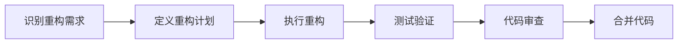

## 1. 背景介绍

在软件开发的生命周期中，代码重构是一项至关重要的工作。它涉及修改现有的代码基础，以改进其结构和可读性，同时不改变其外部行为。技术债是指为了快速交付软件而采取的非理想技术解决方案所累积的成本。随着时间的推移，如果不对技术债进行管理，它可能会导致软件维护成本的增加和软件质量的下降。

## 2. 核心概念与联系

### 2.1 代码重构的定义与目的
代码重构是指在不改变软件外在行为的前提下，对代码进行结构上的优化。目的在于提高代码的可读性、可维护性和可扩展性。

### 2.2 技术债的概念
技术债类似于金融债务，是指为了短期利益而采取的技术上的妥协。长期不偿还技术债，会导致软件的复杂度增加，进而影响软件的稳定性和开发效率。

### 2.3 重构与技术债的关系
重构是管理技术债的有效手段之一。通过定期的重构，可以减少技术债的积累，保持代码库的健康。

## 3. 核心算法原理具体操作步骤



### 3.1 识别重构需求
分析现有代码，识别出代码异味（code smells），如重复代码、过长函数、过大类等。

### 3.2 定义重构计划
根据识别出的问题，制定重构计划，确定重构的范围和优先级。

### 3.3 执行重构
按照计划，逐步进行代码的重构操作，如提取方法、合并条件表达式、移动类等。

### 3.4 测试验证
在重构过程中，持续运行测试，确保重构不会改变程序的预期行为。

### 3.5 代码审查
通过代码审查，确保重构的代码符合团队的编码标准和最佳实践。

### 3.6 合并代码
将重构后的代码合并到主分支，完成重构过程。

## 4. 数学模型和公式详细讲解举例说明

在代码重构中，我们可以使用数学模型来量化技术债的成本。例如，我们可以定义技术债的成本函数为：

$$ C(TD) = I + \sum_{t=1}^{n} M(t) $$

其中，$C(TD)$ 是技术债的总成本，$I$ 是初始债务，$M(t)$ 是在时间 $t$ 维护债务的成本。

通过这个模型，我们可以估算不同重构策略对技术债成本的影响，并选择最优的重构方案。

## 5. 项目实践：代码实例和详细解释说明

假设我们有一个过长的函数，我们可以通过提取方法来重构它：

```java
// 原始函数
public void processOrder(Order order) {
    // 处理订单逻辑...
    // ...
    // 发送确认邮件
    sendConfirmationEmail(order);
}

// 重构后的函数
public void processOrder(Order order) {
    // 处理订单逻辑...
    // ...
    sendConfirmationEmail(order);
}

private void sendConfirmationEmail(Order order) {
    // 发送确认邮件逻辑...
}
```

通过这个简单的重构，我们提高了函数的可读性和可维护性。

## 6. 实际应用场景

代码重构在软件开发的各个阶段都有应用，特别是在软件迭代和维护阶段。例如，在添加新功能之前，先进行重构可以为新功能的集成提供更清晰、更稳定的代码基础。

## 7. 工具和资源推荐

- 重构工具：IntelliJ IDEA、Eclipse等IDE提供了自动化重构工具。
- 代码质量分析工具：SonarQube、Code Climate可以帮助识别代码异味。
- 书籍：《重构：改善既有代码的设计》（Martin Fowler）是一本经典的重构书籍。

## 8. 总结：未来发展趋势与挑战

随着软件开发的不断进步，代码重构和技术债管理将变得更加自动化和智能化。未来的挑战在于如何更有效地识别和管理技术债，以及如何将重构更好地集成到持续集成/持续部署（CI/CD）流程中。

## 9. 附录：常见问题与解答

Q1: 什么时候应该进行代码重构？
A1: 当代码出现异味、添加新功能前、代码审查时都是重构的好时机。

Q2: 重构是否会影响现有功能？
A2: 正确的重构不应该改变程序的外部行为。通过持续测试可以确保这一点。

Q3: 如何衡量重构的效果？
A3: 可以通过代码复杂度、维护成本和开发效率等指标来衡量重构的效果。

作者：禅与计算机程序设计艺术 / Zen and the Art of Computer Programming