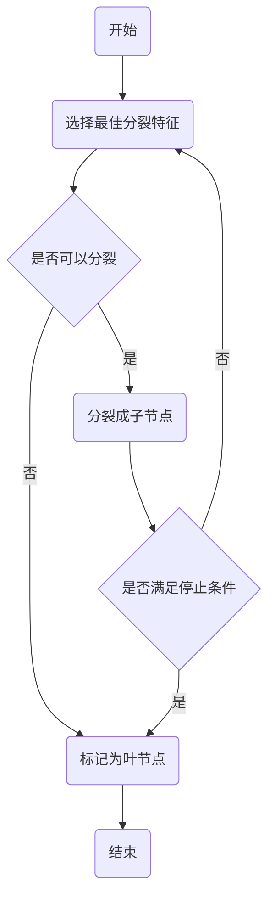

# 决策树 (Decision Trees) 原理与代码实例讲解

## 1. 背景介绍

决策树是一种基本的分类与回归方法，广泛应用于数据挖掘、机器学习、医学诊断等领域。它模拟人类决策过程，通过一系列规则对数据进行分类。决策树的优点在于模型具有可读性，分类速度快。本文将深入探讨决策树的原理、构建过程和实际应用。

## 2. 核心概念与联系

### 2.1 决策树的组成

- **节点**：包括根节点、内部节点和叶节点。
- **分支**：表示特征属性的输出。
- **叶节点**：决策结果。

### 2.2 关键术语

- **信息增益**：选择分裂特征时的主要准则。
- **基尼指数**：CART决策树使用的分裂准则。
- **剪枝**：防止过拟合的策略。

### 2.3 决策树类型

- **ID3**：基于信息增益。
- **C4.5**：基于信息增益比。
- **CART**：分类与回归树，可以用于分类也可以用于回归。

## 3. 核心算法原理具体操作步骤

### 3.1 决策树构建流程



### 3.2 分裂特征的选择

- 计算每个特征的信息增益或基尼指数。
- 选择信息增益最大或基尼指数最小的特征。

### 3.3 剪枝处理

- **预剪枝**：在决策树生成过程中就进行剪枝。
- **后剪枝**：先生成完整的决策树，然后从底部开始剪枝。

## 4. 数学模型和公式详细讲解举例说明

### 4.1 信息熵

$$
Entropy(S) = -\sum_{i=1}^{n} p_i \log_2 p_i
$$

其中，$p_i$ 是选择第 $i$ 个类别的概率。

### 4.2 信息增益

$$
Gain(S, A) = Entropy(S) - \sum_{v \in Values(A)} \frac{|S_v|}{|S|} Entropy(S_v)
$$

其中，$S_v$ 是特征 $A$ 有值 $v$ 的样本集合。

### 4.3 基尼指数

$$
Gini(S) = 1 - \sum_{i=1}^{n} p_i^2
$$

## 5. 项目实践：代码实例和详细解释说明

### 5.1 使用Python构建决策树

```python
from sklearn.datasets import load_iris
from sklearn.tree import DecisionTreeClassifier

# 加载数据集
iris = load_iris()
X, y = iris.data, iris.target

# 创建决策树分类器
clf = DecisionTreeClassifier(criterion='entropy')
clf.fit(X, y)

# 预测新样本
print(clf.predict([[5.1, 3.5, 1.4, 0.2]]))
```

### 5.2 代码解释

- `load_iris`：加载鸢尾花数据集。
- `DecisionTreeClassifier`：创建决策树分类器，`criterion='entropy'` 表示使用信息熵作为分裂准则。
- `fit`：训练模型。
- `predict`：预测新样本的类别。

## 6. 实际应用场景

- **信用评分**：评估客户的信用风险。
- **医疗诊断**：根据病人的临床数据进行疾病诊断。
- **客户细分**：根据购买行为对客户进行分组。

## 7. 工具和资源推荐

- **Scikit-learn**：提供决策树算法的Python库。
- **WEKA**：包含多种决策树算法的机器学习工具箱。
- **R语言**：提供决策树构建的多种包。

## 8. 总结：未来发展趋势与挑战

决策树在解释性和简单性方面具有优势，但在处理高维数据和过拟合方面存在挑战。未来的发展趋势可能包括集成学习、深度学习与决策树的结合，以及自动化特征工程的应用。

## 9. 附录：常见问题与解答

### Q1: 决策树如何处理连续属性？
A1: 通过设定阈值将连续属性离散化。

### Q2: 决策树如何防止过拟合？
A2: 通过剪枝策略和限制树的深度。

### Q3: 决策树在大数据集上的表现如何？
A3: 在大数据集上可能会导致计算量大和模型复杂度高，需要采用适当的优化策略。

---

作者：禅与计算机程序设计艺术 / Zen and the Art of Computer Programming