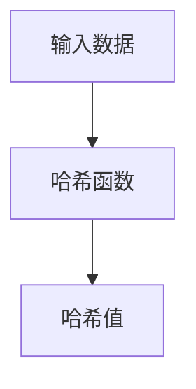
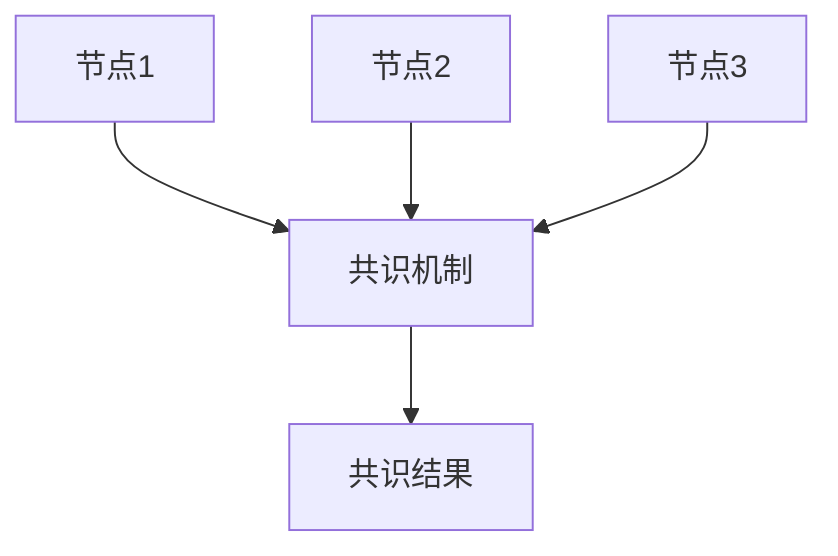
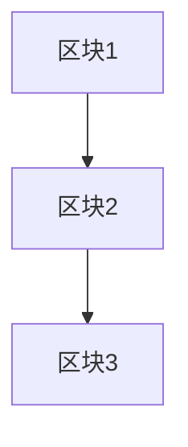

# 区块链与数据可信原理与代码实战案例讲解

## 1.背景介绍

区块链技术自2008年比特币白皮书发布以来，迅速成为技术界和商业界的热门话题。其去中心化、不可篡改和透明的特性，使其在金融、供应链管理、医疗等多个领域展现出巨大的潜力。本文将深入探讨区块链技术的核心概念、算法原理、数学模型，并通过实际代码实例和应用场景，帮助读者全面理解区块链技术及其在数据可信方面的应用。

## 2.核心概念与联系

### 2.1 区块链的基本概念

区块链是一种分布式账本技术，记录了所有参与节点的交易数据。每个区块包含若干交易信息，并通过加密哈希函数与前一个区块相连，形成链式结构。

### 2.2 数据可信的定义

数据可信是指数据的真实性、完整性和不可篡改性。区块链通过其独特的结构和共识机制，确保了数据的可信性。

### 2.3 区块链与数据可信的联系

区块链的去中心化和不可篡改特性，使其成为实现数据可信的理想技术。通过共识机制和加密技术，区块链确保了数据的真实性和完整性。

## 3.核心算法原理具体操作步骤

### 3.1 哈希函数

哈希函数是区块链的基础，用于生成固定长度的哈希值。常用的哈希函数包括SHA-256。



### 3.2 共识机制

共识机制是区块链网络中节点达成一致的协议。常见的共识机制包括工作量证明（PoW）、权益证明（PoS）等。



### 3.3 区块链结构

区块链由多个区块组成，每个区块包含前一个区块的哈希值、时间戳和交易数据。



## 4.数学模型和公式详细讲解举例说明

### 4.1 哈希函数的数学模型

哈希函数 $H$ 将任意长度的输入 $x$ 映射为固定长度的输出 $H(x)$。例如，SHA-256的输出长度为256位。

$$
H: \{0,1\}^* \rightarrow \{0,1\}^{256}
$$

### 4.2 工作量证明（PoW）

工作量证明要求节点解决一个计算难题，以获得记账权。其数学模型为：

$$
H(nonce + previous\_hash + transactions) < target
$$

其中，$nonce$ 是一个随机数，$previous\_hash$ 是前一个区块的哈希值，$transactions$ 是当前区块的交易数据，$target$ 是难度目标。

### 4.3 权益证明（PoS）

权益证明根据节点持有的代币数量和时间，确定记账权。其数学模型为：

$$
P(i) = \frac{stake_i}{\sum_{j=1}^{N} stake_j}
$$

其中，$P(i)$ 是节点 $i$ 获得记账权的概率，$stake_i$ 是节点 $i$ 持有的代币数量，$N$ 是网络中的总节点数。

## 5.项目实践：代码实例和详细解释说明

### 5.1 创建区块链类

以下是一个简单的Python实现，用于创建区块链类。

```python
import hashlib
import time

class Block:
    def __init__(self, index, previous_hash, timestamp, data, hash):
        self.index = index
        self.previous_hash = previous_hash
        self.timestamp = timestamp
        self.data = data
        self.hash = hash

def calculate_hash(index, previous_hash, timestamp, data):
    value = str(index) + previous_hash + str(timestamp) + data
    return hashlib.sha256(value.encode('utf-8')).hexdigest()

def create_genesis_block():
    return Block(0, "0", int(time.time()), "Genesis Block", calculate_hash(0, "0", int(time.time()), "Genesis Block"))

def create_new_block(previous_block, data):
    index = previous_block.index + 1
    timestamp = int(time.time())
    hash = calculate_hash(index, previous_block.hash, timestamp, data)
    return Block(index, previous_block.hash, timestamp, data, hash)

# 创建区块链
blockchain = [create_genesis_block()]
previous_block = blockchain[0]

# 添加新块
for i in range(1, 5):
    new_block = create_new_block(previous_block, f"Block {i} Data")
    blockchain.append(new_block)
    previous_block = new_block
    print(f"Block {new_block.index} has been added to the blockchain!")
    print(f"Hash: {new_block.hash}\n")
```

### 5.2 代码解释

1. `Block` 类定义了区块的基本结构，包括索引、前一个区块的哈希值、时间戳、数据和当前区块的哈希值。
2. `calculate_hash` 函数用于计算区块的哈希值。
3. `create_genesis_block` 函数创建创世区块。
4. `create_new_block` 函数基于前一个区块创建新块。
5. 最后，创建区块链并添加新块。

## 6.实际应用场景

### 6.1 金融领域

区块链在金融领域的应用包括跨境支付、智能合约和去中心化金融（DeFi）。其去中心化和不可篡改特性，确保了交易的安全性和透明性。

### 6.2 供应链管理

区块链在供应链管理中的应用，可以实现产品从生产到销售的全程追溯，确保产品的真实性和质量。

### 6.3 医疗健康

区块链在医疗健康领域的应用包括电子病历管理、药品追溯和临床试验数据管理。其数据不可篡改特性，确保了医疗数据的可信性。

## 7.工具和资源推荐

### 7.1 开发工具

- **Ethereum**：一个开源的区块链平台，支持智能合约。
- **Hyperledger Fabric**：一个企业级的区块链平台，适用于供应链管理等应用。
- **Truffle**：一个开发、测试和部署智能合约的工具。

### 7.2 学习资源

- **《Mastering Bitcoin》**：一本深入讲解比特币和区块链技术的书籍。
- **Coursera区块链课程**：提供区块链技术的在线课程。
- **GitHub**：大量开源的区块链项目和代码实例。

## 8.总结：未来发展趋势与挑战

### 8.1 未来发展趋势

区块链技术在未来将继续发展，特别是在去中心化金融（DeFi）、供应链管理和医疗健康等领域。随着技术的成熟和应用的广泛，区块链将成为数据可信的重要保障。

### 8.2 挑战

区块链技术面临的主要挑战包括扩展性、隐私保护和监管问题。解决这些挑战，需要技术的不断创新和政策的支持。

## 9.附录：常见问题与解答

### 9.1 区块链如何确保数据的不可篡改性？

区块链通过哈希函数和共识机制，确保了数据的不可篡改性。每个区块包含前一个区块的哈希值，任何篡改都会导致链条断裂。

### 9.2 区块链的性能如何提升？

区块链的性能可以通过分片技术、侧链和Layer 2解决方案等方式提升。这些技术可以提高交易处理速度和网络扩展性。

### 9.3 区块链如何保护隐私？

区块链通过零知识证明、环签名和同态加密等技术，保护用户隐私。这些技术确保了交易的隐私性和数据的安全性。

---

作者：禅与计算机程序设计艺术 / Zen and the Art of Computer Programming