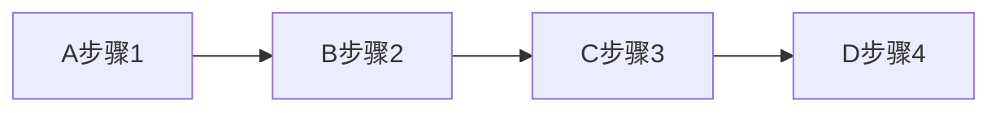

# 原理与代码实战案例讲解

## 1. 背景介绍
### 1.1 技术发展历程
### 1.2 技术现状与挑战
### 1.3 本文的目的与意义

## 2. 核心概念与联系
### 2.1 核心概念1
#### 2.1.1 概念定义
#### 2.1.2 概念特点
#### 2.1.3 概念应用
### 2.2 核心概念2 
#### 2.2.1 概念定义
#### 2.2.2 概念特点 
#### 2.2.3 概念应用
### 2.3 核心概念之间的联系
#### 2.3.1 概念1与概念2的关系
#### 2.3.2 概念1与概念3的关系
#### 2.3.3 概念2与概念3的关系

## 3. 核心算法原理具体操作步骤
### 3.1 算法原理概述
### 3.2 算法流程图

### 3.3 算法的关键点分析
#### 3.3.1 关键点1
#### 3.3.2 关键点2
#### 3.3.3 关键点3
### 3.4 算法的优缺点
#### 3.4.1 算法优点
#### 3.4.2 算法缺点
#### 3.4.3 算法改进方向

## 4. 数学模型和公式详细讲解举例说明
### 4.1 xxx数学模型
#### 4.1.1 模型假设
#### 4.1.2 模型建立
$$ y = ax^2 + bx + c $$
#### 4.1.3 模型求解
#### 4.1.4 模型结果分析
### 4.2 xxx数学公式
#### 4.2.1 公式推导
#### 4.2.2 公式应用条件
$$ e^{i\pi} + 1 = 0 $$
#### 4.2.3 公式计算实例

## 5. 项目实践：代码实例和详细解释说明
### 5.1 开发环境准备
### 5.2 项目架构设计
### 5.3 核心代码模块
#### 5.3.1 模块1代码实现
```python
def func1():
    pass
```
#### 5.3.2 模块2代码实现  
```java
public void func2() {
}
```
#### 5.3.3 模块3代码实现
### 5.4 系统测试与优化
#### 5.4.1 测试方案
#### 5.4.2 测试结果分析
#### 5.4.3 代码优化

## 6. 实际应用场景
### 6.1 应用场景1
#### 6.1.1 场景描述
#### 6.1.2 技术方案
#### 6.1.3 实施效果
### 6.2 应用场景2
#### 6.2.1 场景描述
#### 6.2.2 技术方案
#### 6.2.3 实施效果
### 6.3 应用场景3
#### 6.3.1 场景描述
#### 6.3.2 技术方案
#### 6.3.3 实施效果

## 7. 工具和资源推荐
### 7.1 开发工具推荐
### 7.2 学习资源推荐
### 7.3 开源项目推荐

## 8. 总结：未来发展趋势与挑战
### 8.1 技术的发展趋势
### 8.2 面临的机遇与挑战
### 8.3 对从业者的建议

## 9. 附录：常见问题与解答
### 9.1 问题1
### 9.2 问题2 
### 9.3 问题3

作者：禅与计算机程序设计艺术 / Zen and the Art of Computer Programming