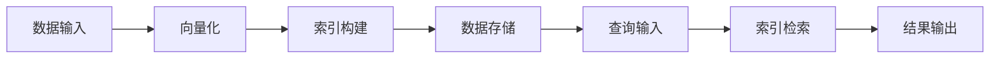

# 向量数据库基础：存储和检索多维数据的科学

## 1. 背景介绍
在当今数据驱动的时代，海量的多维数据被广泛应用于各个领域，如推荐系统、自然语言处理、图像识别等。这些数据通常以高维向量的形式存在，传统的关系型数据库在处理这类数据时面临效率低下的问题。向量数据库作为一种新型的数据库系统，专门针对高维向量数据的存储和检索进行了优化，能够提供更快的查询速度和更高的数据吞吐量。

## 2. 核心概念与联系
向量数据库的核心在于其对多维空间数据的处理能力。它通过索引结构如KD树、R树或倒排索引等，实现了高效的空间数据检索。此外，向量数据库还采用了数据压缩、分布式存储等技术，以提高存储效率和查询性能。

## 3. 核心算法原理具体操作步骤
向量数据库的核心算法包括向量索引构建和查询处理。构建索引时，算法会根据向量之间的距离关系，将数据组织到多维空间中。查询处理时，算法通过向量索引快速定位到目标数据，实现高效检索。



## 4. 数学模型和公式详细讲解举例说明
向量数据库的数学模型基于向量空间理论。例如，余弦相似度公式 $$ \cos(\theta) = \frac{A \cdot B}{\|A\|\|B\|} $$ 被用来衡量两个向量的相似度。通过这些数学模型，向量数据库能够准确地计算数据点之间的关系。

## 5. 项目实践：代码实例和详细解释说明
在实际项目中，向量数据库可以通过以下Python代码片段实现一个简单的向量检索：

```python
from vector_database import VectorDB

# 初始化向量数据库
vector_db = VectorDB()

# 向数据库中添加向量
vector_db.add_vector([1, 2, 3, 4], "Vector1")
vector_db.add_vector([4, 3, 2, 1], "Vector2")

# 查询最相似的向量
result = vector_db.query([1, 2, 3, 4], top_k=1)
print(result)
```

## 6. 实际应用场景
向量数据库在多个领域都有广泛应用，如在推荐系统中通过用户和商品的向量表示来计算相似度，在生物信息学中用于基因表达数据的快速检索，在安全领域用于异常检测等。

## 7. 工具和资源推荐
推荐使用开源向量数据库如Milvus、Faiss等，它们提供了丰富的API和高效的向量检索能力。此外，还有一些云服务提供商如AWS、Google Cloud提供了向量数据库相关的托管服务。

## 8. 总结：未来发展趋势与挑战
向量数据库的未来发展趋势将更加注重于分布式计算、实时性能优化和智能化索引策略。同时，随着数据规模的不断扩大，如何保持检索效率和准确性将是向量数据库面临的主要挑战。

## 9. 附录：常见问题与解答
Q1: 向量数据库与传统数据库有何不同？
A1: 向量数据库专门针对高维向量数据进行了优化，具有更快的查询速度和更高的数据吞吐量。

Q2: 向量数据库如何保证查询的准确性？
A2: 通过精确的数学模型和高效的索引结构，向量数据库能够准确计算向量之间的相似度，从而保证查询结果的准确性。

作者：禅与计算机程序设计艺术 / Zen and the Art of Computer Programming