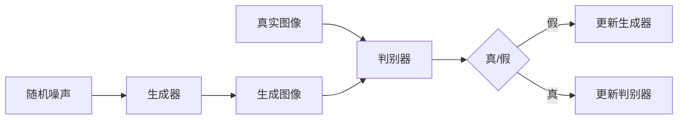
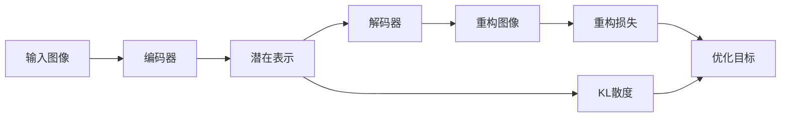

# 图像生成 (Image Generation)

## 1. 背景介绍

图像生成是人工智能领域中一个令人兴奋和充满挑战的研究方向。它旨在通过机器学习算法,特别是深度学习技术,自动生成逼真、多样化且具有语义意义的图像。近年来,随着生成对抗网络(GAN)、变分自编码器(VAE)等生成模型的出现和发展,图像生成取得了显著进步。这些技术不仅在计算机视觉领域有广泛应用,如图像编辑、图像翻译、图像超分辨率等,而且在虚拟现实、游戏设计、医学影像等领域也展现出巨大潜力。

### 1.1 图像生成的发展历程

- 1.1.1 早期的图像生成方法
  - 1.1.1.1 基于模板的方法
  - 1.1.1.2 基于规则的方法
- 1.1.2 基于深度学习的图像生成
  - 1.1.2.1 生成对抗网络(GAN)的出现
  - 1.1.2.2 变分自编码器(VAE)的发展
  - 1.1.2.3 其他生成模型的探索

### 1.2 图像生成的应用领域

- 1.2.1 计算机视觉
  - 1.2.1.1 图像编辑与修复
  - 1.2.1.2 图像风格转换
  - 1.2.1.3 图像超分辨率
- 1.2.2 虚拟现实与游戏设计 
  - 1.2.2.1 逼真场景生成
  - 1.2.2.2 虚拟角色生成
- 1.2.3 医学影像
  - 1.2.3.1 医学图像合成
  - 1.2.3.2 疾病诊断辅助

## 2. 核心概念与联系

### 2.1 生成对抗网络(GAN)

- 2.1.1 GAN的基本原理
- 2.1.2 生成器与判别器的博弈过程
- 2.1.3 GAN的损失函数与优化目标

### 2.2 变分自编码器(VAE) 

- 2.2.1 VAE的基本架构
- 2.2.2 编码器与解码器的作用
- 2.2.3 VAE的损失函数与优化目标

### 2.3 GAN与VAE的比较

- 2.3.1 生成图像的质量与多样性
- 2.3.2 训练稳定性与收敛速度
- 2.3.3 可解释性与可控性

### 2.4 其他图像生成模型

- 2.4.1 自回归模型
- 2.4.2 流模型
- 2.4.3 扩散模型

## 3. 核心算法原理与具体操作步骤

### 3.1 生成对抗网络(GAN)

- 3.1.1 GAN的训练流程
  - 3.1.1.1 生成器的训练
  - 3.1.1.2 判别器的训练
  - 3.1.1.3 交替优化过程
- 3.1.2 GAN的改进与变体
  - 3.1.2.1 条件GAN
  - 3.1.2.2 Wasserstein GAN
  - 3.1.2.3 StyleGAN

### 3.2 变分自编码器(VAE)

- 3.2.1 VAE的训练流程 
  - 3.2.1.1 编码器的训练
  - 3.2.1.2 解码器的训练
  - 3.2.1.3 重构损失与KL散度
- 3.2.2 VAE的改进与变体
  - 3.2.2.1 β-VAE
  - 3.2.2.2 条件VAE
  - 3.2.2.3 层次VAE

## 4. 数学模型与公式详细讲解举例说明

### 4.1 生成对抗网络(GAN)的数学模型

- 4.1.1 生成器与判别器的目标函数
  - 生成器: $\min_G \max_D V(D,G) = \mathbb{E}_{x \sim p_{data}(x)}[\log D(x)] + \mathbb{E}_{z \sim p_z(z)}[\log (1 - D(G(z)))]$
  - 判别器: $\max_D V(D,G) = \mathbb{E}_{x \sim p_{data}(x)}[\log D(x)] + \mathbb{E}_{z \sim p_z(z)}[\log (1 - D(G(z)))]$
- 4.1.2 纳什均衡与最优判别器
- 4.1.3 生成器的优化目标

### 4.2 变分自编码器(VAE)的数学模型

- 4.2.1 证据下界(ELBO)的推导
  - $\log p(x) \geq \mathbb{E}_{q_{\phi}(z|x)}[\log p_{\theta}(x|z)] - D_{KL}(q_{\phi}(z|x) || p(z))$
- 4.2.2 重构损失与KL散度的权衡
- 4.2.3 变分推断与随机梯度估计

## 5. 项目实践:代码实例与详细解释说明

### 5.1 基于PyTorch实现GAN

- 5.1.1 生成器与判别器的网络结构设计
- 5.1.2 数据加载与预处理
- 5.1.3 训练循环与优化过程
- 5.1.4 生成结果可视化与评估

### 5.2 基于TensorFlow实现VAE

- 5.2.1 编码器与解码器的网络结构设计  
- 5.2.2 数据加载与预处理
- 5.2.3 训练循环与损失函数计算
- 5.2.4 潜在空间插值与采样

## 6. 实际应用场景

### 6.1 图像编辑与修复

- 6.1.1 人脸属性编辑
- 6.1.2 图像补全与修复
- 6.1.3 图像去噪与超分辨率

### 6.2 虚拟试衣与时尚设计

- 6.2.1 服装生成与转换
- 6.2.2 虚拟试衣与搭配推荐
- 6.2.3 时尚设计辅助

### 6.3 医学影像合成与分析

- 6.3.1 医学图像合成与数据增强
- 6.3.2 疾病诊断辅助
- 6.3.3 医学图像跨模态转换

## 7. 工具与资源推荐

### 7.1 深度学习框架

- 7.1.1 PyTorch
- 7.1.2 TensorFlow
- 7.1.3 Keras

### 7.2 图像生成模型库

- 7.2.1 TensorFlow Hub
- 7.2.2 PyTorch Hub
- 7.2.3 MMGeneration

### 7.3 数据集资源

- 7.3.1 CIFAR-10/100
- 7.3.2 CelebA
- 7.3.3 LSUN

## 8. 总结:未来发展趋势与挑战

### 8.1 图像生成的研究方向

- 8.1.1 可控性与可解释性
- 8.1.2 多模态图像生成
- 8.1.3 高分辨率与高保真度

### 8.2 图像生成面临的挑战

- 8.2.1 训练稳定性与收敛性
- 8.2.2 生成多样性与一致性
- 8.2.3 隐私与安全问题

### 8.3 图像生成的未来展望

- 8.3.1 跨领域应用拓展
- 8.3.2 与其他AI技术的融合
- 8.3.3 社会影响与伦理考量

## 9. 附录:常见问题与解答

### 9.1 如何评估生成图像的质量?

- 9.1.1 主观评估方法
- 9.1.2 客观评估指标

### 9.2 图像生成模型的训练需要哪些硬件资源?

- 9.2.1 GPU配置要求
- 9.2.2 内存与存储需求

### 9.3 如何处理图像生成过程中的模式崩溃问题?

- 9.3.1 模式崩溃的原因分析
- 9.3.2 改进训练策略与网络结构

图像生成技术的发展日新月异,不断突破人工智能的边界。从最初的简单生成模型,到如今的高质量、多样化生成能力,图像生成展现出了巨大的应用潜力。然而,图像生成依然面临着诸多挑战,如训练稳定性、可控性、隐私安全等问题。未来,图像生成技术将继续与其他人工智能技术融合,拓展至更广泛的应用领域。同时,我们也需要审慎考虑图像生成技术带来的社会影响与伦理问题。相信通过研究者的不断探索和努力,图像生成技术必将迎来更加辉煌的明天。

作者:禅与计算机程序设计艺术 / Zen and the Art of Computer Programming