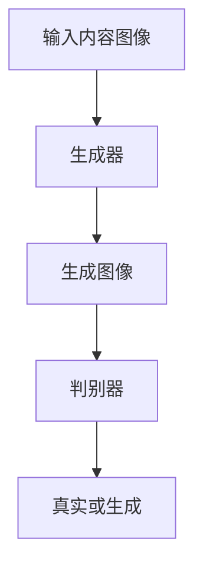

# 基于生成对抗网络的图像风格迁移在教育中的应用模式

## 1.背景介绍

在现代教育中，图像和多媒体资源的使用变得越来越普遍。传统的图像处理技术已经无法满足日益增长的需求，尤其是在个性化和多样化的教育内容制作方面。生成对抗网络（GANs）作为一种新兴的深度学习技术，提供了一种强大的工具来实现图像风格迁移。通过GANs，我们可以将一种图像的风格迁移到另一种图像上，从而创造出具有艺术感和教育意义的图像。

## 2.核心概念与联系

### 2.1 生成对抗网络（GANs）

生成对抗网络由两个主要部分组成：生成器（Generator）和判别器（Discriminator）。生成器的任务是生成逼真的图像，而判别器的任务是区分真实图像和生成图像。两者通过对抗训练，逐步提升生成图像的质量。

### 2.2 图像风格迁移

图像风格迁移是一种将一种图像的风格应用到另一种图像上的技术。通过这种技术，我们可以将艺术作品的风格迁移到普通照片上，从而创造出具有艺术感的图像。

### 2.3 GANs与图像风格迁移的联系

GANs在图像风格迁移中扮演了重要角色。通过GANs，我们可以实现高质量的图像风格迁移，从而在教育中创造出丰富多彩的图像资源。

## 3.核心算法原理具体操作步骤

### 3.1 数据准备

首先，我们需要准备两类数据：内容图像和风格图像。内容图像是我们希望保留其结构的图像，而风格图像是我们希望迁移其风格的图像。

### 3.2 模型架构设计

我们需要设计一个生成对抗网络，其中生成器负责生成具有目标风格的图像，判别器负责区分生成图像和真实图像。



### 3.3 损失函数设计

损失函数是GANs训练的关键。我们需要设计一个损失函数，使得生成器能够生成逼真的图像，同时保留内容图像的结构。

### 3.4 模型训练

通过对抗训练，我们逐步提升生成图像的质量。生成器和判别器交替训练，直到生成图像达到满意的效果。

## 4.数学模型和公式详细讲解举例说明

### 4.1 生成对抗网络的数学模型

生成对抗网络的目标是找到生成器 $G$ 和判别器 $D$ 之间的纳什均衡。其损失函数可以表示为：

$$
\min_G \max_D V(D, G) = \mathbb{E}_{x \sim p_{data}(x)}[\log D(x)] + \mathbb{E}_{z \sim p_z(z)}[\log(1 - D(G(z)))]
$$

### 4.2 图像风格迁移的损失函数

图像风格迁移的损失函数通常包括内容损失和风格损失。内容损失用于保留内容图像的结构，风格损失用于迁移风格图像的风格。

内容损失可以表示为：

$$
L_{content} = \sum_{i=1}^N \| F_i^{content} - F_i^{generated} \|^2
$$

风格损失可以表示为：

$$
L_{style} = \sum_{j=1}^M \| G_j^{style} - G_j^{generated} \|^2
$$

总损失函数为：

$$
L_{total} = \alpha L_{content} + \beta L_{style}
$$

其中，$\alpha$ 和 $\beta$ 是权重参数，用于平衡内容损失和风格损失。

## 5.项目实践：代码实例和详细解释说明

### 5.1 环境配置

首先，我们需要配置深度学习环境。可以使用TensorFlow或PyTorch等深度学习框架。

```python
import tensorflow as tf
from tensorflow.keras import layers

# 检查TensorFlow版本
print(tf.__version__)
```

### 5.2 数据加载

加载内容图像和风格图像。

```python
from tensorflow.keras.preprocessing import image
import numpy as np

def load_img(path_to_img):
    max_dim = 512
    img = image.load_img(path_to_img)
    img = image.img_to_array(img)
    img = np.expand_dims(img, axis=0)
    img = tf.image.resize(img, (max_dim, max_dim))
    return img

content_image = load_img('path_to_content_image.jpg')
style_image = load_img('path_to_style_image.jpg')
```

### 5.3 模型构建

构建生成器和判别器模型。

```python
def build_generator():
    model = tf.keras.Sequential()
    model.add(layers.Conv2D(64, (3, 3), padding='same', input_shape=(None, None, 3)))
    model.add(layers.Activation('relu'))
    # 添加更多层
    return model

def build_discriminator():
    model = tf.keras.Sequential()
    model.add(layers.Conv2D(64, (3, 3), padding='same', input_shape=(None, None, 3)))
    model.add(layers.Activation('relu'))
    # 添加更多层
    return model

generator = build_generator()
discriminator = build_discriminator()
```

### 5.4 模型训练

训练生成对抗网络。

```python
def train(generator, discriminator, content_image, style_image, epochs=1000):
    for epoch in range(epochs):
        # 生成图像
        generated_image = generator(content_image)
        
        # 计算损失
        content_loss = tf.reduce_mean(tf.square(content_image - generated_image))
        style_loss = tf.reduce_mean(tf.square(style_image - generated_image))
        total_loss = content_loss + style_loss
        
        # 更新生成器和判别器
        generator_optimizer.minimize(total_loss, var_list=generator.trainable_variables)
        discriminator_optimizer.minimize(total_loss, var_list=discriminator.trainable_variables)
        
        if epoch % 100 == 0:
            print(f'Epoch {epoch}, Loss: {total_loss.numpy()}')

train(generator, discriminator, content_image, style_image)
```

## 6.实际应用场景

### 6.1 教育内容创作

通过图像风格迁移，教师可以将普通的教学图片转换为具有艺术感的图像，从而提高学生的学习兴趣。

### 6.2 课件制作

在课件制作中，图像风格迁移可以用于创建独特的视觉效果，使课件更加生动有趣。

### 6.3 在线教育平台

在线教育平台可以利用图像风格迁移技术，为用户提供个性化的学习体验。例如，用户可以选择自己喜欢的图像风格，系统会自动将学习内容转换为该风格。

## 7.工具和资源推荐

### 7.1 深度学习框架

- TensorFlow
- PyTorch

### 7.2 图像处理工具

- OpenCV
- PIL（Python Imaging Library）

### 7.3 数据集

- COCO（Common Objects in Context）
- ImageNet

## 8.总结：未来发展趋势与挑战

### 8.1 未来发展趋势

随着深度学习技术的不断发展，生成对抗网络在图像风格迁移中的应用将会越来越广泛。未来，我们可以期待更加高效和高质量的图像风格迁移算法，从而在教育中创造出更多有趣和有价值的应用。

### 8.2 挑战

尽管生成对抗网络在图像风格迁移中表现出色，但仍然存在一些挑战。例如，如何在保持图像质量的同时提高生成速度，如何处理复杂的图像风格迁移任务等。这些问题需要进一步的研究和探索。

## 9.附录：常见问题与解答

### 9.1 什么是生成对抗网络？

生成对抗网络（GANs）是一种深度学习模型，由生成器和判别器组成，通过对抗训练生成逼真的图像。

### 9.2 图像风格迁移的应用场景有哪些？

图像风格迁移可以应用于教育内容创作、课件制作和在线教育平台等多个场景。

### 9.3 如何提高图像风格迁移的效果？

可以通过改进生成对抗网络的架构和损失函数设计，提高图像风格迁移的效果。

### 9.4 生成对抗网络的训练需要多长时间？

训练时间取决于数据集的大小和模型的复杂度。通常需要数小时到数天不等。

### 9.5 是否有开源的图像风格迁移工具？

是的，有许多开源的图像风格迁移工具，例如TensorFlow和PyTorch的相关实现。

---

作者：禅与计算机程序设计艺术 / Zen and the Art of Computer Programming