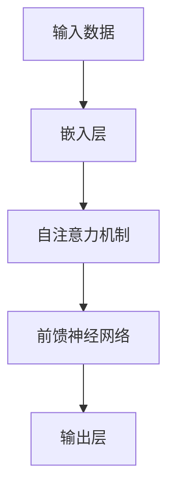
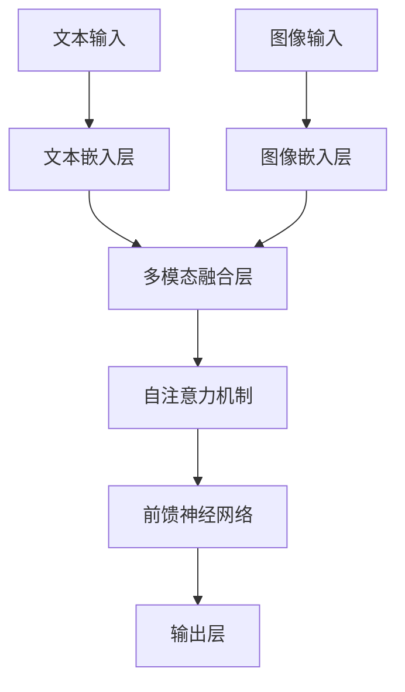

# 多模态大模型：技术原理与实战 看清GPT的进化史和创新点

## 1.背景介绍

### 1.1 人工智能的发展历程
人工智能（AI）自20世纪50年代诞生以来，经历了多次技术革新和应用扩展。从最初的符号主义和专家系统，到后来的机器学习和深度学习，AI技术不断进步，逐步渗透到各行各业。近年来，随着计算能力的提升和大数据的普及，深度学习特别是大规模预训练模型（如GPT-3）的出现，标志着AI进入了一个新的发展阶段。

### 1.2 多模态大模型的兴起
传统的AI模型通常专注于单一模态的数据处理，如文本、图像或语音。然而，现实世界中的信息往往是多模态的，即包含多种类型的数据。多模态大模型的出现，旨在通过融合不同模态的数据，提升模型的理解和生成能力。这类模型不仅能够处理文本，还能理解图像、语音等多种数据形式，实现更为复杂和智能的任务。

### 1.3 GPT的进化史
GPT（Generative Pre-trained Transformer）系列模型是由OpenAI开发的自然语言处理（NLP）模型。自2018年发布以来，GPT经历了多次迭代，从最初的GPT-1到如今的GPT-4，每一代都在模型规模、性能和应用范围上取得了显著进步。GPT-3的发布，标志着大规模预训练模型在NLP领域的突破，而多模态大模型则是这一技术的进一步延伸。

## 2.核心概念与联系

### 2.1 多模态数据
多模态数据是指包含多种类型信息的数据集，如文本、图像、语音、视频等。多模态数据的处理需要模型能够理解和融合不同模态的信息，从而实现更为复杂的任务。

### 2.2 预训练与微调
预训练是指在大规模数据集上训练模型，使其具备基本的理解和生成能力。微调则是在特定任务的数据集上进一步训练模型，以提升其在特定任务上的表现。预训练和微调的结合，使得大规模模型能够在多种任务上表现出色。

### 2.3 Transformer架构
Transformer是当前主流的深度学习架构之一，广泛应用于NLP和多模态模型中。其核心组件包括自注意力机制和多头注意力机制，能够高效地处理序列数据。



### 2.4 GPT与多模态模型的联系
GPT系列模型主要用于文本生成和理解，而多模态模型则在此基础上扩展，能够处理和生成多种类型的数据。通过融合不同模态的信息，多模态模型能够实现更为复杂和智能的任务，如图文生成、视频理解等。

## 3.核心算法原理具体操作步骤

### 3.1 数据预处理
多模态模型的数据预处理包括文本、图像、语音等多种数据的处理。文本数据通常需要进行分词、去停用词等处理；图像数据需要进行归一化、数据增强等处理；语音数据则需要进行特征提取等处理。

### 3.2 模型架构设计
多模态模型的架构设计通常基于Transformer架构，结合不同模态的数据处理模块。以下是一个典型的多模态模型架构示意图：



### 3.3 模型训练
多模态模型的训练通常分为预训练和微调两个阶段。在预训练阶段，模型在大规模多模态数据集上进行训练，学习基本的多模态表示。在微调阶段，模型在特定任务的数据集上进行训练，以提升其在特定任务上的表现。

### 3.4 模型评估
多模态模型的评估通常包括多种指标，如准确率、召回率、F1值等。不同任务的评估指标可能有所不同，如图像分类任务通常使用准确率，而文本生成任务则可能使用BLEU分数等。

## 4.数学模型和公式详细讲解举例说明

### 4.1 自注意力机制
自注意力机制是Transformer架构的核心组件，其计算公式如下：

$$
\text{Attention}(Q, K, V) = \text{softmax}\left(\frac{QK^T}{\sqrt{d_k}}\right)V
$$

其中，$Q$、$K$、$V$分别表示查询、键和值矩阵，$d_k$表示键的维度。

### 4.2 多头注意力机制
多头注意力机制通过并行计算多个自注意力机制，并将结果拼接在一起，其计算公式如下：

$$
\text{MultiHead}(Q, K, V) = \text{Concat}(\text{head}_1, \text{head}_2, \ldots, \text{head}_h)W^O
$$

其中，$\text{head}_i = \text{Attention}(QW_i^Q, KW_i^K, VW_i^V)$，$W_i^Q$、$W_i^K$、$W_i^V$和$W^O$为可训练参数。

### 4.3 前馈神经网络
前馈神经网络是Transformer架构中的另一个重要组件，其计算公式如下：

$$
\text{FFN}(x) = \text{ReLU}(xW_1 + b_1)W_2 + b_2
$$

其中，$W_1$、$W_2$、$b_1$和$b_2$为可训练参数。

### 4.4 多模态融合
多模态融合是多模态模型的关键步骤，其常用方法包括加权平均、拼接和注意力机制等。以下是加权平均的计算公式：

$$
\text{Fusion}(x_1, x_2, \ldots, x_n) = \sum_{i=1}^n \alpha_i x_i
$$

其中，$x_i$表示第$i$个模态的表示，$\alpha_i$为对应的权重。

## 5.项目实践：代码实例和详细解释说明

### 5.1 数据预处理
以下是一个简单的多模态数据预处理示例，包括文本和图像数据的处理：

```python
import numpy as np
import pandas as pd
from sklearn.feature_extraction.text import TfidfVectorizer
from keras.preprocessing.image import ImageDataGenerator

# 文本数据预处理
texts = ["这是一个示例文本", "多模态模型很有趣"]
vectorizer = TfidfVectorizer()
text_features = vectorizer.fit_transform(texts).toarray()

# 图像数据预处理
image_generator = ImageDataGenerator(rescale=1./255)
image_data = image_generator.flow_from_directory('path/to/images', target_size=(224, 224), batch_size=32)
```

### 5.2 模型架构设计
以下是一个基于Keras的多模态模型架构示例：

```python
from keras.models import Model
from keras.layers import Input, Dense, Concatenate
from keras.applications import ResNet50

# 文本输入
text_input = Input(shape=(text_features.shape[1],), name='text_input')
text_dense = Dense(128, activation='relu')(text_input)

# 图像输入
image_input = Input(shape=(224, 224, 3), name='image_input')
image_model = ResNet50(weights='imagenet', include_top=False, pooling='avg')(image_input)
image_dense = Dense(128, activation='relu')(image_model)

# 多模态融合
merged = Concatenate()([text_dense, image_dense])
output = Dense(1, activation='sigmoid')(merged)

# 模型定义
model = Model(inputs=[text_input, image_input], outputs=output)
model.compile(optimizer='adam', loss='binary_crossentropy', metrics=['accuracy'])
```

### 5.3 模型训练
以下是多模态模型的训练示例：

```python
# 假设我们有文本和图像数据
text_data = np.array(text_features)
image_data = np.array([image for image, _ in image_data])

# 标签数据
labels = np.array([0, 1])

# 模型训练
model.fit([text_data, image_data], labels, epochs=10, batch_size=32)
```

### 5.4 模型评估
以下是多模态模型的评估示例：

```python
# 模型评估
loss, accuracy = model.evaluate([text_data, image_data], labels)
print(f'Loss: {loss}, Accuracy: {accuracy}')
```

## 6.实际应用场景

### 6.1 图文生成
多模态模型可以用于图文生成任务，即根据图像生成描述性文本。这在电商、社交媒体等领域有广泛应用。例如，电商平台可以利用图文生成技术自动生成商品描述，提高运营效率。

### 6.2 视频理解
多模态模型可以用于视频理解任务，即从视频中提取有用的信息。这在安防、娱乐等领域有广泛应用。例如，安防系统可以利用视频理解技术自动检测异常行为，提高安全性。

### 6.3 多模态搜索
多模态模型可以用于多模态搜索任务，即根据文本、图像等多种模态的信息进行搜索。这在信息检索、推荐系统等领域有广泛应用。例如，用户可以通过上传图片在电商平台上搜索相似商品，提高购物体验。

## 7.工具和资源推荐

### 7.1 开源框架
- **TensorFlow**：谷歌开发的开源深度学习框架，支持多模态模型的开发和训练。
- **PyTorch**：Facebook开发的开源深度学习框架，广泛应用于研究和工业界，支持多模态模型的开发和训练。

### 7.2 数据集
- **COCO**：一个大规模图像数据集，包含丰富的图像和对应的文本描述，适用于图文生成任务。
- **YouTube-8M**：一个大规模视频数据集，包含丰富的视频和对应的标签，适用于视频理解任务。

### 7.3 预训练模型
- **BERT**：谷歌开发的预训练语言模型，广泛应用于NLP任务，支持多模态模型的文本处理。
- **ResNet**：微软开发的预训练图像模型，广泛应用于图像分类任务，支持多模态模型的图像处理。

## 8.总结：未来发展趋势与挑战

### 8.1 未来发展趋势
多模态大模型的发展前景广阔，未来可能会在以下几个方面取得突破：
- **模型规模和性能**：随着计算能力的提升和数据规模的扩大，多模态大模型的规模和性能将不断提升。
- **应用场景扩展**：多模态大模型的应用场景将不断扩展，涵盖更多领域和任务，如医疗、教育、娱乐等。
- **模型解释性和可控性**：未来的多模态大模型将更加注重模型的解释性和可控性，提高模型的透明度和可解释性。

### 8.2 面临的挑战
多模态大模型在发展过程中也面临一些挑战：
- **数据获取和标注**：多模态数据的获取和标注成本较高，如何高效地获取和标注多模态数据是一个重要挑战。
- **模型训练和优化**：多模态大模型的训练和优化需要大量的计算资源和时间，如何高效地训练和优化模型是一个重要挑战。
- **隐私和安全**：多模态大模型在处理多模态数据时，可能涉及用户隐私和数据安全问题，如何保护用户隐私和数据安全是一个重要挑战。

## 9.附录：常见问题与解答

### 9.1 多模态模型的优势是什么？
多模态模型的优势在于能够融合不同模态的数据，提升模型的理解和生成能力，从而实现更为复杂和智能的任务。

### 9.2 多模态模型的应用场景有哪些？
多模态模型的应用场景包括图文生成、视频理解、多模态搜索等，广泛应用于电商、安防、娱乐等领域。

### 9.3 如何选择合适的多模态模型架构？
选择合适的多模态模型架构需要根据具体任务和数据特点进行设计。常用的多模态模型架构包括基于Transformer的架构，结合不同模态的数据处理模块。

### 9.4 多模态模型的训练和优化有哪些技巧？
多模态模型的训练和优化技巧包括数据预处理、模型架构设计、预训练和微调等。合理的数据预处理和模型架构设计可以提升模型的性能，预训练和微调可以提高模型在特定任务上的表现。

### 9.5 多模态模型的发展前景如何？
多模态模型的发展前景广阔，未来可能会在模型规模和性能、应用场景扩展、模型解释性和可控性等方面取得突破。

---

作者：禅与计算机程序设计艺术 / Zen and the Art of Computer Programming