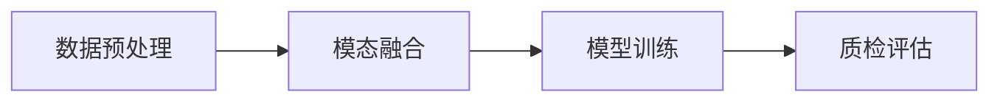

# 多模态大模型：技术原理与实战 语音质检

## 1. 背景介绍
随着人工智能技术的飞速发展，多模态大模型已经成为了研究和应用的热点。在语音质检领域，多模态大模型的应用尤为重要，它能够结合语音、文本和情感等多种信息，提高语音质量的检测精度。本文将深入探讨多模态大模型在语音质检中的技术原理和实战应用。

## 2. 核心概念与联系
多模态大模型涉及到的核心概念包括多模态学习、深度学习、自然语言处理等。多模态学习是指模型能够处理并融合多种类型的数据，如文本、图像和声音。在语音质检中，模型需要理解语音内容，并结合语境和情感信息进行综合判断。

## 3. 核心算法原理具体操作步骤
语音质检的核心算法原理可以分为以下几个步骤：
1. 数据预处理：包括语音信号的降噪、分段和特征提取。
2. 模态融合：将提取的语音特征与文本、情感等其他模态数据进行融合。
3. 模型训练：使用深度学习框架训练多模态模型。
4. 质检评估：模型输出语音质量评分，并进行评估和优化。



## 4. 数学模型和公式详细讲解举例说明
在多模态大模型中，数学模型和公式是理解算法原理的基础。例如，语音信号的特征提取可以使用梅尔频率倒谱系数（MFCC）进行，其数学公式为：

$$
MFCC(t) = \sum_{n=1}^{N} log(S(n)) \cdot cos\left(t \cdot (n - \frac{1}{2})\frac{\pi}{N}\right), \quad t = 1, 2, ..., T
$$

其中，$S(n)$ 是语音信号的功率谱，$N$ 是滤波器组的数量，$T$ 是倒谱系数的数量。

## 5. 项目实践：代码实例和详细解释说明
在项目实践中，我们可以使用Python和TensorFlow等工具进行多模态大模型的构建和训练。以下是一个简单的代码示例，展示了如何使用TensorFlow构建一个多模态语音质检模型：

```python
import tensorflow as tf
from tensorflow.keras.models import Model
from tensorflow.keras.layers import Input, Dense, LSTM, Concatenate

# 语音特征输入
audio_input = Input(shape=(None, feature_dim))
audio_model = LSTM(128)(audio_input)

# 文本特征输入
text_input = Input(shape=(None, word_dim))
text_model = LSTM(128)(text_input)

# 模态融合
merged = Concatenate()([audio_model, text_model])
output = Dense(1, activation='sigmoid')(merged)

# 构建模型
model = Model(inputs=[audio_input, text_input], outputs=output)
model.compile(optimizer='adam', loss='binary_crossentropy', metrics=['accuracy'])

# 模型训练
# model.fit([audio_data, text_data], labels, epochs=10)
```

## 6. 实际应用场景
多模态大模型在语音质检中的应用场景非常广泛，包括客服电话质量监控、智能助手的语音交互质量评估等。通过对语音质量的准确评估，可以大幅提升用户体验和服务质量。

## 7. 工具和资源推荐
在进行多模态大模型的研究和开发时，推荐使用以下工具和资源：
- TensorFlow和PyTorch：两个主流的深度学习框架。
- Hugging Face Transformers：提供了大量预训练模型和工具。
- Librosa：一个用于音频和音乐分析的Python库。

## 8. 总结：未来发展趋势与挑战
多模态大模型的发展前景广阔，但也面临着数据融合、模型泛化能力和计算资源等方面的挑战。未来的研究将更加注重模型的效率和可解释性，以及在不同应用场景下的适应性。

## 9. 附录：常见问题与解答
Q1: 多模态大模型在语音质检中的优势是什么？
A1: 多模态大模型能够综合考虑语音、文本和情感等多种信息，提高语音质量检测的准确性。

Q2: 如何处理不同模态数据的融合问题？
A2: 可以通过设计融合层或使用注意力机制等方法，有效地整合不同模态的数据。

作者：禅与计算机程序设计艺术 / Zen and the Art of Computer Programming