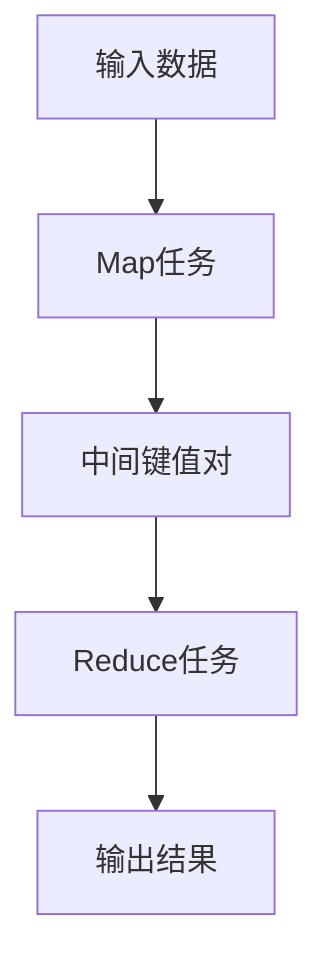
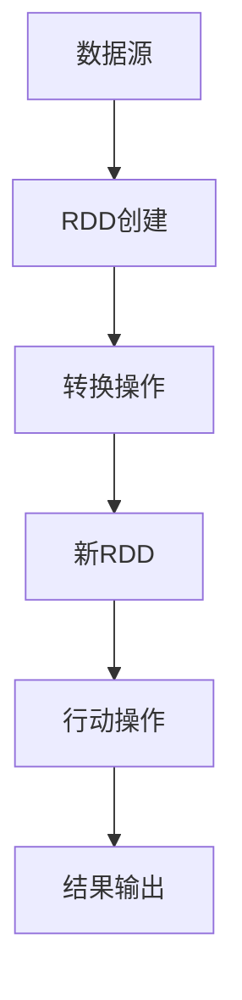
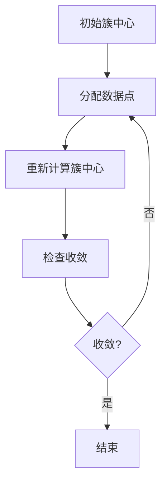

# 大数据分析 原理与代码实例讲解

## 1.背景介绍

大数据分析是现代信息技术的重要组成部分，随着数据量的爆炸性增长，如何有效地存储、处理和分析这些数据成为了一个关键问题。大数据分析不仅仅是对大量数据的处理，更是通过数据挖掘、机器学习等技术，从中提取有价值的信息和知识。本文将深入探讨大数据分析的核心概念、算法原理、数学模型，并通过实际代码实例进行详细讲解，帮助读者更好地理解和应用大数据分析技术。

## 2.核心概念与联系

### 2.1 大数据的定义与特征

大数据通常被定义为具有以下四个特征的数据集合：

- **Volume（数据量）**：数据量巨大，传统的数据处理工具难以应对。
- **Velocity（速度）**：数据生成和处理的速度非常快。
- **Variety（多样性）**：数据类型多样，包括结构化、半结构化和非结构化数据。
- **Veracity（真实性）**：数据的准确性和可靠性需要保证。

### 2.2 大数据分析的基本流程

大数据分析的基本流程通常包括以下几个步骤：

1. **数据采集**：从各种数据源获取数据。
2. **数据存储**：将数据存储在分布式存储系统中。
3. **数据预处理**：对数据进行清洗、转换和归一化处理。
4. **数据分析**：使用统计分析、机器学习等方法对数据进行分析。
5. **结果展示**：通过可视化工具展示分析结果。

### 2.3 大数据分析与传统数据分析的区别

大数据分析与传统数据分析的主要区别在于数据量和处理方法。传统数据分析通常处理的是结构化数据，数据量相对较小，使用的工具和方法也较为简单。而大数据分析则需要处理海量的、复杂的、多样化的数据，通常需要分布式计算和存储技术的支持。

## 3.核心算法原理具体操作步骤

### 3.1 MapReduce算法

MapReduce是一种编程模型，用于处理和生成大规模数据集。它由两个主要步骤组成：Map和Reduce。

#### 3.1.1 Map步骤

在Map步骤中，输入数据被分割成独立的块，并由多个Map任务并行处理。每个Map任务处理一个数据块，并生成一组中间键值对。

#### 3.1.2 Reduce步骤

在Reduce步骤中，中间键值对被合并，所有具有相同键的值被组合在一起，并由Reduce任务处理，生成最终的输出结果。



### 3.2 Spark算法

Spark是一个基于内存的大数据处理框架，提供了比MapReduce更快的处理速度。Spark的核心是弹性分布式数据集（RDD），它是一个不可变的分布式对象集合，可以并行操作。

#### 3.2.1 RDD的创建

RDD可以通过并行化一个已有的集合或从外部存储系统（如HDFS、HBase）中读取数据来创建。

#### 3.2.2 RDD的转换和行动

RDD支持两类操作：转换（Transformation）和行动（Action）。转换操作会生成新的RDD，而行动操作会触发实际的计算。



## 4.数学模型和公式详细讲解举例说明

### 4.1 线性回归模型

线性回归是一种基本的回归分析方法，用于预测因变量与自变量之间的线性关系。其数学模型如下：

$$
y = \beta_0 + \beta_1 x + \epsilon
$$

其中，$y$ 是因变量，$x$ 是自变量，$\beta_0$ 和 $\beta_1$ 是回归系数，$\epsilon$ 是误差项。

#### 4.1.1 最小二乘法

最小二乘法用于估计回归系数，使得预测值与实际值之间的误差平方和最小。其目标函数为：

$$
\min_{\beta_0, \beta_1} \sum_{i=1}^{n} (y_i - (\beta_0 + \beta_1 x_i))^2
$$

### 4.2 K-means聚类算法

K-means是一种常用的聚类算法，用于将数据集划分为 $K$ 个簇。其目标是最小化簇内数据点到簇中心的距离平方和。

#### 4.2.1 算法步骤

1. 随机选择 $K$ 个初始簇中心。
2. 将每个数据点分配到最近的簇中心。
3. 重新计算每个簇的中心。
4. 重复步骤2和3，直到簇中心不再变化。



## 5.项目实践：代码实例和详细解释说明

### 5.1 使用MapReduce进行词频统计

以下是一个使用MapReduce进行词频统计的示例代码：

```python
from mrjob.job import MRJob

class MRWordCount(MRJob):

    def mapper(self, _, line):
        for word in line.split():
            yield word, 1

    def reducer(self, word, counts):
        yield word, sum(counts)

if __name__ == '__main__':
    MRWordCount.run()
```

#### 5.1.1 代码解释

- **mapper**：将每一行文本分割成单词，并为每个单词生成一个键值对（word, 1）。
- **reducer**：将具有相同键的值相加，得到每个单词的频数。

### 5.2 使用Spark进行数据处理

以下是一个使用Spark进行数据处理的示例代码：

```python
from pyspark import SparkContext

sc = SparkContext("local", "Word Count")

text_file = sc.textFile("hdfs://path/to/textfile")
counts = text_file.flatMap(lambda line: line.split()) \
                  .map(lambda word: (word, 1)) \
                  .reduceByKey(lambda a, b: a + b)

counts.saveAsTextFile("hdfs://path/to/output")
```

#### 5.2.1 代码解释

- **textFile**：从HDFS中读取文本文件。
- **flatMap**：将每一行文本分割成单词。
- **map**：为每个单词生成一个键值对（word, 1）。
- **reduceByKey**：将具有相同键的值相加，得到每个单词的频数。
- **saveAsTextFile**：将结果保存到HDFS中。

## 6.实际应用场景

### 6.1 电商推荐系统

大数据分析在电商推荐系统中有广泛应用。通过分析用户的浏览、购买历史，可以为用户推荐个性化的商品，提高用户满意度和销售额。

### 6.2 金融风险控制

在金融领域，大数据分析可以用于风险控制。通过分析用户的交易记录、信用评分等数据，可以预测用户的违约风险，帮助金融机构做出更好的决策。

### 6.3 医疗健康

大数据分析在医疗健康领域也有重要应用。通过分析患者的病历、基因数据等，可以发现疾病的潜在风险因素，提供个性化的治疗方案。

## 7.工具和资源推荐

### 7.1 Hadoop

Hadoop是一个开源的分布式计算框架，提供了HDFS和MapReduce两个核心组件，用于大规模数据存储和处理。

### 7.2 Spark

Spark是一个基于内存的大数据处理框架，提供了比MapReduce更快的处理速度，支持多种数据源和多种编程语言。

### 7.3 Jupyter Notebook

Jupyter Notebook是一个交互式的计算环境，支持多种编程语言，适合用于数据分析和可视化。

### 7.4 数据集

- **Kaggle**：提供了大量的公开数据集，适合用于大数据分析的学习和实践。
- **UCI Machine Learning Repository**：一个著名的机器学习数据集库，包含了各种类型的数据集。

## 8.总结：未来发展趋势与挑战

大数据分析技术在不断发展，未来将会有更多的应用场景和技术创新。以下是一些未来的发展趋势和挑战：

### 8.1 人工智能与大数据的结合

人工智能技术的发展将进一步推动大数据分析的应用。通过结合机器学习、深度学习等技术，可以从大数据中提取更有价值的信息。

### 8.2 数据隐私与安全

随着数据量的增加，数据隐私和安全问题也变得越来越重要。如何在保证数据隐私的前提下进行大数据分析，是一个重要的研究方向。

### 8.3 实时数据分析

实时数据分析是大数据分析的一个重要发展方向。通过实时处理和分析数据，可以更快地做出决策，提高业务效率。

## 9.附录：常见问题与解答

### 9.1 大数据分析需要哪些基础知识？

大数据分析需要掌握以下基础知识：

- **编程语言**：如Python、Java、Scala等。
- **数据结构与算法**：了解基本的数据结构和算法。
- **统计学**：掌握基本的统计分析方法。
- **数据库**：了解关系型数据库和NoSQL数据库的基本原理。

### 9.2 如何选择合适的大数据处理框架？

选择大数据处理框架时，可以考虑以下因素：

- **数据量**：如果数据量非常大，可以选择Hadoop或Spark。
- **处理速度**：如果需要快速处理数据，可以选择Spark。
- **编程语言**：根据自己熟悉的编程语言选择合适的框架。

### 9.3 大数据分析的常见挑战有哪些？

大数据分析的常见挑战包括：

- **数据质量**：数据可能存在噪声、缺失值等问题，需要进行预处理。
- **数据隐私**：需要保证数据的隐私和安全。
- **计算资源**：大数据分析需要大量的计算资源，可能需要使用分布式计算框架。

---

作者：禅与计算机程序设计艺术 / Zen and the Art of Computer Programming