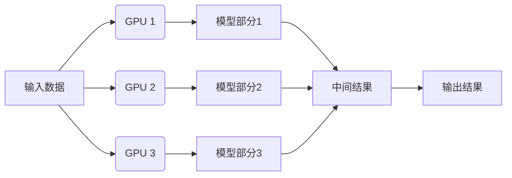
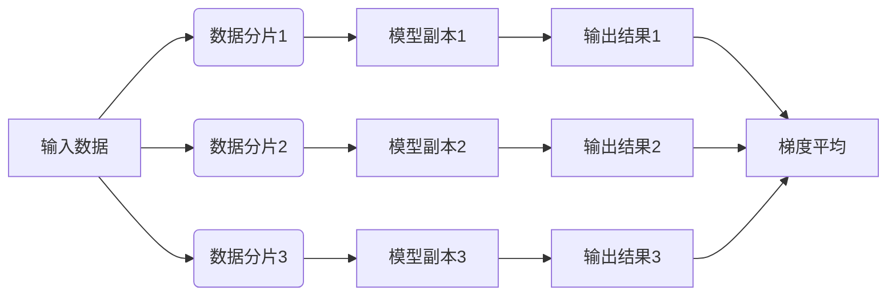
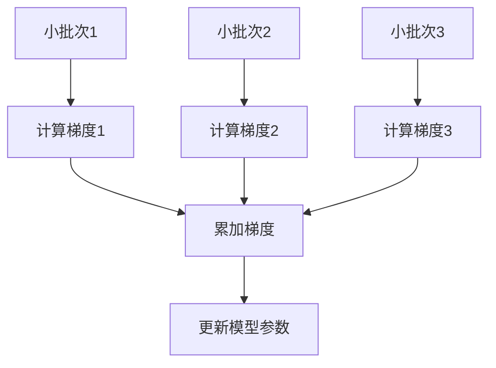

# 大规模语言模型从理论到实践 DeepSpeed-Chat SFT实践

## 1.背景介绍

### 1.1 人工智能的崛起

人工智能(Artificial Intelligence, AI)是当代科技发展的核心驱动力,其中以大规模语言模型(Large Language Model, LLM)为代表的自然语言处理(Natural Language Processing, NLP)技术正在引领着人工智能的新浪潮。近年来,随着算力、数据和算法的飞速发展,大规模语言模型展现出了令人惊叹的能力,在机器翻译、问答系统、文本生成等诸多领域取得了突破性进展。

### 1.2 大规模语言模型的挑战

然而,训练大规模语言模型面临着巨大的算力和存储需求,这对硬件资源提出了极高的要求。以GPT-3为例,它拥有1750亿个参数,在训练过程中需要消耗大量的计算资源,这对于大多数机构和个人来说都是一个不小的挑战。此外,大规模模型的推理也需要大量的计算资源,这限制了它们在终端设备上的应用。

### 1.3 DeepSpeed 介绍

为了应对这一挑战,微软推出了DeepSpeed,这是一个用于加速大规模模型训练和推理的系统。DeepSpeed通过多种优化技术,如模型并行化、数据并行化、梯度累积等,显著降低了训练和推理所需的资源,使得训练大规模模型成为可能。DeepSpeed已被广泛应用于自然语言处理、计算机视觉等多个领域。

## 2.核心概念与联系

### 2.1 模型并行化

模型并行化(Model Parallelism)是DeepSpeed的核心概念之一。由于大规模语言模型通常包含数十亿甚至上千亿个参数,单个GPU无法存储整个模型。模型并行化将模型分割为多个部分,每个部分分配给不同的GPU,从而实现了跨多个GPU的模型分布式训练和推理。



### 2.2 数据并行化

数据并行化(Data Parallelism)是另一种常见的并行化策略。在数据并行化中,每个GPU存储完整的模型副本,但只处理一部分输入数据。在前向传播过程中,每个GPU计算自己的数据批次,然后在反向传播时,梯度会在所有GPU之间进行平均。



### 2.3 梯度累积

梯度累积(Gradient Accumulation)是一种优化技术,它可以减少GPU内存需求,从而支持更大的批量大小。在梯度累积中,模型会在多个小批次上计算梯度,然后将这些梯度累加起来,最后一次性更新模型参数。这种方式可以有效地模拟大批量训练,同时降低内存占用。



### 2.4 ZeRO优化

ZeRO(Zero Redundancy Optimizer)是DeepSpeed提出的一种优化策略,旨在最大限度地减少内存占用和通信开销。ZeRO包括三种优化方式:

1. **ZeRO-DP**:通过减少模型副本的数量,降低内存需求。
2. **ZeRO-Offload**:将模型参数和优化器状态从GPU卸载到主机内存,从而节省GPU内存。
3. **ZeRO-Infinity**:结合模型并行化和ZeRO-DP,实现无限大模型的训练。

通过这些优化,DeepSpeed可以在有限的硬件资源上训练和推理大规模模型。

## 3.核心算法原理具体操作步骤

### 3.1 DeepSpeed安装和配置

DeepSpeed可以通过Python包管理器pip轻松安装:

```bash
pip install deepspeed
```

安装完成后,需要配置DeepSpeed的相关参数。DeepSpeed提供了一个JSON配置文件,用于指定优化策略、模型并行化、数据并行化等设置。下面是一个示例配置文件:

```json
{
    "zero_optimization": {
        "stage": 2,
        "contiguous_gradients": true,
        "overlap_comm": true,
        "reduce_bucket_size": 5e8,
        "reduce_buffer_size": 1e9
    },
    "gradient_compression": true,
    "gradient_clipping": 1.0,
    "fp16": {
        "enabled": true,
        "loss_scale": 0,
        "initial_scale_power": 16
    },
    "optimizer": {
        "type": "Adam",
        "params": {
            "lr": 1e-4,
            "betas": [0.9, 0.999],
            "eps": 1e-8,
            "weight_decay": 3e-7
        }
    },
    "scheduler": {
        "type": "WarmupLR",
        "params": {
            "warmup_min_lr": 0,
            "warmup_max_lr": 1e-4,
            "warmup_num_steps": 1000
        }
    }
}
```

### 3.2 模型并行化实现

DeepSpeed支持多种模型并行化策略,包括张量并行化(Tensor Parallelism)、管道并行化(Pipeline Parallelism)和序列并行化(Sequence Parallelism)。下面以张量并行化为例,介绍模型并行化的具体实现步骤。

1. **导入必要的模块**

```python
import torch
import deepspeed

from transformers import GPT2LMHeadModel
```

2. **定义模型**

```python
model = GPT2LMHeadModel.from_pretrained('gpt2')
```

3. **初始化DeepSpeed引擎**

```python
ds_engine = deepspeed.initialize(
    model=model,
    model_parallel_size=2,  # 设置模型并行化的GPU数量
    config=config  # 加载DeepSpeed配置文件
)
```

4. **模型前向传播和反向传播**

```python
for batch in data_loader:
    outputs = ds_engine.module(batch)
    loss = outputs.loss
    ds_engine.backward(loss)
    ds_engine.step()
```

在上述代码中,`ds_engine.module`返回一个包装过的模型,它会自动处理模型并行化的细节。在前向传播和反向传播过程中,DeepSpeed会自动分割和合并张量,实现跨GPU的并行计算。

### 3.3 数据并行化实现

数据并行化的实现相对简单,只需在初始化DeepSpeed引擎时指定`data_parallel_size`参数即可。

```python
ds_engine = deepspeed.initialize(
    model=model,
    data_parallel_size=4,  # 设置数据并行化的GPU数量
    config=config
)
```

在训练过程中,DeepSpeed会自动将输入数据分割为多个批次,并在不同的GPU上进行并行计算。在反向传播阶段,梯度会在所有GPU之间进行平均。

### 3.4 梯度累积实现

梯度累积可以通过DeepSpeed的`gradient_accumulation_steps`参数来设置。

```python
ds_engine = deepspeed.initialize(
    model=model,
    gradient_accumulation_steps=4,  # 设置梯度累积步数
    config=config
)
```

在训练过程中,DeepSpeed会累积指定步数的梯度,然后一次性更新模型参数。这种方式可以有效地模拟大批量训练,同时降低内存占用。

### 3.5 ZeRO优化实现

ZeRO优化可以通过DeepSpeed的`zero_optimization`参数来启用。

```python
ds_engine = deepspeed.initialize(
    model=model,
    zero_optimization=True,  # 启用ZeRO优化
    config=config
)
```

在初始化DeepSpeed引擎时,可以指定ZeRO优化的具体策略,如`stage`参数控制ZeRO优化的级别。DeepSpeed会自动管理模型参数和优化器状态的内存分配,实现高效的内存利用。

## 4.数学模型和公式详细讲解举例说明

### 4.1 Transformer模型

大规模语言模型通常采用Transformer架构,它是一种基于自注意力机制(Self-Attention)的序列到序列模型。Transformer模型的核心组件包括编码器(Encoder)和解码器(Decoder),它们都由多个相同的层组成。

每个编码器层由两个子层构成:多头自注意力机制(Multi-Head Attention)和前馈神经网络(Feed-Forward Neural Network)。多头自注意力机制用于捕获输入序列中的长程依赖关系,而前馈神经网络则对每个位置的表示进行非线性转换。

解码器层除了包含上述两个子层外,还引入了一个额外的多头注意力子层,用于关注输入序列的表示。

#### 4.1.1 缩放点积注意力

缩放点积注意力(Scaled Dot-Product Attention)是Transformer模型中的核心计算单元,它计算查询(Query)和键(Key)之间的相似性,并根据相似性分配值(Value)的权重。具体计算公式如下:

$$\text{Attention}(Q, K, V) = \text{softmax}\left(\frac{QK^T}{\sqrt{d_k}}\right)V$$

其中,$$Q$$、$$K$$和$$V$$分别表示查询、键和值,$$d_k$$是缩放因子,用于防止内积过大导致梯度消失或爆炸。

#### 4.1.2 多头注意力机制

多头注意力机制(Multi-Head Attention)是将多个独立的注意力计算结果进行拼接,从而捕获不同的子空间表示。具体计算公式如下:

$$\text{MultiHead}(Q, K, V) = \text{Concat}(head_1, \dots, head_h)W^O$$
$$\text{where } head_i = \text{Attention}(QW_i^Q, KW_i^K, VW_i^V)$$

其中,$$W_i^Q$$、$$W_i^K$$和$$W_i^V$$是可学习的线性投影矩阵,$$W^O$$是另一个可学习的线性投影矩阵,用于将多个头的结果拼接后映射回原始空间。

#### 4.1.3 前馈神经网络

前馈神经网络(Feed-Forward Neural Network)是Transformer模型中的另一个重要组件,它对每个位置的表示进行非线性转换。具体计算公式如下:

$$\text{FFN}(x) = \max(0, xW_1 + b_1)W_2 + b_2$$

其中,$$W_1$$和$$W_2$$是可学习的权重矩阵,$$b_1$$和$$b_2$$是可学习的偏置向量,$$\max(0, \cdot)$$是ReLU激活函数。

### 4.2 优化器和学习率调度

在训练大规模语言模型时,优化器和学习率调度策略也扮演着重要的角色。DeepSpeed支持多种优化器和学习率调度策略,如Adam、AdamW、LAMB等优化器,以及线性warmup、余弦退火等学习率调度策略。

#### 4.2.1 Adam优化器

Adam(Adaptive Moment Estimation)是一种常用的优化算法,它结合了动量(Momentum)和RMSProp的优点,可以自适应地调整每个参数的学习率。Adam优化器的更新规则如下:

$$m_t = \beta_1 m_{t-1} + (1 - \beta_1)g_t$$
$$v_t = \beta_2 v_{t-1} + (1 - \beta_2)g_t^2$$
$$\hat{m}_t = \frac{m_t}{1 - \beta_1^t}$$
$$\hat{v}_t = \frac{v_t}{1 - \beta_2^t}$$
$$\theta_{t+1} = \theta_t - \frac{\eta}{\sqrt{\hat{v}_t} + \epsilon}\hat{m}_t$$

其中,$$m_t$$和$$v_t$$分别是动量和平方梯度的指数加权移动平均值,$$\beta_1$$和$$\beta_2$$是相应的衰减率,$$\hat{m}_t$$和$$\