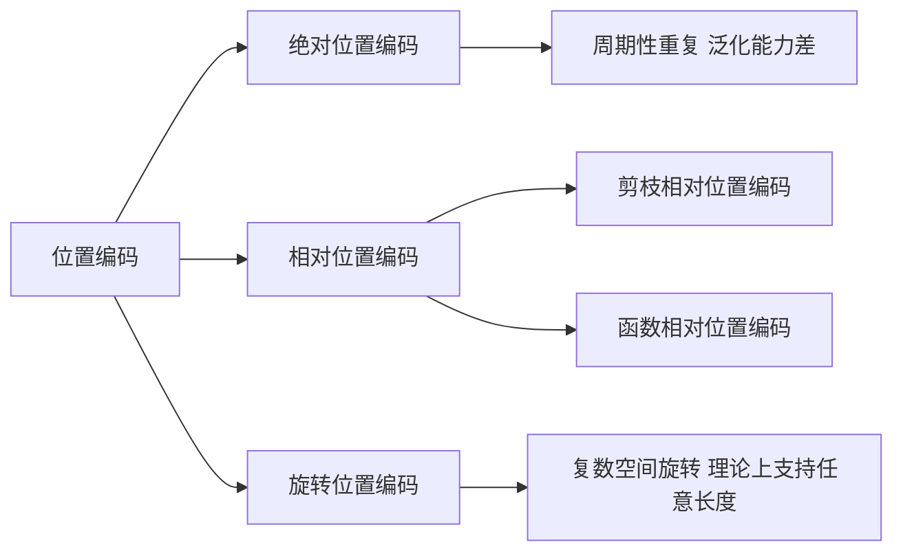

# 大规模语言模型从理论到实践 具有外推能力的位置编码

## 1. 背景介绍

近年来,大规模语言模型(Large Language Models,LLMs)在自然语言处理(Natural Language Processing, NLP)领域取得了巨大的成功。这些模型通过在海量文本语料上进行预训练,学习到了丰富的语言知识和强大的语言理解与生成能力。从GPT、BERT到最新的GPT-3、PaLM等模型,LLMs不断刷新着NLP领域的性能上限。

然而,尽管LLMs展现出了非凡的能力,但它们在处理一些需要外推(extrapolation)的任务时,如超长文本建模、少样本学习等,仍然面临着挑战。这主要是因为现有的LLMs大多采用绝对位置编码(absolute positional encoding)的方式来对输入序列中的位置信息进行建模,这种方式在面对未见过的更长序列时,泛化能力有限。

为了克服这一局限性,研究者们提出了多种具有外推能力的位置编码方法。本文将重点介绍其中最具代表性的几种方法,包括相对位置编码(relative positional encoding)、旋转位置编码(rotary positional encoding)等,探讨它们的原理、优势以及在LLMs中的应用。同时,本文还将讨论这些位置编码方法在实践中的效果,以及未来的研究方向。

## 2. 核心概念与联系

在深入探讨具有外推能力的位置编码方法之前,我们首先需要了解一些核心概念:

### 2.1 绝对位置编码

传统的Transformer模型采用绝对位置编码的方式,即为每个位置学习一个唯一的位置向量,并将其与词嵌入相加作为输入。形式化地,对于位置 $i$,其位置编码 $PE_i$ 为:

$$
PE_{i,2j} = sin(i/10000^{2j/d})
$$
$$  
PE_{i,2j+1} = cos(i/10000^{2j/d})
$$

其中 $d$ 为词嵌入维度,$j=0,1,...,d/2-1$。

这种方式的局限性在于,模型只能处理训练时见过的序列长度,对于更长的序列,位置编码可能出现周期性重复,影响建模效果。

### 2.2 相对位置编码 

相对位置编码不直接为每个绝对位置分配编码向量,而是考虑词之间的相对位置关系。常见的相对位置编码有:

- 基于剪枝的相对位置编码:只为一个固定窗口内的相对位置分配编码向量
- 基于函数的相对位置编码:用函数(如正弦函数)生成相对位置的编码向量

相对位置编码能够更好地外推到未见过的序列长度,但在计算复杂度和内存消耗上有一定代价。

### 2.3 旋转位置编码

旋转位置编码利用复数空间中的旋转操作来编码位置信息。对于位置 $i$,其旋转位置编码 $RoPE_i$ 为:

$$
RoPE_i = [e^{i\theta_0}, e^{i\theta_1}, ..., e^{i\theta_{d-1}}]
$$

其中 $\theta_j = i/10000^{j/d}, j=0,1,...,d-1$。将词嵌入与 $RoPE_i$ 进行元素级乘法,即可得到具有位置信息的输入表示。

旋转位置编码能够在理论上实现任意长度的序列建模,且计算高效。

### 核心概念之间的联系

下图展示了几种位置编码方法之间的联系与区别:



## 3. 核心算法原理具体操作步骤

下面以旋转位置编码(RoPE)为例,详细介绍其核心算法原理和具体操作步骤。

### 3.1 RoPE编码

对于位置 $i$,RoPE编码 $RoPE_i$ 的生成步骤如下:

1. 设词嵌入维度为 $d$,生成一个 $d$ 维的角度向量 $\theta$:
   $$
   \theta_j = 1/10000^{j/d}, j=0,1,...,d-1
   $$

2. 将位置 $i$ 与角度向量 $\theta$ 进行点积,得到旋转角度 $\phi_i$:
   $$
   \phi_i = i \cdot \theta
   $$

3. 根据欧拉公式 $e^{ix}=cos(x)+isin(x)$,生成RoPE编码 $RoPE_i$:
   $$
   RoPE_i = [e^{i\phi_{i,0}}, e^{i\phi_{i,1}}, ..., e^{i\phi_{i,d-1}}]
   $$
   其中 $\phi_{i,j}$ 表示 $\phi_i$ 的第 $j$ 个元素。

### 3.2 嵌入旋转

将词嵌入 $E_i$ 与 $RoPE_i$ 进行元素级乘法,得到具有位置信息的输入表示 $X_i$:

$$
X_i = E_i \odot RoPE_i
$$

其中 $\odot$ 表示元素级乘法。

### 3.3 注意力计算

在Transformer的注意力计算中,使用 $X_i$ 替代原始的词嵌入 $E_i$,即可引入RoPE位置编码:

$$
Attention(Q,K,V) = softmax(\frac{QK^T}{\sqrt{d_k}})V
$$

其中 $Q,K,V$ 分别为查询、键、值矩阵,由 $X_i$ 计算得到。

## 4. 数学模型和公式详细讲解举例说明

本节将详细讲解RoPE中涉及的数学模型和公式,并给出具体的例子。

### 4.1 复数运算

RoPE利用了复数空间中的旋转操作。复数 $z$ 可以表示为 $z=a+bi$,其中 $a$ 为实部,$b$ 为虚部,$i$ 为虚数单位,满足 $i^2=-1$。

复数乘法遵循以下法则:

$$
(a+bi)(c+di) = (ac-bd) + (ad+bc)i
$$

复数 $z=a+bi$ 的模为 $|z|=\sqrt{a^2+b^2}$,辐角为 $arg(z)=atan2(b,a)$。

欧拉公式建立了复数与三角函数的联系:

$$
e^{ix} = cos(x) + isin(x)
$$

### 4.2 RoPE数值示例

假设词嵌入维度 $d=4$,位置 $i=3$,则RoPE编码的计算过程如下:

1. 生成角度向量 $\theta$:
   $$
   \theta = [1, 1/10000^{1/4}, 1/10000^{2/4}, 1/10000^{3/4}]
   $$

2. 计算旋转角度 $\phi_i$:
   $$
   \phi_3 = 3 \cdot \theta = [3, 3/10000^{1/4}, 3/10000^{2/4}, 3/10000^{3/4}]
   $$

3. 生成RoPE编码 $RoPE_3$:
   $$
   RoPE_3 = [e^{i\phi_{3,0}}, e^{i\phi_{3,1}}, e^{i\phi_{3,2}}, e^{i\phi_{3,3}}]
   $$
   展开得:
   $$
   RoPE_3 = [cos(\phi_{3,0})+isin(\phi_{3,0}), cos(\phi_{3,1})+isin(\phi_{3,1}), 
             cos(\phi_{3,2})+isin(\phi_{3,2}), cos(\phi_{3,3})+isin(\phi_{3,3})]
   $$

假设词嵌入 $E_3=[1,2,3,4]$,则嵌入旋转后的输入表示为:

$$
X_3 = E_3 \odot RoPE_3 = [1(cos(\phi_{3,0})+isin(\phi_{3,0})), 2(cos(\phi_{3,1})+isin(\phi_{3,1})),
                          3(cos(\phi_{3,2})+isin(\phi_{3,2})), 4(cos(\phi_{3,3})+isin(\phi_{3,3}))]
$$

## 5. 项目实践代码实例和详细解释说明

下面给出了在PyTorch中实现RoPE位置编码的示例代码:

```python
import torch
import torch.nn as nn

class RoPEPositionalEncoding(nn.Module):
    def __init__(self, d_model, max_len=1024):
        super().__init__()
        self.d_model = d_model
        self.max_len = max_len
        
        # 生成角度向量
        angles = 1. / torch.pow(10000., torch.arange(0., d_model, 2.) / d_model)
        self.register_buffer('angles', angles)
        
    def forward(self, x):
        # x: (batch_size, seq_len, d_model)
        seq_len = x.size(1)
        assert seq_len <= self.max_len, "Sequence length exceeds maximum length"
        
        # 生成位置索引
        pos = torch.arange(seq_len, dtype=torch.float, device=x.device).unsqueeze(1)
        
        # 计算旋转角度
        phi = pos * self.angles
        
        # 生成RoPE编码
        cos_pos = torch.cos(phi)
        sin_pos = torch.sin(phi)
        rope = torch.stack([cos_pos, sin_pos], dim=-1).flatten(-2, -1)
        
        # 嵌入旋转
        x_rope = x * rope
        
        return x_rope
```

代码解释:

1. 初始化时,根据词嵌入维度 `d_model` 生成角度向量 `angles`,用于后续计算旋转角度。

2. 在前向传播时,首先检查输入序列长度是否超过预设的最大长度 `max_len`。

3. 生成位置索引 `pos`,形状为 `(seq_len, 1)`。

4. 将位置索引 `pos` 与角度向量 `angles` 点积,得到旋转角度 `phi`,形状为 `(seq_len, d_model/2)`。

5. 根据欧拉公式,计算 `cos_pos` 和 `sin_pos`,并将它们拼接成 `rope`,形状为 `(seq_len, d_model)`。

6. 将输入 `x` 与 `rope` 进行元素级乘法,得到具有位置信息的输入表示 `x_rope`。

使用示例:

```python
d_model = 512
max_len = 1024
rope_pe = RoPEPositionalEncoding(d_model, max_len)

batch_size = 16
seq_len = 128
x = torch.randn(batch_size, seq_len, d_model)

x_rope = rope_pe(x)
```

以上代码实现了RoPE位置编码,并展示了如何将其应用于输入序列。

## 6. 实际应用场景

RoPE位置编码在多个NLP任务中得到了广泛应用,下面列举几个典型的应用场景:

### 6.1 语言建模

在语言建模任务中,模型需要根据前面的词预测下一个词。将RoPE编码引入Transformer语言模型,可以提升模型对长距离依赖的建模能力,生成更连贯、语义更丰富的文本。

### 6.2 机器翻译

机器翻译任务需要将源语言序列转换为目标语言序列。传统的Transformer模型在处理长序列时,由于绝对位置编码的限制,性能会有所下降。使用RoPE编码可以缓解这一问题,提高模型对长序列的翻译质量。

### 6.3 文本摘要

文本摘要任务需要将长文档压缩成简短的摘要,这对模型的长文本理解和生成能力提出了较高要求。基于RoPE编码的Transformer模型能够更好地捕捉文档的全局信息,生成更准确、连贯的摘要。

### 6.4 对话系统

在对话系统中,模型需要根据对话历史生成恰当的回复。RoPE编码可以帮助模型更好地理解对话上下文,捕捉说话者之间的交互模式,生成更自然、连贯的对话响应。

## 7. 工具和资源推荐

以下是一些实现和应用RoPE位置编码的常用工具和资源:

1. PyTorch (https://pytorch.org/): PyTorch是一个流行的深度学习框架,提供了