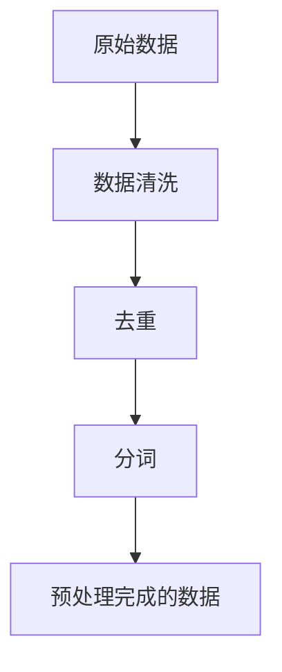
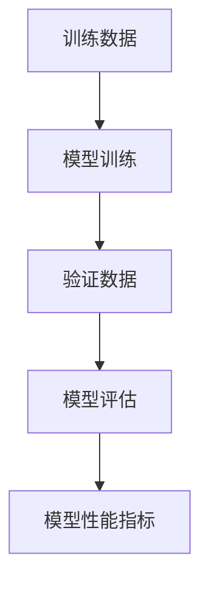

# 大规模语言模型从理论到实践 开源指令数据集

## 1.背景介绍

大规模语言模型（Large Language Models, LLMs）近年来在自然语言处理（NLP）领域取得了显著的进展。诸如GPT-3、BERT等模型在各种任务中表现出色，从文本生成到翻译，再到问答系统，几乎无所不能。这些模型的成功离不开庞大的训练数据集和复杂的算法架构。然而，如何有效地构建和利用开源指令数据集，仍然是一个值得深入探讨的话题。

## 2.核心概念与联系

### 2.1 大规模语言模型

大规模语言模型是基于深度学习的模型，通常包含数十亿甚至上千亿个参数。它们通过大量的文本数据进行训练，能够理解和生成自然语言。

### 2.2 指令数据集

指令数据集是专门为训练语言模型而设计的数据集，包含各种任务的指令和相应的输出。这些数据集可以帮助模型更好地理解和执行特定任务。

### 2.3 开源数据集

开源数据集是指公开可用的数据集，任何人都可以访问和使用。这些数据集通常由研究机构、公司或社区贡献，旨在促进科学研究和技术进步。

## 3.核心算法原理具体操作步骤

### 3.1 数据预处理

数据预处理是构建指令数据集的第一步。包括数据清洗、去重、分词等操作。



### 3.2 模型训练

模型训练是指使用预处理后的数据集对语言模型进行训练。通常包括以下步骤：

1. 数据加载
2. 模型初始化
3. 损失函数定义
4. 训练循环

### 3.3 模型评估

模型评估是指在训练完成后，使用验证集对模型进行评估，以确定其性能。



## 4.数学模型和公式详细讲解举例说明

### 4.1 语言模型的数学基础

语言模型的核心是概率论和统计学。给定一个词序列 $w_1, w_2, ..., w_n$，语言模型的目标是计算这个序列的概率：

$$
P(w_1, w_2, ..., w_n) = \prod_{i=1}^{n} P(w_i | w_1, w_2, ..., w_{i-1})
$$

### 4.2 损失函数

常用的损失函数是交叉熵损失（Cross-Entropy Loss），其定义为：

$$
L = -\sum_{i=1}^{N} y_i \log(\hat{y}_i)
$$

其中，$y_i$ 是真实标签，$\hat{y}_i$ 是预测概率。

### 4.3 优化算法

常用的优化算法包括随机梯度下降（SGD）、Adam等。以Adam为例，其更新规则为：

$$
m_t = \beta_1 m_{t-1} + (1 - \beta_1) g_t
$$

$$
v_t = \beta_2 v_{t-1} + (1 - \beta_2) g_t^2
$$

$$
\hat{m}_t = \frac{m_t}{1 - \beta_1^t}
$$

$$
\hat{v}_t = \frac{v_t}{1 - \beta_2^t}
$$

$$
\theta_t = \theta_{t-1} - \alpha \frac{\hat{m}_t}{\sqrt{\hat{v}_t} + \epsilon}
$$

## 5.项目实践：代码实例和详细解释说明

### 5.1 数据预处理代码示例

```python
import re
import nltk
from nltk.corpus import stopwords

# 下载停用词
nltk.download('stopwords')

def preprocess_text(text):
    # 转换为小写
    text = text.lower()
    # 移除标点符号
    text = re.sub(r'[^\w\s]', '', text)
    # 移除停用词
    stop_words = set(stopwords.words('english'))
    text = ' '.join([word for word in text.split() if word not in stop_words])
    return text

# 示例文本
sample_text = "This is a sample text for preprocessing."
print(preprocess_text(sample_text))
```

### 5.2 模型训练代码示例

```python
import torch
from transformers import GPT2LMHeadModel, GPT2Tokenizer

# 加载预训练模型和分词器
model_name = 'gpt2'
model = GPT2LMHeadModel.from_pretrained(model_name)
tokenizer = GPT2Tokenizer.from_pretrained(model_name)

# 示例输入
input_text = "Once upon a time"
input_ids = tokenizer.encode(input_text, return_tensors='pt')

# 模型推理
outputs = model.generate(input_ids, max_length=50, num_return_sequences=1)
print(tokenizer.decode(outputs[0], skip_special_tokens=True))
```

### 5.3 模型评估代码示例

```python
from sklearn.metrics import accuracy_score

# 示例真实标签和预测标签
true_labels = [1, 0, 1, 1, 0]
pred_labels = [1, 0, 0, 1, 0]

# 计算准确率
accuracy = accuracy_score(true_labels, pred_labels)
print(f"Accuracy: {accuracy}")
```

## 6.实际应用场景

### 6.1 文本生成

大规模语言模型可以用于生成高质量的文本内容，如新闻报道、小说等。

### 6.2 机器翻译

通过训练多语言数据集，语言模型可以实现高精度的机器翻译。

### 6.3 问答系统

语言模型可以用于构建智能问答系统，提供准确的答案。

### 6.4 情感分析

通过分析文本内容，语言模型可以判断文本的情感倾向。

## 7.工具和资源推荐

### 7.1 开源数据集

- [OpenAI GPT-3](https://openai.com/gpt-3/)
- [Google BERT](https://github.com/google-research/bert)

### 7.2 开源工具

- [Hugging Face Transformers](https://github.com/huggingface/transformers)
- [TensorFlow](https://www.tensorflow.org/)
- [PyTorch](https://pytorch.org/)

### 7.3 在线资源

- [Kaggle](https://www.kaggle.com/)
- [UCI Machine Learning Repository](https://archive.ics.uci.edu/ml/index.php)

## 8.总结：未来发展趋势与挑战

### 8.1 未来发展趋势

大规模语言模型的未来发展趋势包括更高效的模型架构、更大规模的数据集以及更广泛的应用场景。随着计算资源的不断提升，语言模型的性能将进一步提高。

### 8.2 挑战

尽管大规模语言模型在许多任务中表现出色，但仍然面临一些挑战，如数据隐私、模型偏见和高计算成本等。这些问题需要在未来的研究中得到解决。

## 9.附录：常见问题与解答

### 9.1 如何选择合适的数据集？

选择数据集时，应考虑数据的质量、规模和多样性。高质量的数据集可以提高模型的性能，而多样性的数据集可以增强模型的泛化能力。

### 9.2 如何处理数据不平衡问题？

可以通过数据增强、重采样等方法来处理数据不平衡问题。例如，使用过采样技术增加少数类样本的数量，或使用欠采样技术减少多数类样本的数量。

### 9.3 如何评估模型的性能？

常用的评估指标包括准确率、精确率、召回率和F1分数等。选择合适的评估指标可以更全面地反映模型的性能。

### 9.4 如何优化模型的训练过程？

可以通过调整学习率、使用正则化技术、增加训练数据等方法来优化模型的训练过程。此外，选择合适的优化算法和超参数也是关键。

---

作者：禅与计算机程序设计艺术 / Zen and the Art of Computer Programming