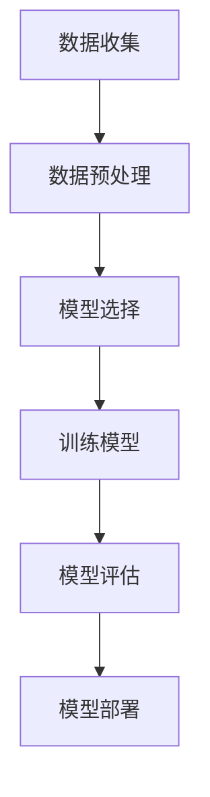
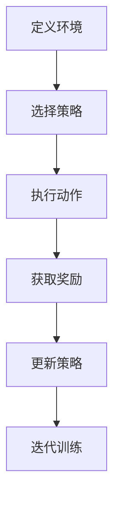

# 大规模语言模型从理论到实践 强化学习与有监督学习的区别

## 1.背景介绍

在人工智能领域，语言模型的研究和应用已经成为一个重要的方向。大规模语言模型（Large Language Models, LLMs）如GPT-3、BERT等，已经在自然语言处理（NLP）任务中取得了显著的成果。这些模型的成功离不开两种主要的学习方法：有监督学习（Supervised Learning）和强化学习（Reinforcement Learning）。本文将深入探讨这两种学习方法的核心概念、算法原理、数学模型、实际应用以及未来发展趋势。

## 2.核心概念与联系

### 2.1 有监督学习

有监督学习是一种机器学习方法，通过使用标注数据来训练模型。模型在训练过程中学习输入数据与输出标签之间的映射关系，从而在新数据上进行预测。

### 2.2 强化学习

强化学习是一种通过与环境交互来学习策略的机器学习方法。智能体（Agent）通过执行动作（Action）获得奖励（Reward），并根据奖励调整策略，以最大化累积奖励。

### 2.3 联系与区别

有监督学习和强化学习在目标和方法上有显著区别。有监督学习依赖于标注数据，而强化学习则通过试错和奖励机制进行学习。两者在大规模语言模型的训练中各有应用场景和优势。

## 3.核心算法原理具体操作步骤

### 3.1 有监督学习的操作步骤

1. **数据收集**：收集并标注训练数据。
2. **数据预处理**：清洗和规范化数据。
3. **模型选择**：选择适合的模型架构，如Transformer。
4. **训练模型**：使用标注数据训练模型，优化损失函数。
5. **模型评估**：使用验证集评估模型性能。
6. **模型部署**：将训练好的模型应用于实际任务。

### 3.2 强化学习的操作步骤

1. **定义环境**：定义智能体与环境的交互规则。
2. **选择策略**：选择初始策略，如随机策略。
3. **执行动作**：智能体在环境中执行动作。
4. **获取奖励**：根据动作获得即时奖励。
5. **更新策略**：根据奖励调整策略，通常使用Q-learning或策略梯度方法。
6. **迭代训练**：重复上述步骤，直到策略收敛。

## 4.数学模型和公式详细讲解举例说明

### 4.1 有监督学习的数学模型

有监督学习的目标是最小化损失函数 $L(\theta)$，其中 $\theta$ 是模型参数。常见的损失函数包括均方误差（MSE）和交叉熵损失（Cross-Entropy Loss）。

$$
L(\theta) = \frac{1}{N} \sum_{i=1}^{N} \ell(y_i, f(x_i; \theta))
$$

其中，$N$ 是样本数量，$y_i$ 是真实标签，$f(x_i; \theta)$ 是模型预测值。

### 4.2 强化学习的数学模型

强化学习的目标是最大化累积奖励 $R_t$，通常使用折扣因子 $\gamma$ 来计算未来奖励的现值。

$$
R_t = \sum_{k=0}^{\infty} \gamma^k r_{t+k}
$$

其中，$r_{t+k}$ 是时间步 $t+k$ 的即时奖励，$\gamma$ 是折扣因子，取值范围为 $0 \leq \gamma \leq 1$。

### 4.3 Mermaid 流程图





## 5.项目实践：代码实例和详细解释说明

### 5.1 有监督学习代码实例

以下是一个使用PyTorch进行有监督学习的示例代码：

```python
import torch
import torch.nn as nn
import torch.optim as optim
from torch.utils.data import DataLoader, TensorDataset

# 数据准备
X = torch.randn(100, 10)
y = torch.randint(0, 2, (100,))

# 数据集和数据加载器
dataset = TensorDataset(X, y)
dataloader = DataLoader(dataset, batch_size=32, shuffle=True)

# 模型定义
class SimpleNN(nn.Module):
    def __init__(self):
        super(SimpleNN, self).__init__()
        self.fc = nn.Linear(10, 2)
    
    def forward(self, x):
        return self.fc(x)

model = SimpleNN()

# 损失函数和优化器
criterion = nn.CrossEntropyLoss()
optimizer = optim.SGD(model.parameters(), lr=0.01)

# 训练过程
for epoch in range(100):
    for inputs, labels in dataloader:
        optimizer.zero_grad()
        outputs = model(inputs)
        loss = criterion(outputs, labels)
        loss.backward()
        optimizer.step()

print("训练完成")
```

### 5.2 强化学习代码实例

以下是一个使用Gym和PyTorch进行强化学习的示例代码：

```python
import gym
import torch
import torch.nn as nn
import torch.optim as optim

# 环境定义
env = gym.make('CartPole-v1')

# 模型定义
class QNetwork(nn.Module):
    def __init__(self):
        super(QNetwork, self).__init__()
        self.fc = nn.Linear(4, 2)
    
    def forward(self, x):
        return self.fc(x)

model = QNetwork()
optimizer = optim.Adam(model.parameters(), lr=0.001)
criterion = nn.MSELoss()

# Q-learning参数
gamma = 0.99
epsilon = 0.1

# 训练过程
for episode in range(1000):
    state = env.reset()
    done = False
    while not done:
        if torch.rand(1).item() < epsilon:
            action = env.action_space.sample()
        else:
            with torch.no_grad():
                action = model(torch.tensor(state, dtype=torch.float32)).argmax().item()
        
        next_state, reward, done, _ = env.step(action)
        target = reward + gamma * model(torch.tensor(next_state, dtype=torch.float32)).max().item() * (1 - done)
        output = model(torch.tensor(state, dtype=torch.float32))[action]
        
        loss = criterion(output, torch.tensor(target))
        optimizer.zero_grad()
        loss.backward()
        optimizer.step()
        
        state = next_state

print("训练完成")
```

## 6.实际应用场景

### 6.1 有监督学习的应用场景

1. **文本分类**：如垃圾邮件检测、情感分析。
2. **机器翻译**：如将一种语言翻译成另一种语言。
3. **图像识别**：如人脸识别、物体检测。

### 6.2 强化学习的应用场景

1. **游戏AI**：如AlphaGo、Dota 2 AI。
2. **机器人控制**：如自动驾驶、机械臂控制。
3. **金融交易**：如股票交易策略优化。

## 7.工具和资源推荐

### 7.1 有监督学习工具

1. **TensorFlow**：谷歌开发的开源机器学习框架。
2. **PyTorch**：Facebook开发的深度学习框架，易于使用和调试。
3. **Scikit-learn**：适用于中小规模数据的机器学习库。

### 7.2 强化学习工具

1. **OpenAI Gym**：一个用于开发和比较强化学习算法的工具包。
2. **Stable Baselines**：基于OpenAI Baselines的强化学习库。
3. **RLlib**：一个用于分布式强化学习的库，基于Ray。

## 8.总结：未来发展趋势与挑战

### 8.1 未来发展趋势

1. **多模态学习**：结合文本、图像、音频等多种数据类型进行学习。
2. **自监督学习**：减少对标注数据的依赖，通过数据自身结构进行学习。
3. **分布式训练**：利用分布式计算资源加速大规模模型的训练。

### 8.2 挑战

1. **数据隐私**：如何在保护用户隐私的前提下使用数据进行训练。
2. **模型解释性**：如何解释和理解复杂模型的决策过程。
3. **计算资源**：大规模模型的训练和推理需要大量计算资源，如何优化资源使用是一个重要问题。

## 9.附录：常见问题与解答

### 9.1 有监督学习常见问题

**Q1**: 如何处理不平衡数据？
**A1**: 可以使用过采样、欠采样、数据增强等方法来处理不平衡数据。

**Q2**: 如何选择合适的模型架构？
**A2**: 根据任务需求和数据特点选择合适的模型架构，如CNN适用于图像数据，RNN适用于序列数据。

### 9.2 强化学习常见问题

**Q1**: 如何处理探索与利用的平衡？
**A1**: 可以使用 $\epsilon$-贪婪策略、UCB（上置信界）等方法来平衡探索与利用。

**Q2**: 如何加速策略收敛？
**A2**: 可以使用经验回放、优先级经验回放、双重Q-learning等方法来加速策略收敛。

---

作者：禅与计算机程序设计艺术 / Zen and the Art of Computer Programming