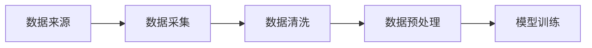

# 大规模语言模型从理论到实践 数据收集

## 1. 背景介绍

随着人工智能技术的飞速发展，大规模语言模型已成为自然语言处理（NLP）领域的重要研究方向。这些模型能够理解、生成和翻译人类语言，广泛应用于机器翻译、情感分析、问答系统等多个场景。然而，构建一个高效、准确的大规模语言模型需要大量的数据作为支撑。本文将深入探讨数据收集的理论基础、实践操作和面临的挑战。

## 2. 核心概念与联系

### 2.1 语言模型简介
语言模型是用于计算一段文本序列出现概率的模型，它是NLP的基石。

### 2.2 数据的重要性
数据是训练语言模型的基础，数据的质量和数量直接影响模型的性能。

### 2.3 数据收集与处理
数据收集包括数据的来源、采集、清洗和预处理等步骤，是模型训练前的关键环节。

## 3. 核心算法原理具体操作步骤

### 3.1 数据来源定位
数据可以来源于公开数据集、网络爬虫、API接口等。

### 3.2 数据采集策略
采集策略需要考虑数据的代表性、多样性和时效性。

### 3.3 数据清洗与预处理
清洗步骤包括去除噪声、标准化和去重，预处理包括分词、词性标注等。



## 4. 数学模型和公式详细讲解举例说明

### 4.1 概率语言模型
概率语言模型通常使用链式法则来计算文本序列的概率。

$$ P(w_1, w_2, ..., w_n) = \prod_{i=1}^{n} P(w_i | w_1, w_2, ..., w_{i-1}) $$

### 4.2 数据平滑技术
平滑技术用于处理稀疏数据，例如加一平滑（Laplace smoothing）。

$$ P_{smooth}(w_i) = \frac{C(w_i) + 1}{N + V} $$

其中，$C(w_i)$ 是单词 $w_i$ 的出现次数，$N$ 是总词数，$V$ 是词汇表大小。

## 5. 项目实践：代码实例和详细解释说明

### 5.1 数据采集代码示例

```python
import requests
from bs4 import BeautifulSoup

# 网络爬虫示例
def fetch_data(url):
    response = requests.get(url)
    soup = BeautifulSoup(response.text, 'html.parser')
    return soup.get_text()

# 数据采集
data = fetch_data('https://example.com')
```

### 5.2 数据预处理代码示例

```python
import nltk
nltk.download('punkt')

# 文本预处理
def preprocess(text):
    sentences = nltk.sent_tokenize(text)
    tokenized_sentences = [nltk.word_tokenize(sentence) for sentence in sentences]
    return tokenized_sentences

# 数据预处理
processed_data = preprocess(data)
```

## 6. 实际应用场景

大规模语言模型在机器翻译、智能客服、内容推荐等多个领域有着广泛的应用。

## 7. 工具和资源推荐

- 数据采集：BeautifulSoup, Scrapy
- 数据预处理：NLTK, SpaCy
- 模型训练：TensorFlow, PyTorch
- 公开数据集：Common Crawl, Wikipedia dumps

## 8. 总结：未来发展趋势与挑战

未来的大规模语言模型将更加注重模型的泛化能力、数据的隐私保护和模型的可解释性。同时，如何高效地处理更大规模的数据集也是一个挑战。

## 9. 附录：常见问题与解答

### Q1: 数据收集是否有法律风险？
A1: 数据收集需要遵守相关法律法规，尤其是隐私保护和版权问题。

### Q2: 如何确保数据的多样性？
A2: 可以通过多渠道采集、确保数据来源的广泛性来提高数据的多样性。

### Q3: 数据预处理的目的是什么？
A3: 数据预处理的目的是提高数据质量，为模型训练提供干净、标准化的数据。

作者：禅与计算机程序设计艺术 / Zen and the Art of Computer Programming