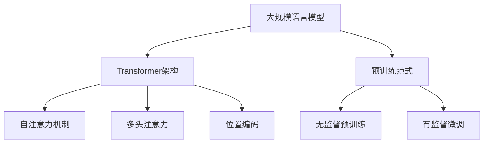

# 大规模语言模型从理论到实践 有监督下游任务微调

## 1. 背景介绍
### 1.1 大规模语言模型的发展历程
#### 1.1.1 早期的统计语言模型
#### 1.1.2 神经网络语言模型的兴起 
#### 1.1.3 Transformer架构的突破

### 1.2 预训练范式的出现
#### 1.2.1 BERT等双向语言模型  
#### 1.2.2 GPT等单向语言模型
#### 1.2.3 预训练范式的优势

### 1.3 大规模语言模型的应用前景
#### 1.3.1 自然语言理解任务 
#### 1.3.2 自然语言生成任务
#### 1.3.3 知识问答与对话系统

## 2. 核心概念与联系
### 2.1 语言模型的基本原理
#### 2.1.1 概率语言模型
#### 2.1.2 最大似然估计
#### 2.1.3 语言模型的评估指标

### 2.2 Transformer架构详解
#### 2.2.1 自注意力机制
#### 2.2.2 多头注意力
#### 2.2.3 位置编码

### 2.3 预训练与微调范式
#### 2.3.1 无监督预训练
#### 2.3.2 有监督微调
#### 2.3.3 预训练目标函数设计

### 2.4 大规模语言模型的特点
#### 2.4.1 参数量巨大
#### 2.4.2 训练数据规模空前
#### 2.4.3 强大的语言理解和生成能力



## 3. 核心算法原理具体操作步骤
### 3.1 Transformer的训练过程
#### 3.1.1 输入表示
#### 3.1.2 编码器
#### 3.1.3 解码器
#### 3.1.4 损失函数与优化

### 3.2 BERT的预训练方法
#### 3.2.1 Masked Language Model(MLM)
#### 3.2.2 Next Sentence Prediction(NSP)
#### 3.2.3 预训练数据构建

### 3.3 GPT的预训练方法 
#### 3.3.1 Language Modeling
#### 3.3.2 预训练数据构建
#### 3.3.3 生成式预训练

### 3.4 下游任务微调流程
#### 3.4.1 下游任务数据准备
#### 3.4.2 模型架构调整
#### 3.4.3 微调训练
#### 3.4.4 超参数选择

## 4. 数学模型和公式详细讲解举例说明
### 4.1 Transformer的数学表示
#### 4.1.1 自注意力机制的数学推导
$Attention(Q,K,V) = softmax(\frac{QK^T}{\sqrt{d_k}})V$
#### 4.1.2 多头注意力的数学表示  
$$MultiHead(Q,K,V) = Concat(head_1,...,head_h)W^O$$
$$head_i = Attention(QW_i^Q, KW_i^K, VW_i^V)$$
#### 4.1.3 前馈神经网络层的数学表示
$FFN(x) = max(0, xW_1 + b_1)W_2 + b_2$

### 4.2 语言模型的概率计算
#### 4.2.1 n-gram语言模型
$P(w_1, w_2, ..., w_m) = \prod_{i=1}^{m} P(w_i | w_{i-(n-1)}, ..., w_{i-1})$
#### 4.2.2 神经网络语言模型
$P(w_1, w_2, ..., w_m) = \prod_{i=1}^{m} P(w_i | w_1, w_2, ..., w_{i-1})$
#### 4.2.3 Transformer语言模型
$P(w_1, w_2, ..., w_m) = \prod_{i=1}^{m} P(w_i | w_1, w_2, ..., w_{i-1}; \theta)$

### 4.3 预训练目标的数学表示
#### 4.3.1 BERT的MLM目标
$\mathcal{L}_{MLM}(\theta) = -\sum_{i=1}^{n} m_i \log P(w_i | \hat{w}_{1:i-1}, \hat{w}_{i+1:n}; \theta)$
#### 4.3.2 BERT的NSP目标
$\mathcal{L}_{NSP}(\theta) = -\sum_{i=1}^{n} y_i \log P(y_i | s_1, s_2; \theta)$
#### 4.3.3 GPT的Language Modeling目标
$\mathcal{L}_{LM}(\theta) = -\sum_{i=1}^{n} \log P(w_i | w_{1:i-1}; \theta)$

## 5. 项目实践：代码实例和详细解释说明
### 5.1 使用Hugging Face的Transformers库
#### 5.1.1 加载预训练模型
```python
from transformers import BertModel, BertTokenizer

model = BertModel.from_pretrained('bert-base-uncased') 
tokenizer = BertTokenizer.from_pretrained('bert-base-uncased')
```
#### 5.1.2 微调下游任务
```python
from transformers import BertForSequenceClassification

model = BertForSequenceClassification.from_pretrained('bert-base-uncased', num_labels=2)
model.train()
```
#### 5.1.3 模型推理
```python
from transformers import pipeline

classifier = pipeline('sentiment-analysis', model=model, tokenizer=tokenizer)
result = classifier('This movie is great!')
print(result)
```

### 5.2 使用PyTorch构建Transformer
#### 5.2.1 定义Transformer模型类
```python
import torch
import torch.nn as nn

class Transformer(nn.Module):
    def __init__(self, ...):
        super().__init__()
        self.encoder = Encoder(...)
        self.decoder = Decoder(...)
    
    def forward(self, src, tgt):
        ...
```
#### 5.2.2 自注意力机制的实现
```python
class MultiHeadAttention(nn.Module):
    def __init__(self, d_model, num_heads):
        super().__init__()
        self.d_model = d_model
        self.num_heads = num_heads
        self.head_dim = d_model // num_heads
        
        self.q_linear = nn.Linear(d_model, d_model)
        self.k_linear = nn.Linear(d_model, d_model) 
        self.v_linear = nn.Linear(d_model, d_model)
        self.out_linear = nn.Linear(d_model, d_model)

    def forward(self, query, key, value, mask=None):
        ...
```
#### 5.2.3 训练Transformer模型
```python
model = Transformer(...)
criterion = nn.CrossEntropyLoss()
optimizer = torch.optim.Adam(model.parameters(), lr=0.0001)

for epoch in range(num_epochs):
    for batch in data_loader:
        src, tgt = batch
        output = model(src, tgt)
        loss = criterion(output, tgt)
        optimizer.zero_grad()
        loss.backward()
        optimizer.step()
```

## 6. 实际应用场景
### 6.1 机器翻译
#### 6.1.1 使用预训练模型进行翻译
#### 6.1.2 构建专门的翻译模型

### 6.2 文本分类
#### 6.2.1 情感分析
#### 6.2.2 主题分类
#### 6.2.3 意图识别

### 6.3 命名实体识别
#### 6.3.1 使用预训练模型进行微调
#### 6.3.2 构建专门的命名实体识别模型

### 6.4 文本摘要
#### 6.4.1 抽取式摘要
#### 6.4.2 生成式摘要

### 6.5 对话系统
#### 6.5.1 基于检索的对话系统
#### 6.5.2 生成式对话系统

## 7. 工具和资源推荐
### 7.1 开源框架和库
#### 7.1.1 Hugging Face的Transformers库
#### 7.1.2 Google的TensorFlow和BERT
#### 7.1.3 Facebook的PyTorch和XLM

### 7.2 预训练模型资源
#### 7.2.1 BERT系列模型
#### 7.2.2 GPT系列模型
#### 7.2.3 XLNet、RoBERTa等模型

### 7.3 数据集资源
#### 7.3.1 GLUE基准测试
#### 7.3.2 SQuAD问答数据集
#### 7.3.3 WMT机器翻译数据集

### 7.4 云平台和工具
#### 7.4.1 Google Colab
#### 7.4.2 Amazon SageMaker
#### 7.4.3 微软Azure ML

## 8. 总结：未来发展趋势与挑战
### 8.1 模型规模的持续增长
#### 8.1.1 参数量突破万亿
#### 8.1.2 计算资源需求激增

### 8.2 多模态语言模型的崛起
#### 8.2.1 文本-图像预训练模型
#### 8.2.2 文本-语音预训练模型
#### 8.2.3 多模态融合与对齐

### 8.3 低资源语言的建模
#### 8.3.1 跨语言迁移学习
#### 8.3.2 无监督机器翻译
#### 8.3.3 少样本学习

### 8.4 预训练范式的创新
#### 8.4.1 对比学习
#### 8.4.2 prompt learning
#### 8.4.3 instruction tuning

### 8.5 语言模型的可解释性和鲁棒性
#### 8.5.1 注意力分析与可视化
#### 8.5.2 对抗训练与鲁棒优化
#### 8.5.3 公平性与去偏

## 9. 附录：常见问题与解答
### 9.1 如何选择合适的预训练模型？
#### 9.1.1 考虑任务类型和数据特点
#### 9.1.2 模型规模与性能的权衡
#### 9.1.3 多模型集成

### 9.2 微调过程中的最佳实践有哪些？
#### 9.2.1 学习率调度策略
#### 9.2.2 正则化技术的运用
#### 9.2.3 对抗训练与数据增强

### 9.3 如何处理低资源语言的建模？
#### 9.3.1 利用多语言预训练模型
#### 9.3.2 数据增强与半监督学习
#### 9.3.3 知识蒸馏与模型压缩

### 9.4 大规模语言模型的部署挑战有哪些？
#### 9.4.1 模型量化与剪枝
#### 9.4.2 模型并行与数据并行
#### 9.4.3 推理加速与优化

### 9.5 如何应对语言模型的偏见和安全问题？
#### 9.5.1 数据去偏与均衡采样
#### 9.5.2 公平性约束与优化目标
#### 9.5.3 人工审核与过滤

作者：禅与计算机程序设计艺术 / Zen and the Art of Computer Programming