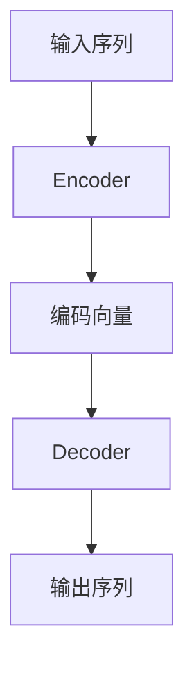
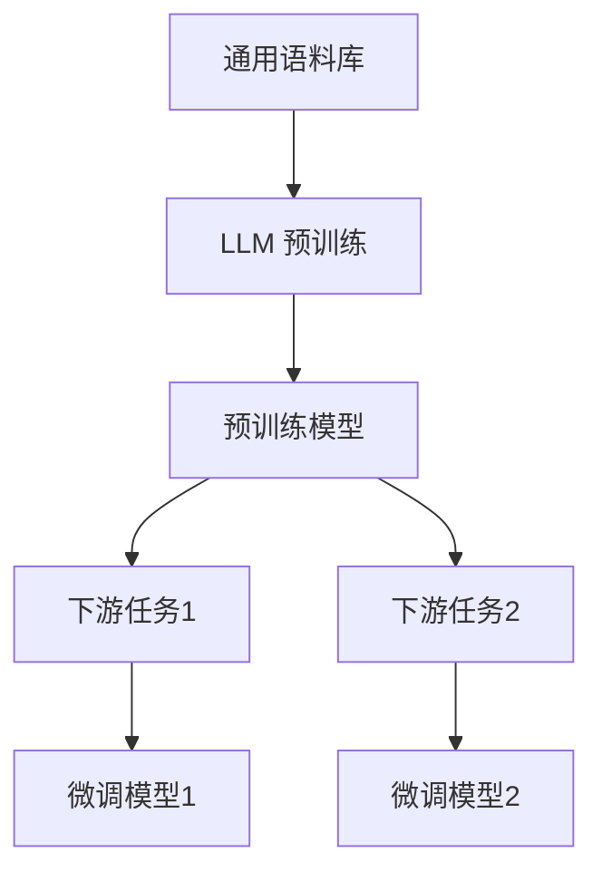
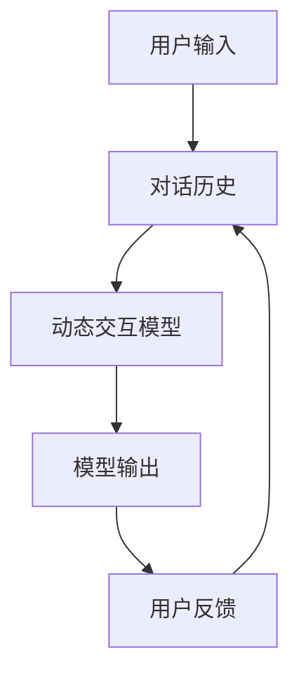
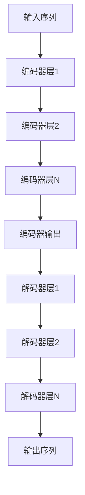

# 大语言模型原理与工程实践：动态交互

## 1.背景介绍

### 1.1 大语言模型的兴起

近年来,大型语言模型(Large Language Models, LLMs)在自然语言处理(NLP)领域取得了令人瞩目的进展。这些模型通过在大规模语料库上进行预训练,学习了丰富的语言知识和上下文信息,展现出惊人的语言生成和理解能力。

LLMs的核心思想是利用自注意力(Self-Attention)机制和transformer架构,捕捉输入序列中单词之间的长程依赖关系,从而更好地建模语言的语义和语法结构。与传统的序列模型(如RNN和LSTM)相比,transformer架构具有更强的并行计算能力,可以更高效地利用GPU和TPU等硬件资源,从而支持训练更大规模的模型。

代表性的大语言模型包括GPT(Generative Pre-trained Transformer)系列、BERT(Bidirectional Encoder Representations from Transformers)、XLNet、RoBERTa等。这些模型在各种自然语言处理任务上表现出色,如机器翻译、文本生成、问答系统、文本摘要等,极大推动了NLP技术的发展。

### 1.2 动态交互的重要性

尽管大语言模型展现出了强大的语言理解和生成能力,但它们在实际应用中仍然面临一些挑战,其中之一就是缺乏动态交互能力。传统的LLMs通常将输入视为一个静态的文本序列,生成相应的输出,而无法根据用户的反馈动态调整输出。这种单向的交互模式限制了模型的灵活性和适应性,难以满足复杂场景下的需求。

为了提升LLMs的实用性和用户体验,赋予它们动态交互的能力变得越来越重要。动态交互可以使模型根据用户的反馈和上下文,持续优化和调整输出,实现更加自然、流畅的对话交互。这不仅有助于提高模型在实际应用中的效果,还能增强用户的信任度和参与度。

本文将探讨大语言模型动态交互的原理和实现方法,包括模型架构、训练策略、评估指标等,并介绍相关的工程实践和应用场景。我们将深入分析动态交互对于提升LLMs性能和用户体验的重要意义,以及未来在该领域的发展趋势和挑战。

## 2.核心概念与联系

### 2.1 序列到序列模型

大语言模型的核心是将自然语言处理任务建模为序列到序列(Sequence-to-Sequence, Seq2Seq)的转换问题。给定一个输入序列 $X = (x_1, x_2, ..., x_n)$,模型需要生成一个对应的输出序列 $Y = (y_1, y_2, ..., y_m)$。这种通用的框架可以应用于多种NLP任务,如机器翻译、文本摘要、对话系统等。

在传统的Seq2Seq模型中,编码器(Encoder)将输入序列编码为一个向量表示,解码器(Decoder)则根据该向量和之前生成的词元,预测下一个词元,最终生成完整的输出序列。这种编码-解码架构存在一些局限性,如编码向量难以捕捉长序列的全部信息、解码过程无法利用双向上下文等。

大语言模型通过引入self-attention机制和transformer架构,有效解决了上述问题。自注意力机制允许每个位置的词元关注整个输入序列,捕捉长程依赖关系。transformer则通过多头自注意力和位置编码,直接对序列进行建模,无需循环计算,具有更好的并行性。这使得LLMs能够在大规模语料库上进行预训练,学习丰富的语言知识。

### 2.2 预训练与微调

LLMs的强大能力来自于在大规模语料库上进行预训练(Pre-training)。预训练阶段采用自监督学习方式,通过掩码语言模型(Masked Language Modeling)和下一句预测(Next Sentence Prediction)等任务,让模型学习捕捉输入序列中单词之间的语义和语法关系。

预训练完成后,LLMs可以在特定的下游任务上进行微调(Fine-tuning)。微调过程中,模型参数在相应任务的监督数据上进行进一步调整,使模型适应该任务的特征和需求。这种预训练+微调的范式大幅提高了模型的泛化能力,使其能够快速转移到新的任务上,减少了从头训练的计算开销。

### 2.3 动态交互模型

传统的LLMs通常将输入视为一个静态的文本序列,生成相应的输出,缺乏与用户的动态交互能力。为了实现动态交互,我们需要引入新的模型架构和训练策略,使模型能够根据用户的反馈动态调整输出。

动态交互模型通常采用基于对话历史(Conversation History)的方式,将之前的输入和输出序列作为上下文,与当前的用户输入一起送入模型,生成新的响应。这种方式可以让模型充分利用对话的上下文信息,产生更加连贯和相关的输出。

在训练阶段,动态交互模型需要在包含对话历史的数据集上进行监督学习,优化模型参数。此外,还可以引入特殊的训练策略,如对抗训练(Adversarial Training)、反馈增强(Feedback Augmented)等,提高模型的鲁棒性和交互能力。

## 3.核心算法原理具体操作步骤

### 3.1 Transformer 架构

Transformer 是大语言模型的核心架构,它完全基于注意力机制,避免了传统序列模型中的递归计算,具有更好的并行性和计算效率。Transformer 由编码器(Encoder)和解码器(Decoder)两部分组成,下面我们分别介绍它们的工作原理。

#### 3.1.1 编码器(Encoder)

编码器的主要作用是将输入序列编码为一系列向量表示,捕捉输入序列中单词之间的依赖关系。编码器由多个相同的层组成,每一层包含两个子层:多头自注意力机制(Multi-Head Attention)和前馈神经网络(Feed-Forward Neural Network)。

1. **多头自注意力机制**

自注意力机制允许每个位置的单词关注整个输入序列,捕捉长程依赖关系。具体来说,对于输入序列 $X = (x_1, x_2, ..., x_n)$,自注意力机制计算每个位置 $i$ 的输出向量 $y_i$ 如下:

$$y_i = \sum_{j=1}^{n} \alpha_{ij}(x_jW^V)$$

其中 $\alpha_{ij}$ 是注意力权重,表示位置 $i$ 对位置 $j$ 的注意力程度,通过计算查询向量 $q_i$ 和键向量 $k_j$ 的相似性得到:

$$\alpha_{ij} = \frac{exp(q_i^Tk_j)}{\sum_{l=1}^{n}exp(q_i^Tk_l)}$$

$q_i$、$k_j$ 和 $x_jW^V$ 分别由输入序列 $X$ 与查询矩阵 $W^Q$、键矩阵 $W^K$ 和值矩阵 $W^V$ 的线性变换得到。多头注意力机制是将多个注意力子层的输出进行拼接,以捕捉不同的依赖关系。

2. **前馈神经网络**

前馈神经网络是一个简单的全连接前馈网络,对自注意力机制的输出进行进一步处理,捕捉更高层次的特征。它包含两个线性变换和一个ReLU激活函数:

$$FFN(x) = max(0, xW_1 + b_1)W_2 + b_2$$

编码器中的每一层都包含上述两个子层,并采用残差连接和层归一化,以保持梯度的稳定性。

#### 3.1.2 解码器(Decoder)

解码器的作用是根据编码器的输出和之前生成的词元,预测下一个词元,最终生成完整的输出序列。解码器的架构与编码器类似,也由多个相同的层组成,每一层包含三个子层:

1. **掩码多头自注意力机制**

与编码器的自注意力机制类似,但在计算注意力权重时,会掩码未来位置的信息,确保每个位置的输出只依赖于之前的输入。

2. **编码器-解码器注意力机制**

该机制允许解码器关注编码器的输出,捕捉输入序列和输出序列之间的依赖关系。

3. **前馈神经网络**

与编码器中的前馈网络相同,对注意力机制的输出进行进一步处理。

解码器中的每一层也采用残差连接和层归一化,以保持梯度的稳定性。在生成输出序列时,解码器会根据之前生成的词元和编码器的输出,预测下一个词元,直到生成特殊的结束符号或达到最大长度。

### 3.2 预训练任务

大语言模型通过在大规模语料库上进行预训练,学习丰富的语言知识和上下文信息。预训练任务的设计对于模型的性能至关重要,下面介绍两种常见的预训练任务。

#### 3.2.1 掩码语言模型(Masked Language Modeling, MLM)

MLM 任务的目标是根据上下文预测被掩码的单词。具体来说,对于输入序列 $X = (x_1, x_2, ..., x_n)$,我们随机选择一些位置的单词,用特殊的掩码符号 [MASK] 替换,得到掩码序列 $X' = (x_1', x_2', ..., x_n')$。模型需要根据上下文,预测被掩码位置的原始单词。

MLM 任务的损失函数为:

$$\mathcal{L}_{MLM} = -\frac{1}{N}\sum_{i=1}^{N}log P(x_i|X')$$

其中 $N$ 是被掩码位置的数量,模型需要最小化这个损失函数,提高预测的准确性。

MLM 任务可以让模型学习捕捉双向上下文信息,并且通过随机掩码,模型需要根据上下文推理出被掩码单词的语义,从而学习更丰富的语言知识。

#### 3.2.2 下一句预测(Next Sentence Prediction, NSP)

NSP 任务的目标是判断两个句子是否连续出现在语料库中。具体来说,给定两个句子 $A$ 和 $B$,模型需要预测 $B$ 是否是 $A$ 的下一句。

NSP 任务的损失函数为:

$$\mathcal{L}_{NSP} = -log P(label|A, B)$$

其中 $label$ 表示 $B$ 是否是 $A$ 的下一句的标签。

NSP 任务可以让模型学习捕捉句子之间的关系和上下文信息,提高模型对长范围依赖的建模能力。

在预训练过程中,MLM 和 NSP 任务通常会被合并,共同优化模型参数。预训练完成后,模型可以在特定的下游任务上进行微调,进一步提高性能。

### 3.3 微调策略

大语言模型在下游任务上的性能很大程度上取决于微调策略的设计。下面介绍一些常见的微调策略。

#### 3.3.1 全模型微调

全模型微调是最直接的方式,即在下游任务的监督数据上,对预