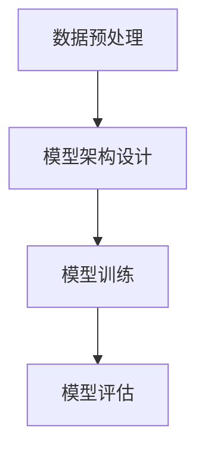

# 大语言模型原理与工程实践：即时奖励

## 1.背景介绍

大语言模型（Large Language Model, LLM）是近年来人工智能领域的一个重要突破。它们通过大量的文本数据进行训练，能够生成高质量的自然语言文本，完成各种复杂的语言任务，如翻译、问答、文本生成等。即时奖励（Immediate Reward）是强化学习中的一个重要概念，指的是在每一步操作后立即获得的反馈。将即时奖励引入大语言模型的训练中，可以显著提升模型的性能和实用性。

## 2.核心概念与联系

### 2.1 大语言模型

大语言模型是基于深度学习的自然语言处理模型，通常采用Transformer架构。它们通过大量的文本数据进行训练，能够理解和生成自然语言文本。常见的大语言模型包括GPT-3、BERT等。

### 2.2 即时奖励

即时奖励是强化学习中的一个重要概念，指的是在每一步操作后立即获得的反馈。即时奖励可以帮助模型更快地学习到有效的策略，从而提升模型的性能。

### 2.3 大语言模型与即时奖励的联系

将即时奖励引入大语言模型的训练中，可以通过强化学习的方法，优化模型的生成策略，使其能够更好地完成特定任务。例如，在对话系统中，可以通过即时奖励来优化模型的回答质量和用户满意度。

## 3.核心算法原理具体操作步骤

### 3.1 数据预处理

在训练大语言模型之前，需要对数据进行预处理。包括文本清洗、分词、去除停用词等步骤。

### 3.2 模型架构设计

大语言模型通常采用Transformer架构。Transformer由编码器和解码器组成，编码器负责将输入文本编码为向量，解码器负责将向量解码为输出文本。

### 3.3 模型训练

在模型训练过程中，可以采用监督学习和强化学习相结合的方法。首先，通过监督学习对模型进行预训练，然后通过强化学习引入即时奖励，优化模型的生成策略。

### 3.4 模型评估

模型评估是模型训练的重要环节。可以通过多种指标对模型进行评估，如BLEU、ROUGE等。同时，可以通过用户反馈来评估模型的实际效果。



## 4.数学模型和公式详细讲解举例说明

### 4.1 Transformer架构

Transformer架构的核心是自注意力机制（Self-Attention Mechanism）。自注意力机制通过计算输入序列中每个位置的注意力权重，来捕捉序列中的长距离依赖关系。

$$
\text{Attention}(Q, K, V) = \text{softmax}\left(\frac{QK^T}{\sqrt{d_k}}\right)V
$$

其中，$Q$、$K$、$V$分别表示查询矩阵、键矩阵和值矩阵，$d_k$表示键矩阵的维度。

### 4.2 强化学习中的即时奖励

在强化学习中，策略 $\pi$ 是一个映射函数，将状态 $s$ 映射到动作 $a$。即时奖励 $r$ 是在每一步操作后立即获得的反馈。

$$
Q(s, a) = r + \gamma \max_{a'} Q(s', a')
$$

其中，$Q(s, a)$ 表示状态 $s$ 和动作 $a$ 的价值函数，$\gamma$ 是折扣因子，$s'$ 是下一状态，$a'$ 是下一动作。

### 4.3 将即时奖励引入大语言模型

在大语言模型的训练中，可以通过强化学习的方法，将即时奖励引入模型的生成策略。具体来说，可以通过策略梯度方法，优化模型的参数，使其能够最大化即时奖励。

$$
\nabla J(\theta) = \mathbb{E}_{\pi_\theta} \left[ \nabla_\theta \log \pi_\theta(a|s) Q(s, a) \right]
$$

其中，$J(\theta)$ 表示策略的期望回报，$\pi_\theta$ 表示参数为 $\theta$ 的策略，$Q(s, a)$ 表示状态 $s$ 和动作 $a$ 的价值函数。

## 5.项目实践：代码实例和详细解释说明

### 5.1 数据预处理

```python
import re
import nltk
from nltk.corpus import stopwords

nltk.download('stopwords')
stop_words = set(stopwords.words('english'))

def preprocess_text(text):
    # 转换为小写
    text = text.lower()
    # 去除标点符号
    text = re.sub(r'[^\w\s]', '', text)
    # 分词
    words = text.split()
    # 去除停用词
    words = [word for word in words if word not in stop_words]
    return ' '.join(words)

# 示例文本
text = "Hello, world! This is a test."
processed_text = preprocess_text(text)
print(processed_text)
```

### 5.2 模型架构设计

```python
import torch
import torch.nn as nn
import torch.optim as optim

class TransformerModel(nn.Module):
    def __init__(self, vocab_size, d_model, nhead, num_encoder_layers, num_decoder_layers):
        super(TransformerModel, self).__init__()
        self.transformer = nn.Transformer(d_model, nhead, num_encoder_layers, num_decoder_layers)
        self.embedding = nn.Embedding(vocab_size, d_model)
        self.fc = nn.Linear(d_model, vocab_size)

    def forward(self, src, tgt):
        src = self.embedding(src)
        tgt = self.embedding(tgt)
        output = self.transformer(src, tgt)
        output = self.fc(output)
        return output

# 示例参数
vocab_size = 10000
d_model = 512
nhead = 8
num_encoder_layers = 6
num_decoder_layers = 6

model = TransformerModel(vocab_size, d_model, nhead, num_encoder_layers, num_decoder_layers)
```

### 5.3 模型训练

```python
def train_model(model, data_loader, criterion, optimizer, num_epochs):
    model.train()
    for epoch in range(num_epochs):
        for src, tgt in data_loader:
            optimizer.zero_grad()
            output = model(src, tgt)
            loss = criterion(output.view(-1, vocab_size), tgt.view(-1))
            loss.backward()
            optimizer.step()
        print(f'Epoch {epoch+1}/{num_epochs}, Loss: {loss.item()}')

# 示例数据加载器
data_loader = ...

# 损失函数和优化器
criterion = nn.CrossEntropyLoss()
optimizer = optim.Adam(model.parameters(), lr=0.001)

# 训练模型
train_model(model, data_loader, criterion, optimizer, num_epochs=10)
```

### 5.4 模型评估

```python
def evaluate_model(model, data_loader, criterion):
    model.eval()
    total_loss = 0
    with torch.no_grad():
        for src, tgt in data_loader:
            output = model(src, tgt)
            loss = criterion(output.view(-1, vocab_size), tgt.view(-1))
            total_loss += loss.item()
    return total_loss / len(data_loader)

# 评估模型
eval_loss = evaluate_model(model, data_loader, criterion)
print(f'Evaluation Loss: {eval_loss}')
```

## 6.实际应用场景

### 6.1 对话系统

在对话系统中，可以通过即时奖励来优化模型的回答质量和用户满意度。例如，可以通过用户的反馈来调整模型的生成策略，使其能够更好地满足用户的需求。

### 6.2 机器翻译

在机器翻译中，可以通过即时奖励来优化模型的翻译质量。例如，可以通过BLEU等指标来评估翻译结果，并根据评估结果调整模型的生成策略。

### 6.3 文本生成

在文本生成中，可以通过即时奖励来优化模型的生成质量。例如，可以通过用户的反馈来评估生成文本的质量，并根据评估结果调整模型的生成策略。

## 7.工具和资源推荐

### 7.1 工具

- **PyTorch**：一个流行的深度学习框架，支持动态计算图，适合大语言模型的开发和训练。
- **TensorFlow**：另一个流行的深度学习框架，支持静态计算图，适合大规模模型的部署和优化。
- **Hugging Face Transformers**：一个开源的自然语言处理库，提供了多种预训练的大语言模型，方便快速开发和实验。

### 7.2 资源

- **论文**：阅读相关领域的最新论文，如《Attention is All You Need》、《BERT: Pre-training of Deep Bidirectional Transformers for Language Understanding》等。
- **书籍**：推荐阅读《深度学习》、《自然语言处理入门》等书籍，了解相关的基础知识和前沿技术。
- **在线课程**：参加相关的在线课程，如Coursera、edX等平台上的深度学习和自然语言处理课程，提升自己的技能和知识。

## 8.总结：未来发展趋势与挑战

大语言模型和即时奖励的结合，为自然语言处理领域带来了新的机遇和挑战。未来，随着计算能力和数据规模的不断提升，大语言模型将能够处理更加复杂的语言任务，生成更加高质量的文本。同时，如何有效地引入即时奖励，优化模型的生成策略，仍然是一个需要深入研究的问题。

在实际应用中，大语言模型和即时奖励的结合，可以显著提升对话系统、机器翻译、文本生成等任务的性能和实用性。然而，如何平衡模型的性能和计算成本，如何处理大规模数据的训练和优化，仍然是一个需要解决的挑战。

## 9.附录：常见问题与解答

### 9.1 大语言模型的训练需要多长时间？

大语言模型的训练时间取决于模型的规模、数据的规模和计算资源的配置。通常，大规模的大语言模型需要数周甚至数月的时间进行训练。

### 9.2 如何选择合适的即时奖励策略？

选择合适的即时奖励策略需要根据具体的任务和应用场景来确定。可以通过实验和评估，选择能够最大化模型性能和用户满意度的即时奖励策略。

### 9.3 如何评估大语言模型的性能？

大语言模型的性能可以通过多种指标进行评估，如BLEU、ROUGE等。同时，可以通过用户反馈来评估模型的实际效果。

### 9.4 如何处理大规模数据的训练和优化？

处理大规模数据的训练和优化需要采用分布式计算和并行计算的方法。可以使用多GPU、多节点的计算集群，提升训练和优化的效率。

### 9.5 大语言模型的未来发展方向是什么？

大语言模型的未来发展方向包括提升模型的生成质量和效率，优化模型的训练和部署方法，探索新的应用场景和任务等。

---

作者：禅与计算机程序设计艺术 / Zen and the Art of Computer Programming