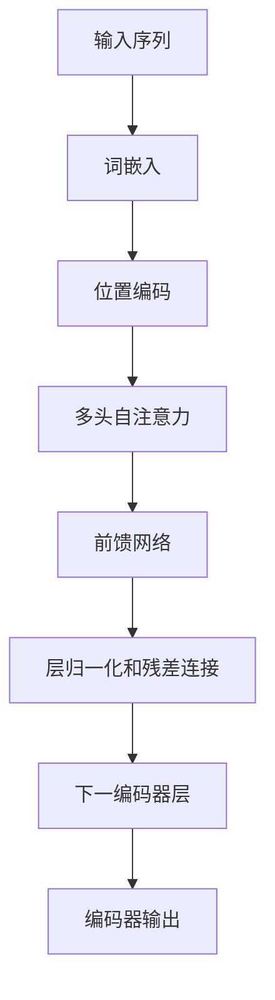
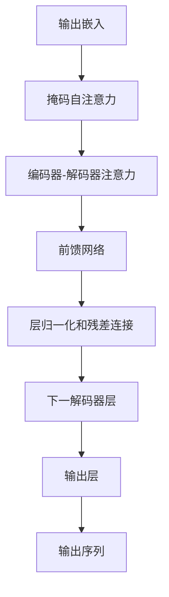

# 大语言模型原理与工程实践：大语言模型基础技术

## 1. 背景介绍

随着人工智能技术的快速发展,大型语言模型(Large Language Models, LLMs)近年来受到了广泛关注。LLMs是一种基于深度学习的自然语言处理(NLP)模型,能够从大量文本数据中学习语言模式和语义关系,从而生成看似人类编写的自然语言输出。

LLMs的出现源于对更强大的语言理解和生成能力的需求。传统的NLP模型通常专注于特定的任务,如机器翻译、文本分类或问答系统等,但它们的性能和适用范围受到限制。相比之下,LLMs通过在大规模语料库上进行预训练,获得了更广泛、更通用的语言理解和生成能力,可以应用于多种不同的NLP任务。

LLMs的核心思想是利用自注意力(Self-Attention)机制和Transformer架构,从海量文本数据中学习上下文相关性和语义表示。通过预训练,LLMs可以捕捉丰富的语言模式,并在下游任务中通过微调(Fine-tuning)进行特定领域的适应。这种通用性和可迁移性使LLMs成为当前NLP领域的重要突破,在自然语言生成、理解和任务完成等方面展现出卓越的能力。

## 2. 核心概念与联系

### 2.1 自注意力机制(Self-Attention)

自注意力机制是LLMs的核心组成部分之一,它允许模型在处理序列数据(如文本)时,捕捉不同位置之间的长程依赖关系。与传统的循环神经网络(RNN)和卷积神经网络(CNN)不同,自注意力机制不受序列长度的限制,可以有效地处理长序列输入。

在自注意力机制中,每个输入token都会与其他token进行关联,计算出一个注意力分数,表示该token对其他token的重要性程度。通过这种方式,模型可以动态地捕捉序列中任意两个位置之间的关系,从而更好地理解和生成语言。

### 2.2 Transformer架构

Transformer架构是LLMs中广泛采用的一种模型架构,它完全基于自注意力机制,不依赖于RNN或CNN。Transformer架构由编码器(Encoder)和解码器(Decoder)两个主要部分组成,用于处理输入序列和生成输出序列。

编码器负责捕捉输入序列的上下文信息,并将其编码为高维向量表示。解码器则利用编码器的输出,结合自身的自注意力机制,生成目标输出序列。Transformer架构的并行性和高效性使其在处理长序列时表现出色,成为LLMs的主要模型架构选择。

### 2.3 预训练与微调(Transfer Learning)

LLMs通常采用两阶段训练策略:预训练(Pre-training)和微调(Fine-tuning)。

预训练阶段是LLMs的关键环节,模型在大规模语料库上进行无监督学习,捕捉通用的语言模式和语义知识。常见的预训练目标包括掩码语言模型(Masked Language Modeling)和下一句预测(Next Sentence Prediction)等。通过预训练,LLMs可以获得丰富的语言表示能力,为后续的任务适应奠定基础。

微调阶段则是将预训练模型应用于特定的下游任务,如文本分类、机器翻译或问答系统等。在这个阶段,模型会在相关的任务数据上进行有监督的训练,对预训练模型进行调整和适应,以获得更好的任务性能。这种迁移学习(Transfer Learning)策略可以有效地利用预训练模型的通用知识,加快下游任务的训练过程,并提高模型的泛化能力。

## 3. 核心算法原理具体操作步骤

### 3.1 自注意力计算

自注意力机制是LLMs中的核心算法之一,它的计算过程如下:

1. **查询(Query)、键(Key)和值(Value)计算**

   给定一个输入序列 $X = (x_1, x_2, \dots, x_n)$,我们首先通过线性变换将每个token $x_i$映射到查询向量 $q_i$、键向量 $k_i$ 和值向量 $v_i$:

   $$q_i = W^Q x_i, \quad k_i = W^K x_i, \quad v_i = W^V x_i$$

   其中 $W^Q$、$W^K$ 和 $W^V$ 分别是查询、键和值的线性变换矩阵。

2. **计算注意力分数**

   对于每个查询向量 $q_i$,我们计算它与所有键向量 $k_j$ 的相似度,得到一个注意力分数向量 $\alpha_i$:

   $$\alpha_{i,j} = \frac{e^{q_i^T k_j}}{\sum_{l=1}^n e^{q_i^T k_l}}$$

   注意力分数 $\alpha_{i,j}$ 表示查询向量 $q_i$ 对键向量 $k_j$ 的注意力程度。

3. **计算加权和**

   最后,我们将注意力分数与值向量相乘,得到查询向量 $q_i$ 的加权和表示 $o_i$:

   $$o_i = \sum_{j=1}^n \alpha_{i,j} v_j$$

   这个加权和向量 $o_i$ 就是自注意力机制对输入token $x_i$ 的输出表示,它综合了输入序列中所有其他token的信息。

通过自注意力计算,LLMs可以动态地捕捉输入序列中任意两个位置之间的关系,从而更好地理解和生成语言。

### 3.2 Transformer编码器

Transformer编码器是LLMs中另一个关键组件,它基于自注意力机制对输入序列进行编码。编码器的计算过程如下:

1. **词嵌入(Word Embedding)**

   首先,将输入序列 $X = (x_1, x_2, \dots, x_n)$ 映射到词嵌入向量序列 $(e_1, e_2, \dots, e_n)$。

2. **位置编码(Positional Encoding)**

   为了捕捉序列中token的位置信息,我们将位置编码向量 $(p_1, p_2, \dots, p_n)$ 加到词嵌入向量上,得到位置感知的输入表示 $(e_1 + p_1, e_2 + p_2, \dots, e_n + p_n)$。

3. **多头自注意力(Multi-Head Self-Attention)**

   将位置感知的输入表示输入到多头自注意力层,得到自注意力输出 $(o_1, o_2, \dots, o_n)$。多头自注意力层可以从不同的子空间捕捉不同的注意力模式,提高模型的表示能力。

4. **前馈网络(Feed-Forward Network)**

   自注意力输出经过一个前馈网络进行进一步的特征转换,得到编码器的最终输出 $(z_1, z_2, \dots, z_n)$。

5. **层归一化(Layer Normalization)和残差连接(Residual Connection)**

   在每个子层之后,都会应用层归一化和残差连接,以提高模型的训练稳定性和表现力。

通过多个编码器层的堆叠,Transformer编码器可以逐层捕捉输入序列的上下文信息,为后续的解码器提供丰富的语义表示。

### 3.3 Transformer解码器

Transformer解码器与编码器类似,但增加了一个掩码自注意力(Masked Self-Attention)层,用于处理输出序列的自回归性质。解码器的计算过程如下:

1. **输出嵌入(Output Embedding)**

   将输出序列 $Y = (y_1, y_2, \dots, y_m)$ 映射到输出嵌入向量序列 $(f_1, f_2, \dots, f_m)$。

2. **掩码自注意力(Masked Self-Attention)**

   在掩码自注意力层中,每个输出token只能关注到它之前的token,而不能关注到未来的token。这确保了模型在生成每个token时,只依赖于已生成的部分,而不会引入未来的信息。

3. **编码器-解码器注意力(Encoder-Decoder Attention)**

   解码器会计算输出嵌入向量与编码器输出之间的注意力,捕捉输入序列和输出序列之间的关系。

4. **前馈网络(Feed-Forward Network)**

   与编码器类似,解码器也包含一个前馈网络层进行特征转换。

5. **层归一化(Layer Normalization)和残差连接(Residual Connection)**

   同样应用层归一化和残差连接,以提高模型的稳定性和表现力。

6. **输出层(Output Layer)**

   最后,解码器的输出经过一个线性层和softmax层,生成下一个token的概率分布。

通过多个解码器层的堆叠,Transformer解码器可以逐步生成输出序列,同时利用编码器的输出来捕捉输入序列的语义信息。

## 4. 数学模型和公式详细讲解举例说明

在LLMs中,自注意力机制和Transformer架构都涉及到一些关键的数学模型和公式。我们将详细讲解其中的一些核心公式,并给出具体的例子说明。

### 4.1 缩放点积注意力(Scaled Dot-Product Attention)

缩放点积注意力是自注意力机制的一种变体,它通过缩放来解决较长序列的注意力值不稳定的问题。其公式如下:

$$\text{Attention}(Q, K, V) = \text{softmax}\left(\frac{QK^T}{\sqrt{d_k}}\right)V$$

其中:

- $Q$ 是查询向量序列 $(q_1, q_2, \dots, q_n)$
- $K$ 是键向量序列 $(k_1, k_2, \dots, k_n)$
- $V$ 是值向量序列 $(v_1, v_2, \dots, v_n)$
- $d_k$ 是键向量的维度

通过除以 $\sqrt{d_k}$,我们可以缩放点积的值,使其落入一个更加稳定的范围,从而避免梯度爆炸或消失的问题。

**例子**:

假设我们有一个长度为4的序列,其查询向量 $Q$、键向量 $K$ 和值向量 $V$ 如下:

$$Q = \begin{bmatrix}
0.1 & 0.2 \\
0.3 & 0.4 \\
0.5 & 0.6 \\
0.7 & 0.8
\end{bmatrix}, \quad
K = \begin{bmatrix}
0.2 & 0.1 \\
0.4 & 0.3 \\
0.6 & 0.5 \\
0.8 & 0.7
\end{bmatrix}, \quad
V = \begin{bmatrix}
1.0 & 2.0 \\
3.0 & 4.0 \\
5.0 & 6.0 \\
7.0 & 8.0
\end{bmatrix}$$

我们计算缩放点积注意力如下:

1. 计算 $QK^T$:

   $$QK^T = \begin{bmatrix}
   0.1 & 0.2 \\
   0.3 & 0.4 \\
   0.5 & 0.6 \\
   0.7 & 0.8
   \end{bmatrix}
   \begin{bmatrix}
   0.2 & 0.4 & 0.6 & 0.8 \\
   0.1 & 0.3 & 0.5 & 0.7
   \end{bmatrix}
   = \begin{bmatrix}
   0.06 & 0.14 & 0.22 & 0.30 \\
   0.12 & 0.28 & 0.44 & 0.60 \\
   0.18 & 0.42 & 0.66 & 0.90 \\
   0.24 & 0.56 & 0.88 & 1.20
   \end{bmatrix}$$

2. 缩放 $QK^T$ 