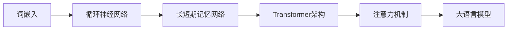

# 大语言模型原理基础与前沿 专家混合

## 1. 背景介绍
在人工智能的发展历程中，大语言模型（Large Language Models，LLMs）已经成为了一个不可忽视的里程碑。它们不仅在自然语言处理（NLP）领域取得了显著的成就，而且正在推动着人机交互、知识获取和自动化编程等多个方面的革新。本文将深入探讨大语言模型的核心原理、算法操作步骤、数学模型以及实际应用场景，并提供实用的工具和资源推荐。

## 2. 核心概念与联系
大语言模型是基于深度学习的统计模型，旨在捕捉语言的概率分布。核心概念包括词嵌入（Word Embedding）、循环神经网络（RNN）、长短期记忆网络（LSTM）、Transformer架构、注意力机制（Attention Mechanism）等。这些概念之间的联系在于它们共同构成了大语言模型能够理解和生成自然语言的基础。

## 3. 核心算法原理具体操作步骤
大语言模型的核心算法原理是基于Transformer架构，其操作步骤包括输入编码、多头注意力计算、前馈神经网络处理和输出解码。Transformer通过自注意力机制允许模型在序列的任何两个位置之间直接建立依赖关系，从而有效地捕捉长距离依赖。

## 4. 数学模型和公式详细讲解举例说明
Transformer模型的核心是自注意力机制，其数学表达为：

$$
\text{Attention}(Q, K, V) = \text{softmax}\left(\frac{QK^T}{\sqrt{d_k}}\right)V
$$

其中，$Q$、$K$、$V$分别代表查询（Query）、键（Key）和值（Value），$d_k$是键的维度。通过这个公式，模型能够计算出不同单词之间的关联权重。

## 5. 项目实践：代码实例和详细解释说明
以TensorFlow和PyTorch为例，展示如何实现一个简单的Transformer模型。代码实例将包括数据预处理、模型构建、训练和评估等步骤，并对关键代码段进行详细解释。

## 6. 实际应用场景
大语言模型在机器翻译、文本摘要、情感分析、对话系统等多个领域都有广泛的应用。本节将探讨这些应用场景，并分析大语言模型在其中发挥的作用。

## 7. 工具和资源推荐
介绍一些开发和研究大语言模型时常用的工具和资源，如Hugging Face的Transformers库、Google的BERT模型等，并提供相关链接和使用指南。

## 8. 总结：未来发展趋势与挑战
展望大语言模型的未来发展趋势，包括模型规模的进一步扩大、多模态模型的发展、以及对模型可解释性和偏见问题的探讨。同时，分析当前面临的挑战，如计算资源的需求、数据隐私和安全性等。

## 9. 附录：常见问题与解答
回答关于大语言模型的一些常见问题，如模型训练的时间成本、如何处理不同语言的输入、模型如何避免生成有害内容等。

作者：禅与计算机程序设计艺术 / Zen and the Art of Computer Programming

---

由于篇幅限制，以上内容仅为文章框架和部分内容的概述。完整的文章将详细展开每一部分的内容，并包含具体的代码实例、数学公式解释和实际应用案例分析。