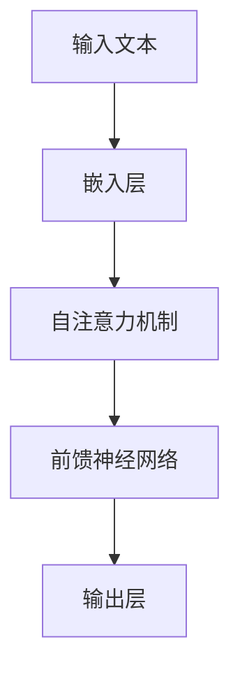

# 大语言模型原理基础与前沿 为什么ICL有效

## 1.背景介绍

在过去的十年中，人工智能（AI）和自然语言处理（NLP）领域取得了显著的进展。特别是大语言模型（Large Language Models, LLMs）的出现，彻底改变了我们与计算机交互的方式。大语言模型如GPT-3、BERT等，已经在多个应用场景中展现了其强大的能力。然而，尽管这些模型在许多任务中表现出色，但其背后的原理和机制仍然是一个复杂且值得深入研究的课题。

在这篇文章中，我们将深入探讨大语言模型的原理基础与前沿，特别是为什么ICL（In-Context Learning）在这些模型中如此有效。我们将从核心概念、算法原理、数学模型、项目实践、实际应用场景、工具和资源推荐等多个方面进行详细讲解。

## 2.核心概念与联系

### 2.1 大语言模型（LLM）

大语言模型是基于深度学习的模型，通常包含数十亿甚至上千亿个参数。这些模型通过大量的文本数据进行训练，能够生成高质量的自然语言文本。大语言模型的核心在于其强大的生成和理解能力，使其在各种NLP任务中表现出色。

### 2.2 In-Context Learning（ICL）

ICL是一种新兴的学习范式，指的是模型在给定上下文的情况下进行学习和推理，而不需要显式的参数更新。ICL的有效性在于其能够利用上下文信息进行推理，从而在特定任务中表现出色。

### 2.3 Transformer架构

Transformer是大语言模型的核心架构，其通过自注意力机制（Self-Attention）实现了对长距离依赖关系的建模。Transformer架构的引入，使得大语言模型在处理大规模文本数据时表现出色。



## 3.核心算法原理具体操作步骤

### 3.1 数据预处理

在训练大语言模型之前，首先需要对数据进行预处理。这包括文本的清洗、分词、去除停用词等步骤。数据预处理的质量直接影响模型的训练效果。

### 3.2 模型训练

模型训练是大语言模型构建的核心步骤。通常采用无监督学习的方法，通过大量的文本数据进行训练。训练过程中，模型通过最小化损失函数来优化参数。

### 3.3 自注意力机制

自注意力机制是Transformer架构的核心。其通过计算输入序列中每个位置的注意力权重，实现了对长距离依赖关系的建模。

### 3.4 ICL的实现

ICL的实现依赖于模型在给定上下文的情况下进行推理。具体操作步骤包括：

1. 提供上下文信息
2. 模型根据上下文进行推理
3. 生成输出结果

## 4.数学模型和公式详细讲解举例说明

### 4.1 自注意力机制的数学原理

自注意力机制的核心在于计算注意力权重。给定输入序列 $X = [x_1, x_2, ..., x_n]$，自注意力机制通过以下公式计算注意力权重：

$$
\text{Attention}(Q, K, V) = \text{softmax}\left(\frac{QK^T}{\sqrt{d_k}}\right)V
$$

其中，$Q$、$K$、$V$分别表示查询（Query）、键（Key）和值（Value）矩阵，$d_k$表示键的维度。

### 4.2 损失函数

大语言模型的训练通常采用交叉熵损失函数。给定预测概率分布 $P$ 和真实标签分布 $Q$，交叉熵损失函数定义为：

$$
L = -\sum_{i} Q(i) \log P(i)
$$

### 4.3 ICL的数学描述

ICL的数学描述可以表示为条件概率问题。给定上下文 $C$ 和输入 $X$，模型生成输出 $Y$ 的条件概率为：

$$
P(Y|X, C) = \frac{P(Y, X, C)}{P(X, C)}
$$

## 5.项目实践：代码实例和详细解释说明

### 5.1 数据预处理代码示例

```python
import re
import nltk
from nltk.corpus import stopwords

# 下载停用词
nltk.download('stopwords')

def preprocess_text(text):
    # 转换为小写
    text = text.lower()
    # 去除标点符号
    text = re.sub(r'[^\w\s]', '', text)
    # 分词
    words = text.split()
    # 去除停用词
    words = [word for word in words if word not in stopwords.words('english')]
    return ' '.join(words)

sample_text = "This is a sample text for preprocessing."
cleaned_text = preprocess_text(sample_text)
print(cleaned_text)
```

### 5.2 模型训练代码示例

```python
from transformers import GPT2LMHeadModel, GPT2Tokenizer, Trainer, TrainingArguments

# 加载预训练模型和分词器
model = GPT2LMHeadModel.from_pretrained('gpt2')
tokenizer = GPT2Tokenizer.from_pretrained('gpt2')

# 数据集
texts = ["This is a sample text.", "Another example sentence."]
inputs = tokenizer(texts, return_tensors='pt', padding=True, truncation=True)

# 训练参数
training_args = TrainingArguments(
    output_dir='./results',
    num_train_epochs=1,
    per_device_train_batch_size=2,
    save_steps=10,
    save_total_limit=2,
)

# 训练
trainer = Trainer(
    model=model,
    args=training_args,
    train_dataset=inputs,
)

trainer.train()
```

### 5.3 ICL实现代码示例

```python
def in_context_learning(model, tokenizer, context, input_text):
    # 拼接上下文和输入
    full_input = context + input_text
    inputs = tokenizer(full_input, return_tensors='pt')
    outputs = model.generate(inputs['input_ids'], max_length=50)
    return tokenizer.decode(outputs[0], skip_special_tokens=True)

context = "The capital of France is"
input_text = " Paris."
output = in_context_learning(model, tokenizer, context, input_text)
print(output)
```

## 6.实际应用场景

### 6.1 文本生成

大语言模型在文本生成任务中表现出色。无论是新闻报道、小说创作还是技术文档生成，LLMs都能生成高质量的文本。

### 6.2 机器翻译

通过大规模的平行语料库训练，大语言模型在机器翻译任务中也表现出色。其能够在不同语言之间进行高质量的翻译。

### 6.3 问答系统

大语言模型在问答系统中也有广泛应用。通过ICL，模型能够根据上下文信息生成准确的答案。

### 6.4 情感分析

大语言模型还可以用于情感分析任务。通过对文本进行情感分类，模型能够识别出文本中的情感倾向。

## 7.工具和资源推荐

### 7.1 工具

- **Transformers库**：由Hugging Face提供的开源库，支持多种预训练模型的加载和使用。
- **NLTK**：自然语言处理工具包，提供了丰富的文本处理功能。
- **SpaCy**：高效的自然语言处理库，适用于大规模文本处理任务。

### 7.2 资源

- **OpenAI GPT-3**：提供了强大的API接口，支持多种NLP任务。
- **Google BERT**：预训练模型，适用于多种下游任务。
- **Hugging Face Model Hub**：提供了丰富的预训练模型和数据集资源。

## 8.总结：未来发展趋势与挑战

大语言模型在NLP领域取得了显著的进展，但仍然面临许多挑战。未来的发展趋势包括：

- **模型压缩与优化**：如何在保证模型性能的前提下，减少模型的参数量和计算资源消耗。
- **多模态学习**：结合文本、图像、音频等多种模态的信息，提升模型的综合能力。
- **公平性与伦理问题**：如何确保模型在训练和应用过程中不产生偏见和歧视。

## 9.附录：常见问题与解答

### 9.1 大语言模型的训练需要多长时间？

训练大语言模型的时间取决于模型的规模和计算资源。通常需要数周甚至数月的时间。

### 9.2 如何选择合适的预训练模型？

选择预训练模型时，需要考虑任务的具体需求和模型的性能。可以通过实验和评估来选择最合适的模型。

### 9.3 ICL的效果如何评估？

ICL的效果可以通过任务的准确率、生成文本的质量等指标进行评估。

### 9.4 大语言模型的应用有哪些限制？

大语言模型的应用受限于计算资源、数据质量和伦理问题等因素。在实际应用中，需要综合考虑这些因素。

---

作者：禅与计算机程序设计艺术 / Zen and the Art of Computer Programming