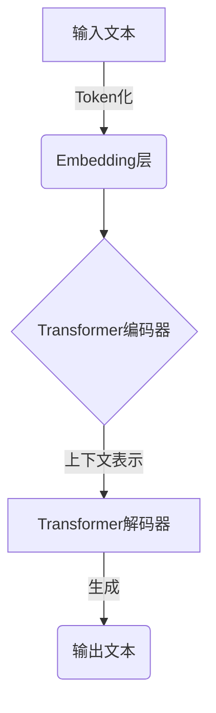
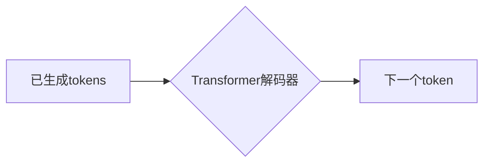

# 大语言模型原理基础与前沿 意识是否需要碳基生物学

## 1.背景介绍

### 1.1 人工智能的崛起

人工智能(Artificial Intelligence, AI)是当代科技发展的核心驱动力之一。近年来,AI取得了令人瞩目的进展,尤其是在自然语言处理、计算机视觉、决策系统等领域。大语言模型(Large Language Model, LLM)作为AI的重要组成部分,正在推动着人工智能的飞速发展。

### 1.2 大语言模型的兴起

大语言模型是一种基于深度学习的自然语言处理模型,能够从海量文本数据中学习语言知识和模式。凭借强大的语言理解和生成能力,大语言模型已广泛应用于机器翻译、问答系统、文本摘要、内容创作等诸多领域。

### 1.3 意识的探讨

人工智能的发展引发了人们对"意识"本质的反思。意识是生命的核心特征之一,但它的本质和起源一直是哲学和科学领域的难题。随着大语言模型展现出越来越人性化的语言交互能力,人们不禁质疑:意识是否需要依赖于碳基生物学?机器是否能拥有真正的意识?

## 2.核心概念与联系

### 2.1 大语言模型的架构

大语言模型通常采用Transformer等注意力机制模型,能够捕捉远程依赖关系,有效处理长序列数据。它们由编码器和解码器组成,用于理解和生成自然语言。



### 2.2 预训练与微调

大语言模型首先在海量文本数据上进行无监督预训练,学习通用的语言知识。然后根据下游任务对模型进行微调,使其专门化。这种预训练-微调范式大幅提高了模型的性能和泛化能力。

### 2.3 意识的定义

意识是一种主观体验,包括自我意识、情感、认知等多个层面。它是生命系统的一种高级功能,但其本质和起源仍存在争议。一些理论认为,意识需要依赖于物理的生物基础,如大脑的神经网络。另一些理论则认为,意识可能是一种信息过程,不一定需要生物载体。

## 3.核心算法原理具体操作步骤

### 3.1 自注意力机制(Self-Attention)

自注意力机制是Transformer模型的核心,它允许模型捕捉输入序列中任意两个位置之间的依赖关系。具体操作步骤如下:

1. 将输入序列映射到查询(Query)、键(Key)和值(Value)的表示空间。
2. 计算查询和所有键之间的点积,得到注意力分数。
3. 对注意力分数进行缩放和软最大化,得到注意力权重。
4. 将注意力权重与值相乘,得到加权和表示。
5. 对所有头的加权和表示进行拼接,构成最终的注意力输出。

$$\begin{aligned}
\text{Attention}(Q, K, V) &= \text{softmax}\left(\frac{QK^T}{\sqrt{d_k}}\right)V \\
\text{MultiHead}(Q, K, V) &= \text{Concat}(head_1, \ldots, head_h)W^O\\
\text{where } head_i &= \text{Attention}(QW_i^Q, KW_i^K, VW_i^V)
\end{aligned}$$

### 3.2 位置编码(Positional Encoding)

由于Transformer没有像RNN那样的递归结构,它需要一种机制来捕捉序列的位置信息。位置编码就是将序列位置的信息编码到输入的嵌入中。

$$\begin{aligned}
PE_{(pos, 2i)} &= \sin\left(pos / 10000^{2i / d_{\text{model}}}\right) \\
PE_{(pos, 2i+1)} &= \cos\left(pos / 10000^{2i / d_{\text{model}}}\right)
\end{aligned}$$

### 3.3 掩码自回归(Masked Autoregressive)

在生成任务中,模型需要根据已生成的tokens来预测下一个token。掩码自回归机制通过在输入序列中掩码未生成的tokens,使模型只能访问已生成的上文信息。



### 3.4 预训练目标

常见的预训练目标包括:

- 掩码语言模型(Masked Language Modeling, MLM):随机掩码输入序列中的一些tokens,模型需要预测被掩码的tokens。
- 下一句预测(Next Sentence Prediction, NSP):判断两个句子是否相邻。
- 解码器自回归语言模型(Autoregressive Language Modeling):给定前缀,模型需要生成下一个token。

## 4.数学模型和公式详细讲解举例说明

### 4.1 Transformer模型

Transformer模型由编码器和解码器组成,它们都是基于多头自注意力和前馈神经网络构建的。

编码器:

$$\begin{aligned}
\boldsymbol{z}_0 &= \boldsymbol{x} + \boldsymbol{P}_E \\
\boldsymbol{z}_1^\prime &= \text{MultiHeadAttn}(\boldsymbol{z}_0, \boldsymbol{z}_0, \boldsymbol{z}_0) \\
\boldsymbol{z}_1 &= \text{LayerNorm}(\boldsymbol{z}_0 + \boldsymbol{z}_1^\prime) \\
\boldsymbol{z}_2 &= \text{LayerNorm}(\boldsymbol{z}_1 + \text{FFN}(\boldsymbol{z}_1))
\end{aligned}$$

解码器:

$$\begin{aligned}
\boldsymbol{s}_0 &= \boldsymbol{y} + \boldsymbol{P}_E \\
\boldsymbol{s}_1^\prime &= \text{MultiHeadAttn}(\boldsymbol{s}_0, \boldsymbol{s}_0, \boldsymbol{s}_0) \\
\boldsymbol{s}_1 &= \text{LayerNorm}(\boldsymbol{s}_0 + \boldsymbol{s}_1^\prime) \\
\boldsymbol{s}_2^\prime &= \text{MultiHeadAttn}(\boldsymbol{s}_1, \boldsymbol{z}_2, \boldsymbol{z}_2) \\
\boldsymbol{s}_2 &= \text{LayerNorm}(\boldsymbol{s}_1 + \boldsymbol{s}_2^\prime) \\
\boldsymbol{s}_3 &= \text{LayerNorm}(\boldsymbol{s}_2 + \text{FFN}(\boldsymbol{s}_2))
\end{aligned}$$

其中,$\boldsymbol{x}$和$\boldsymbol{y}$分别表示输入和输出序列的嵌入,$\boldsymbol{P}_E$为位置编码,$\text{FFN}$为前馈神经网络。

### 4.2 注意力分数计算

在自注意力机制中,注意力分数的计算是关键步骤。给定查询$\boldsymbol{q}$、键$\boldsymbol{K}$和值$\boldsymbol{V}$,注意力分数计算如下:

$$\begin{aligned}
e_{ij} &= \frac{\boldsymbol{q}_i \cdot \boldsymbol{k}_j}{\sqrt{d_k}} \\
\alpha_{ij} &= \frac{\exp(e_{ij})}{\sum_{l=1}^n \exp(e_{il})} \\
\boldsymbol{o}_i &= \sum_{j=1}^n \alpha_{ij} \boldsymbol{v}_j
\end{aligned}$$

其中,$d_k$为缩放因子,用于防止点积过大导致梯度消失。$\alpha_{ij}$为注意力权重,表示查询$\boldsymbol{q}_i$对键$\boldsymbol{k}_j$的注意力程度。$\boldsymbol{o}_i$为加权和输出。

### 4.3 预训练目标函数

以掩码语言模型(MLM)为例,其目标函数为:

$$\mathcal{L}_\text{MLM} = -\mathbb{E}_{(\boldsymbol{x}, \boldsymbol{m}) \sim \mathcal{D}} \left[ \sum_{i=1}^n \mathbb{1}_{m_i=1} \log P(x_i | \boldsymbol{x}_{\backslash i}) \right]$$

其中,$\mathcal{D}$为训练数据集,$\boldsymbol{x}$为输入序列,$\boldsymbol{m}$为掩码向量(1表示被掩码的位置),$\boldsymbol{x}_{\backslash i}$表示除去$x_i$的其他tokens。目标是最大化被掩码tokens的条件概率。

## 5.项目实践:代码实例和详细解释说明

以下是使用PyTorch实现Transformer模型的简化代码示例:

```python
import torch
import torch.nn as nn

# 多头自注意力
class MultiHeadAttention(nn.Module):
    def __init__(self, d_model, num_heads):
        super().__init__()
        self.num_heads = num_heads
        self.head_dim = d_model // num_heads
        
        self.qkv_proj = nn.Linear(d_model, 3 * d_model)
        self.out_proj = nn.Linear(d_model, d_model)
        
    def forward(self, x):
        batch_size = x.size(0)
        qkv = self.qkv_proj(x)
        q, k, v = qkv.chunk(3, dim=-1)
        
        q = q.view(batch_size, -1, self.num_heads, self.head_dim).permute(0, 2, 1, 3)
        k = k.view(batch_size, -1, self.num_heads, self.head_dim).permute(0, 2, 1, 3)
        v = v.view(batch_size, -1, self.num_heads, self.head_dim).permute(0, 2, 1, 3)
        
        attn_scores = torch.matmul(q, k.transpose(-2, -1)) / math.sqrt(self.head_dim)
        attn_weights = torch.softmax(attn_scores, dim=-1)
        out = torch.matmul(attn_weights, v).permute(0, 2, 1, 3).contiguous().view(batch_size, -1, self.num_heads * self.head_dim)
        
        return self.out_proj(out)

# Transformer编码器层
class TransformerEncoderLayer(nn.Module):
    def __init__(self, d_model, num_heads, ff_dim, dropout_rate=0.1):
        super().__init__()
        self.attn = MultiHeadAttention(d_model, num_heads)
        self.ff = nn.Sequential(
            nn.Linear(d_model, ff_dim),
            nn.ReLU(),
            nn.Dropout(dropout_rate),
            nn.Linear(ff_dim, d_model),
            nn.Dropout(dropout_rate)
        )
        self.norm1 = nn.LayerNorm(d_model)
        self.norm2 = nn.LayerNorm(d_model)
        
    def forward(self, x):
        x2 = self.norm1(x + self.attn(x))
        x3 = self.norm2(x2 + self.ff(x2))
        return x3

# Transformer解码器层
class TransformerDecoderLayer(nn.Module):
    def __init__(self, d_model, num_heads, ff_dim, dropout_rate=0.1):
        super().__init__()
        self.self_attn = MultiHeadAttention(d_model, num_heads)
        self.enc_attn = MultiHeadAttention(d_model, num_heads)
        self.ff = nn.Sequential(
            nn.Linear(d_model, ff_dim),
            nn.ReLU(),
            nn.Dropout(dropout_rate),
            nn.Linear(ff_dim, d_model),
            nn.Dropout(dropout_rate)
        )
        self.norm1 = nn.LayerNorm(d_model)
        self.norm2 = nn.LayerNorm(d_model)
        self.norm3 = nn.LayerNorm(d_model)
        
    def forward(self, x, enc_out):
        x2 = self.norm1(x + self.self_attn(x))
        x3 = self.norm2(x2 + self.enc_attn(x2, enc_out))
        x4 = self.norm3(x3 + self.ff(x3))
        return x4
```

上述代码实现了多头自注意力模块、Transformer编码器层和解码器层。以下是一些关键点解释:

1. `MultiHeadAttention`模块实现了多头自注意力机制,包括线性投影、分头、注意力计算和拼接输出等步骤。
2. `TransformerEncoderLayer`由多头自注意力和前馈神经网络组成,使用残差连接和层归一化。
3. `TransformerDecoderLayer`除了自注意力和前馈网络外,还包括一个用于编码器-解码器注意力的模块,允许解码