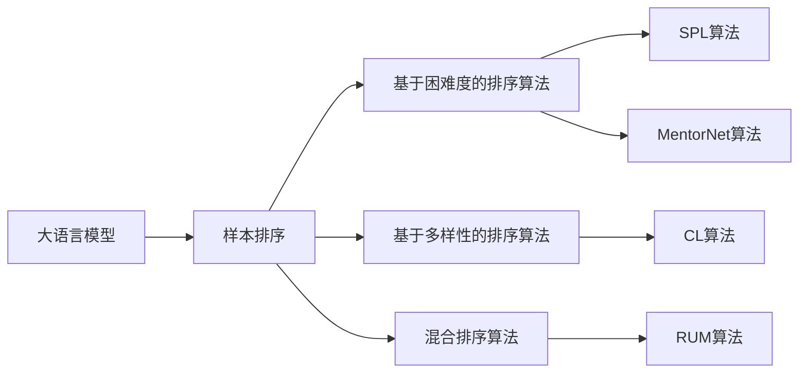

# 大语言模型原理基础与前沿 样本排序

## 1. 背景介绍
### 1.1 大语言模型的发展历程
#### 1.1.1 早期的语言模型
#### 1.1.2 神经网络语言模型的兴起  
#### 1.1.3 Transformer架构的突破

### 1.2 样本排序在大语言模型中的重要性
#### 1.2.1 提高模型训练效率
#### 1.2.2 改善模型泛化能力
#### 1.2.3 加速模型收敛速度

## 2. 核心概念与联系
### 2.1 大语言模型的定义与特点
#### 2.1.1 定义
#### 2.1.2 特点
#### 2.1.3 应用领域

### 2.2 样本排序的概念与作用
#### 2.2.1 样本排序的定义
#### 2.2.2 样本排序的作用
#### 2.2.3 样本排序与模型性能的关系

### 2.3 样本排序与其他优化技术的联系
#### 2.3.1 与学习率调度的联系
#### 2.3.2 与Batch Normalization的联系 
#### 2.3.3 与梯度裁剪的联系

## 3. 核心算法原理具体操作步骤
### 3.1 基于困难度的样本排序算法
#### 3.1.1 样本困难度的度量方法
#### 3.1.2 基于Loss的排序算法
#### 3.1.3 基于梯度范数的排序算法

### 3.2 基于多样性的样本排序算法 
#### 3.2.1 样本多样性的度量方法
#### 3.2.2 Curriculum Learning算法
#### 3.2.3 Self-Paced Learning算法

### 3.3 混合排序算法
#### 3.3.1 结合困难度和多样性的排序算法
#### 3.3.2 MentorNet算法
#### 3.3.3 RUM算法

## 4. 数学模型和公式详细讲解举例说明
### 4.1 大语言模型的数学形式化描述
#### 4.1.1 语言模型的概率形式
#### 4.1.2 最大似然估计目标函数
#### 4.1.3 交叉熵损失函数

### 4.2 样本排序算法的数学原理
#### 4.2.1 基于Loss的排序算法的数学推导
#### 4.2.2 基于梯度范数的排序算法的数学推导
#### 4.2.3 Curriculum Learning的数学原理

### 4.3 公式推导与案例分析
#### 4.3.1 MentorNet算法的公式推导
#### 4.3.2 RUM算法的公式推导
#### 4.3.3 实际案例分析

## 5. 项目实践：代码实例和详细解释说明
### 5.1 基于PyTorch实现样本排序算法
#### 5.1.1 数据集的准备与预处理
#### 5.1.2 模型构建与训练流程
#### 5.1.3 样本排序算法的实现

### 5.2 基于TensorFlow实现样本排序算法
#### 5.2.1 数据集的准备与预处理
#### 5.2.2 模型构建与训练流程 
#### 5.2.3 样本排序算法的实现

### 5.3 项目实践中的注意事项
#### 5.3.1 超参数的选择与调优
#### 5.3.2 样本排序算法的适用场景
#### 5.3.3 模型评估与结果分析

## 6. 实际应用场景
### 6.1 自然语言处理领域的应用
#### 6.1.1 机器翻译中的应用
#### 6.1.2 文本摘要中的应用
#### 6.1.3 情感分析中的应用

### 6.2 语音识别领域的应用
#### 6.2.1 语音转文本中的应用
#### 6.2.2 说话人识别中的应用
#### 6.2.3 语音合成中的应用

### 6.3 其他领域的应用
#### 6.3.1 图像字幕生成中的应用
#### 6.3.2 知识图谱构建中的应用
#### 6.3.3 推荐系统中的应用

## 7. 工具和资源推荐
### 7.1 开源工具库
#### 7.1.1 PyTorch
#### 7.1.2 TensorFlow
#### 7.1.3 Hugging Face Transformers

### 7.2 预训练模型
#### 7.2.1 BERT
#### 7.2.2 GPT系列
#### 7.2.3 T5

### 7.3 数据集资源
#### 7.3.1 WikiText
#### 7.3.2 BookCorpus
#### 7.3.3 OpenWebText

## 8. 总结：未来发展趋势与挑战
### 8.1 样本排序算法的发展趋势
#### 8.1.1 个性化样本排序
#### 8.1.2 在线学习中的样本排序
#### 8.1.3 多任务学习中的样本排序

### 8.2 大语言模型面临的挑战
#### 8.2.1 计算资源瓶颈
#### 8.2.2 数据隐私与安全
#### 8.2.3 模型解释性与可控性

### 8.3 未来研究方向
#### 8.3.1 更高效的样本排序算法
#### 8.3.2 样本排序与模型压缩的结合
#### 8.3.3 样本排序在零样本/小样本学习中的应用

## 9. 附录：常见问题与解答
### 9.1 样本排序算法的时间复杂度如何?
### 9.2 样本排序对不同任务的效果有何差异?
### 9.3 如何选择合适的样本排序算法?
### 9.4 样本排序能否与其他优化技术结合使用?
### 9.5 样本排序算法在实际应用中需要注意哪些问题?

作者：禅与计算机程序设计艺术 / Zen and the Art of Computer Programming

大语言模型(Large Language Model, LLM)是自然语言处理(NLP)领域近年来的重大突破,其在机器翻译、对话系统、文本生成等任务上取得了巨大成功。然而,随着模型规模的不断扩大,训练大语言模型面临着诸多挑战,如训练效率低下、资源消耗巨大等问题。样本排序(Sample Ordering)作为一种提高模型训练效率的技术,受到了学术界和工业界的广泛关注。本文将深入探讨样本排序在大语言模型训练中的原理、算法以及应用,为读者提供全面而深入的认识。

大语言模型的发展可以追溯到上世纪90年代的统计语言模型。2003年,Bengio等人提出了神经网络语言模型(Neural Network Language Model, NNLM),开启了语言模型的深度学习时代。2017年,Vaswani等人提出的Transformer架构成为大语言模型的主流架构,其自注意力机制和并行计算能力极大地提升了模型性能。GPT、BERT等大语言模型相继问世,刷新了多项NLP任务的性能记录。

然而,大语言模型的训练是一个资源消耗巨大的过程。以GPT-3为例,其参数量高达1750亿,训练成本估计超过1200万美元。因此,如何提高大语言模型的训练效率成为了一个亟待解决的问题。样本排序作为一种curriculum learning的策略,通过合理地安排训练样本的顺序,可以加速模型收敛、提高训练效率。此外,样本排序还有助于提升模型的泛化能力,使其在面对新样本时表现更加鲁棒。

样本排序的核心思想是根据样本的难易程度或重要性对其进行排序,让模型从易到难、从简单到复杂地学习。一般而言,样本排序算法可以分为以下三类:

1. 基于困难度的排序算法:这类算法根据样本的Loss值或梯度范数对样本进行排序。Loss值越大或梯度范数越大,表明样本越难,应该放在后面学习。代表性算法有SPL(Self-Paced Learning)等。

2. 基于多样性的排序算法:这类算法着眼于样本的多样性,认为模型应该接触不同类型、不同难度的样本。代表性算法有CL(Curriculum Learning)等。

3. 混合排序算法:这类算法综合考虑样本的难易程度和多样性,如MentorNet、RUM(Reweighted Sampling Unit)等。

下面以MentorNet算法为例,介绍样本排序算法的数学原理。MentorNet由Jiang等人于2018年提出,其核心思想是引入一个Teacher网络来指导Student网络的训练过程。具体而言,Teacher网络根据样本的Loss值对其进行加权,得到样本的重要性权重$v_i$:

$$
v_i = \frac{\exp(-\lambda L_i)}{\sum_j \exp(-\lambda L_j)}
$$

其中,$L_i$为样本$i$的Loss值,$\lambda$为超参数。重要性权重$v_i$越大,表明样本$i$越简单,学习价值越大,应该优先学习。

在训练过程中,Student网络根据Teacher网络给出的重要性权重对样本进行加权,得到加权后的Loss函数:

$$
L = \sum_i v_i L_i
$$

通过最小化加权后的Loss函数,Student网络可以更加关注那些简单且重要的样本,从而加速收敛、提高训练效率。

下面给出基于PyTorch实现MentorNet样本排序算法的示例代码:

```python
import torch
import torch.nn as nn
import torch.optim as optim

class MentorNet(nn.Module):
    def __init__(self, student_net, teacher_net, lambda_=1.0):
        super(MentorNet, self).__init__()
        self.student_net = student_net
        self.teacher_net = teacher_net
        self.lambda_ = lambda_
    
    def forward(self, x, y):
        # 计算Student网络的Loss
        student_loss = nn.functional.cross_entropy(self.student_net(x), y)
        
        # 计算Teacher网络的Loss
        with torch.no_grad():
            teacher_loss = nn.functional.cross_entropy(self.teacher_net(x), y)
        
        # 计算样本的重要性权重
        v = torch.exp(-self.lambda_ * teacher_loss)
        v = v / v.sum()
        
        # 计算加权后的Loss
        loss = (v * student_loss).sum()
        
        return loss

# 定义Student网络和Teacher网络
student_net = ...
teacher_net = ...

# 定义MentorNet
mentor_net = MentorNet(student_net, teacher_net)

# 定义优化器
optimizer = optim.Adam(mentor_net.parameters())

# 训练
for epoch in range(num_epochs):
    for x, y in dataloader:
        loss = mentor_net(x, y)
        
        optimizer.zero_grad()
        loss.backward()
        optimizer.step()
```

在实践中,样本排序算法已经在诸多领域得到了应用,如机器翻译、语音识别、图像字幕等。以机器翻译为例,Facebook的研究人员发现,将样本按照长度排序可以显著提高Transformer模型的训练效率和翻译质量。这是因为长度相近的样本具有相似的计算复杂度,按长度排序可以减少训练过程中的计算浪费。

总的来说,样本排序是大语言模型训练中一个简单而有效的优化策略。未来,个性化样本排序、在线学习中的样本排序等方向值得进一步探索。此外,样本排序与模型压缩、零样本/小样本学习等技术的结合也是一个有前景的研究方向。相信通过学术界和工业界的共同努力,大语言模型的训练效率和性能将会得到进一步提升,为自然语言处理的发展注入新的活力。



常见问题解答:

1. 样本排序算法的时间复杂度如何?
   - 样本排序算法的时间复杂度取决于具体的算法设计。一般而言,基于Loss值或梯度范数排序的时间复杂度为$O(n \log n)$,其中$n$为样本数。而一些复杂的算法(如MentorNet)需要额外的Teacher网络,其时间复杂度会有所增加。
2. 样本排序对不同任务的效果有何差异?
   - 样本排序对不同任务的效果差异较大。一般来说,在数据量较大、样本多样性