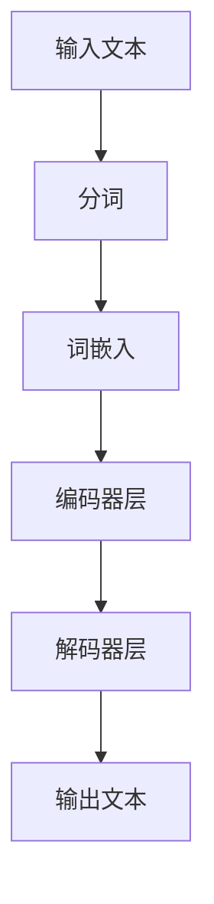

# 大语言模型原理基础与前沿 递归提示

## 1.背景介绍

大语言模型（Large Language Model, LLM）是近年来人工智能领域的一个重要突破。它们通过训练在大量文本数据上，能够生成高质量的自然语言文本，完成翻译、问答、文本生成等任务。大语言模型的成功不仅依赖于深度学习技术的进步，还得益于大规模数据和计算资源的支持。

### 1.1 大语言模型的发展历程

大语言模型的发展可以追溯到早期的统计语言模型，如n-gram模型。随着深度学习的兴起，基于神经网络的语言模型逐渐取代了传统的统计模型。2018年，OpenAI发布的GPT（Generative Pre-trained Transformer）模型标志着大语言模型的一个重要里程碑。随后，BERT、T5等模型相继问世，进一步推动了自然语言处理技术的发展。

### 1.2 大语言模型的应用领域

大语言模型在多个领域展现了强大的应用潜力，包括但不限于：
- **自然语言生成**：自动生成高质量的文本内容，如新闻报道、小说等。
- **机器翻译**：实现多语言之间的高质量翻译。
- **问答系统**：构建智能问答系统，提供准确的答案。
- **文本摘要**：自动生成文本摘要，提取关键信息。

## 2.核心概念与联系

在深入探讨大语言模型的原理和前沿技术之前，我们需要了解一些核心概念和它们之间的联系。

### 2.1 递归提示（Recursive Prompting）

递归提示是一种通过递归调用语言模型来生成更复杂和连贯的文本的方法。它的核心思想是将生成的文本作为新的提示输入，反复调用模型，直到生成满足要求的文本。

### 2.2 变换器（Transformer）

变换器是大语言模型的基础架构。它通过自注意力机制（Self-Attention）来捕捉文本中的长距离依赖关系。变换器的核心组件包括编码器（Encoder）和解码器（Decoder）。

### 2.3 自注意力机制

自注意力机制允许模型在处理每个词时，关注输入序列中的其他词，从而捕捉到词与词之间的依赖关系。这种机制是变换器架构的关键。

### 2.4 预训练与微调

大语言模型通常采用预训练和微调的策略。预训练阶段，模型在大规模无监督数据上进行训练；微调阶段，模型在特定任务的数据上进行有监督训练，以提高在该任务上的表现。

## 3.核心算法原理具体操作步骤

在这一部分，我们将详细介绍大语言模型的核心算法原理和具体操作步骤。

### 3.1 数据预处理

数据预处理是训练大语言模型的第一步。它包括文本清洗、分词、词嵌入等步骤。分词是将文本分解为单词或子词，词嵌入是将词转换为向量表示。

### 3.2 模型架构设计

大语言模型的核心架构是变换器。变换器由多个编码器和解码器层堆叠而成。每个编码器层包括自注意力机制和前馈神经网络，每个解码器层在自注意力机制之外，还包括一个编码器-解码器注意力机制。



### 3.3 训练过程

训练过程包括前向传播和反向传播。前向传播是将输入数据通过模型，计算输出；反向传播是根据输出与真实值的误差，更新模型参数。

### 3.4 递归提示的实现

递归提示的实现包括以下步骤：
1. **初始提示**：提供初始提示文本。
2. **生成文本**：使用大语言模型生成文本。
3. **递归调用**：将生成的文本作为新的提示，重复调用模型，直到生成满足要求的文本。

## 4.数学模型和公式详细讲解举例说明

在这一部分，我们将详细讲解大语言模型的数学模型和公式，并通过举例说明其应用。

### 4.1 变换器的数学模型

变换器的核心是自注意力机制。自注意力机制的计算公式如下：

$$
\text{Attention}(Q, K, V) = \text{softmax}\left(\frac{QK^T}{\sqrt{d_k}}\right)V
$$

其中，$Q$、$K$、$V$分别表示查询（Query）、键（Key）和值（Value）矩阵，$d_k$是键的维度。

### 4.2 词嵌入的数学表示

词嵌入是将词转换为向量表示。常用的词嵌入方法包括Word2Vec、GloVe等。词嵌入的数学表示如下：

$$
\mathbf{v}_w = \text{Embedding}(w)
$$

其中，$\mathbf{v}_w$表示词$w$的向量表示。

### 4.3 递归提示的数学描述

递归提示可以用递归函数来描述。设初始提示为$P_0$，生成的文本为$T_i$，则递归提示的过程可以表示为：

$$
P_{i+1} = \text{Model}(P_i)
$$

其中，$\text{Model}$表示大语言模型。

### 4.4 举例说明

假设我们要生成一篇关于人工智能的文章，初始提示为“人工智能是”，则递归提示的过程如下：

1. 初始提示：$P_0 = \text{人工智能是}$
2. 第一次生成：$T_1 = \text{人工智能是未来科技的重要组成部分}$
3. 递归调用：$P_1 = T_1$
4. 第二次生成：$T_2 = \text{人工智能是未来科技的重要组成部分，它将改变我们的生活方式}$

## 5.项目实践：代码实例和详细解释说明

在这一部分，我们将通过一个具体的代码实例，展示如何实现大语言模型和递归提示。

### 5.1 环境配置

首先，我们需要配置环境，包括安装必要的库和工具。

```bash
pip install transformers torch
```

### 5.2 加载预训练模型

我们使用Hugging Face的Transformers库加载预训练的大语言模型。

```python
from transformers import GPT2LMHeadModel, GPT2Tokenizer

model_name = 'gpt2'
model = GPT2LMHeadModel.from_pretrained(model_name)
tokenizer = GPT2Tokenizer.from_pretrained(model_name)
```

### 5.3 实现递归提示

下面的代码实现了递归提示的功能。

```python
def recursive_prompt(model, tokenizer, prompt, max_length=50, num_iterations=3):
    for _ in range(num_iterations):
        inputs = tokenizer.encode(prompt, return_tensors='pt')
        outputs = model.generate(inputs, max_length=max_length, do_sample=True)
        prompt = tokenizer.decode(outputs[0], skip_special_tokens=True)
        print(prompt)
    return prompt

initial_prompt = "人工智能是"
final_text = recursive_prompt(model, tokenizer, initial_prompt)
```

### 5.4 代码解释

1. **加载模型和分词器**：我们加载了预训练的GPT-2模型和对应的分词器。
2. **递归提示函数**：`recursive_prompt`函数实现了递归提示的功能。它接受初始提示，生成文本，并将生成的文本作为新的提示，重复调用模型。

## 6.实际应用场景

大语言模型在多个实际应用场景中展现了强大的能力。下面我们将介绍几个典型的应用场景。

### 6.1 自动文本生成

大语言模型可以用于自动生成高质量的文本内容，如新闻报道、小说等。这在内容创作领域具有重要意义。

### 6.2 智能问答系统

大语言模型可以用于构建智能问答系统，提供准确的答案。这在客服、教育等领域具有广泛应用。

### 6.3 机器翻译

大语言模型可以实现多语言之间的高质量翻译，促进跨语言交流。

### 6.4 文本摘要

大语言模型可以自动生成文本摘要，提取关键信息。这在信息检索、新闻聚合等领域具有重要应用。

## 7.工具和资源推荐

在这一部分，我们将推荐一些常用的工具和资源，帮助读者更好地理解和应用大语言模型。

### 7.1 开源库

- **Transformers**：Hugging Face的Transformers库是一个强大的自然语言处理工具库，支持多种预训练模型。
- **TensorFlow**：谷歌开发的深度学习框架，广泛应用于大语言模型的训练和推理。
- **PyTorch**：Facebook开发的深度学习框架，具有灵活性和易用性，适合大语言模型的研究和应用。

### 7.2 数据集

- **Common Crawl**：一个大规模的网页抓取数据集，常用于大语言模型的预训练。
- **Wikipedia**：维基百科是一个高质量的文本数据源，常用于大语言模型的训练。

### 7.3 在线资源

- **Hugging Face Model Hub**：一个在线平台，提供多种预训练模型和数据集，方便用户下载和使用。
- **arXiv**：一个开放的学术论文平台，提供大量关于大语言模型的最新研究成果。

## 8.总结：未来发展趋势与挑战

大语言模型在自然语言处理领域取得了显著的进展，但仍面临一些挑战和未来发展方向。

### 8.1 未来发展趋势

- **模型规模的进一步扩大**：随着计算资源的增加，未来的大语言模型将更加庞大，性能也将进一步提升。
- **多模态学习**：未来的大语言模型将不仅限于文本，还将结合图像、音频等多种模态，提升模型的综合能力。
- **个性化定制**：未来的大语言模型将更加注重个性化定制，满足不同用户的需求。

### 8.2 面临的挑战

- **计算资源的需求**：大语言模型的训练和推理需要大量的计算资源，这对硬件和能源提出了挑战。
- **数据隐私和安全**：大语言模型在处理敏感数据时，需要注意数据隐私和安全问题。
- **模型的可解释性**：大语言模型的复杂性使得其内部机制难以解释，这对模型的可信度提出了挑战。

## 9.附录：常见问题与解答

在这一部分，我们将解答一些关于大语言模型的常见问题。

### 9.1 大语言模型的训练需要多长时间？

大语言模型的训练时间取决于模型的规模和计算资源。一般来说，训练一个大型模型可能需要数周甚至数月的时间。

### 9.2 如何选择合适的大语言模型？

选择大语言模型时，需要考虑任务的具体需求、模型的性能和计算资源的限制。可以通过实验比较不同模型的表现，选择最合适的模型。

### 9.3 大语言模型是否可以处理多语言任务？

是的，大语言模型可以处理多语言任务。通过在多语言数据上进行预训练，模型可以学习到不同语言之间的转换关系，实现高质量的多语言处理。

### 9.4 如何提高大语言模型的生成质量？

提高大语言模型的生成质量可以通过以下几种方法：
- **增加训练数据**：更多的训练数据可以帮助模型学习到更多的语言模式。
- **优化模型架构**：改进模型的架构，如增加层数、调整超参数等，可以提升模型的性能。
- **微调**：在特定任务的数据上进行微调，可以提高模型在该任务上的表现。

### 9.5 大语言模型的应用是否存在伦理问题？

是的，大语言模型的应用可能存在伦理问题，如生成虚假信息、侵犯隐私等。在应用大语言模型时，需要遵循相关的伦理规范，确保模型的使用符合道德标准。

---

作者：禅与计算机程序设计艺术 / Zen and the Art of Computer Programming