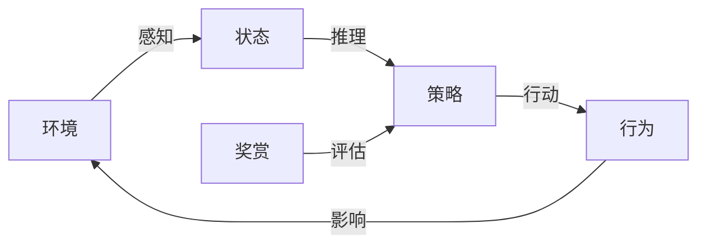

# 大语言模型应用指南：自主Agent系统的基本组成

## 1.背景介绍

### 1.1 人工智能的发展历程

人工智能(Artificial Intelligence, AI)是当代科技发展的热点领域之一。自20世纪50年代AI概念被正式提出以来,经历了几个重要的发展阶段。最初的AI系统主要采用符号主义方法,通过构建知识库和规则库来模拟人类的推理过程。随后,机器学习和神经网络等技术的兴起,使AI系统能够从大量数据中自动学习模式和规律。近年来,benefiting from算力、数据和算法的飞速发展,AI取得了令人瞩目的进步,尤其是在计算机视觉、自然语言处理等领域。

### 1.2 大语言模型的兴起

作为AI发展的重要分支,自然语言处理(Natural Language Processing, NLP)技术也取得了长足进步。其中,大型语言模型(Large Language Model, LLM)的出现被视为NLP领域的里程碑式进展。大语言模型通过在海量文本数据上进行预训练,学习语言的语义和语法规律,从而获得通用的语言理解和生成能力。

代表性的大语言模型有GPT(Generative Pre-trained Transformer)、BERT(Bidirectional Encoder Representations from Transformers)等。这些模型展现出惊人的语言理解和生成能力,可应用于机器翻译、文本摘要、问答系统、内容创作等多个场景,为自然语言人机交互带来了革命性的变革。

### 1.3 自主Agent系统的需求

随着大语言模型能力的不断提升,人们开始期望它们不仅能完成特定的语言任务,还能像人一样进行自主思考和行动。于是,自主Agent(Autonomous Agent)系统的概念应运而生。自主Agent系统旨在赋予语言模型更强的理解、推理和决策能力,使其能够根据具体情境自主完成复杂任务,而非仅停留在被动响应的层面。

构建自主Agent系统是当前AI领域的一大挑战,需要整合多种技术,包括自然语言处理、知识表示、规划与决策、交互与控制等。本文将重点介绍自主Agent系统的基本组成部分及其工作原理。

## 2.核心概念与联系

自主Agent系统是一个复杂的系统,涉及多个核心概念,这些概念相互关联、相互作用,共同赋予系统自主性。我们先来了解这些核心概念。

### 2.1 Agent

Agent是指能够感知环境、持有目标,并根据感知做出决策的主体。在自主Agent系统中,Agent通常指具备一定智能的软件实体。Agent需要具备以下几个基本能力:

1. **感知(Perception)**: 从环境中获取信息,构建对环境的表示。
2. **推理(Reasoning)**: 根据感知和目标,推理出行为策略。
3. **行动(Action)**: 根据推理结果,对环境产生影响。

### 2.2 环境(Environment)

环境是指Agent所处的外部世界,包括物理环境和信息环境。环境可以是静态的,也可以是动态变化的。Agent通过与环境交互来完成任务。

环境的复杂程度将直接影响Agent的设计难度。简单的环境可以用确定性模型描述,而复杂环境则需要概率模型来表示不确定性。

### 2.3 状态(State)

状态是对环境的抽象表示,包含了Agent所需的全部信息。状态可以是完全可观测的,也可以是部分可观测的。

在自主Agent系统中,状态通常由以下几个部分组成:

1. **环境状态(Environment State)**: 描述环境的客观情况。
2. **Agent状态(Agent State)**: 描述Agent自身的内部状态,如知识库、目标、偏好等。
3. **历史(History)**: 记录过去发生的事件序列。

### 2.4 策略(Policy)

策略定义了Agent在每个状态下应该采取的行动。策略可以是确定性的,也可以是随机的(概率策略)。

一个好的策略应该能够最大化Agent的期望回报(Expected Reward),即完成目标的程度。因此,策略的生成需要考虑到Agent的目标、环境的约束,并进行优化。

### 2.5 奖赏(Reward)

奖赏是对Agent行为的评价,用来指导Agent朝着正确的方向发展。奖赏可以是即时的,也可以是延迟的。

在自主Agent系统中,奖赏通常由人为设计,反映了任务的目标。Agent的目标就是最大化长期的累积奖赏。

### 2.6 核心流程

上述核心概念之间的关系可以用下图表示:

1. Agent从环境中获取信息,构建状态表示。
2. 基于当前状态,Agent推理出一个策略。
3. 根据策略,Agent做出行为,影响环境。
4. 环境根据Agent的行为给出奖赏反馈。
5. Agent根据奖赏,优化策略,以获得更高的长期回报。

这个循环不断重复,Agent通过与环境的交互来学习和优化自身。

## 3.核心算法原理具体操作步骤

构建自主Agent系统需要多种算法和技术的支持,包括感知、表示、推理、决策、交互等多个环节。我们将分别介绍这些环节的核心算法原理和具体操作步骤。

### 3.1 感知

感知是Agent获取环境信息的基础。常用的感知技术包括计算机视觉、自然语言处理、语音识别等。以自然语言处理为例,主要分为以下步骤:

1. **文本预处理**: 对原始文本进行分词、去除停用词等预处理,转换为算法可识别的形式。
2. **特征提取**: 使用词向量、注意力机制等技术,从文本中提取语义特征。
3. **模型构建**: 基于特征,使用深度学习模型(如BERT、GPT等)构建文本的语义表示。

### 3.2 表示

表示是将环境状态和Agent内部状态编码为机器可处理的形式。常用的表示技术包括知识图谱、概率图模型等。以知识图谱为例,主要步骤如下:

1. **实体识别**: 从文本中识别出关键实体,如人物、地点、组织等。
2. **关系抽取**: 识别实体之间的语义关系,如"工作于"、"生于"等。
3. **图构建**: 将实体作为节点,关系作为边,构建知识图谱。
4. **知识融合**: 整合多源异构知识,构建统一的知识表示。

### 3.3 推理

推理是根据当前状态,推导出Agent应该采取的行为策略。常用的推理技术包括规则推理、案例推理、模型推理等。以模型推理为例,主要步骤如下:

1. **模型构建**: 使用机器学习技术,从历史数据中学习状态到策略的映射模型。
2. **模型评估**: 在验证集上评估模型的准确性和泛化能力。
3. **模型微调**: 根据评估结果,对模型进行优化和微调。
4. **策略生成**: 将新的状态输入模型,生成对应的策略。

### 3.4 决策

决策是根据推理得到的策略,选择具体的行为方案。常用的决策技术包括规划算法、强化学习等。以强化学习为例,主要步骤如下:

1. **奖赏设计**: 根据任务目标,设计合理的奖赏函数。
2. **策略迭代**: 使用Q-Learning、策略梯度等算法,不断优化策略。
3. **模拟训练**: 在模拟环境中训练Agent,使其学会最优策略。
4. **策略部署**: 将训练好的策略应用到实际环境中。

### 3.5 交互

交互是Agent与环境进行信息交换的过程。常用的交互技术包括自然语言交互、多模态交互等。以自然语言交互为例,主要步骤如下:

1. **语言理解**: 使用NLU技术,理解用户的语言输入。
2. **对话管理**: 根据对话历史和当前状态,决定系统的响应策略。
3. **响应生成**: 使用NLG技术,生成自然语言形式的响应。
4. **反馈收集**: 收集用户对响应的反馈,用于优化对话策略。

## 4.数学模型和公式详细讲解举例说明

在自主Agent系统的构建过程中,数学模型和公式扮演着重要角色。我们将介绍一些常用的数学模型,并详细讲解它们的原理和应用。

### 4.1 马尔可夫决策过程(Markov Decision Process, MDP)

马尔可夫决策过程是描述序贯决策问题的数学框架,广泛应用于强化学习和规划算法中。一个MDP可以用一个五元组$(S, A, P, R, \gamma)$来表示:

- $S$是状态集合
- $A$是行为集合
- $P(s'|s,a)$是状态转移概率,表示在状态$s$执行行为$a$后,转移到状态$s'$的概率
- $R(s,a)$是奖赏函数,表示在状态$s$执行行为$a$所获得的即时奖赏
- $\gamma \in [0,1)$是折现因子,用于权衡即时奖赏和长期奖赏的重要性

在MDP中,Agent的目标是找到一个策略$\pi: S \rightarrow A$,使得期望的累积折现奖赏最大化:

$$
\max_\pi \mathbb{E}\left[\sum_{t=0}^\infty \gamma^t R(s_t, a_t) \right]
$$

其中$s_t$和$a_t$分别表示第$t$个时刻的状态和行为。

常用的求解MDP的算法包括值迭代(Value Iteration)、策略迭代(Policy Iteration)、Q-Learning等。

### 4.2 部分可观测马尔可夫决策过程(Partially Observable Markov Decision Process, POMDP)

在现实环境中,Agent通常无法完全观测到环境的全部状态,只能获取部分观测值。这种情况可以用POMDP来建模,它扩展了MDP,增加了观测值的概念。

一个POMDP可以用一个六元组$(S, A, P, R, \Omega, O)$来表示:

- $S, A, P, R$的含义与MDP相同
- $\Omega$是观测值集合
- $O(o|s',a)$是观测概率,表示在执行行为$a$并转移到状态$s'$后,观测到$o$的概率

在POMDP中,Agent无法直接获取状态$s$,而是根据历史观测值序列$o_{1:t}$来估计状态,并选择行为。POMDP的目标是找到一个策略$\pi: o_{1:t} \rightarrow a_t$,使得期望的累积折现奖赏最大化。

求解POMDP是一个复杂的问题,常用的算法包括点基值迭代(Point-Based Value Iteration)、蒙特卡罗树搜索(Monte Carlo Tree Search)等。

### 4.3 贝叶斯网络(Bayesian Network)

贝叶斯网络是一种概率图模型,用于表示随机变量之间的条件独立性和因果关系。它可以用一个有向无环图$G=(V,E)$来表示,其中:

- $V$是随机变量集合
- $E$是有向边集合,表示变量之间的依赖关系

在贝叶斯网络中,每个变量$X_i$的条件概率分布$P(X_i|Pa(X_i))$只依赖于它的父节点$Pa(X_i)$,从而简化了联合概率分布的计算:

$$
P(X_1, X_2, \dots, X_n) = \prod_{i=1}^n P(X_i|Pa(X_i))
$$

贝叶斯网络可以用于状态表示、推理和决策,是构建自主Agent系统的重要工具。常见的应用包括故障诊断、风险分析、规划与决策等。

### 4.4 其他模型

除了上述模型,自主Agent系统中还广泛使用了其他数学模型,如隐马尔可夫模型(Hidden Markov Model)、条件随机场(Conditional Random Field)、高斯过程(Gaussian Process)等。这些模型在不同