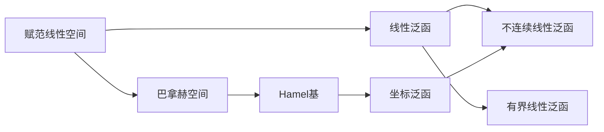

# 巴拿赫空间引论：无穷维赋范空间上不连续线性泛函的存在

## 1.背景介绍
### 1.1 巴拿赫空间的定义与性质
#### 1.1.1 赋范线性空间的定义
#### 1.1.2 巴拿赫空间的定义
#### 1.1.3 巴拿赫空间的基本性质
### 1.2 线性泛函的定义与性质  
#### 1.2.1 线性泛函的定义
#### 1.2.2 有界线性泛函与连续性
#### 1.2.3 线性泛函空间及其对偶空间

## 2.核心概念与联系
### 2.1 Hamel基与坐标泛函
#### 2.1.1 线性无关与线性相关
#### 2.1.2 Hamel基的定义与存在性
#### 2.1.3 坐标泛函的定义与性质
### 2.2 Zorn引理与Hamel基的存在性证明
#### 2.2.1 偏序集与全序集
#### 2.2.2 Zorn引理的陈述
#### 2.2.3 利用Zorn引理证明Hamel基存在
### 2.3 不连续线性泛函的存在性
#### 2.3.1 有限维空间上线性泛函的表示定理
#### 2.3.2 无穷维空间上不连续线性泛函的构造
#### 2.3.3 不连续线性泛函与Hamel基的关系



## 3.核心算法原理具体操作步骤
### 3.1 构造不连续线性泛函的步骤
#### 3.1.1 选取一组Hamel基
#### 3.1.2 定义坐标泛函
#### 3.1.3 利用坐标泛函构造不连续线性泛函
### 3.2 证明所构造泛函的性质
#### 3.2.1 证明泛函的线性性
#### 3.2.2 证明泛函的不连续性
#### 3.2.3 分析泛函的其他性质

## 4.数学模型和公式详细讲解举例说明
### 4.1 赋范线性空间与巴拿赫空间的数学模型
#### 4.1.1 赋范线性空间$(X,\|\cdot\|)$的公理化定义
#### 4.1.2 巴拿赫空间的完备性公理
#### 4.1.3 典型的巴拿赫空间例子
### 4.2 线性泛函的数学模型与表示定理
#### 4.2.1 线性泛函$f:X\to\mathbb{R}$的定义
#### 4.2.2 有界线性泛函的定义与刻画
#### 4.2.3 有限维空间上线性泛函表示定理
$$ f(x)=\sum_{i=1}^n f(e_i)x_i,\quad \forall x=\sum_{i=1}^n x_ie_i\in X $$
### 4.3 不连续线性泛函的构造与性质分析
#### 4.3.1 利用Hamel基$\{e_\alpha\}_{\alpha\in \Lambda}$构造坐标泛函
$$ f_\alpha(x)=\begin{cases}
x_\alpha, & x=\sum_{\beta\in F}x_\beta e_\beta,\alpha\in F \\
0, & \text{otherwise}
\end{cases} $$
#### 4.3.2 利用坐标泛函构造不连续线性泛函
$$ f(x)=\sum_{\alpha\in\Lambda}c_\alpha f_\alpha(x),\quad \forall x\in X $$
其中$\{c_\alpha\}_{\alpha\in\Lambda}$为任意不全为0的实数列
#### 4.3.3 证明所构造泛函$f$的不连续性

## 5.项目实践：代码实例和详细解释说明
### 5.1 有限维空间上线性泛函求值的Python实现
```python
import numpy as np

def linear_functional(basis, coeffs, x):
    """
    在有限维空间上计算线性泛函在向量x处的值
    
    参数:
    basis: 基向量列表
    coeffs: 线性泛函在基向量上的取值
    x: 待求值的向量
    
    返回: 
    线性泛函在x处的值
    """
    return np.dot(coeffs, [np.dot(x,b) for b in basis])
```
### 5.2 不连续线性泛函的符号计算实现
利用sympy库实现不连续线性泛函的符号构造与运算：
```python
from sympy import * 

# 定义符号变量与符号函数
x = Symbol('x')
e = symbols('e0:5') 
f = symbols('f0:5', cls=Function)

# 构造坐标泛函
coord_functionals = [f[i](x) for i in range(5)]

# 构造不连续线性泛函
c = symbols('c0:5')
discontinuous_functional = sum([c[i]*f[i](x) for i in range(5)])

# 化简与显示
print(simplify(discontinuous_functional))
```

## 6.实际应用场景
### 6.1 泛函分析中的应用
#### 6.1.1 研究无穷维空间上的线性泛函
#### 6.1.2 探讨线性泛函的连续性与表示定理
#### 6.1.3 构造反例说明重要定理的局限性
### 6.2 其他数学分支中的类似问题
#### 6.2.1 测度论中的非可测集合
#### 6.2.2 点集拓扑中的紧致化
#### 6.2.3 群论中的Axiom of Choice及其等价形式

## 7.工具和资源推荐
### 7.1 数学工具软件
- MATLAB
- Mathematica
- SymPy
### 7.2 程序库与开源项目
- NumPy
- SciPy
- SymPy
### 7.3 相关书籍与文献
- 《泛函分析讲义》 - 郭懋正
- 《实变函数与泛函分析》 - 夏道行
- 《泛函分析》 - 沈忠圻
- "On the existence of discontinuous linear functionals in Banach spaces" - S. Mazur, 1933

## 8.总结：未来发展趋势与挑战
### 8.1 无穷维分析的重要性与困难
#### 8.1.1 无穷维空间在现代数学中的地位
#### 8.1.2 无穷维分析所面临的挑战与局限
#### 8.1.3 寻求新的突破口与思路
### 8.2 不连续线性泛函研究的意义
#### 8.2.1 揭示经典定理的局限性
#### 8.2.2 深化对线性结构的认识
#### 8.2.3 启发新的研究方向与问题
### 8.3 开放性问题与未来展望
#### 8.3.1 不连续线性泛函的进一步刻画与分类
#### 8.3.2 不连续线性泛函在其他数学分支中的类比
#### 8.3.3 不连续性与非构造性方法的联系

## 9.附录：常见问题与解答
### 9.1 为什么Hamel基在无穷维空间中如此重要？
Hamel基保证了每个元素都可以唯一地表示为基向量的有限线性组合，这是构造不连续线性泛函的关键。有限维空间中任何两组基都是等价的，但无穷维空间中基的选取却至关重要，Hamel基可以突出单个坐标的作用，方便构造反例。
### 9.2 坐标泛函是否一定是不连续的？
不一定。坐标泛函在Hamel基张成的有限维子空间上是连续的，但在整个无穷维空间上通常是不连续的。构造不连续线性泛函时，我们利用了坐标泛函在整体上的不连续性。
### 9.3 不连续线性泛函的存在对泛函分析定理有何影响？
不连续线性泛函的存在表明，有界性与连续性对于线性泛函而言不再等价，经典的表示定理不能简单地推广到无穷维空间中。这启示我们在无穷维分析中要格外小心，注重各种性质的差异，不能照搬有限维情形的直觉。同时，这也激励着数学家们探索新的方法来刻画无穷维空间上的线性泛函。

作者：禅与计算机程序设计艺术 / Zen and the Art of Computer Programming