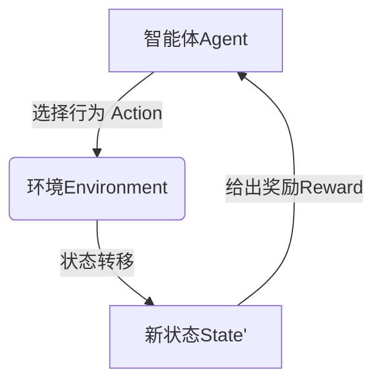

# 强化学习Reinforcement Learning的实时动态决策制定与应用

## 1.背景介绍

### 1.1 什么是强化学习

强化学习(Reinforcement Learning, RL)是机器学习的一个重要分支,它关注如何基于环境反馈来学习采取最优策略,以最大化预期的长期回报。与监督学习不同,强化学习没有给定正确的输入/输出对,而是必须通过与环境的交互来学习。

强化学习的核心思想是让智能体(Agent)通过与环境(Environment)的持续交互来学习,并根据反馈信号(Reward)来调整行为策略,最终达到最优化目标。这种学习方式类似于人类或动物通过试错和奖惩来获得经验并逐步改善行为的过程。

### 1.2 强化学习的应用场景

强化学习在诸多领域有着广泛的应用前景,例如:

- 机器人控制:让机器人学习完成复杂的运动控制任务
- 游戏AI:训练AI代理人在各种游戏中做出明智决策
- 资源管理:优化数据中心、电网等资源的动态分配
- 自动驾驶:训练自动驾驶系统在复杂环境中安全行驶
- 金融交易:开发自动交易策略以获取最大利润
- 工业控制:优化工厂生产流程以提高效率

## 2.核心概念与联系  

### 2.1 强化学习的主要元素

强化学习系统由四个核心元素组成:

- 智能体(Agent):做出决策并与环境交互的主体
- 环境(Environment):智能体所处的外部世界
- 状态(State):环境的当前情况
- 奖励(Reward):环境对智能体行为的反馈信号

智能体根据当前状态选择一个行为(Action),将其应用于环境,环境会过渡到新的状态,并给出相应的奖励值。智能体的目标是通过不断探索和利用,学习一个最优策略(Policy),使长期累积奖励最大化。



### 2.2 强化学习的主要类型

根据环境的特点,强化学习可分为以下几种类型:

- 基于模型(Model-based)与无模型(Model-free)
- 价值函数(Value Function)与策略(Policy)
- 单智能体(Single-Agent)与多智能体(Multi-Agent)
- 离散(Discrete)与连续(Continuous)动作空间

其中,价值函数方法旨在估计每个状态或状态-行为对的长期价值,而直接策略搜索则专注于直接学习最优策略。两种方法各有优缺点,可根据具体问题进行选择或结合。

### 2.3 马尔可夫决策过程

强化学习问题通常建模为马尔可夫决策过程(Markov Decision Process, MDP),它是一种离散时间的随机控制过程,可以用以下元组表示:

$$\langle \mathcal{S}, \mathcal{A}, \mathcal{P}, \mathcal{R}, \gamma \rangle$$

其中:

- $\mathcal{S}$是状态集合
- $\mathcal{A}$是行为集合  
- $\mathcal{P}$是状态转移概率函数
- $\mathcal{R}$是奖励函数
- $\gamma \in [0, 1)$是折现因子,控制未来奖励的重要性

MDP的核心思想是利用马尔可夫性质,即下一状态只与当前状态和行为有关,而与过去无关。这种性质简化了问题,使得我们可以使用动态规划或强化学习等方法来求解最优策略。

## 3.核心算法原理具体操作步骤

### 3.1 动态规划方法

对于已知MDP模型的情况,我们可以使用动态规划算法来求解最优策略,常用算法包括:

1. **价值迭代(Value Iteration)**

价值迭代通过不断更新状态价值函数$V(s)$,逐步逼近最优价值函数$V^*(s)$,从而得到最优策略$\pi^*(s)$。算法步骤如下:

```
初始化 V(s) = 0, for all s
repeat:
    for each s in S:
        V(s) = max_{a} [R(s,a) + gamma * sum_{s'} P(s'|s,a) * V(s')]
until 价值函数收敛
for each s:
    pi*(s) = argmax_{a} [R(s,a) + gamma * sum_{s'} P(s'|s,a) * V(s')]
```

2. **策略迭代(Policy Iteration)** 

策略迭代直接对策略$\pi$进行迭代,包括策略评估和策略提升两个步骤。算法流程为:

```
初始化任意策略 pi
repeat:
    // 策略评估
    求解 V^pi 满足:
        V^pi(s) = sum_{a} pi(a|s) * (R(s,a) + gamma * sum_{s'} P(s'|s,a) * V^pi(s'))
    // 策略提升 
    pi' = greedy(V^pi)
        pi'(s) = argmax_{a} [R(s,a) + gamma * sum_{s'} P(s'|s,a) * V^pi(s')]
    if pi' == pi, 停止迭代
    pi = pi'
until 策略收敛到最优pi*
```

动态规划方法虽然有理论保证可以得到最优解,但需要已知MDP的完整模型,并且在状态空间很大时计算代价高昂。

### 3.2 时序差分学习

对于未知模型的情况,我们可以使用时序差分(Temporal Difference, TD)学习方法,通过与环境交互采样得到经验,并根据时序差分目标来更新价值函数或策略,常见算法包括:

1. **Sarsa**: 基于策略的On-Policy TD控制算法
2. **Q-Learning**: 基于价值函数的Off-Policy TD控制算法
3. **Actor-Critic**: 同时学习价值函数和策略的算法

以Q-Learning为例,其核心思想是估计最优行为价值函数$Q^*(s, a)$,并根据它贪婪地构造最优策略。算法流程如下:

```
初始化 Q(s,a) = 0
for each Episode:
    初始化状态 s
    repeat for each step:
        选择行为 a = argmax_{a'} Q(s,a')  // epsilon-greedy
        执行行为a, 观测奖励r和新状态s'
        Q(s,a) = Q(s,a) + alpha * (r + gamma * max_{a'} Q(s',a') - Q(s,a))
        s = s'
    until 终止
```

其中$\alpha$是学习率,$\gamma$是折现因子。Q-Learning将时序差分目标设为$r + \gamma \max_{a'} Q(s', a')$,这使得其可以off-policy地学习,提高了样本利用效率。

### 3.3 策略梯度方法

除了基于价值函数的方法,我们还可以直接对策略$\pi_\theta$进行参数化,并使用策略梯度(Policy Gradient)方法来学习最优策略,常见算法包括:

1. REINFORCE
2. Actor-Critic
3. 信任区域策略优化(TRPO)
4. 近端策略优化(PPO)

以REINFORCE为例,其使用累积奖励的期望作为目标函数:

$$J(\theta) = \mathbb{E}_{\pi_\theta}[\sum_{t=0}^{T} \gamma^t r_t]$$

我们可以通过随机梯度上升来最大化目标函数:

$$\Delta\theta \propto \hat{J}(\theta) = \sum_{t=0}^{T} \gamma^t r_t \nabla_\theta \log \pi_\theta(a_t|s_t)$$

其中$\hat{J}(\theta)$是目标函数的无偏估计。算法流程如下:

```
初始化策略参数 theta
for each Episode:
    初始化状态 s, 累积奖励 G = 0
    for each step:
        根据 pi_theta 选择行为 a
        执行行为 a, 观测奖励 r, 新状态 s'
        G = r + gamma * G
    for each step:
        theta = theta + alpha * gamma^t * G * 梯度(log(pi_theta(a|s)))
        s = s'
```

策略梯度方法直接优化策略参数,避免了维护价值函数的需求,但往往收敛速度较慢,并且存在高方差的问题。Actor-Critic算法结合了两者的优点,通过引入价值函数来减小策略梯度的方差。

### 3.4 深度强化学习

传统的强化学习算法在处理高维观测和动作空间时存在瓶颈。深度强化学习(Deep RL)通过将深度神经网络(DNN)与强化学习相结合,显著提高了算法在处理复杂问题的能力,主要包括:

1. 值函数逼近(Value Function Approximation)
2. 策略函数逼近(Policy Approximation)
3. 模型学习(Model Learning)

深度Q网络(DQN)是深度强化学习的开山之作,它使用一个深度卷积神经网络来逼近Q函数,并采用经验回放(Experience Replay)和目标网络(Target Network)等技术来提高训练稳定性。

```python
import torch
import torch.nn as nn

class DQN(nn.Module):
    def __init__(self, obs_space, act_space):
        # ...
        
    def forward(self, x):
        # 使用DNN提取特征
        features = self.net(x)
        # 输出每个动作的Q值
        q_values = self.fc(features)
        return q_values
        
    def act(self, state):
        # 根据Q值选择贪婪行为
        q_values = self.forward(state)
        action = torch.argmax(q_values, dim=1)
        return action
```

除了DQN,其他一些重要的深度RL算法还包括:

- 深度确定性策略梯度(DDPG)
- 深度Q网络(DQN)的改进版本,如双重DQN、优先经验回放等
- 基于策略梯度的算法,如A3C、PPO等
- 基于模型的算法,如World Models等

通过深度神经网络的强大表达能力和端到端的训练方式,深度强化学习算法在许多复杂任务上取得了突破性的进展,如游戏AI、机器人控制、自动驾驶等。

## 4.数学模型和公式详细讲解举例说明

### 4.1 马尔可夫决策过程(MDP)

马尔可夫决策过程(MDP)是强化学习的核心数学模型,用于描述一个完全可观测的、离散时间的、随机决策过程。一个MDP可以用一个5元组来表示:

$$\langle \mathcal{S}, \mathcal{A}, \mathcal{P}, \mathcal{R}, \gamma \rangle$$

其中:

- $\mathcal{S}$是有限的状态集合
- $\mathcal{A}$是有限的行为集合
- $\mathcal{P}$是状态转移概率函数,定义为$\mathcal{P}_{ss'}^a = \Pr(s_{t+1}=s'|s_t=s, a_t=a)$
- $\mathcal{R}$是奖励函数,定义为$\mathcal{R}_s^a = \mathbb{E}[r_{t+1}|s_t=s, a_t=a]$
- $\gamma \in [0, 1)$是折现因子,用于权衡未来奖励的重要性

在MDP中,智能体处于状态$s_t$时,选择行为$a_t$,然后环境转移到新状态$s_{t+1}$,并给出相应的奖励$r_{t+1}$。这个过程可以用状态转移概率$\mathcal{P}_{ss'}^a$来描述。

智能体的目标是学习一个策略$\pi: \mathcal{S} \rightarrow \mathcal{A}$,使得期望的累积折现奖励最大化:

$$J(\pi) = \mathbb{E}_\pi \left[ \sum_{t=0}^\infty \gamma^t r_t \right]$$

其中$r_t$是在时间步$t$获得的奖励。

我们还可以定义状态价值函数$V^\pi(s)$和行为价值函数$Q^\pi(s, a)$,分别表示在策略$\pi$下从状态$s$开始,或从状态$s$执行行为$a$开始,期望获得的累积折现奖励:

$$V^\pi(s) = \mathbb{E}_\pi \left[ \sum_{t=0}^\infty \gamma^t r_t | s_0 = s \right]$$

$$Q^\pi(s, a) = \mathbb{E}_\pi \left[ \sum_{t=0}^\infty \gamma^t r_t