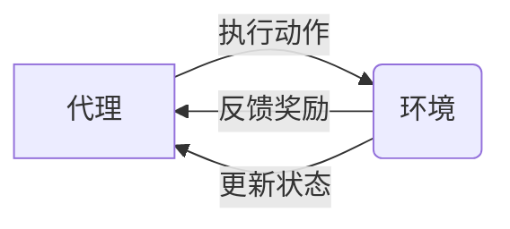

# 强化学习原理与代码实例讲解

## 1. 背景介绍

强化学习（Reinforcement Learning, RL）是机器学习的一个重要分支，它在理解和构建具有自主决策能力的智能系统方面扮演着关键角色。与监督学习和无监督学习不同，强化学习关注如何基于环境给出的奖励或惩罚来优化决策过程。它的灵感来源于心理学中的行为主义理论，特别是关于条件反射和操作条件作用的概念。

## 2. 核心概念与联系

强化学习的核心概念包括代理（Agent）、环境（Environment）、状态（State）、动作（Action）、奖励（Reward）和策略（Policy）。代理在环境中执行动作，环境根据动作反馈新的状态和奖励，代理根据策略选择动作，目标是最大化长期奖励。



## 3. 核心算法原理具体操作步骤

强化学习的核心算法包括值迭代（Value Iteration）、策略迭代（Policy Iteration）和Q学习（Q-Learning）。这些算法的操作步骤通常包括初始化参数、观察环境状态、选择并执行动作、接收奖励和下一个状态、更新策略或值函数。

## 4. 数学模型和公式详细讲解举例说明

强化学习的数学模型基于马尔可夫决策过程（Markov Decision Process, MDP）。MDP由状态空间、动作空间、状态转移概率和奖励函数组成。核心的数学公式包括贝尔曼方程（Bellman Equation）：

$$
V(s) = \max_a \sum_{s'} P(s'|s,a) [R(s,a,s') + \gamma V(s')]
$$

其中，$V(s)$ 是状态 $s$ 的值函数，$P(s'|s,a)$ 是从状态 $s$ 通过动作 $a$ 转移到状态 $s'$ 的概率，$R(s,a,s')$ 是对应的即时奖励，$\gamma$ 是折扣因子。

## 5. 项目实践：代码实例和详细解释说明

在项目实践中，我们通常使用Python编程语言和相关的库，如OpenAI Gym，来实现强化学习算法。以下是一个简单的Q学习代码实例：

```python
import numpy as np
import gym

env = gym.make('FrozenLake-v0')
Q = np.zeros([env.observation_space.n, env.action_space.n])

# 超参数
alpha = 0.8
gamma = 0.95
num_episodes = 1000

for i in range(num_episodes):
    state = env.reset()
    done = False
    
    while not done:
        action = np.argmax(Q[state] + np.random.randn(1, env.action_space.n) * (1./(i+1)))
        new_state, reward, done, _ = env.step(action)
        Q[state, action] = Q[state, action] + alpha * (reward + gamma * np.max(Q[new_state]) - Q[state, action])
        state = new_state
```

这段代码展示了如何使用Q学习算法来训练一个代理在FrozenLake环境中寻找最优策略。

## 6. 实际应用场景

强化学习在多个领域都有应用，包括但不限于游戏（如AlphaGo）、机器人控制、自动驾驶、资源管理和推荐系统。

## 7. 工具和资源推荐

- OpenAI Gym：一个用于开发和比较强化学习算法的工具包。
- TensorFlow Agents：一个基于TensorFlow的强化学习库。
- PyTorch：一个提供强化学习支持的机器学习库。

## 8. 总结：未来发展趋势与挑战

强化学习的未来发展趋势包括算法的进一步优化、多任务学习、转移学习、以及与深度学习的结合。挑战包括样本效率、稳定性和泛化能力。

## 9. 附录：常见问题与解答

Q1: 强化学习和监督学习有什么区别？
A1: 强化学习是基于环境反馈的奖励来学习策略，而监督学习是基于标签数据来学习模型。

Q2: 强化学习如何选择动作？
A2: 强化学习可以使用多种策略来选择动作，包括贪婪策略、ε-贪婪策略和softmax策略等。

Q3: 强化学习中的探索和利用如何平衡？
A3: 通过调整ε-贪婪策略中的ε值或使用其他如UCB（Upper Confidence Bound）策略来平衡探索和利用。

作者：禅与计算机程序设计艺术 / Zen and the Art of Computer Programming