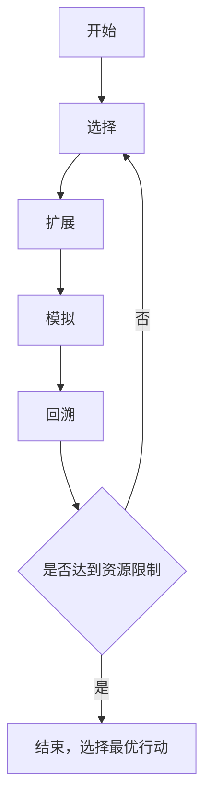

# 强化学习算法：蒙特卡洛树搜索 (Monte Carlo Tree Search) 原理与代码实例讲解

## 1. 背景介绍
蒙特卡洛树搜索（Monte Carlo Tree Search，MCTS）是一种在人工智能领域，特别是在游戏理论中广泛使用的搜索算法。它结合了随机模拟的蒙特卡洛方法和树形搜索的决策框架，能够有效地处理大规模决策问题。MCTS的知名度大幅提升是在2016年，当AlphaGo使用它击败了世界围棋冠军李世石，从此，MCTS成为了强化学习领域的热门话题。

## 2. 核心概念与联系
MCTS的核心在于通过构建搜索树来模拟决策过程。搜索树的每个节点代表游戏的一个状态，而边则代表可能的行动。MCTS通过以下四个阶段进行：

- **选择(Selection)**：从根节点开始，选择最有潜力的子节点，直到达到叶节点。
- **扩展(Expansion)**：在叶节点处添加一个或多个合法的子节点。
- **模拟(Simulation)**：从新的子节点开始，使用随机策略进行模拟，直到游戏结束。
- **回溯(Backpropagation)**：根据模拟的结果更新从根节点到叶节点路径上的节点信息。

这四个阶段循环进行，直到达到计算资源的限制（如时间、内存等），然后选择最优的行动。

## 3. 核心算法原理具体操作步骤
MCTS的操作步骤可以用以下Mermaid流程图表示：



## 4. 数学模型和公式详细讲解举例说明
在MCTS中，选择阶段通常使用UCB1（Upper Confidence Bound 1）算法来选择最有潜力的节点。UCB1的计算公式如下：

$$
UCB1 = \bar{X}_j + C \sqrt{\frac{2 \ln n}{n_j}}
$$

其中，$\bar{X}_j$ 是节点$j$的平均胜率，$n$ 是父节点的访问次数，$n_j$ 是节点$j$的访问次数，$C$ 是探索参数，用于平衡探索和利用。

## 5. 项目实践：代码实例和详细解释说明
以下是一个简单的MCTS代码实例，用于解决一个简单的游戏问题：

```python
# MCTS伪代码示例
class MCTSNode:
    def __init__(self, game_state):
        self.state = game_state
        self.children = []
        self.wins = 0
        self.visits = 0

    def select_child(self):
        # 使用UCB1选择最有潜力的子节点
        pass

    def expand(self):
        # 扩展新的子节点
        pass

    def simulate(self):
        # 进行游戏模拟
        pass

    def backpropagate(self, result):
        # 根据模拟结果回溯更新节点信息
        pass

def mcts_search(root):
    while not resource_limit_reached():
        leaf = root.select_child()
        child = leaf.expand()
        result = child.simulate()
        child.backpropagate(result)
    return root.get_best_move()
```

## 6. 实际应用场景
MCTS在多个领域都有应用，包括但不限于：

- 游戏AI：围棋、国际象棋、桥牌等。
- 机器人路径规划。
- 自动化决策系统。

## 7. 工具和资源推荐
- **OpenAI Gym**：提供了多种环境，用于开发和测试强化学习算法。
- **Google's TensorFlow**：一个强大的机器学习库，可以用来实现MCTS。
- **PySC2**：星际争霸II的强化学习环境。

## 8. 总结：未来发展趋势与挑战
MCTS作为一种强大的算法，其未来的发展趋势在于与深度学习的结合，提高搜索效率和决策质量。挑战在于如何处理更复杂的决策环境，以及如何减少计算资源的消耗。

## 9. 附录：常见问题与解答
- **Q1**: MCTS是否总是找到最优解？
- **A1**: 不一定，MCTS旨在在有限的计算资源下找到尽可能好的解。

- **Q2**: 如何选择合适的探索参数$C$？
- **A2**: 通常通过实验调整，以平衡探索和利用。

- **Q3**: MCTS在哪些类型的游戏中效果最好？
- **A3**: 在具有高度不确定性和复杂状态空间的游戏中效果最好，如围棋。

作者：禅与计算机程序设计艺术 / Zen and the Art of Computer Programming